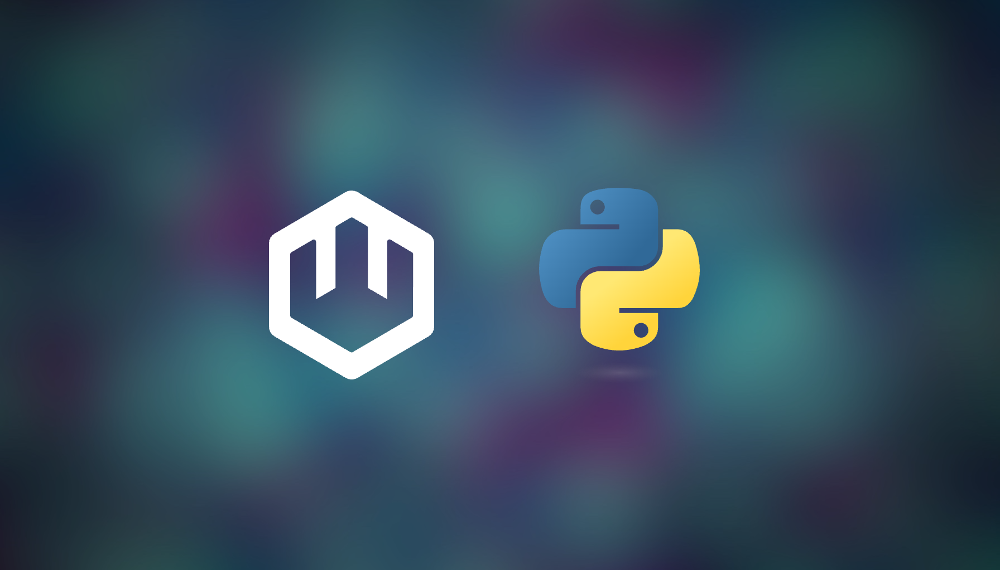

WASI 0.2.0 is [in the wild](https://wasmcloud.com/blog/wasi-preview-2-officially-launches), pushing forward common standards for portable, language-agnostic components and interfaces. That means it just got a whole lot easier to create WebAssembly components from any language&mdash;and have them work together with other components of any provenance. Better still, it's now possible to "bring your own Wasm components" from any language that compiles to WASI 0.2.0 and run them as distributed apps in wasmCloud.  

{/* truncate */}

As WebAssembly enters a new era, now is a good time to walk through the process of running a generic component on wasmCloud and explain what we're doing at each step. For this tutorial, we'll use Python as an example. A Bytecode Alliance project called [`componentize-py`](https://github.com/bytecodealliance/componentize-py) makes it simple to build a Wasm component from Python code. Once you can do that, it's trivial to run the app in wasmCloud. All you need to do is...

* Build and sign the component with `wash build` 
* Deploy the component to wasmCloud with `wadm`

Before we get started, props to Fermyon's Joel Dice and all the other contributors to `componentize-py`, and to Brooks Townsend for first demonstrating this during a [wasmCloud Community Meeting](https://wasmcloud.com/community/2024/01/17/community-meeting) last month. 

## How to run a Python-based app in wasmCloud

You'll need to [install wasmCloud](https://wasmcloud.com/docs/installation), [Python 3.10 or higher](https://www.python.org/), and [`pip`](https://pip.pypa.io/en/stable/installation/) if you haven't already. 

Once `pip` is in place, you'll also need to install `componentize-py` (v0.11 or later):

```bash
pip install componentize-py
```

Next, we'll download the **`componentize-py`** repo from GitHub. The GitHub repo gives us a directory of Python examples, including an app that makes and receives HTTP requests. If we open `examples/http/app.py`, we find a nifty demo that returns an echo or hash depending on your request. 

In the repo we also find a `wit` directory with WebAssembly Interface Type (WIT) definitions for an HTTP interface. Types like `IncomingRequest` in the Python code bind to these standard WIT definitions. (Feel free to explore files like `wit/deps/http/types.wit` to get a sense for how these work.) Using APIs standardized around WIT definitions means that the actual HTTP *functionality* can be delivered by another component compiled from a different language&mdash;in this case, we'll be using wasmCloud's first-party HTTP capability providers (written in Rust). But we don't have to worry about the specifics of the providers just yet. 

For now, we'll simply create an application manifest. Create a file called `wasmcloud.toml` in the `componentize-py/examples/http` directory and add:

```toml
name = "PythonExample"
language = "python"
type = "component"
version = "0.1.0"

[component]
build_command = "componentize-py -d ../../wit -w wasi:http/proxy@0.2.0 componentize app -o http.wasm"
build_artifact = "http.wasm"
destination = "http_s.wasm"
```

Up top, we provide basic metadata for our component and define it as an **actor**&mdash;a component running original logic. In the last three lines we have two fields enabling a "bring your own Wasm component" approach:

* **`build_command`** defines the underlying command that `wash` will use to build the component when we run `wash build`. In this case, `wash` will run `componentize-py`.
* **`build_artifact`** specifies the `.wasm` artifact to be signed by `wash build`. 
* **`destination`** defines the name and location of the final, signed Wasm artifact for the component.

If we wanted to produce a `.wasm` artifact from another language, we would simply replace the `build_command` value with the appropriate procedure for creating a component from that source language. 

In the same `examples/http` directory, create a file called `wadm.yaml` and add:

```yaml
apiVersion: core.oam.dev/v1beta1
kind: Application
metadata:
  name: PythonExample
  annotations:
    version: v0.0.1
    description: "Python component"
    experimental: "true"
spec:
  components:
    - name: python-http
      type: actor
      properties:
        image: file://./http_s.wasm
      traits:
        - type: spreadscaler
          properties:
            instances: 1
        - type: linkdef
          properties:
            target: httpserver
            values:
              address: 127.0.0.1:8080
        - type: linkdef
          properties:
            target: httpclient
    - name: httpserver
      type: capability
      properties:
        image: wasmcloud.azurecr.io/httpserver:0.19.1
        contract: wasmcloud:httpserver
    - name: httpclient
      type: capability
      properties:
        image: wasmcloud.azurecr.io/httpclient:0.8.0
        contract: wasmcloud:httpclient
```

If you're familiar with wasmCloud, this should all look perfectly standard: we're defining deployment metadata and two components (the actor and the first-party `httpserver` capability provider).

Now let's build our Wasm artifact:

```bash
wash build
```

If you haven't already, run `wash up` to start a wasmCloud host. Then, from `examples/http`, run:

```bash
wash app deploy wadm.yaml
```

When `wash app list` reports that the deployment is ready, you can `curl` the component for a response. Per the readme for this example, we'll send over a couple of stanzas of poetry:

```bash
curl -i -H 'content-type: text/plain' --data-binary @- http://localhost:8080/echo <<EOF
'Twas brillig, and the slithy toves
      Did gyre and gimble in the wabe:
All mimsy were the borogoves,
      And the mome raths outgrabe.
EOF
```
The response:

```bash
HTTP/1.1 200 OK
content-type: text/plain
content-length: 142
date: Mon, 29 Jan 2024 22:44:57 GMT

'Twas brillig, and the slithy toves
      Did gyre and gimble in the wabe:
All mimsy were the borogoves,
      And the mome raths outgrabe.
```

Success! We get our bit of **Alice in Wonderland** back, and now we're down the rabbit hole. When we're done, we'll clean up:

```bash
wash app undeploy python
wash app delete python --delete-all
```

## Conclusion

Now that WASI Preview 2 is released, componentizing different languages with common WIT definitions is only going to get easier&mdash;especially with a vibrant community building awesome tooling like `componentize-py`. Using the same pattern we walked through here, wasmCloud users can define build processes for any Wasm-compiled language you can imagine and run them in a distributed manner, taking full advantage of templated requirements like HTTP, storage, logging, and all the rest. The wasmCloud vision of building in any language and deploying anywhere is here, and it's only moving faster.