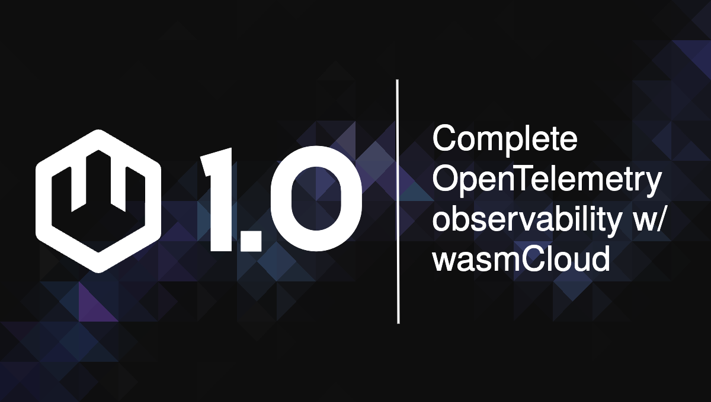
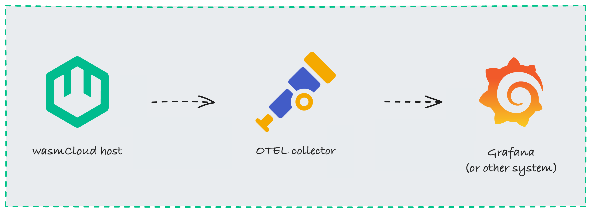
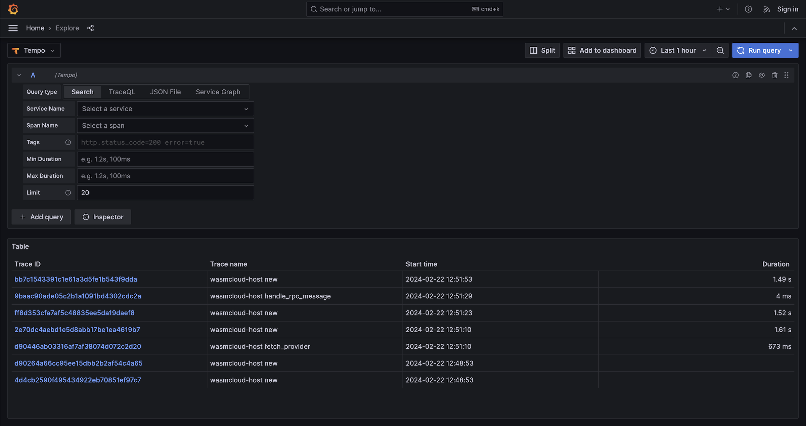
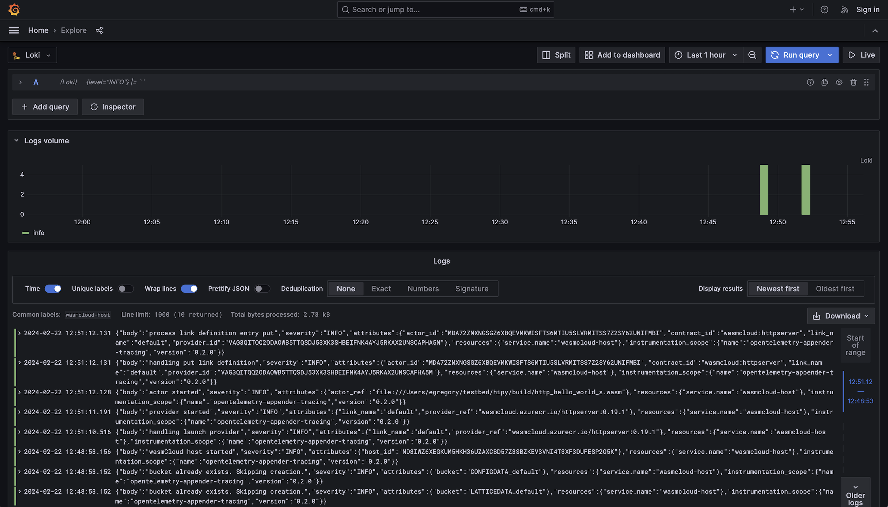

Observability is a cornerstone of any cloud native system. With v1.0, wasmCloud supports the three pillars of observability&mdash;traces, logs, and metrics&mdash;using the industry-standard [OpenTelemetry](https://opentelemetry.io/) (OTEL) specification.

{/* truncate */}

wasmCloud has included OpenTelemetry traces for some time, enabling operators to follow traces across an entire call stack. Now OTEL logging and metrics complete the trifecta, providing full observability that is easy to integrate with existing cloud native estates. For teams ready to give wasmCloud 1.0 a whirl, observing hosts is as simple as plugging the system in to Grafana, Honeycomb, or the backend of your choice.

## How wasmCloud observability works

OpenTelemetry is a CNCF project&mdash;boasting the second most contributors after Kubernetes!&mdash;that defines a common set of APIs and standards for cloud native observability. wasmCloud uses the OTEL SDK to emit **signals** (OTEL's unified abstraction for logs, metrics, and traces) to a vendor-agnostic application called the [**OTEL collector**](https://opentelemetry.io/docs/collector/), which relays the data on to systems like [**Grafana**](https://github.com/grafana/grafana).



Grafana is just one possible choice for your observability backend&mdash;since OTEL is an open standard, you can use whatever observability system you prefer.

## Enabling OpenTelemetry observability

By default, OTEL signals are disabled. Enabling them is a simple matter of passing an environment variable:

```bash
WASMCLOUD_OBSERVABILITY_ENABLED="true"
```

Additionally, the default endpoint for HTTP/OpenTelemetry Protocol exports (`localhost:4318`) can be overridden with an environment variable:

```bash
OTEL_EXPORTER_OTLP_ENDPOINT=http://my-custom-host:4318
```

Refer to the [wasmCloud documentation](/docs/deployment/observability/observability-with-opentelemetry) for advanced and signal-specific options.

## Explore the wasmCloud observability ecosystem locally

To make it easy to experiment with a wasmCloud observability ecosystem on your local machine, we've provided a set of sample configurations and Docker Compose files on GitHub. Prerequisites for running this example are a local wasmCloud installation ([installation instructions](https://wasmcloud.com/docs/installation)) and [Docker](https://docs.docker.com/get-docker/).

Once wasmCloud and Docker are installed, download or clone the wasmCloud repository:

```bash
git clone https://github.com/wasmCloud/wasmCloud.git`
```

Change directory to `examples/docker`:

```bash
cd wasmcloud/examples/docker
```

The `docker-compose-otel.yml` file configures and runs...

- Grafana
- An OTEL collector
- Tempo
- Loki
- Prometheus

```bash
docker compose -f docker-compose-otel.yml up
```

Make sure a wasmCloud host is running locally with OTEL signals enabled:

```bash
WASMCLOUD_OBSERVABILITY_ENABLED="true" wash up
```

Now you can access Grafana's "Explore" interface at [http://localhost:5050/explore](http://localhost:5050/explore).

At this point, you may optionally wish to run a hello-world application from the wasmCloud [quickstart](https://wasmcloud.com/docs/tour/hello-world) to give your system a little more activity to observe.

Select **Tempo** in the left-hand dropdown menu and run a query to view traces.



You can switch to Loki and run a query to see logs...



...or choose Prometheus for metrics. Under the "Metric" field, choose the metric you would like to view. (Alternatively, you can check out Prometheus' built-in query interface at [http://localhost:9090/graph](http://localhost:9090/graph)).

At release, wasmCloud 1.0 includes several metrics:

- Time to handle invocation in nanoseconds (`wasmcloud_host.handle_rpc_message.duration`)
- Actor: Count of the number of invocations (`wasmcloud_host.actor.invocations`)
- Actor: Count of errors (`wasmcloud_host.actor.errors`)

## Conclusion

wasmCloud 1.0 provides everything you need to not only run production workloads, but observe your hosts with standard cloud native tooling. As you explore wasmCloud observability, we'd love to hear about your experiences, including features like individual metrics that you'd like to see in the future. Don't hesitate to [file an issue on GitHub](https://github.com/wasmCloud/wasmCloud/issues) or get in touch on the [wasmCloud Slack](https://slack.wasmcloud.com/)!
