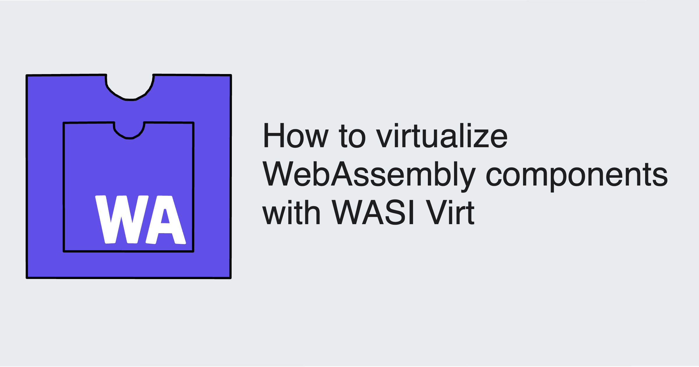
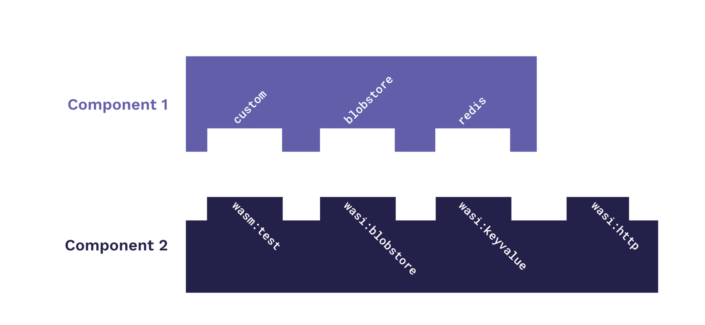

Suppose you're developing an application as a WebAssembly component, and you need access to environment variables&mdash;but your app will run in an environment where this is impossible. What do you do? The WebAssembly ecosystem provides a powerful command-line tool for this and similar use-cases called [**WASI Virt**](https://github.com/bytecodealliance/wasi-virt), enabling you to encapsulate components within other components and abstract away requirements, or otherwise consolidate your application.

In this blog, we'll explore how component virtualization works, when you might want to use WASI Virt, and how to get started.

{/* truncate */}

## How component virtualization works

For those new to the WebAssembly component space, a quick review: components are WebAssembly binaries adhering to an additional layer of specification called the [Component Model](https://component-model.bytecodealliance.org/introduction.html). Like ordinary WebAssembly binaries, components are sandboxed and hyper-efficient. The Component Model enables them to go a step further and interoperate&mdash;regardless of the language they were originally written in&mdash;over [standard APIs like the WebAssembly System Interface (WASI)](/docs/concepts/interfaces#well-known-interfaces).

Along with portability and cross-language interoperability, **composability** is a signature feature of components: two or more components can be combined (or "composed") together into one standalone binary, with the constituent components satisfying one another's **dependencies** and **exposed functions**, or "**imports**" and "**exports**" respectively. 



It's this characteristic that makes it possible to compose a component within an encapsulating component&mdash;in other words, to create a "virtualized component" for which all imports are satisfied, the external requirements abstracted away. In our case, if the requirement we need to abstract away is access to environment variables, we can compose our primary component with an encapsulating component that fulfills the need.

## When to virtualize a component

Perhaps the most important use-case for WASI Virt and component virtualization is creating a sandbox to use sensitive functionality in secure environments. 

In addition to environment variables, WASI Virt can give a component access to a virtualized filesystem, sockets, or stdio. This is an important use-case on wasmCloud, where interfaces like `wasi:sockets` are not available in accordance with a Zero Trust security model. 

Here's the complete list of WASI interfaces that can be virtualized with WASI Virt:

* Clocks
* Environment
* Exit
* Filesystem
* HTTP
* Random
* Sockets
* Stdio

Beyond requirements for running in secure environments, it's useful to remember that virtualization with WASI Virt is a form of [build-time composition](/docs/concepts/linking-components/linking-at-build#example-composition), and this makes sense for some use-cases more than others, as well as lending itself more and less ideally to certain development workflows:

* Components that are composed together at build-time are tightly coupled and will generally be updated simultaneously, and will scale together once deployed. I
* If this doesn't make sense for your application, and you don't require an otherwise unavailable core operation system interface, it may make sense to explore dynamically [linking components at runtime](/docs/concepts/linking-components/linking-at-runtime). 

But returning to our original example: what if we need WASI Virt to make use of environment variables? Let's take a look at exactly how we can do it.

## Example: Virtualized environment variables

We need access to environment variables, so we're going to use WASI Virt to give us access to this sensitive interface via an encapsulating component. 

Before we get started, we need local installations of WASI Virt and [wasmCloud Shell (wash)](https://wasmcloud.com/docs/installation). WASI Virt requires the nightly release channel for [Rust](https://www.rust-lang.org/tools/install):

```bash
rustup toolchain install nightly
```

Install the `wasi-virt` CLI tool with `cargo`:

```bash
cargo +nightly install --git https://github.com/bytecodealliance/wasi-virt
```

The example files are included in the wasmCloud [monorepo](https://github.com/wasmcloud/wasmcloud). Perform a "sparse" checkout to download only the directory for this example:

```bash
git clone --depth 1 --no-checkout https://github.com/wasmCloud/wasmCloud.git
cd wasmcloud
git sparse-checkout set ./examples/rust/composition
git checkout
cd examples/rust/composition
```

For this example, we only need the `pong` directory.

### Virtualizing a component

Change directory to the `pong` folder. In this directory is the code for a Rust component with a custom interface called `pong` that will return a string "ping" on its exported `pingpong` interface. Build the component:

```shell
cd pong
wash build
```

Use `wash inspect` to look at the [WebAssembly Interface Type (WIT) interfaces](/docs/concepts/interfaces) used by this component:

```shell
wash inspect --wit ./build/pong_s.wasm
```
```wit
package root:component;

world root {
  import wasi:cli/environment@0.2.0;
  import wasi:cli/exit@0.2.0;
  import wasi:io/error@0.2.0;
  import wasi:io/streams@0.2.0;
  import wasi:cli/stdin@0.2.0;
  import wasi:cli/stdout@0.2.0;
  import wasi:cli/stderr@0.2.0;
  import wasi:clocks/wall-clock@0.2.0;
  import wasi:filesystem/types@0.2.0;
  import wasi:filesystem/preopens@0.2.0;
  import wasi:random/random@0.2.0;

  export example:pong/pingpong;
}
```
The `pingpong` interface is listed as an export and `wasi:cli/environment` is among the imports. 

Now we can use WASI Virt to compose the `pong_s.wasm` binary into an encapsulating component with an environment variable `PONG` set to `virtualized`. Our new, composed component will be named `virt.wasm`.

```shell
wasi-virt build/pong_s.wasm --allow-random -e PONG=virtualized -o virt.wasm
```
Let's pause a moment to break down the command:

* The starting component is specified as `build/pong_s.wasm`
* The `--allow-random` argument allows the final component to import `wasi:random/random` (since the [wasmCloud host](/docs/concepts/hosts) satisfies that requirement)
* The `-e` argument sets an environment variable `PONG` to `virtualized`
* The output component is named `virt.wasm`

Check out the interfaces for the new virtualized component:

```shell
wash inspect --wit virt.wasm 
```
```wit
package root:component;

world root {
  import wasi:random/random@0.2.0;

  export example:pong/pingpong;
}
```
The new component exports `pingpong` but no longer imports `wasi:cli/environment`&mdash;that requirement has been abstracted awat. If we run this component on wasmCloud, the host will be able to satisfy the `random` import&mdash;it will simply require another component to invoke it via the `pingpong` interface. 

In the `http-hello2` directory is a modified `http-hello-world` component that imports the `pingpong` interface and calls for a string from `pong` to append to the hello world message. Navigate to that directory and build the component.

```shell
cd ../http-hello2
wash build
```
The `wadm.yaml` application deployment manifest in this directory can be used to launch both the virtualized `pong` component and the new `http-hello-world` component. When we deploy with this manifest, wasmCloud will automatically [**link the components at runtime**](/docs/concepts/linking-components/linking-at-runtime), so that `pong` can satisfy the import of `http-hello-world`. 

```shell
wash app deploy wadm.yaml
```

If you invoke `http-hello-world` via `curl`, it invokes `pong`:

```shell
curl localhost:8080
Hello World! I got pong virtualized
```

We get the environment variable value `virtualized` back in the hello world message. Virtualization achieved!

## Conclusion

For more information on using WASI Virt, see the [project repository on GitHub](https://github.com/bytecodealliance/wasi-virt). If you'd like to talk about virtualizing components and building applications on wasmCloud, join us on the [wasmCloud community Slack](https://slack.wasmcloud.com/)!


