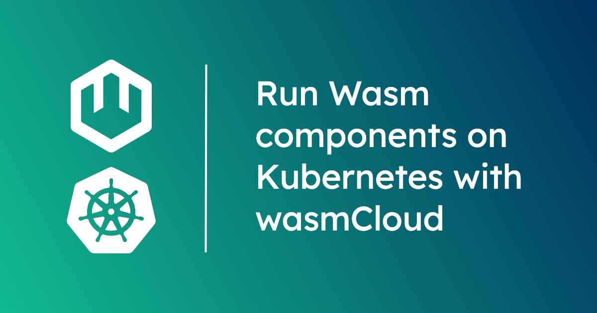

**WebAssembly components** are made for cloud native environments: 

* As WebAssembly binaries, components are truly agnostic to OS and architecture.  
* Teams can compile components from their language of choice, then combine and interoperate&mdash;across languages&mdash;with other components via standard APIs. It's like building blocks. 
* Components are orders of magnitude more efficient than containers, setting the stage for major cost, speed, and sustainability improvements.

With components, teams can write code in the language of their choice and run it anywhere...including in places where even containers are impractical. If your organization is already using Kubernetes, it's easy to run components on your clusters with **wasmCloud**. In fact, wasmCloud can help you extend Kubernetes to tackle traditional challenge areas like multi-cloud and edge. 

In this tutorial, you'll learn how to get started running WebAssembly components on Kubernetes in **three simple steps**. The whole process should only take about five minutes.

{/* truncate */}

### How does wasmCloud work with Kubernetes?

At a high level you can think of wasmCloud is as **Kubernetes for WebAssembly**. We describe it as a "**Wasm-native orchestrator**": a distributed applications platform built from the ground up for WebAssembly workloads.  

Because wasmCloud is tailored specifically to WebAssembly, it can take advantage of components' distinctive efficiency, interoperability, and composability. While you can run wasmCloud standalone, most teams don't want to replace their entire infrastructure. Kubernetes is very good at abstracting and managing the infrastructure side of the equation&mdash;wasmCloud sits on that foundation and focuses on orchestrating distributed applications. 

On a technical level, wasmCloud integrates with Kubernetes through an [operator](https://github.com/wasmCloud/wasmcloud-operator). Once you install the operator on your Kubernetes cluster, you can...

* **Deploy [wasmCloud hosts](/docs/concepts/hosts) on the cluster**. At a high level, you can think of a host as a runtime environment that loads, runs, and communicates between the different parts of your application.
* **Deploy wasmCloud applications to the cluster straight from `kubectl`**. In wasmCloud, [applications are defined in YAML manifests](../../docs/ecosystem/wadm/model) with the [OAM specification](https://oam.dev/). The manifests will look familiar to Kubernetes users&mdash;better yet, you can deploy them to the cluster the same way you would any other Kubernetes resource. 

What does all of this mean in practice?

1. Developers can move faster, reusing building blocks written against well-known APIs. 
2. It's easy to run distributed apps in resource-constrained environments at the edge. 
3. You can use wasmCloud's connectivity layer to connect Kubernetes clusters across different clouds or regions.
4. Workloads can be scheduled dynamically across regions and clouds. 

By unlocking the power of distributed components, wasmCloud extends Kubernetes as well. Let's jump in and see how it works.

## Get started with wasmCloud on Kubernetes

In this tutorial, we'll get wasmCloud up and running on a local Kubernetes cluster. You'll need [Helm](https://helm.sh/) and a Kubernetes cluster running on your machine. It also helps to install [wasmCloud Shell (`wash`)](/docs/installation), though it's not strictly necessary.

:::info[Your friendly neighborhood Kubernetes]
Make sure you have a Kubernetes cluster running and API access to run `helm` and `kubectl` commands. Some good local options include [minikube](https://minikube.sigs.k8s.io/docs/), [kind](https://kind.sigs.k8s.io/), [k3s](https://k3s.io/), or [k0s](https://k0sproject.io/).
:::

A wasmCloud installation requires a few things to run:

- **[NATS](/docs/ecosystem/nats/)** (with Jetstream enabled)
- **[wasmCloud Application Deployment Manager (wadm)](/docs/ecosystem/wadm/)** connected to NATS

If you're not sure what that means, don't worry: the following steps will help you deploy the prerequisites to your Kubernetes cluster, then deploy the operator.

#### 1. Deploy prerequisites

First we'll add the NATS Helm repo. If you're not familiar with it, NATS is the open source connective technology that wasmCloud uses to create a unified topology across any number of environments. 

```shell
helm repo add nats https://nats-io.github.io/k8s/helm/charts/
```
Next install the upstream NATS Helm chart:

```shell
helm upgrade --install -f https://raw.githubusercontent.com/wasmCloud/wasmcloud-operator/main/examples/quickstart/nats-values.yaml nats nats/nats
```
You can validate the NATS installation with:

```shell
kubectl rollout status deploy,sts -l app.kubernetes.io/instance=nats
```
Deploy wadm to your Kubernetes cluster with a Helm chart hosted by wasmCloud: 

```shell
helm install wadm -f https://raw.githubusercontent.com/wasmCloud/wasmcloud-operator/main/examples/quickstart/wadm-values.yaml oci://ghcr.io/wasmcloud/charts/wadm
```
Validate the wadm installation with:

```shell
kubectl rollout status deploy -l app.kubernetes.io/instance=wadm
```
Once NATS and wadm are ready, you can move on to deploy the operator.

#### 2. Deploy the operator

To deploy the operator:

```shell
kubectl apply -k https://github.com/wasmCloud/wasmcloud-operator/deploy/base
```
Validate the installation by checking that the pods are ready...

```shell
kubectl rollout status deploy -l app=wasmcloud-operator -n wasmcloud-operator
```
...and confirming that the API service is available:
```shell
kubectl get apiservices.apiregistration.k8s.io v1beta1.core.oam.dev
```

#### 3. Create wasmCloud hosts

Our final step is to apply the `wasmcloud-host` manifest:

```shell
kubectl apply -f https://raw.githubusercontent.com/wasmCloud/wasmcloud-operator/main/examples/quickstart/wasmcloud-host.yaml
```
Check the status of your wasmCloud host:

```shell
kubectl describe wasmcloudhostconfig wasmcloud-host
```

At this point, you're up and running. Let's try running some WebAssembly components with our new wasmCloud installation. 

#### Run a WebAssembly component on Kubernetes

When you `kubectl apply` a [wasmCloud application manifest](../../docs/ecosystem/wadm/model), the cluster will automatically provision the component workload with wasmCloud. We'll use the [`hello-world-application.yaml` manifest](https://raw.githubusercontent.com/wasmCloud/wasmcloud-operator/main/examples/quickstart/hello-world-application.yaml) included in the operator's quickstart. (You can check out the [source code for the application itself](https://github.com/wasmCloud/wasmCloud/tree/main/examples/rust/components/http-hello-world) in the wasmCloud monorepo.)

Before we launch the application, let's take a quick look at an excerpt of the manifest:

```yaml {7-7}
...
spec:
  components:
    - name: http-component
      type: component
      properties:
        image: ghcr.io/wasmcloud/components/http-hello-world-rust:0.1.0
...
```
On line 7, you can see that we're deploying our component from an image. Specifically, the component is packaged as an OCI artifact. These aren't containers, but pure components conforming to OCI standards&mdash;meaning you can use the same registry for component artifacts that you're already using for container images. 

Now run `kubectl apply`: 

```shell
kubectl apply -f https://raw.githubusercontent.com/wasmCloud/wasmcloud-operator/main/examples/quickstart/hello-world-application.yaml
```

Now we can check the deployment status:

```shell
kubectl get application
```
```shell
APPLICATION   DEPLOYED VERSION   LATEST VERSION   STATUS
hello-world   v0.0.1             v0.0.1           Deployed
```

The operator automatically creates Kubernetes services for wasmCloud applications that use the `httpserver` provider with a daemonscaler.

We can view our Kubernetes services to check this out:

```shell
kubectl get services
```
```text
NAME             TYPE        CLUSTER-IP      EXTERNAL-IP   PORT(S)                                        AGE
hello-world      ClusterIP   10.96.199.43    <none>        8080/TCP                                       11s
kubernetes       ClusterIP   10.96.0.1       <none>        443/TCP                                        6m29s
nats             ClusterIP   10.96.104.180   <none>        4222/TCP,7422/TCP,4223/TCP                     5m36s
nats-headless    ClusterIP   None            <none>        4222/TCP,7422/TCP,4223/TCP,6222/TCP,8222/TCP   5m36s
wasmcloud-host   ClusterIP   10.96.67.225    <none>        4222/TCP                                       84s

```

One way we can test the component (without needing ingress) is to port-forward from within the wasmCloud host container where the application is running. First, let's assign the wasmCloud host pod name to an environment variable:

```shell
WASMCLOUD_HOST_POD=$(kubectl get pods -o jsonpath="{.items[*].metadata.name}" -l app.kubernetes.io/instance=wasmcloud-host)
```
Now we'll port-forward the wasmCloud host's port 8080:

```shell
kubectl port-forward pods/$WASMCLOUD_HOST_POD 8080
```
Now let's `curl` the application:

```shell
curl http://localhost:8080
```
```text
Hello from Rust!
```

### Manage applications with wash

Now let's port-forward into the NATS service running in our Kubernetes cluster. (Note: `4222` is the port for the NATS service, `4223` is the port for NATS websockets.)

```shell
kubectl port-forward svc/nats 4222:4222 4223:4223
```
Now you can connect to wasmCloud on Kubernetes with your local wash toolchain:

```shell
wash app list
```

Finally, here is our hello world component running on the Kubernetes cluster, manageable via our local `wash` CLI:

```shell
Name          Latest Version   Deployed Version   Deploy Status  Description                                                                                                  
hello-world   v0.0.1           v0.0.1                  Deployed  HTTP hello world demo in Rust, using the WebAssembly Component Model and WebAssembly Interfaces Types (WIT)
```

Success! If you prefer video, you can [watch a quickstart walkthrough of this entire process on YouTube](https://www.youtube.com/embed/239Q_hAKqPw?si=y0nHeFHfCPOdItNU&amp;start=235&amp;end=1000):

<YouTube url="https://www.youtube.com/embed/239Q_hAKqPw?si=y0nHeFHfCPOdItNU&amp;start=235&amp;end=1000" />

### Next steps

You can learn more about wasmCloud's integrations with cloud native staples like OpenTelemetry, Open Policy Agent, and more in the [wasmCloud documentation](/docs/kubernetes).

We love to hear about the different ways users are deploying components on wasmCloud and Kubernetes. [Join us on the wasmCloud Slack](https://slack.wasmcloud.com/) to talk WebAssembly, components, Kubernetes, and distributed computing, or bring questions for the community.
