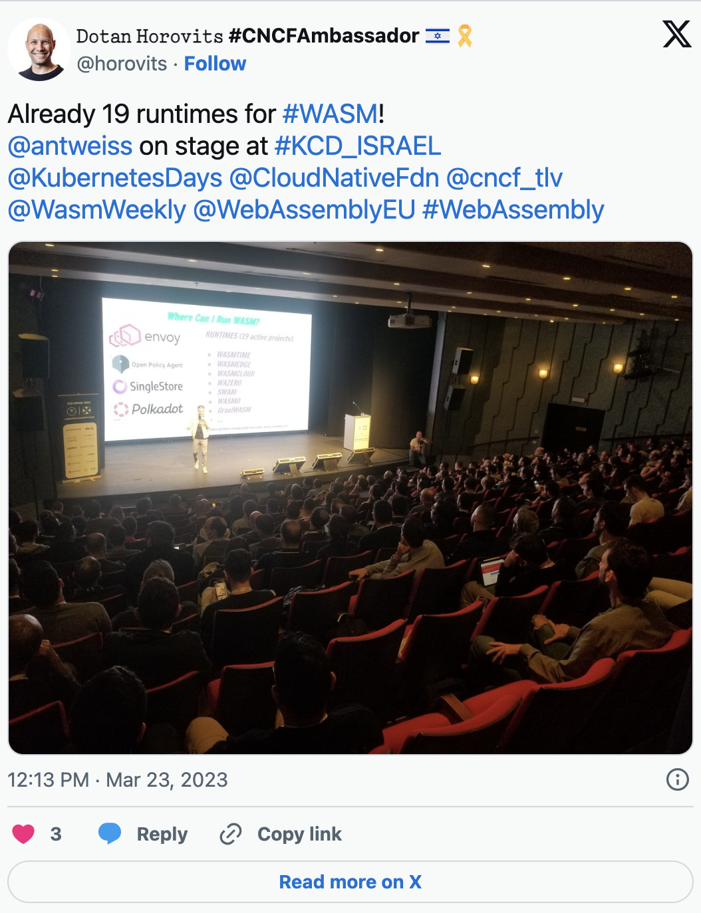
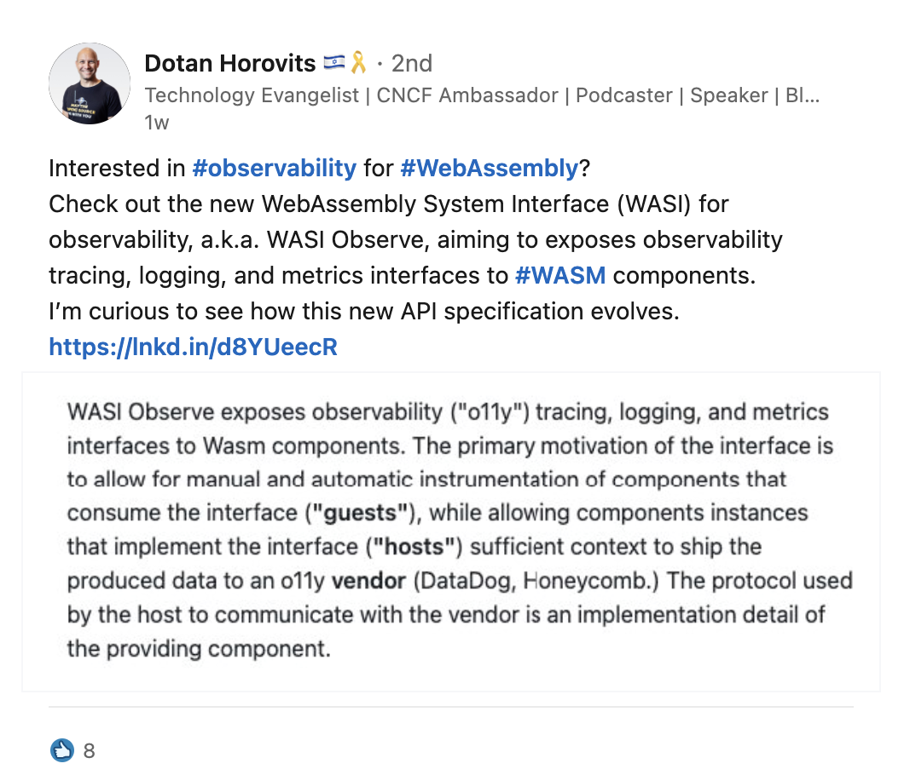

:::note[Cross Posted Article]

This was originally posted by [Dotan Horovits](https://www.linkedin.com/in/horovits/) at [Logz.io blog](https://logz.io/blog/webassembly-wasm-next-frontier-in-cloud-native/?utm_source=devrel&utm_medium=devrel&utm_campaign=OpenObservabilityTalks) to accompany a Cloud Observability Talks episode with Taylor Thomas, CNCF wasmCloud maintainer and CNCF Wasm WG member

:::

Kubernetes has just reached its 10th anniversary, signifying the maturity of the containers movement. Now it's time to explore the next frontier in cloud-native evolution: *WebAssembly*, a.k.a. *WASM* or *Wasm*. Moving [beyond containers and Kubernetes](https://logz.io/blog/kubernetes-and-beyond-2023-reflection/), WASM bears the promise to revolutionize the cloud landscape with unparalleled performance, portability, and security.

{/* truncate */}

In a recent episode of OpenObservability Talks, we delved into how WASM is transforming the way we build and run cloud-native applications, enabling a more efficient, scalable, and flexible infrastructure. We looked at the WASM standardization work taking place at the W3C, the [Cloud Native Computing Foundation](https://logz.io/blog/fireside-chat-with-cncf-cto-opentelemetry-more/) (CNCF) and the Bytecode Alliance, and reviewed the wasmCloud open source project under the CNCF.

My guest for the episode was [Taylor Thomas](https://www.linkedin.com/in/oftaylor/), Engineering Director at Cosmonic and a WebAssembly veteran. Taylor serves as a co-chair for the CNCF's WASM working group, and is one of the creators of Krustlet and Bindle open source projects. His work at Intel, Nike, and Microsoft spanned various containers and Kubernetes platforms as well as WebAssembly platforms.

In this blog post I will take you through the journey of WebAssembly, what it is, its use cases and benefits in comparison to containers, its maturity and support among various programming languages, operating systems and runtime environments, the standardization efforts and more. You can also find the full episode recording below.

<YouTube url="https://www.youtube.com/watch?v=t2xIoVNwtKM" />

## What is WebAssembly (WASM)?

The first thing to understand about WebAssembly is it's neither web nor is it assembly. So what is WebAssembly?

According to [WebAssembly.org](http://webassembly.org/), it's a binary instruction format for a stack-based virtual machine. WASM is designed as a portable compilation target for programming languages, enabling deployment on the web for client and server applications.

I look at it as the proverbial "compile it once, run it anywhere" promise. Programmers have been chasing this promise since the days of Corba and SOAP. How is this time different? Let's have a look.

## Compile once, run anywhere

Being a compilation target means you compile your program from your programming language of choice to a WebAssembly binary, and then natively run this binary. The **language-agnostic execution** standard is the first important value proposition of WASM.

The other part of the "compile it once, run it anywhere" promise, is WASM's **cross-platform execution**. Containers have gotten us somewhat closer to this promise, but admittedly their Linux origins are quite present.

"You can't run a container on a Mac, you have to run it through a VM on a Mac. You can run a Windows container, but those are entirely different from how a Linux container works," shares Taylor. "So, you end up compiling all the different architectures you need to be able to run a container image for any given operating system."

WASM, on the other hand, has standard support across the different platforms. "Any developer class workstation, I should say, could do it." says Taylor. "Linux, Windows, Mac can all do this right now."

In addition to the out-of-the-box runtime support, you could also leverage alternative WebAssembly runtimes, including purpose-built ones such as for running on IoT devices and constrained environments.

## Lightweight and near-native performance

The second value proposition of WASM lies in its promise to deliver lightweight and near-native performance for web applications and server-side applications alike, making it a potential game-changer for both frontend and backend development.

How lightweight is WASM in comparison to a container?

"A simple hello world in a scratch container is going to be a meg or two," says Taylor, "and in WebAssembly, that's going to be probably a couple hundred kilobytes at most."

Being lightweight, WASM binary also displays superior startup time when compared to a container startup. Its lightweight nature enables running "thousands or tens of thousands of these on a similar size node to what you have inside of your Kubernetes cluster," according to Taylor.

## Security-first with sandboxed execution

WASM is designed with security as a fundamental priority, making it highly suitable for running untrusted code safely. One of its key security features is sandboxed execution, which isolates WASM code from the host environment. This means that WebAssembly modules run in a secure, restricted environment that prevents them from accessing the host system's resources directly, thereby mitigating the risk of malicious code execution.

This sandboxing is achieved through strict memory and execution constraints, ensuring that the code cannot perform unauthorized actions or access memory outside its allotted space. Additionally, WebAssembly's linear memory model and its use of safe, typed bytecode further enhance security by preventing common vulnerabilities such as buffer overflows.

This security-friendly architecture allows developers to confidently run third-party or user-generated code within their applications, knowing that it is contained and controlled, thus preserving the integrity and security of the host system.

## WASM support in various environments

WASM is a new technology, but support is expanding rapidly. Things are more evolved in the browser, where the origins of WASM lie. You can compile in most major languages to be able to do a WebAssembly that works in the browser. Taylor explains that the reason that works is because "you can shim everything in the browser. You're essentially taking advantage of the browser sandbox."

On the server side, where no sandboxing is available, things are more interesting, as it requires native support for compiling and running WASM binaries. According to Taylor, "the best support right now are a lot of the very static languages like Rust, C, C++." GoLang recently joined the pack with [TinyGo](https://tinygo.org/), and there's support also in C#, and efforts underway in the Java community, in Python and in other languages. Taylor cautions that: "It's a little bit janky sometimes in Python just because you have things like CPython."

The vision is that these languages compile to WASM, enabling developers to leverage their existing skills while enjoying the performance benefits of WASM. The support is toolchain-specific, however, and you should check support for your specific programming language and environment.

Can the developer just program the same, or do they need to be aware that it ultimately runs as a WASM binary? Taylor answers that: "essentially, you won't have to change much. Right now, you have to know that some things might not compile very well depending on the different dependencies and stuff, but you can essentially just write it, use the same IDE, use the same toolsets you've always had, you just compile to a different target."

Taylor shares that "debugging step is a little bit more difficult right now," with active efforts in the community around it.

## The WebAssembly System Interface (WASI) specification

In an effort to standardize APIs for WebAssembly, the community established the *WebAssembly System Interface (WASI)* specification. WASI provides a way to compose software written in different languages "without costly and clunky interface systems like HTTP-based microservices," as aptly stated on [wasi.dev](https://wasi.dev/).

This aims to simplify the developer experience. Taking the caching example, Taylor explains that the developer should only ask for a key-value store, while today: "I need to pick [Redis or Valkey](https://logz.io/blog/redis-no-longer-open-source-is-valkey-successor/) or something, and then you have to pick a client, and then you have to do that." Day-2 scenarios, such as switching caching provider or addressing security vulnerabilities or bugs in a caching client, may necessitate recompilation of our application, further complicating the developer experience.

WASI is in fact a group of APIs, addressing multiple aspects. One such aspect is observability, which is covered by the [*WASI Observe* observability API specification](https://github.com/WebAssembly/wasi-observe). WASI Observe exposes observability tracing, logging, and metrics interfaces to WASM components, allowing for manual and automatic instrumentation of these components. As an observability enthusiast, I'm curious to see how this new specification evolves.

## WASM Component Model

The WASM elements we've discussed above are infrastructure-level primitives, enabling benefits such as faster startup time and more dense compute. The WASM component model introduces application level primitives to the mix.

The [WASM component model](https://component-model.bytecodealliance.org/) is an architecture for building interoperable WASM libraries, applications, and environments. Put simply, it's a way to build and manage components that can be dynamically composed and deployed. It supports the creation of scalable and maintainable applications by allowing developers to build components that interact through well-defined WASI interfaces. I summarize it as shareability and reusability of app building blocks.

Taylor explained it through the experience of the common Kubernetes user: "Well, I'm trying to do something in this language. Do I have a client? No, I don't have a client or it's half featured or it doesn't have this thing," he says. "Imagine a world where you just have client Go and that is exported via these interfaces, and then you might be in C# or you might be in Java or you might be in whatever language and you're able to use client Go as it stands. So you get these SDKs for free, so you get these interface driven developments."

Bear in mind that the component model is fairly new, and was only formalized and voted on in February 2024. Taylor shared that some languages like Go have this actually built in, so it's worth a check.

## Which workloads best fit WASM

WASM is particularly suited for workloads that benefit from high performance and portability. Taylor shared several use cases, including:

**Functions as a Service:** Whether you use Azure functions as a service, AWS Lambda, CloudFlare workers, any of the FaaS, WebAssembly offers a simpler and more lightweight alternative than containers: "instead of having to build these bespoke super complex container things and then you have to spin those containers up and keep them hot so that it doesn't take too long."

**Edge Computing:** "WebAssembly is great for edge computing scenarios where resources are constrained, and performance is critical," Taylor noted.

**IoT Devices:** Companies like Machine Metrics use WASM to extend functionality to IoT devices, enabling real-time metrics and data processing.

**Cost Reduction and Security:** Adobe leverages WASM to run untrusted code securely and efficiently, reducing costs and enhancing security.

These examples illustrate how WASM is transforming various domains by providing a consistent and efficient execution environment.

## WebAssembly: Young but Promising Step in Virtualization Evolution

While containerization is mainstream, and Kubernetes enters its second decade, new options for virtualization are emerging. WebAssembly offers a fast, lightweight and secure alternative, which is rooted in emerging industry standards.

It covers both frontend and backend, and is now expanding from the infrastructure into the application. Fairly new, but backed by an active community, it's interesting to see the adoption and ecosystem it will rally behind it.

Want to learn more? Check out the OpenObservability Talks latest episode: [_WebAssembly: The Next Frontier in Cloud-Native Evolution_](https://www.youtube.com/watch?v=t2xIoVNwtKM).
