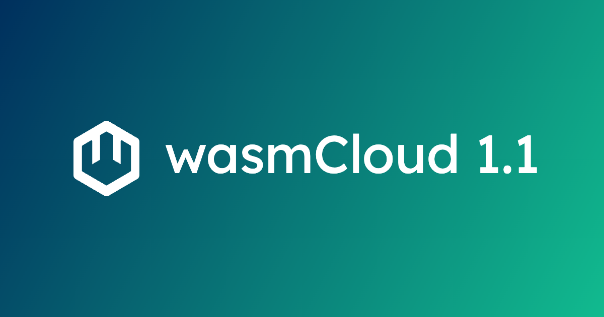

We're proud to announce the release of **wasmCloud 1.1**, including the feature most commonly requested by users: **secrets support**. In addition to secrets, the new release brings along a bevy of enhancements for enterprises, exciting new capabilities like Postgres, and first-class support for Go-based custom capability providers. Let's take a look at some of the highlights.

{/* truncate */}

## Secrets in wasmCloud

Secrets are a must-have feature for application platforms, so it's no surprise that secret support has been our most-requested feature since the launch of 1.0. Now we're thrilled to provide full and flexible support for secrets with a secrets **backend system** that enables you to use the secret store of your choice while maintaining robust encryption across the lifecycle of a secret. 

Here you can see a high-level diagram of how a secret request travels from a component to two different secret stores: HashiCorp Vault and a NATS key-value store. (Not coincidentally, secrets backends are already implemented for these two stores.)  

wasmCloud also integrates fully with Kubernetes secrets, so you can make use of any existing Kubernetes secrets infrastructure right out of the box, if you're [running wasmCloud on Kubernetes](/blog/how-to-run-webassembly-components-on-kubernetes-with-wasmcloud). 

For a full overview of how secrets work in wasmCloud, [check out the documentation](/docs/concepts/secrets), which includes a [hands-on example of using secrets with a NATS key-value store](/docs/concepts/secrets#example-using-a-nats-kv-backend). You can also [learn how to implement your own secrets backend](/docs/deployment/security/secrets).

## Postgres and Couchbase

wasmCloud maintainers and the wider community have released several major capabilities in the process of landing wasmCloud 1.1. There are two capabilities we'd particularly like to highlight&mdash;each of which can leverage our new secrets functionality for secure authentication:

* **Postgres**: The first-party PostgreSQL [interface](https://github.com/wasmCloud/wasmCloud/tree/main/wit/postgres) and [capability provider](https://github.com/wasmCloud/wasmCloud/pkgs/container/sqldb-postgres) combine to bring Postgres functionality to wasmCloud applications as a simple, reusable building block. 
* **Couchbase**: The third-party Couchbase [interface](https://github.com/couchbaselabs/wasmcloud-provider-couchbase/tree/main/wit/couchbase) and [provider](https://github.com/couchbaselabs/wasmcloud-provider-couchbase) bring Couchbase KV connectivity to Wasm applications via `wasi-keyvalue`.

## Enhancements for enterprises

We've iterated on a bevy of enhancements alongside enterprise users:

* **Configure trace levels independently from logs**: In some cases, you may want to surface important traces without needlessly dialing up the verbosity of your logs. For these situations, we've added a `--trace-level` option to wasmCloud that allows users to configure traces and logging separately. As of 1.1 the default trace level is set to `DEBUG`, while the log level default remains `INFO`.

* **Supply additional CA certificates to OCI and OpenTelemetry clients**: wasmCloud 1.1 adds support for providing Certificate Authority certificates to be loaded when the host is initialized. (This option is in addition to including custom CA in the wasmCloud host OS trust store.) These certificates are then configured in the OCI and OpenTelemetry clients. This can be helpful, for example, if you're using or mirroring the upstream wasmCloud container images and don't want to modify them to include your local CA.

* **Export OTEL signals over gRPC**: We've expanded our OTEL support to include signals exported over gRPC, as an alternative to the default HTTP-based protocol. Enable gRPC signals with the `--observability-protocol=grpc` CLI argument or `WASMCLOUD_OBSERVABILITY_PROTOCOL=grpc` environment variable.

* **Configure proxy credentials for HTTP(S) proxy**: You can now specify basic proxy authentication credentials with the `WASH_PROXY_USERNAME` and `WASH_PROXY_PASSWORD` environment variables, in conjunction with the `HTTP(S)_PROXY` (or `http(s)_proxy`) environment variables.

* **Generate tracing flame graphs**: Easily configure wasmCloud to generate a flame graph at a specified path with the `--flame-graph` command line argument or `WASMCLOUD_FLAME_GRAPH=` environment variable.

For more information on the full suite of enhancements in wasmCloud 1.1, check out the [release notes](https://github.com/wasmCloud/wasmCloud/releases/tag/v1.1.0).

## Get involved

Whether you've been following wasmCloud for a while or you're just getting started, we'd love for you to join us! Bring your questions, comments, feedback, or ideas to the [wasmCloud Slack](https://slack.wasmcloud.com/), or join us live for the next [wasmCloud community meeting](https://wasmcloud.com/community). 
