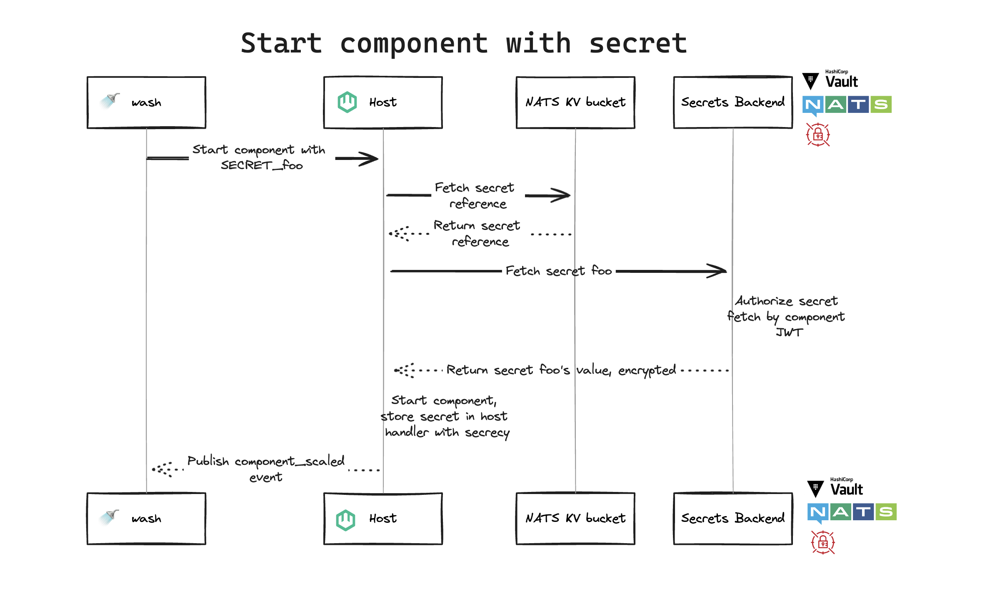

In wasmCloud 1.1, we're excited to introduce what is far and away our most requested feature: **secrets**. Now applications on wasmCloud can request secrets at runtime, leveraging a secrets API that can be used with the secret store of your choice. With a system that encrypts secrets in transit and never stores them on disk, we've doubled down on our Zero Trust security posture so teams can deploy to production with confidence. 

## How secrets work in wasmCloud

Secrets are a challenging problem in cloud native environments, so we spent a lot of time thinking about how to approach them in wasmCloud.  

We wanted a better approach&mdash;one that leverages the NATS-powered lattice to deliver true encryption and avoid storing secrets on the [wasmCloud host](/docs/concepts/hosts) in any form. We accomplished this with an architecture that organizes secret requests and responses into a few key steps:

* A component or capability provider **requests a secret** by reference to secret's location, without needing to present credential material. 
* The request goes to a **secrets handler** which in turn requests the specified secret from the appropriate **secrets backend**.
* Communication with a **secrets store** is mediated by a **secrets backend**.

You can see the path of a secret request for a component in the diagram below. In this example, we can see how the system integrates with both an external secret store like Vault and the key-value store already available in the wasmCloud stack as part of NATS.



Let's walk through this process step-by-step:

* The `wash` CLI asks the wasmCloud host to start a component with `SECRET_foo`
* The host fetches a secret reference from the NATS key-value bucket
* The NATS key-value bucket returns the secret reference to the host
* The host fetches a secret named `foo` from the secrets backend
* The secrets backend authorizes a secret fetch by the component JWT
* The secrets backend returns the encrypted value of secret `foo` to the host
* The host starts the component, storing the secret inthe host handler using the `secrecy` crate
* The host publishes a `component_scaled` event

The secret itself is never logged or accessible in memory&mdash;it is encrypted with an [**xkey**](https://docs.nats.io/running-a-nats-service/configuration/securing_nats/auth_callout#encryption), a x25519 keypair compatible with [NaCl](https://nacl.cr.yp.to/) Seal and Open operations, and held in-memory with Rust's [`secrecy` crate](https://crates.io/crates/secrecy). When you drop a secret, it is wiped in-memory. 

## Putting the pieces together

As you can see in the diagram, **secret backends** are an important piece of the puzzle, acting as a mediator between your applications and the secret store(s) of your choice. You can learn more about the design of backends in the documentation, but the most important thing to know up-front is that backends and wasmCloud workloads alike use the common `wasmcloud:secrets` API defined in [WebAssembly Interface Type (WIT)](/docs/concepts/interfaces#webassembly-interface-type-wit). You can [check out the interface on GitHub](https://github.com/wasmCloud/wasmCloud/blob/main/crates/secrets-types/wit/secrets.wit). 

Using a common API enables the same vendor-agnostic approach that we take throughout the rest of the wasmCloud ecosystem&mdash;if you need to swap out your secrets vendor, that's not a problem as your components and providers remain unchanged while leveraging exactly the same API. All you need to do is change one or two lines of configuration.  

Once you've built a component or provider that uses the `wasmcloud:secrets` interface to consume a secret, using the secret is simply a matter of defining it in your application's [**wasmCloud Application Deployment Manager (wadm)**](/docs/ecosystem/wadm) deployment manifest. At minimum, this means defining a secret `name` and `properties` (with the `properties` specifying a `backend` and `key`). A basic example looks like this:

```yaml {14-18}
apiVersion: core.oam.dev/v1beta1
kind: Application
metadata:
  name: App with secrets
  annotations:
    version: v0.0.1
    description: 'HTTP hello world demo in Rust'
spec:
  components:
    - name: http-component
      type: component
      properties:
        image: ghcr.io/wasmcloud/components/http-hello-world-rust:0.1.0
        secrets:
          - name: test
            properties:
              backend: vault
              key: 'path/to/key'
```

## Example: Using a NATS KV backend

In this example, we have a sample application that includes a capability provider and component that refer to a secret value. The [sample key-value counter](https://github.com/wasmCloud/wasmCloud/tree/main/examples/rust/components/http-keyvalue-counter) app authenticates with a Redis database that requires a password, and serves an HTTP API that requires an authentication password header.

Meanwhile, our secret itself is stored and encrypted in a [NATS KV secrets backend](https://github.com/wasmCloud/wasmCloud/tree/main/crates/secrets-nats-kv) instance. wasmCloud fetches the secret at runtime based on the signed identity of the component/provider. So let's see how all of these pieces work together.

To run through this example, you'll need:

- [The Rust toolchain](https://www.rust-lang.org/tools/install)
- [`wash` v0.30.0 or later](https://wasmcloud.com/docs/installation)
- [Docker](https://www.docker.com/)
- [`jq`](https://jqlang.github.io/jq/download/)
- [`secrets-nats-kv`](https://github.com/wasmCloud/wasmCloud/tree/main/crates/secrets-nats-kv) installed (you can install this from the monorepo cloned below)

Start by cloning the wasmCloud monorepo and navigating to the `secrets` example directory:

```bash
git clone https://github.com/wasmCloud/wasmCloud.git
cd wasmcloud/examples/security/secrets
```

Build the `keyvalue-counter-auth` component, and the `keyvalue-redis-auth` provider:

```bash
wash build -p component-keyvalue-counter-auth
wash build -p provider-keyvalue-redis-auth
```

From the `secrets` directory, run the example Docker Compose file for the necessary infrastructure, generating secret keys with `wash` and assigning them to environment variables:

```bash
export ENCRYPTION_XKEY_SEED=$(wash keys gen curve -o json | jq -r '.seed')
export TRANSIT_XKEY_SEED=$(wash keys gen curve -o json | jq -r '.seed')
docker compose up -d
```

Use the `secrets-nats-kv` CLI to place the necessary secrets in the NATS KV backend:

```bash
# Ensure the TRANSIT_XKEY_SEED is still exported in your environment above
# or the decryption of the secret will fail
secrets-nats-kv put api_password --string opensesame
secrets-nats-kv put redis_password --string sup3rS3cr3tP4ssw0rd
# You can also put the password using an environment variable
SECRET_STRING_VALUE=sup3rS3cr3tP4ssw0rd secrets-nats-kv put default_redis_password
```

Allow your component and provider to access these secrets at runtime (this step is specific to a NATS KV backend&mdash;other secrets backends like Vault will handle authorization externally via policies):

```bash
component_key=$(wash inspect ./component-keyvalue-counter-auth/build/component_keyvalue_counter_auth_s.wasm -o json | jq -r '.component')
provider_key=$(wash inspect ./provider-keyvalue-redis-auth/build/wasmcloud-example-auth-kvredis.par.gz -o json | jq -r '.service')
secrets-nats-kv add-mapping $component_key --secret api_password
secrets-nats-kv add-mapping $provider_key --secret redis_password --secret default_redis_password
```

Finally, run wasmCloud and deploy the application:

```bash
WASMCLOUD_SECRETS_TOPIC=wasmcloud.secrets \
    WASMCLOUD_ALLOW_FILE_LOAD=true \
    NATS_CONNECT_ONLY=true \
    wash up --detached
```

```bash
wash app deploy ./wadm.yaml
```

You can check the status of your application by running `wash app list`. Once it's deployed, you can make requests to the application.

### Making authenticated requests

First, let's verify that unauthenticated requests to Redis and the component are denied:

```bash
redis-cli -u redis://127.0.0.1:6379 keys '*'
(error) NOAUTH Authentication required.

curl 127.0.0.1:8080/counter
Unauthorized
```

Now we can try authenticating with the component:

```bash
curl -H "password: opensesame" 127.0.0.1:8080/counter
Counter /counter: 1
```

If we pass an invalid password, the authentication check will still fail:

```bash
curl -H "password: letmein" 127.0.0.1:8080/counter
Unauthorized
```

To inspect the Redis database directly, you can provide the password in the URI:

```bash
redis-cli -u redis://sup3rS3cr3tP4ssw0rd@127.0.0.1:6379 get /counter
```

### Cleanup

When you're done, shut down wasmCloud and the resources running in Docker:

```bash
wash down
docker compose down
```

## Join the conversation

For more information on secrets in wasmCloud, make sure to check out the [documentation](/docs/concepts/secrets).

From roadmap to RFC to release, secrets support was driven and designed with invaluable input and contributions from across the wasmCloud community. We're thrilled to share it with everyone and look forward to feedback on how it's working for you. If you'd like to talk about secrets or get involved with the project, join us on the [wasmCloud Slack](https://slack.wasmcloud.com/)! 