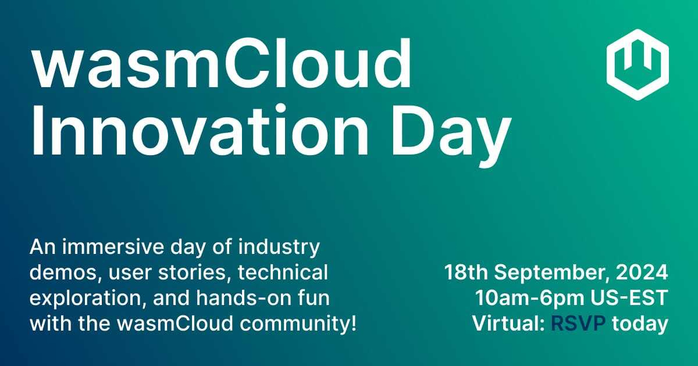

**Date**: 18th September, 2024  
**Time**: 10am-6pm Eastern  
**Location**: Virtual, [RSVP](https://wasmcloud.com/innovation-day)!

Since the release of WASI 0.2 and the WebAssembly (Wasm) Component Model in January, we’ve focused on making wasmCloud the best place for engineering teams to bring Wasm to their own architectures. wasmCloud 1.0 brought the component model to life in the world’s largest organizations—helping to reduce the cost and complexity of Kubernetes, and making it possible thrive at the edge. Now with a bevy of new features in 1.1 (1.2 and 1.3 releasing soon), wasmCloud is cementing its reputation as the enterprise-ready, Wasm-native orchestration platform of choice.

We wanted to get the open source community together to dive into the latest innovation, hear the experiences of wasmCloud users and customers, and celebrate the work of our maintainers and community contributors. That’s why we created **wasmCloud Innovation Day**, taking place on the 18th September from 10am ‘til 6pm ET.

Whether you’re already using Wasm or a complete newbie, this one-day virtual event is the ideal immersion in all things WebAssembly and wasmCloud. We’ll explore wasmCloud’s technical architecture, fresh and growing feature set and, most importantly, hear how companies in a host of industries are working with this popular open source CNCF project.

Here’s what to expect—check out the full agenda below and [**register now**](https://wasmcloud.com/innovation-day)!

**wasmCloud in Industry:** Hear how engineers from the world’s largest organizations are using wasmCloud in real-world use cases…stay tuned for details.

**Technical Deep Dive:** wasmCloud has been transformed with WASI 0.2 and wasmCloud 1.1 is full of features designed to make building with components a joy. From secrets support to creating your own custom capabilities, we’ll take a deeper look at what’s new, and how to get the most out of 1.1.

**Community Workshop and Hangout:** Join us in Gather space to build your own Wasm application and hang with industry leaders, our valued open source contributors and wasmCloud users.

## **Agenda**

**Morning Session**  

**10 - 10.15 ET: Welcome and Opening Keynote:** **The Pitfalls of Modern Platform Engineering: [Bailey Hayes](https://github.com/ricochet)**

- Learn how to end the ‘rinse and repeat’ of application development, improve life with Kubernetes, and run distributed workloads securely and efficiently.

**10.15 - 11.30: wasmCloud Technical Deep Dive**

- **Secrets**
    - [**Brooks Townsend**](https://github.com/brooksmtownsend) explains why this is the most requested feature amongst our enterprise customers and partners and digs into how secrets work in wasmCloud.
- **Evolution in Golang**
    - [**Lucas Fontes**](https://github.com/lxfontes) discuss the Go provider SDK and building Go components with TinyGo.
- **wasmCloud-operator**
    - [**Lucas Fontes**](https://github.com/lxfontes) explores the wasmCloud Kubernetes operator and how it helps users bring wasmCloud applications to Kubernetes clusters.
- **wash dev**
    - [**Victor Adossi**](https://github.com/vados-cosmonic) introduces and demonstrates the `wash dev` CLI feature.
- **Custom Capabilities**
    - Postgres and Couchbase with [**Victor Adossi**](https://github.com/vados-cosmonic)
- **Machine Learning**
    - AI, LLM's, and Machine Learning overview with [**Bailey Hayes**](https://github.com/ricochet)
- **wRPC and NATS**
    - [**Taylor Thomas**](https://github.com/thomastaylor312) and [**Roman Volosatovs**](https://github.com/rvolosatovs) explore how to use wRPC and NATS for seamless distributed systems

**11.30 - 12.15pm: wasmCloud Weekly Community Meeting**

- In a special edition of our [weekly community meeting](https://wasmcloud.com/community), we’ll focus on the essential role of open source maintainers, exploring what being a maintainer entails, and how you can be a part of the project.

**Community Keynote and Demos**

- **12.15 - 12.30: Fireside Chat:** Bytecode Alliance and Wasm industry leader [Yosh Wuyts](https://github.com/yoshuawuyts) and [Luke Wagner](https://github.com/lukewagner) will join Bailey Hayes to discuss what’s next for the WebAssembly ecosystem, standards and community.
    - What’s next in cloud native WASI proposals?
    - Your Community Needs You! Bytecode Alliance community call to action
- **12.30 - 1.30pm Customer and User Demos**
    - **Akamai and the future of edge computing**
    Senior Architect at **Akamai**, [Doug Rodrigues](https://github.com/djrodrigues), will discuss what the future of edge computing looks like for Akamai, and the role of Wasm and wasmCloud in addressing the problems inherent in deploying to edge locations.
    - **wasmCloud in Industrial IoT**
    [Jochen Rau](https://github.com/jocrau) and [Tyler Schoppe](https://github.com/tylerschoppe) from **MachineMetrics**’s Platform Engineering Team will share the secrets to bringing wasmCloud to industrial IoT use cases. After a successful PoC which proved it’s possible to better utilize edge resources with Wasm, the team is now progressing to deploying wasmCloud on manufacturing machinery! Join their session to find out how.
    - **Infrastructure Transformation with wasmCloud**
    Senior Software Engineer at **Adobe**, [Colin Murphy](https://github.com/cdmurph32), having brought wasmCloud to Adobe’s Kubernetes infrastructure, Colin will share how the use of wasmCloud is evolving at Adobe, and the different use cases emerging within the company.

**1.30 - 2pm: Lunch**

**2 - 6pm: Workshop and Gather Hangout**

- Workshop! Build your own app with [Lachlan Heywood](https://www.notion.so/cd7e2b68ae934af5a9edd419f5f57817?pvs=21)
- Meet the Bytecode Alliance team
- Meet wasmCloud maintainers Brooks, Taylor, Bailey, Victor and the team and find out how to get involved
- Meet your community compatriots!

**6pm: Event Closes**

<a href="/innovation-day" class="button" style={{ display: 'block', width: '200px', marginTop: '50px', fontSize: '18px' }}>Register now!</a>
