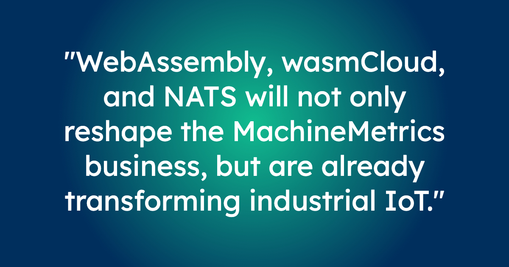
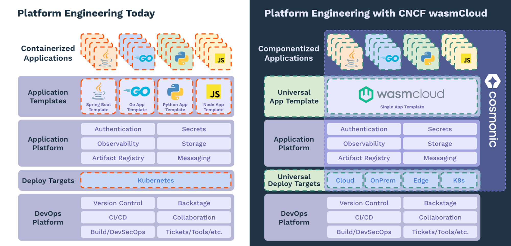
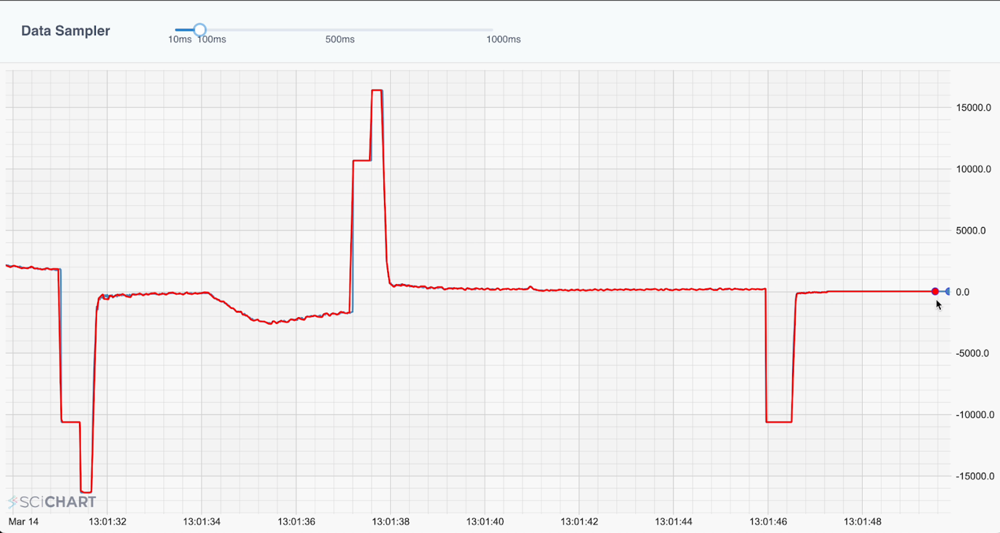
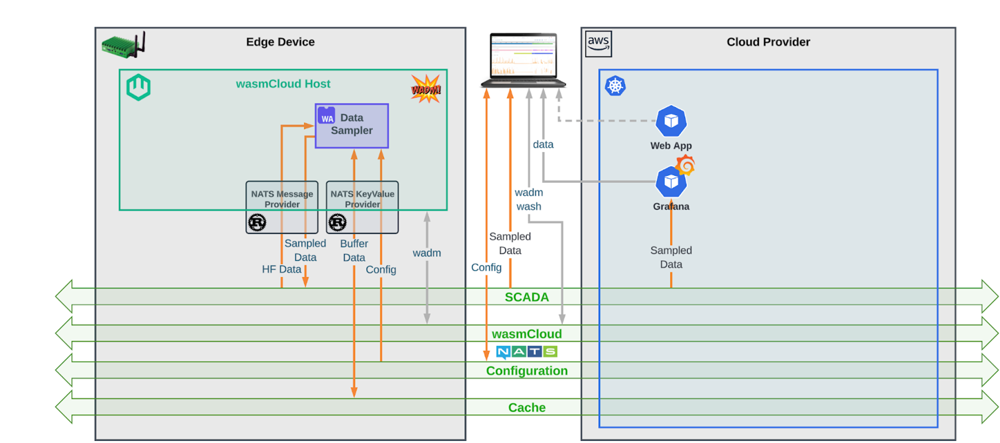
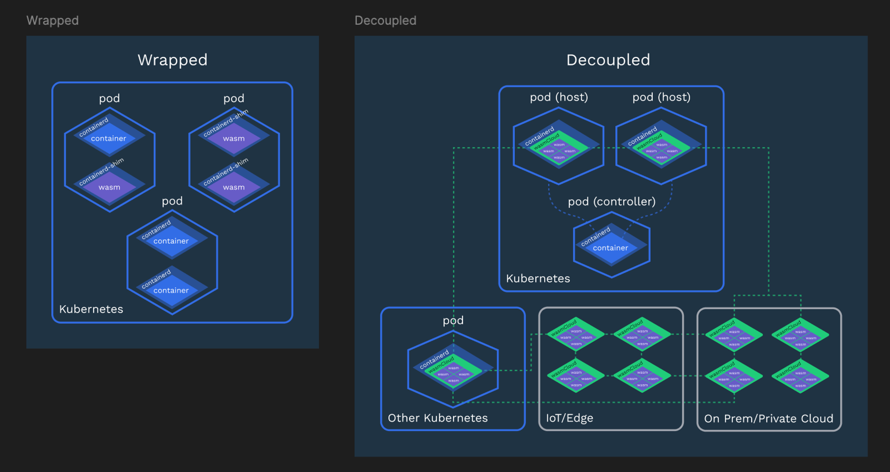

:::note[Cross-Posted Article]

This post originally appeared on the [Cloud Native Computing Foundation (CNCF) blog](#).

:::

Operating in the manufacturing sector has never been more costly. Exacerbated by high inflation, the cost of materials, fuel, shipping and labor have risen exponentially post-pandemic. In response, manufacturers are looking for ways to reduce maintenance costs, and improve production capacity. They’re doing this by putting advanced data analytics into production lines to better understand and optimize machine performance.

[**MachineMetrics LLC**](https://www.machinemetrics.com/), is a catalyst for this next phase of digital transformation. The company’s customers operate factories and plants containing advanced manufacturing machinery, producing swathes of unutilized data. Reporting is usually carried out manually, sometimes on thousands of machines. Manual errors often arise which result in missed anomalies, risking eventual machine failure.

MachineMetrics’ edge monitoring devices connect to each machine to capture timely and accurate data from machine controls and sensors. By being able to closely analyze the performance of machinery, operators more accurately predict wear and tear. This reduces costly incidents, lowers maintenance costs and extends the longevity of equipment.

Data capture alone, however, consumes the majority of resources on each device which leaves less space to do much else. The inherent abundance of high-frequency data, coupled with network constraints, make visualizing that data difficult in tools like Grafana. MachineMetrics’ Data Platform Team Engineers Jochen Rau and Tyler Schoppe, suspected that the efficiency of the WebAssembly (Wasm) bytecode format could help solve this issue and unlock greater architectural freedom.

WebAssembly is often described as a tiny virtual machine designed to execute portable bytecode in any location, at near native speed. When built with standardized, interchangeable **WebAssembly components**, applications can run on any server, device or cloud that supports the standard APIs of WASI (WebAssembly System Interfaces) 0.2, regardless of the underlying hardware or operating system.

To test the theory, Rau and Schoppe designed an early PoC with the CNCF Sandbox Project **wasmCloud**, which enables users to run WebAssembly workloads in distributed environments.

## Edge Extensibility with WebAssembly

Streaming high frequency data poses considerable challenges, exponentially increasing ingest costs. Many factories do not have the network bandwidth to support volume data being streamed across a fleet of machines. Adding to the challenge, a single edge device can collect data from dozens of systems machines and push it to the cloud, but this leaves few resources available for compute.

The PoC was created to discover whether wasmCloud could provide a more efficient and lightweight compute methodology, with business logic that could be more easily transported over the network. This would make better use of existing available resources at the edge, and put portable processing where needed most.

Engineered around the standard APIs of WASI 0.2, wasmCloud allowed the team to deploy and manage workloads as [**components**](https://component-model.bytecodealliance.org/design/why-component-model.html): portable, interoperable WebAssembly binaries that could run anywhere from the cloud to the edge. By including only the code they needed in components and fulfilling non-functional requirements with wasmCloud providers linked at runtime, applications could be tiny and portable. Because the non-functional requirements are externalized, updating dependencies for large fleets of devices is easy in case of a bug or needed feature

Most importantly, the team could manage and run wasmCloud on existing Kubernetes clusters in a way that felt familiar to them, bringing the kind of extensibility to Kubernetes that was previously impossible.

*Figure 1: What platform engineering feels like in the wasmCloud ecosystem.*

### Proof of Concept: Downsampling High-Frequency Data

The team developed a custom algorithm allowing high-frequency data to be downsampled from any deployment target. This would allow processing power to be moved between edges and clouds, according to need and without losing data fidelity. Whether analyzing 5000 data points or just 50, the data would be consistent. Built on Sveinn Steinarsson’s (University of Iceland) [Largest-Triangle-Three-Buckets (LTTB)](https://skemman.is/bitstream/1946/15343/3/SS_MSthesis.pdf) algorithm, it was adjusted to operate on unbounded streams and provided stateful processing to enable storage.

Implemented in Rust and deployed in wasmCloud as a Wasm component, the completed downsampling algorithm reports proactive maintenance telemetry across edge and cloud platforms. Crucially, the algorithm is deployed to wasmCloud with Wadm, a Wasm components native orchestrator that integrates seamlessly with Kubernetes.

Jochen Rau: 

> “Wadm simplifies creating and linking components. It’s easy to define your providers, as well as your components, in this common model and produce the providers you need for key-value mass messaging, as well as the downsampling component, hooked up together with some links. That's great for reconciliation. And as we release new versions, it helps make sure everything goes smoothly.”

The algorithm proves it’s possible to run high-frequency data workloads as components, on edge devices running in wasmCloud. wasmCloud is also shown to be an effective compute lattice on which to move workloads seamlessly between deployment targets. In the next development phase, Schoppe and Rau will deploy wasmCloud on machines, and begin to observe the potential efficiencies.

*Figure 2: Downsampling algorithm maintains fidelity of the graph even at low sampling rates*

*Figure 3: Architecture of the PoC showing wasmCloud host running on an edge device. NATS serves as backbone for machine, configuration, and control data.*

## What are the challenges wasmCloud overcomes?

### Portable Processing Made Real

Rather than handing off data to be processed in the cloud, applications running as components in wasmCloud are radically smaller, freeing resources to process and stream performance data directly from machines. For MachineMetrics’ customers, that means lower latency, faster time-to-value, and fewer hardware problems.

This is only half the story. The real advantage for the team is in making these workloads portable to *any* location—easily shifted back-and-forth between multiple edges and clouds. This gives the team freedom to make better and quicker architectural decisions.

Tyler Schoppe: 

> “What’s powerful is we don’t have to think about where the compute lives. wasmCloud takes that off the minds of developers, the importance of which cannot be overstated. If we need to make changes it’s a lot easier to pivot and move workloads from the edge to the cloud; if we need to scale, for instance. That would be very challenging for us to do in our current architecture.”

wasmCloud also breaks down language barriers. Usually, edge application teams work in a different preferred languages to their cloud engineering counterparts. Whether written in Python, Go, C++ or any other language, WASI 0.2 components mean edge and cloud teams can interoperate using standard WebAssembly Interface Type (WIT) definitions for interfaces. This unties them from specific libraries so they can focus on business logic.

### Architectural Freedom = Resource Efficiency

In traditional IoT models, processing is linear and unidirectional. Data is collected from separate sensors: captured by an edge, then ingested into a cloud—where the majority of compute takes place—before being handed off to the consumer. By pushing processing to the cloud, higher costs are incurred and latency increases. More importantly, valuable, more efficient processing capacity at the edge is underutilized.

MachineMetrics does the majority of its data processing in Kubernetes in the cloud. By moving compute to devices, existing edge resources are used more effectively and cloud resources preserved. Porting logic between resources means the team can balance their resources against their needs. They use the cloud to scale the processing of larger data sets, whilst allowing edge devices to process and stream real-time data directly to operators.

Jochen Rau: 

> “The focus is to find ways to more efficiently use resources that we already have at the edge, and manage our cloud resources more effectively. wasmCloud helps us do that. It’s also a balance—edge devices are relatively small so we can scale much more easily in the cloud. Having the flexibility to move workloads around means greater resource efficiency.”*

### Extending the Value of Existing Architecture

MachineMetrics uses Kubernetes extensively, but the team can’t run it at the edge. This is partly due to the company’s OS configuration, but primarily due to the limitations of Kubernetes. Kubernetes is great at managing infrastructure, but not so good at running applications on resource-constrained devices.

To solve this problem, [MachineMetrics](https://www.youtube.com/watch?v=fQdkNGZqYZA) uses wasmCloud alongside Kubernetes and ArgoCD, making use of the [wasmcloud-operator](https://github.com/wasmcloud/wasmcloud-operator) to deploy software to all of its edge locations. The wasmcloud-operator allows platform engineers to manage and run Wasm on Kubernetes using the standard, familiar controller pattern and custom resource definitions (CRDs), all while remaining decoupled from Kubernetes and free to leverage the unique benefits of components. Bringing the kind of extensibility to Kubernetes that was previously impossible.

Rau says: 

> “We shifted up a level: taking the wasmCloud host and deploying it on Kubernetes. The wasmcloud-operator makes this really simple to manage with our existing tools. We deploy our compute workloads on the lattice on wasmCloud. We’re crossing the boundaries between edge and cloud.”

Using this “decoupled” model means it’s easy for MachineMetrics to tie wasmCloud directly into existing pipelines and tools like ArgoCD.

*Figure 4: wasmCloud integrates with Kubernetes but as a separate service. This means engineers can capitalize on the benefits of the component model.*

### Deny-by-Default Security

Security is also a major consideration for MachineMetrics. Each customer has completely distinct approaches to security. Some have large, dedicated security teams whereas others may adopt a leaner approach. In every case, data is highly sensitive–MachineMetrics has to bring the same cast-iron security to every use case, and must be able to scale the same level of security to devices and sensors.

The power of WebAssembly allows wasmCloud applications to run securely from edge to edge. All code runs in a deny-by-default, secure, stateless, and reactive sandbox. The sandbox satisfies larger customers’ enterprise Service Level Agreements and more complex security, compliance, and policy requirements.

Tyler Schoppe: 

> “We work with mom and pop shops making screws, all the way to hardware planned for outer space. Regardless of how much or little security they have, we treat their security with the same level of care. wasmCloud’s sandbox model gives us a lot of guarantees. In terms of developer peace of mind, it provides a lot for us out of the box.”

wasmCloud’s hosts enforce a certain level of default security that cannot be loosened. For example, hosts will always validate runtime links. Additionally, the wasmCloud policy service API can be used to extend and customize policy evaluation, such as by restricting untrusted application components and providers on particular hosts.

## Benefits to Manufacturers

The team believes the benefits of being able to process and stream high velocity data directly from machines will excite their customers, from small shops to large plants. Carbide tools are very expensive—each machine costs thousands—so properly managing the utilization of them is essential. Damaged tools are not just expensive to replace, they can take out entire production lines. Extending the life of their tools through closer monitoring will save customers thousands in maintenance and replacements.

For Rau, the exciting part is being able to deliver a feature that customers have been waiting for.

Rau: 

> “Downsampled high frequency data is as expressive as raw data; we’re moving beyond aggregated monitoring data to being able to see real-time, high velocity data on dashboards. This is something our customers are asking for.”

Rau and Shoppe are now taking what they’ve learned from the PoC, developing the solution further and investigating ways to integrate with third-party machinery.

Schoppe concludes: “There’s nothing like this on the market right now and so it’s a great opportunity for us to put this kind of compute power in many more customers’ hands. As well as helping us differentiate, it will provide tremendous operational value for customers—something they can rely on to help them save money in a different way.”