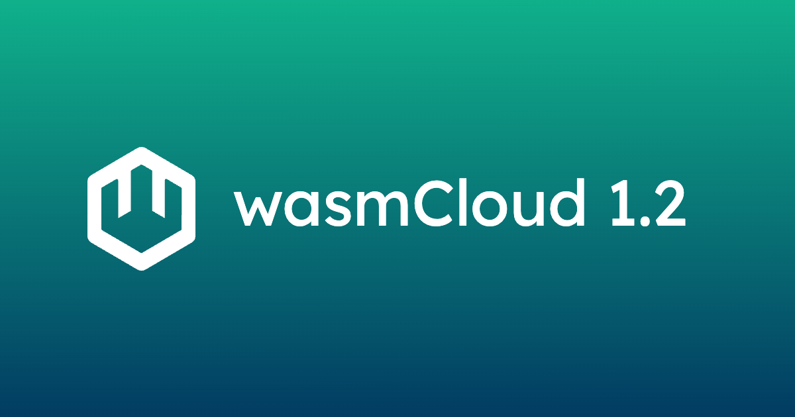

wasmCloud 1.2 officially closes out the remaining issues from the [Q2 Roadmap](https://github.com/orgs/wasmCloud/projects/7/views/10)! This release is also the first of our quicker release cadence, so expect to see some great changes&mdash;but not quite as many as wasmCloud 1.1.


## Updating to 1.2

### Components

Components using `wasi:blobstore` should see immediate improvements this release in terms of max bytes streamed, speed of streaming bytes, and error handling around streaming.

If you’re looking for examples of best practices when using streams, check out the [blobby](https://github.com/wasmCloud/wasmCloud/tree/main/examples/rust/components/blobby) example component. Since it uses `wasi:http` and `wasi:blobstore` directly, you can replicate the same lines of code in any source language component.

### Providers

Capability providers using the latest provider SDK will now be able to [subscribe to configuration updates](https://github.com/wasmCloud/wasmCloud/blob/main/crates/provider-sdk/src/lib.rs#L266), allowing configuration to change and immediately be delivered to providers without needing a restart. This will be an available function to override in the Rust provider SDK, and will be [implemented soon in the Golang provider SDK](https://github.com/wasmCloud/provider-sdk-go/issues/27).

Capability providers implementing `wrpc:blobstore` are **strongly recommended** to update to the latest version (`0.2.0`) in order to take advantage of blobstore async streaming. The host will remain backwards compatible with `wrpc:blobstore@0.1.0` for at least a minor release.

See https://github.com/wasmCloud/wasmCloud/pull/2779 for three implementation examples (Fileystem, Amazon S3, and Azure Blobstore) to see the best path for upgrading. We’ve updated and released each of these providers, so make sure to update your wadm manifests when possible:

- [ghcr.io/wasmcloud/blobstore-azure:0.4.0](http://ghcr.io/wasmcloud/blobstore-azure:0.3.0)
- [ghcr.io/wasmcloud/blobstore-fs:0.9.0](http://ghcr.io/wasmcloud/blobstore-fs:0.9.0)
- [ghcr.io/wasmcloud/blobstore-s3:0.10.0](http://ghcr.io/wasmcloud/blobstore-s3:0.9.0)

### wasmCloud hosts

wasmCloud introduced additional validation for policy and secret subjects, a new `linkdef_set_failed` event for better downstream validation of links, and the ability to tune the wasmtime runtime parameters at the wasmCloud CLI. In addition, wasmCloud is now running [wasmtime 23](https://github.com/bytecodealliance/wasmtime/releases/tag/v23.0.0) which comes with a suite of performance and security improvements.

Here are the newly available CLI flags for tuning runtime parameters (note that no defaults changed here from 1.1):

```sh
--max-linear-memory-bytes <MAX_LINEAR_MEMORY>
    The maximum amount of memory bytes that a component can allocate [env: WASMCLOUD_MAX_LINEAR_MEMORY=] [default: 10485760]
--max-component-size-bytes <MAX_COMPONENT_SIZE>
    The maximum byte size of a component binary that can be loaded [env: WASMCLOUD_MAX_COMPONENT_SIZE=] [default: 52428800]
--max-components <MAX_COMPONENTS>
    The maximum number of components that can be run simultaneously [env: WASMCLOUD_MAX_COMPONENTS=] [default: 10000]
```

## What’s changed:

### New Features

- **feat(host)!**: allow tuning runtime parameters by [@brooksmtownsend](https://github.com/brooksmtownsend) in [#2713](https://github.com/wasmCloud/wasmCloud/pull/2713)
- **feat(host,provider-sdk)**: support provider config updates by [@vados-cosmonic](https://github.com/vados-cosmonic) in [#2436](https://github.com/wasmCloud/wasmCloud/pull/2436)
- **feat(wash-cli)**: limit terminal to width by [@brooksmtownsend](https://github.com/brooksmtownsend) in [#2672](https://github.com/wasmCloud/wasmCloud/pull/2672)
- **feat(examples)**: add load testing for example components by [@vados-cosmonic](https://github.com/vados-cosmonic) in [#2669](https://github.com/wasmCloud/wasmCloud/pull/2669)
- **feat(host)!**: introduce linkdef_set_failed event by [@brooksmtownsend](https://github.com/brooksmtownsend) in [#2723](https://github.com/wasmCloud/wasmCloud/pull/2723)
- **feat(component)**: wrap upstream `wasi` crate by [@rvolosatovs](https://github.com/rvolosatovs) in [#2775](https://github.com/wasmCloud/wasmCloud/pull/2775)
- **feat**: update to Wasmtime 23 by [@rvolosatovs](https://github.com/rvolosatovs) in [#2776](https://github.com/wasmCloud/wasmCloud/pull/2776)
- **feat(wash-cli)**: Modify wash drain to avoid clearing downloads cache when host is running by [@Aditya1404Sal](https://github.com/Aditya1404Sal) in [#2790](https://github.com/wasmCloud/wasmCloud/pull/2790)
- **feat(host)**: Implement NATS subject validation for secret-topic and policy-topic by [@Aditya1404Sal](https://github.com/Aditya1404Sal) in [#2682](https://github.com/wasmCloud/wasmCloud/pull/2682)
- **feat(wash-cli)**: Add secrets-topic and policy-topic flags to wash up by [@Aditya1404Sal](https://github.com/Aditya1404Sal) in [#2783](https://github.com/wasmCloud/wasmCloud/pull/2783)
- **feat(wash-lib)**: ref parsing for components to match providers by [@vados-cosmonic](https://github.com/vados-cosmonic) in [#2805](https://github.com/wasmCloud/wasmCloud/pull/2805)
- **feat**: implement async in blobstore, use WASI and wit-bindgen 0.30 by [@rvolosatovs](https://github.com/rvolosatovs) in [#2779](https://github.com/wasmCloud/wasmCloud/pull/2779)

### Fixes

- **fix(wadm manifest)**: by [@cdmurph32](https://github.com/cdmurph32) in [#2697](https://github.com/wasmCloud/wasmCloud/pull/2697)
- **fix(examples)**: typo in paths to components by [@vados-cosmonic](https://github.com/vados-cosmonic) in [#2717](https://github.com/wasmCloud/wasmCloud/pull/2717)
- **fix(provider-sdk)!**: change inputs to Provider::delete_link_*() by [@vados-cosmonic](https://github.com/vados-cosmonic) in [#2341](https://github.com/wasmCloud/wasmCloud/pull/2341)
- **fix(host)!**: WASMCOULD_NATS_SEED => WASMCLOUD_NATS_SEED by [@joonas](https://github.com/joonas) in [#2761](https://github.com/wasmCloud/wasmCloud/pull/2761)
- **fix(blobstore-fs)**: Creates a subdirectory when no root is specified by [@thomastaylor312](https://github.com/thomastaylor312) in [#2768](https://github.com/wasmCloud/wasmCloud/pull/2768)
- **fix(wash-lib)**: decode body payload as string by [@brooksmtownsend](https://github.com/brooksmtownsend) in [#2769](https://github.com/wasmCloud/wasmCloud/pull/2769)
- **fix**: blobstore examples by [@rvolosatovs](https://github.com/rvolosatovs) in [#2808](https://github.com/wasmCloud/wasmCloud/pull/2808)

### CI & Documentation

- **feat(*)**: Updates code of conduct to link to CNCF CoC by [@thomastaylor312](https://github.com/thomastaylor312) in [#2702](https://github.com/wasmCloud/wasmCloud/pull/2702)
- **ci(examples)**: push golang oci examples by [@ricochet](https://github.com/ricochet) in [#2738](https://github.com/wasmCloud/wasmCloud/pull/2738)
- **ci(examples)**: validate app wadm.yaml by [@ricochet](https://github.com/ricochet) in [#2700](https://github.com/wasmCloud/wasmCloud/pull/2700)
- **ci**: run Nix checks on larger runners by [@rvolosatovs](https://github.com/rvolosatovs) in [#2782](https://github.com/wasmCloud/wasmCloud/pull/2782)

## Get involved

If you'd like to get involved, chat with us on the [wasmCloud Slack](https://slack.wasmcloud.com/), or join us live for the next [wasmCloud community meeting](https://wasmcloud.com/community). For a deeper dive, come hang out with us for a day of immersive learning during our [virtual wasmCloud Innovation Day on September 15, 2024](/innovation-day). 
