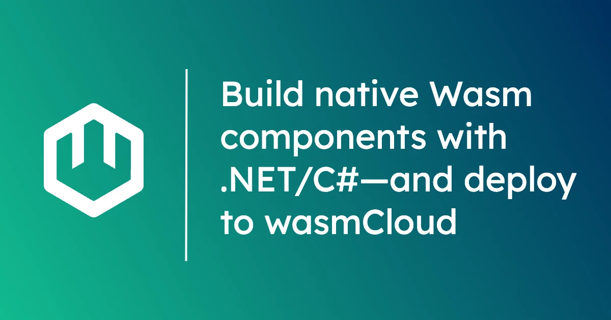

Building WebAssembly components in .NET/C# is easier than ever before. In this post, we'll take a look at the landscape of .NET tooling for components, explore how to get started today, and find out how easy it is to compile .NET/C# code to a component and run it on wasmCloud.

## The WASI P2 and .NET landscape

WebAssembly (Wasm) in general has a strong history of support in .NET, and today there is an increasingly mature ecosystem for building Wasm components with the .NET SDK. The [NativeAOT-LLVM](https://github.com/dotnet/runtimelab/tree/feature/NativeAOT-LLVM) compiler supports WASI P2 (with both .NET 8 and 9), giving developers native WASI P2 support. 

As in languages like Rust and TinyGo, native support means the ability to write "idiomatic" code&mdash;ordinary C# that compiles into a portable, interoperable component with no fuss and no need to learn any additional APIs or bindings. 

In terms of *developer experience*, the most important piece of the toolchain is [`componentize-dotnet`](https://github.com/bytecodealliance/componentize-dotnet), an open source project sponsored by the [Bytecode Alliance](https://bytecodealliance.org/) that consolidates all of the necessary tooling for building a component into a [single NuGet package](https://www.nuget.org/packages/BytecodeAlliance.Componentize.DotNet.Wasm.SDK/0.2.0-preview00004). While it's not strictly *required* to build a component, in this blog we're going to use `componentize-dotnet` the entire way, and I'd recommend that anyone experimenting with .NET and components use the package for two reasons:

* **Bundling**: `componentize-dotnet` bundles parts of the toolchain that you're going to need anyway (like the WASI SDK and dependency management tooling), largely keeping them out of sight and automating the processes. You can simply add a package to your project, compile, and generate a `.wasm` binary that conforms to WASI P2 and the Component Model. 
* **Interfaces**: The ability to create custom, language-agnostic [interfaces](/docs/concepts/interfaces) in WebAssembly Interface Type (WIT) is one of components' signature superpowers, and `componentize-dotnet` not only makes it straightforward, but delivers a streamlined, forward-looking experience in which WIT interfaces can be easily fetched from OCI registries. We'll see this workflow in action in a moment.  

There is one significant limitation to note: `componentize-dotnet` is currently limited to Windows machines. Maintainers expect macOS and Linux support soon.

## Prerequisites

For this blog, we'll use the [.NET 9 Preview 7 SDK](https://dotnet.microsoft.com/en-us/download/dotnet/9.0). If you're a Visual Studio Code user, you may also want to [install the C# Dev Kit extension](https://marketplace.visualstudio.com/items?itemName=ms-dotnettools.csdevkit), but in this walkthrough, we'll stick to the command line. 

:::warning[Windows-only, for now]
At the moment, `componentize-dotnet` only works on Windows. Maintainers expect macOS and Linux support to land soon.
:::

In addition to the .NET 9 SDK, you'll need:

* [`wasmtime`](https://wasmtime.dev/): This is the standalone WebAssembly runtime that we'll use to test some components locally.
* [wasmCloud Shell (`wash`)](https://wasmcloud.com/docs/installation) v0.32.1: We'll use the wasmCloud CLI to inspect component interfaces and deploy a component toward the end of the tutorial. Make sure you have the latest version (**v0.32.1 or higher**).

### Building a WebAssembly component from .NET code

First, let's try a simple hello world app like the one in [Microsoft's .NET tutorial](https://dotnet.microsoft.com/en-us/learn/dotnet/hello-world-tutorial/install)&mdash;but in this case, compiled to a WebAssembly component. 

Our goal here is to get a feel for the "idiomatic" development experience that is possible when a language toolchain supports native WASI P2 compilation. The developer doesn't need to use language-specific bindings for the common APIs included in WASI P2&mdash;they can simply compile a component and move on. 

To start, we'll create a new project:

```powershell
dotnet new console --name hello-wasm
```
```powershell
cd hello-wasm
```

The `componentize-dotnet` package depends on the `NativeAOT-LLVM` package, which resides at the `dotnet-experimental` package source, so you will need to make sure that NuGet is configured to refer to experimental packages. You can create a project-scoped NuGet configuration by running:

```powershell
dotnet new nugetconfig
```

In `nuget.config`, add the following line under `<clear />` to add the experimental package source:

```xml
<add key="dotnet-experimental" value="https://pkgs.dev.azure.com/dnceng/public/_packaging/dotnet-experimental/nuget/v3/index.json" />
```

Your `nuget.config` should look like so:

```xml
<?xml version="1.0" encoding="utf-8"?>
<configuration>
 <packageSources>
    <!--To inherit the global NuGet package sources remove the <clear/> line below -->
    <clear />
    <add key="dotnet-experimental" value="https://pkgs.dev.azure.com/dnceng/public/_packaging/dotnet-experimental/nuget/v3/index.json" /> <!-- [!code ++] -->
    <add key="nuget" value="https://api.nuget.org/v3/index.json" />
 </packageSources>
</configuration>
```

Back on the command line, we'll add the `Componentize.DotNet` package:

```powershell
dotnet add package BytecodeAlliance.Componentize.DotNet.Wasm.SDK --prerelease
```

Open `Program.cs` in your editor. We'll follow the example of Microsoft's tutorial and add a line to include the date and time in our new console app:

```c#
Console.WriteLine("Hello, World!");
Console.WriteLine("The current time is " + DateTime.Now); // [!code ++]
```

Add the following inside the `<PropertyGroup>` in your `hello-wasm.csproj` project file:

```xml
    <RuntimeIdentifier>wasi-wasm</RuntimeIdentifier>
    <UseAppHost>false</UseAppHost>
    <PublishTrimmed>true</PublishTrimmed>
    <InvariantGlobalization>true</InvariantGlobalization>
    <SelfContained>true</SelfContained>
    <MSBuildEnableWorkloadResolver>false</MSBuildEnableWorkloadResolver>
```

Now build the component:

```powershell
dotnet build hello-wasm.csproj
```

We can run the component with [wasmtime](https://wasmtime.dev/):

```powershell
wasmtime bin\Debug\net9.0\wasi-wasm\native\hello-wasm.wasm
```
```text
Hello, World!
The current time is 09/03/2024 19:49:03
```

We can also use `wash inspect` to view the WASI interfaces used by this component:

```powershell
wash inspect --wit bin\Debug\net9.0\wasi-wasm\native\hello-wasm.wasm
```
```wit
package root:component;

world root {
  import wasi:cli/environment@0.2.0;
  import wasi:cli/exit@0.2.0;
  import wasi:io/error@0.2.0;
  import wasi:io/poll@0.2.0;
  import wasi:io/streams@0.2.0;
  import wasi:cli/stdin@0.2.0;
  import wasi:cli/stdout@0.2.0;
  import wasi:cli/stderr@0.2.0;
  import wasi:cli/terminal-input@0.2.0;
  import wasi:cli/terminal-output@0.2.0;
  import wasi:cli/terminal-stdin@0.2.0;
  import wasi:cli/terminal-stdout@0.2.0;
  import wasi:cli/terminal-stderr@0.2.0;
  import wasi:clocks/monotonic-clock@0.2.0;
  import wasi:clocks/wall-clock@0.2.0;
  import wasi:filesystem/types@0.2.0;
  import wasi:filesystem/preopens@0.2.0;
  import wasi:sockets/network@0.2.0;
  import wasi:sockets/udp@0.2.0;
  import wasi:sockets/tcp@0.2.0;
  import wasi:random/random@0.2.0;

  export wasi:cli/run@0.2.0;
}
```

Our only export is on `wasi:cli/run`, since this is a command line executable&mdash;this is the exposed interface that `wasmtime` calls. We have a bunch of imports that are satisfied by the runtime, including `terminal-output` and `clocks`. But we never had to learn those interfaces or use them directly; it all happened under the hood.

## Using WIT interfaces with .NET

In the example above, we didn't use any APIs defined in WebAssembly Interface Type (WIT)&mdash;at least not consciously. We stuck entirely to native .NET, but under the hood, the compiler recognized where .NET APIs corresponded to the standard interfaces in WASI P2, utilizing APIs like `wasi:cli` and `wasi:clocks`. Now we have a component that can speak the "common language" of WASI P2 with any other component, regardless of the language those components were written in. 

In practice, there will be many situations where you *will* want to consciously use WIT interfaces, whether because you've written your own or you want to use one that isn't among the standard interfaces in WASI. For example, you might want to use one of the interfaces like [Postgres](https://github.com/wasmCloud/wasmCloud/tree/main/wit/postgres) or [Couchbase](https://github.com/couchbaselabs/wasmcloud-provider-couchbase/tree/main/wit/couchbase) listed in our [Capability Catalog](/docs/capabilities/). This is sort of like teaching your components a new common language, with WIT acting as the Rosetta Stone.

Fortunately, it's incredibly easy to use WIT interfaces with .NET&mdash;in your project file, simply refer to the WIT interface in an OCI registry. **James Sturtevant**, `componentize-dotnet` maintainer and Principal Software Engineering Lead at Microsoft, created an [excellent demo](https://github.com/jsturtevant/wasi-http-oci/tree/master) that showcases WIT via OCI, using the `wasi:http` interface by grabbing it from the official GHCR registry. 

To start, let's go ahead and replace the hello world lines in `Program.cs` with the following:

```c#
using System.Text;
using ProxyWorld.wit.imports.wasi.http.v0_2_0;

namespace ProxyWorld.wit.exports.wasi.http.v0_2_0;

public class IncomingHandlerImpl: IIncomingHandler {
    public static void Handle(ITypes.IncomingRequest request, ITypes.ResponseOutparam responseOut) {
	var content = Encoding.ASCII.GetBytes("Hello, World!");
	var headers = new List<(string, byte[])> {
	    ("content-type", Encoding.ASCII.GetBytes("text/plain")),
	    ("content-length", Encoding.ASCII.GetBytes(content.Count().ToString()))
	};
	var response = new ITypes.OutgoingResponse(ITypes.Fields.FromList(headers));
	var body = response.Body();
	ITypes.ResponseOutparam.Set(responseOut, Result<ITypes.OutgoingResponse, ITypes.ErrorCode>.ok(response));
	using (var stream = body.Write()) {
	    stream.BlockingWriteAndFlush(content);
	}
	ITypes.OutgoingBody.Finish(body, null);
    }
}
```

We'll come back in a moment and break down what's happening here, but first, let's update `hello-wasm.csproj`:

```xml
<Project Sdk="Microsoft.NET.Sdk">

  <PropertyGroup>
    <OutputType>Exe</OutputType> // [!code --]
    <TargetFramework>net9.0</TargetFramework>
    <ImplicitUsings>enable</ImplicitUsings>
    <Nullable>enable</Nullable>
    <RuntimeIdentifier>wasi-wasm</RuntimeIdentifier>
    <UseAppHost>false</UseAppHost>
    <PublishTrimmed>true</PublishTrimmed>
    <InvariantGlobalization>true</InvariantGlobalization>
    <SelfContained>true</SelfContained>
    <MSBuildEnableWorkloadResolver>false</MSBuildEnableWorkloadResolver>
  </PropertyGroup>

  <ItemGroup>
    <PackageReference Include="BytecodeAlliance.Componentize.DotNet.Wasm.SDK" Version="0.2.0-preview00004" />
  </ItemGroup>

  <ItemGroup> <!-- [!code ++] -->
    <Wit Include="wit/wit.wasm" World="proxy" Registry="ghcr.io/webassembly/wasi/http:0.2.0" /> <!-- [!code ++] -->
  </ItemGroup> <!-- [!code ++] -->
</Project>
```
* Up top, we remove the line configuring this as an executable, since we're no longer building a console app.
* Down in the second `<ItemGroup>`, we're defining the WIT file and world we want to use, and then the address for the official OCI package hosted by the WebAssembly project.

Now we'll build the component:

```powershell
dotnet build hello-wasm.csproj
```

When we build (or when we save if we're using VS Code and the C# Dev Kit extension), `componentize-dotnet` pulls down the specified package and generates WIT bindings at `.\obj\Debug\net9.0\wasi-wasm\wit_bindgen\`. Let's take a look at an excerpt of one of those binding files, `ProxyWorld.wit.imports.wasi.http.v0_2_0.ITypes.cs`:

```c#
...
    /**
    * Represents an outgoing HTTP Response.
    */

    public class OutgoingResponse: IDisposable {
        internal int Handle { get; set; }

        public readonly record struct THandle(int Handle);

        public OutgoingResponse(THandle handle) {
            Handle = handle.Handle;
        }

        public void Dispose() {
            Dispose(true);
            GC.SuppressFinalize(this);
        }

        [DllImport("wasi:http/types@0.2.0", EntryPoint = "[resource-drop]outgoing-response"), WasmImportLinkage]
        private static extern void wasmImportResourceDrop(int p0);
...
```

In this file we see the types for `wasi:http` bound to C# with documentation from the original WIT included throughout the binding file. 

If we look back at `Program.cs`, we see some of those types in use, including `OutgoingResponse` and `ResponseOutparam`. Consulting the binding files, we can make use of any WIT interface in our code.

All right&mdash;we've already built our component. Let's test it out.

Since this component uses HTTP, we'll use the `wasmtime serve` subcommand to run the component at `localhost:3000`:

```powershell
wasmtime serve -S cli  .\bin\Debug\net9.0\wasi-wasm\native\hello-wasm.wasm --addr 127.0.0.1:3000
```
```text
Hello, World!
```
You can CTRL+C to stop the `serve`. When we inspect the component with `wash` this time, we'll see that our component has a different export:

```powershell
wash inspect --wit bin\Debug\net9.0\wasi-wasm\native\hello-wasm.wasm
```
```wit
package root:component;

world root {
  import wasi:cli/environment@0.2.0;
  import wasi:cli/exit@0.2.0;
  import wasi:io/error@0.2.0;
  import wasi:io/poll@0.2.0;
  import wasi:io/streams@0.2.0;
  import wasi:cli/stdin@0.2.0;
  import wasi:cli/stdout@0.2.0;
  import wasi:cli/stderr@0.2.0;
  import wasi:cli/terminal-input@0.2.0;
  import wasi:cli/terminal-output@0.2.0;
  import wasi:cli/terminal-stdin@0.2.0;
  import wasi:cli/terminal-stdout@0.2.0;
  import wasi:cli/terminal-stderr@0.2.0;
  import wasi:clocks/monotonic-clock@0.2.0;
  import wasi:clocks/wall-clock@0.2.0;
  import wasi:filesystem/types@0.2.0;
  import wasi:filesystem/preopens@0.2.0;
  import wasi:sockets/udp@0.2.0;
  import wasi:sockets/tcp@0.2.0;
  import wasi:random/random@0.2.0;
  import wasi:http/types@0.2.0;

  export wasi:http/incoming-handler@0.2.0;
}
```
This example is using a WIT interface, `wasi:http`, that *is* part of WASI P2, but it's a great demonstration of the process for using WIT with .NET-based components. (For more information, [check out the readme for `componentize-dotnet`](https://github.com/bytecodealliance/componentize-dotnet?tab=readme-ov-file#creating-a-wasi-02-component-including-wit-support).)

Since this example uses HTTP, it's also a great candidate to run on wasmCloud. So let's imagine we want to deploy our component to an environment such as a cloud, edge, or Kubernetes cluster using wasmCloud. How might that work?

## Deploying a .NET-based component to wasmCloud

To run our component on wasmCloud, all we need is a [deployment manifest](/docs/ecosystem/wadm/model). Create a new file called `wadm.yaml` at the root of the project directory. The contents of the file should be as follows:

```yaml
# Metadata
apiVersion: core.oam.dev/v1beta1
kind: Application
metadata:
  name: hello-wasm
  annotations:
    description: 'HTTP hello wasm demo'
spec:
  components:
    - name: http-component
      type: component
      properties:
        # This manifest deploys from your local .wasm file, but you can also use OCR registries
        image: file://./bin/Debug/net9.0/wasi-wasm/native/hello-wasm.wasm
      traits:
        # One replica of this component will run
        - type: spreadscaler
          properties:
            instances: 1
    # The httpserver capability provider, started from the official wasmCloud OCI artifact
    - name: httpserver
      type: capability
      properties:
        image: ghcr.io/wasmcloud/http-server:0.22.0
      traits:
        # Link the HTTP server and set it to listen on the local machine's port 8080
        - type: link
          properties:
            target: http-component
            namespace: wasi
            package: http
            interfaces: [incoming-handler]
            source_config:
              - name: default-http
                properties:
                  ADDRESS: 127.0.0.1:8080
```
Use `wash` to run wasmCloud locally. We'll use the `-d` flag to run in "detached" mode.

```powershell
wash up -d
```

Now we can deploy to wasmCloud using the manifest:

```powershell
wash app deploy wadm.yaml
```
You can check that the application is deployed with `wash app list`. Once the status reads as `Deployed`, you can `curl` it for a response:

```powershell
curl localhost:8080
```
```text
Hello, World!
```
Congratulations! You've deployed your first .NET-based component to wasmCloud. Once you're ready to clean up:

```powershell
wash app undeploy wadm.yaml
```
```powershell
wash app delete wadm.yaml
```
```powershell
wash down
```

## Get involved

Join us on the [wasmCloud Slack](https://slack.wasmcloud.com/) to connect with the community, keep up with or get involved in the project, and chat with other developers building components across language ecosystems. You can also join us in our [weekly livestreamed community meeting](/community)&mdash;we'd love to hear about what you're building with .NET/C#!
