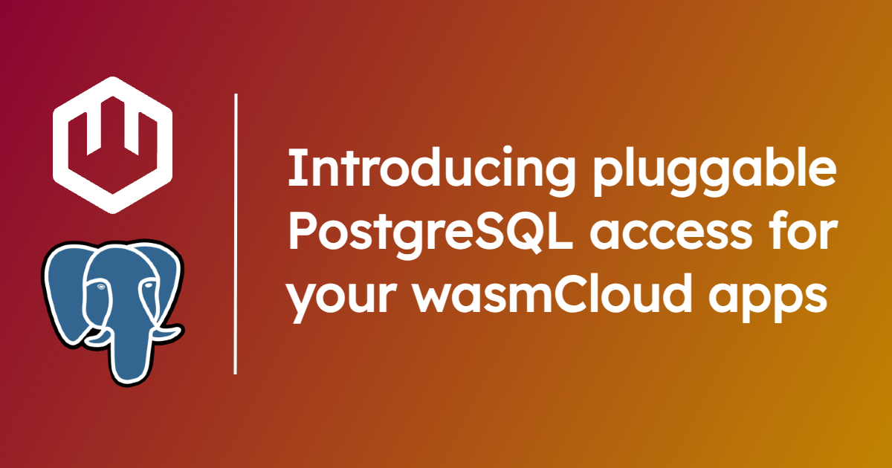

With [wasmCloud](/docs/intro), you can build applications out of WebAssembly components and pluggable, reusable [**capabilities**](/docs/concepts/capabilities), so you can focus on the core logic of your application and abstract away the rest, all using open source standards.

[**PostgreSQL**](https://www.postgresql.org/) is one of the most widely used relational database systems. If you want to use a database system like Postgres, wasmCloud makes it easy to simply plug in the functionality in a reusable, language-agnostic way, without wasting time writing boilerplate code. In this post, we'll show you how to get started with the Postgres capability in wasmCloud.

## Speed up development: Write queries without managing connection pools

Enterprise application teams need flexible database options, and for many, PostgreSQL is the tool of choice. But like many basic, non-functional requirements, teams can waste a lot of time getting to grips with libraries in this or that language and worrying about how to implement their database for a given project. 

Capabilities abstract these worries away. In practice, every wasmCloud capability consists of two parts:

* An **interface**: The standard contract for a piece of functionality, defined in [WebAssembly Interface Type (WIT)](/docs/concepts/interfaces#webassembly-interface-type-wit), defining an API for any language that uses the interface.
* A **capability provider**:  The executable that plugs in to wasmCloud and delivers the functionality in question.

In this case, you can use a [single API](https://github.com/wasmCloud/wasmCloud/tree/main/wit/postgres) for Postgres operations, regardless of your development language, and simply plug the [Postgres capability provider](https://github.com/wasmCloud/wasmCloud/tree/main/crates/provider-sqldb-postgres) into your application manifest when you deploy to wasmCloud. (Later on, if you need to migrate to another system, that's no problem&mdash;the `wasmcloud-postgres` interface can be used by any system that supports the WIT standard.)

## Get started with Postgres on wasmCloud

Let's try it out. We'll use a Rust-based component, but you don't really have to be familiar with the language. For this example, you'll just need:

- The [wasmcloud Shell (`wash`)](https://wasmcloud.com/docs/installation) CLI to build WebAssembly components and deploy to local wasmCloud.
- [`cargo`](https://doc.rust-lang.org/cargo/getting-started/installation.html) (part of the Rust toolchain) to help build from Rust
- [`docker`](https://docs.docker.com) to easily run an instance of Postgres.

### Start Postgres and wasmCloud locally

First we need to get a Postgres cluster running. We can do this quickly and easily with Docker:

```console
docker run \
    --rm \
    -e POSTGRES_PASSWORD=postgres \
    -p 5432:5432 \
    --name pg \
    postgres:16.2-alpine
```

Next we'll start our local wasmCloud, using the `-d`/`--detached` flag to run in the background:

```shell
wash up -d
```

### Generate a new project

Now we'll generate a new project using the Rust-based `sqldb-postgres-query` example from the wasmCloud monorepo as a template.

```shell
wash new component postgres-demo --git wasmcloud/wasmcloud --subfolder examples/rust/components/sqldb-postgres-query
```
```shell
cd postgres-demo
```

If you're familiar with Rust, in `src/lib.rs` you'll see that the [code](https://github.com/wasmCloud/wasmCloud/blob/main/examples/rust/components/sqldb-postgres-query/src/lib.rs) for  querying Postgres is very simple:

```rs
impl Guest for QueryRunner {
    fn call() -> String {
        if let Err(e) = query(CREATE_TABLE_QUERY, &[]) {
            return format!("ERROR - failed to create table: {e}");
        };

        match query(
            INSERT_QUERY,
            &[PgValue::Text(format!("inserted example row!"))],
        ) {
            Ok(rows) => format!("SUCCESS: inserted new row:\n{rows:#?}"),
            Err(e) => format!("ERROR: failed to insert row: {e}"),
        }
    }
}
```

Next build your WebAssembly component from the Rust code.

```console
wash build
```

The build process generates a folder called `build` containing `sqldb-postgres-query_s.wasm`.


### Deploy the demo

The next step for a wasmCloud application deployment is usually to define the components and providers you'll be using in a deployment manifest. We have a pre-populated manifest (`wadm.yaml`) in our project directory.

In the interest of security, we'll use the `wash config` subcommand to define a "named configuration" called `default-postgres`: 

```console
wash config put default-postgres \
    POSTGRES_HOST=localhost \
    POSTGRES_PORT=5432 \
    POSTGRES_USERNAME=postgres \
    POSTGRES_PASSWORD=postgres \
    POSTGRES_DATABASE=postgres \
    POSTGRES_TLS_REQUIRED=false
```

In our application manifest (`wadm.yaml`), we tell our provider to simply use the named configuration that we provided.

Now it's time to deploy: 

```console
wash app deploy wadm.yaml
```

Confirm the application is deployed:

```console
wash app list
```
```text                 
  Name                          Deployed Version              Status                       
  rust-sqldb-postgres-query     v0.1.0                        Deployed                     
    └ Demo WebAssembly component using the wasmCloud SQLDB Postgres provider via the wasmcloud:postgres WIT interface                
```

### Invoke the demo component

By default, the `sqldb-postgres-query` component includes [a simple `invoke` interface](https://github.com/wasmCloud/wasmCloud/blob/main/examples/rust/components/sqldb-postgres-query/wit/component.wit#L6), which enables using `wash call` to trigger the component directly via the CLI:

```shell
wash call rust_sqldb_postgres_query-querier wasmcloud:examples/invoke.call
```
```text
SUCCESS: inserted and manually retrieved new row:
[
    [
        ResultRowEntry {
            column-name: "description",
            value: PgValue::Text(
                "inserted example row!",
            ),
        },
    ],
]
```

### Clean up

When you're finished, you can undeploy and delete the application:

```shell
wash app delete rust-sqldb-postgres-query
```
To stop your local wasmCloud:

```shell
wash down
```

## Learn more and get involved

Explore the [Capability Catalog](/docs/capabilities/) to learn more about the first and third-party capabilities already available on wasmCloud. 

Want to get involved with the community or learn more about building your own components and capabilities? [Join us on the wasmCloud Slack](https://slack.wasmcloud.com/)!