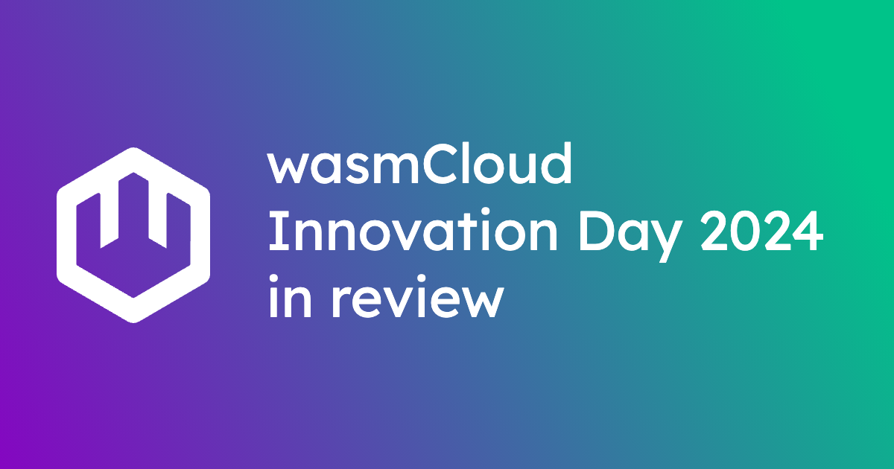
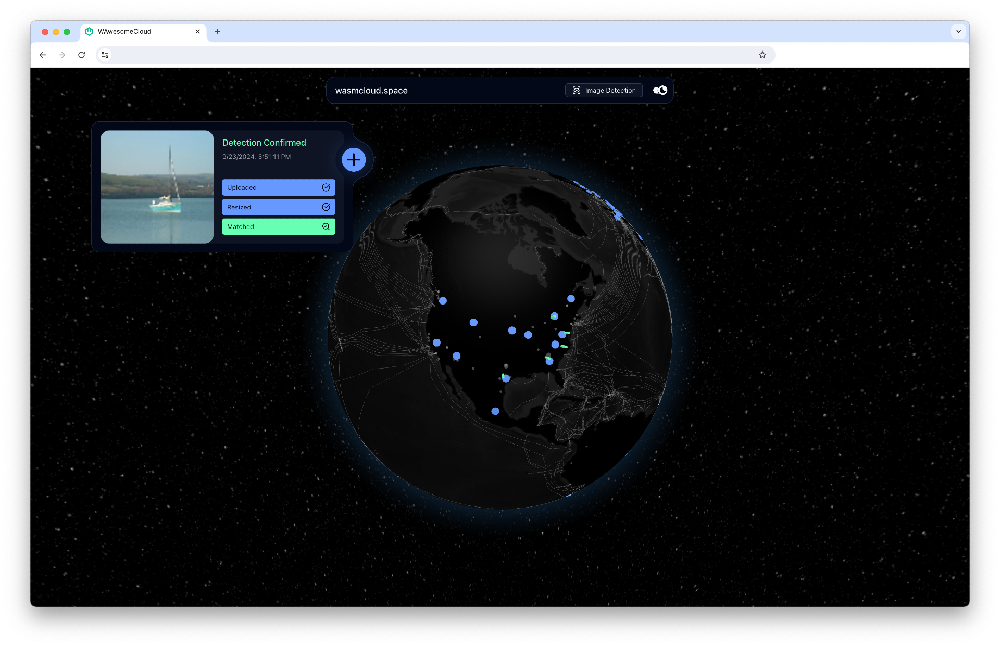

On September 18, we held the first **wasmCloud Innovation Day**—an all-day virtual event bringing together project maintainers, enterprise users, members of the broader WebAssembly community, and folks interested in learning more about Wasm and wasmCloud.

Throughout the day, our audience learned about the latest developments in the wasmCloud project (like secret support, the Go component SDK, and a refined developer experience), as well as how teams are using wasmCloud in production today.

A [recording of the full event is available below and on YouTube](https://www.youtube.com/watch?v=vEHbZCBmPok). Throughout this post, we’ve **time-stamped** each session so you can watch the ones most relevant to you.

<iframe src="https://www.youtube.com/embed/vEHbZCBmPok?rel=0" width="560" height="315" frameborder="0" allowfullscreen></iframe>

## Keynote: The Pitfalls of Modern Platform Engineering

Bytecode Alliance TSC Director [Bailey Hayes](https://github.com/ricochet)’ keynote discussed how using WebAssembly components as a unit of compute addresses long-standing challenges for platform engineers, such as the **cold start problem**.

A containerized application needs multiple containers on the go to address spikes in traffic while meeting standard latency expectations. Since components are able to start in milliseconds rather than the seconds required by containers, components face no such challenges. But the possibilities go further.

Components can be “composed” so that communication between them happens in nanoseconds, rather than being constrained by network communication. Platform engineering teams can compose an application into a larger component that incorporates secrets, authentication, and other requirements that platform teams are on the hook for, giving them a transformative new paradigm.

As an example of the sort of **composable computing** that can be achieved with wasmCloud, Bailey showcased a demo for a celestial and terrestrial mesh that we're building with a number of different agencies that are interested in running **WebAssembly in space**.

The demo runs across many data centers and uses a machine learning model to identify whether a given image is a boat. See the video for the complete demo.

<iframe src="https://www.youtube.com/embed/vEHbZCBmPok?start=420&end=1433&rel=0" width="560" height="315" frameborder="0" allowfullscreen></iframe>

## Technical Deep Dives

In our Technical Deep Dives, wasmCloud maintainers explained recent developments in the project.

### Secrets

Secrets are a must-have feature for enterprise users. Maintainer Brooks Townsend walked through the [secrets support introduced in wasmCloud 1.1](https://wasmcloud.com/blog/secure-pluggable-webassembly-secrets-with-vault-k8s-secrets) and explained how wasmCloud's approach to secrets introduces new possibilities for developers.

Since wasmCloud secrets are [**resources**](https://component-model.bytecodealliance.org/design/wit.html#resources) that are revealed just-in-time, sensitive data can be passed around freely between applications. Think user credentials or data covered by HIPAA. Brooks also discusses how wasmCloud's flexible support for different secrets backends lets teams use (and swap out) the secret store of their choice.

<iframe src="https://www.youtube.com/embed/vEHbZCBmPok?start=1433&end=2164&rel=0" width="560" height="315" frameborder="0" allowfullscreen></iframe>

### Evolution in Golang

The Go-based component development experience has made some big leaps in 2024, including [TinyGo's ability to compile idiomatic Go to components](https://wasmcloud.com/blog/compile-go-directly-to-webassembly-components-with-tinygo-and-wasi-p2). Maintainer [Lucas Fontes](https://github.com/lxfontes) walked through these developments and more, showing how wasmCloud SDKs for Go-based components and providers make it easier than ever to build wasmCloud applications with Go.

- The **Go component SDK** is a brand new, optional framework that enables developers to write Go-based components without ever thinking about bindings to WASI interfaces—especially useful when writing HTTP-centric apps. You can check out an [early version of the Go component SDK on GitHub](https://github.com/wasmCloud/component-sdk-go).
- For developers who want to write a custom capability provider in Go, the **Go provider SDK** makes that easy. This enables Go developers to write an executable plugin that can communicate over WIT interfaces and handle more stateful activities for wasmCloud applications. [Check out the Go provider SDK on GitHub](https://github.com/wasmCloud/provider-sdk-go).

In addition to the SDKs, Lucas showed off **`west`**, a new **Go testing framework for WebAssembly components** written in Go. Traditionally, testing components has been a bit difficult since tools like `go test` don't account for component interfaces. With `west`, tests interact with the Wasmtime WebAssembly runtime used by wasmCloud but allow developers to stub interfaces and ensure complete coverage. You can try an [early version of `west` on GitHub](https://github.com/rvolosatovs/west).

<iframe src="https://www.youtube.com/embed/vEHbZCBmPok?start=2164&end=3348&rel=0" width="560" height="315" frameborder="0" allowfullscreen></iframe>

### wasmCloud operator

Lucas remained on the virtual stage to talk about the **wasmCloud operator**, our project for running WebAssembly components on Kubernetes using wasmCloud, all without having to modify your cluster or use custom nodes.

The wasmCloud operator runs wasmCloud hosts (and underlying infrastructure like NATS) in Kubernetes pods, enabling wasmCloud applications to run on Kubernetes like any other workload. Because the operator uses CRDs and other Kubernetes integration points, it integrates seamlessly with `kubectl`, OpenTelemetry, and other standard K8s tools, so platform teams can take advantage of components without changing their tooling or infrastructure.

For much more on the wasmCloud operator, including a quickstart, check out our [introductory blog post](https://www.notion.so/blog/how-to-run-webassembly-components-on-kubernetes-with-wasmcloud) and [documentation pages](https://www.notion.so/docs/kubernetes).

<iframe src="https://www.youtube.com/embed/vEHbZCBmPok?start=3348&end=4366&rel=0" width="560" height="315" frameborder="0" allowfullscreen></iframe>

### wash dev

[Victor Adossi](https://github.com/vados-cosmonic) led a session on developer experience refinements that will be landing very soon in `wash`—specifically, the `wash dev` subcommand.

The subcommand has been around for a while, but Victor has focused on making it the mature, robust development solution it was always intended to be: the go-to command for anyone starting a dev loop on a component or provider. `wash dev` builds and runs your code, automatically fulfills a project's imports and exports, and constantly watches for updates to relevant files in your project.

Automatically import and export fulfillment (for common interfaces) is at the heart of what makes this new process so smooth. If you're building a component that handles HTTP requests, `wash dev` will simply know to launch an HTTP server provider—no need to worry about deployment manifests. Victor explains and demos the process in the video; the new `wash dev` lands very soon alongside wasmCloud 1.3.

<iframe src="https://www.youtube.com/embed/vEHbZCBmPok?start=4366&end=5148&rel=0" width="560" height="315" frameborder="0" allowfullscreen></iframe>

### Custom capabilities

If you need a wasmCloud capability that doesn't already exist, you can build one using completely open standards—specifically, Rust or Go-based capability provider and an interface described in [WebAssembly Interface Type (WIT)](https://www.notion.so/docs/concepts/interfaces#webassembly-interface-type-wit). Victor discussed two capabilities that bring popular tools to the wasmCloud ecosystem: [Couchbase](https://github.com/couchbaselabs/wasmcloud-provider-couchbase) and [Postgres](https://github.com/wasmCloud/wasmCloud/pkgs/container/sqldb-postgres).

The Postgres interface is a good example of how teams can *choose* to develop a capability that abstracts functionality (say, SQL database operations) more narrowly to take advantage of a particular tool's features.

Similarly, he showed off how a technology like Couchbase can be made to utilize a simple, common interface like `wasi-keyvalue` *or* to use a highly customized interface that defines all of Couchbase's unique types. Ultimately, the ability to create custom capabilities is all about flexibility.

<iframe src="https://www.youtube.com/embed/vEHbZCBmPok?start=5148&end=6181&rel=0" width="560" height="315" frameborder="0" allowfullscreen></iframe>

### Machine learning

wasmCloud is well-suited to running machine learning and AI workloads distributedly—in this deep dive, Bailey revisited the celestial and terrestrial mesh demo to explore how it uses Ollama. She also discussed WASI interfaces focused on this area like [`wasi-nn`](https://github.com/WebAssembly/wasi-nn) and [`wasi-webgpu`](https://github.com/WebAssembly/wasi-webgpu).

<iframe src="https://www.youtube.com/embed/vEHbZCBmPok?start=6181&end=6889&rel=0" width="560" height="315" frameborder="0" allowfullscreen></iframe>

### wRPC and NATS

[Taylor Thomas](https://github.com/thomastaylor312) and [Roman Volosatovs](https://github.com/rvolosatovs) introduced viewers to two critical pieces of wasmCloud's connective infrastructure: **wRPC** and **NATS**.

- [wRPC](https://github.com/bytecodealliance/wrpc) is short for WIT-over-RPC, and it's a component-native protocol designed to facilitate distributed linking of components and other entities. While it's built to be component-native, wRPC is a community project that can even be used in contexts beyond WebAssembly.
- [NATS](https://www.notion.so/docs/ecosystem/nats/) is an open source connective technology hosted by the Cloud Native Computing Foundation (CNCF) and underlying the wasmCloud [lattice](https://www.notion.so/docs/concepts/lattice).

wRPC is what makes it possible to compose two distributed components at runtime using wasmCloud, since wRPC is there acting as a component-aware mediator between the wasmCloud host and the workloads, all while using NATS as the transport layer.

In their session, Taylor and Roman walk through the whys and hows of wRPC and NATS, explaining the thinking behind their roles in wasmCloud and how to interact with them effectively.

<iframe src="https://www.youtube.com/embed/vEHbZCBmPok?start=6889&end=8568&rel=0" width="560" height="315" frameborder="0" allowfullscreen></iframe>

## WebAssembly Fireside Chat

Bytecode Alliance and Wasm industry leaders [Yosh Wuyts](https://github.com/yoshuawuyts) and [Luke Wagner](https://github.com/lukewagner) joined Bailey to discuss what lies ahead for the WebAssembly ecosystem, standards, and community. They discussed the new process for minor releases of WASI, as well as the ongoing work on async functionality for WASI 0.3 and the best way to get started in the community.

<iframe src="https://www.youtube.com/embed/vEHbZCBmPok?start=8568&end=9549&rel=0" width="560" height="315" frameborder="0" allowfullscreen></iframe>>

## User stories

We were honored to be joined by folks from three organizations using wasmCloud today: **Akamai**, **MachineMetrics**, and **Adobe**. 

### Akamai and the future of edge computing

Akamai Senior Architect [Doug Rodrigues](https://github.com/djrodrigues) joined us to discuss the future of edge computing at Akamai—and how Wasm and wasmCloud address some of the trickiest challenges in deploying to edge locations.

Akamai is using wasmCloud to extend Akamai Connected Cloud's distributed edge as close to users as possible. In his presentation, he defines an **edge-native architecture** in which wasmCloud is the low-latency connective layer between edge and "core" locations. This can be transformative for use-cases ranging from real-time APIs to gaming to generative AI, opening up an entirely new possibility space for distributed computing.

<iframe src="https://www.youtube.com/embed/vEHbZCBmPok?start=9549&end=10543&rel=0" width="560" height="315" frameborder="0" allowfullscreen></iframe>

### MachineMetrics and wasmCloud in industrial IoT

[Jochen Rau](https://github.com/jocrau) and [Tyler Schoppe](https://github.com/tylerschoppe) from MachineMetrics’s Platform Engineering Team spoke about how they've used wasmCloud in industrial IoT at a different sort of edge: the factory floor.

Tyler and Jochen share the details of their successful PoC which enabled them to better utilize edge resources with Wasm, working in spaces where using Kubernetes simply wasn't an option.

Tyler and Jochen's presentation was an outstanding look at how wasmCloud is expanding the art of the possible in industrial IoT, and Jochen also gave us one of our favorite quotes of the day:

> It's about the people. It's not just about the bare technology and tools that go in the right direction, but also a bunch of smart people behind it. That's a good feeling...this is backed by a good community.
> 

<iframe src="https://www.youtube.com/embed/vEHbZCBmPok?start=10543&end=12252&rel=0" width="560" height="315" frameborder="0" allowfullscreen></iframe>

### C + wasmCloud

Adobe’s engineers are long-time wasmCloud collaborators and community members. Some may already be familiar with the [successful project](https://www.cncf.io/blog/2022/11/17/better-together-a-kubernetes-and-wasm-case-study/) undertaken by Senior Software Engineers [Colin Murphy](https://github.com/cdmurph32/) and [Sean Isom](https://github.com/seanisom) to bring wasmCloud to Adobe’s Kubernetes architecture. The use cases for Wasm at Adobe continue to grow as do the range of languages core Wasm now supports—Rust, Go, Python, .Net and C#, C, Javascript, and more.

To demonstrate the versatility of wasmCloud, Colin demonstrated a PDF processing service in **C** as a wasmCloud application. Colin's highly technical, hands-on demo takes an input PDF and then processes and returns the text. In his presentation, Colin discussed his experience writing the application and explored the suitability of WebAssembly for sharing portable, polyglot, open source PDF libraries. You can [check out the demo on GitHub](https://github.com/cdmurph32/pdf-text-example). If you like diving into the details, this session is for you!

<iframe src="https://www.youtube.com/embed/vEHbZCBmPok?start=12252&rel=0" width="560" height="315" frameborder="0" allowfullscreen></iframe>

## Getting started—and getting involved

The event closed with [Lachlan Heywood](https://github.com/lachieh) leading a fantastic workshop that showed users how to build their first wasmCloud application.

While the workshop took place in a virtual Gather workspace and isn't available in the recording, you can get a similar experience by working through the wasmCloud Quickstart—and if you need help or just want to chat about WebAssembly and wasmCloud, head on over to the [wasmCloud Slack](https://slack.wasmcloud.com/) to chat with the community.

As Jochen said, the amazing community of contributors is what makes this project so exciting. Thanks to everyone who put time into this event—attendees, contributors, and speakers. Whether you were able to make it to Innovation Day or not, we hope you'll join us at the next weekly [wasmCloud Community Meeting](https://www.notion.so/community), and we hope to see you at another event (maybe [WasmCon](https://events.linuxfoundation.org/wasmcon/)?) soon.