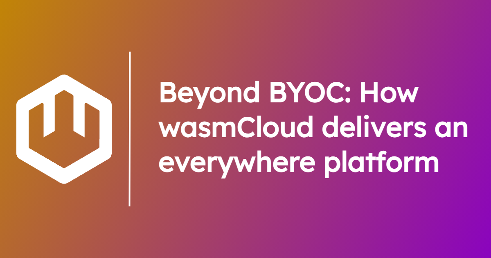
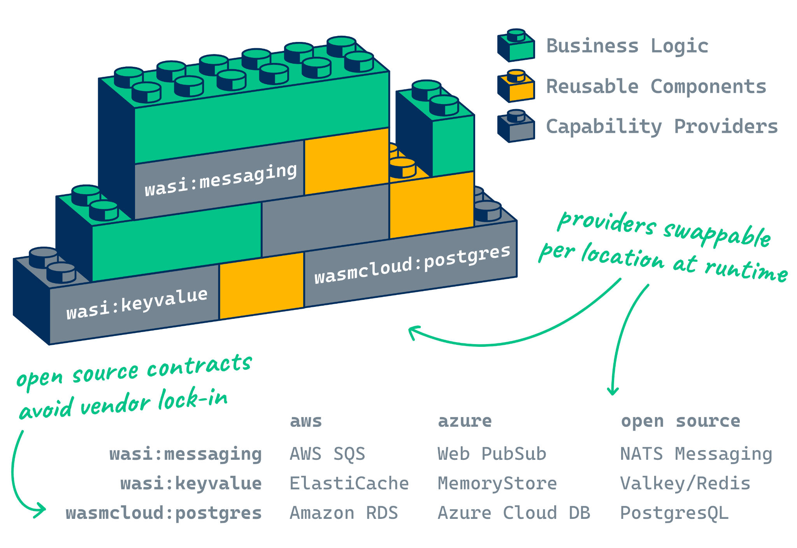
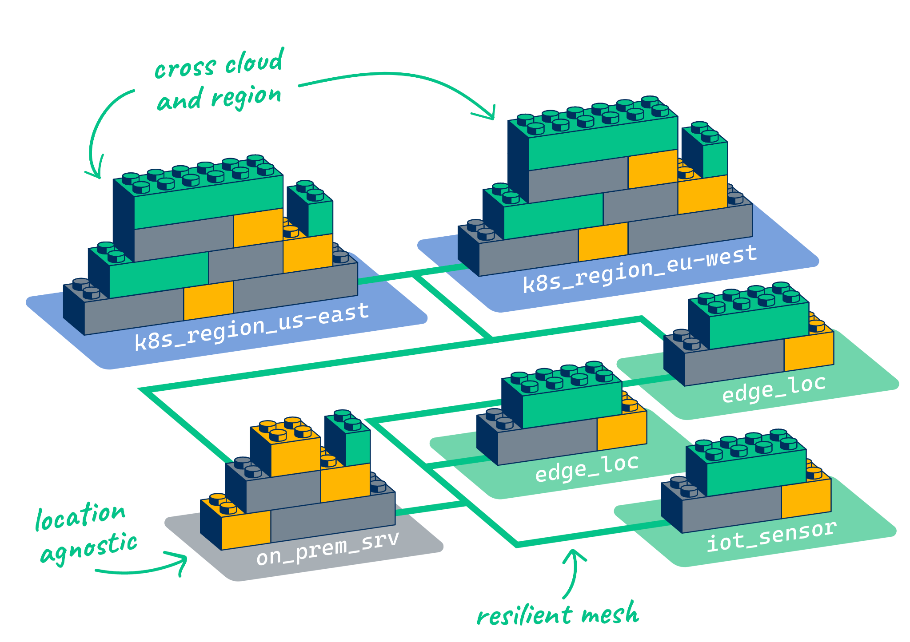

Enterprise software vendors are increasingly adopting a **Bring Your Own Cloud (BYOC)** model for their offerings, which is more or less what it sounds like: vendors deploy their software to the buyer's cloud, managing their offering remotely.

The rise of BYOC is attributable to two converging variables:

- **Enterprises want to maximize control over their applications and data** while maintaining the conveniences of cloud infrastructure and managed services.
- **The portability of cloud native computing** makes it practical for vendors to deliver and manage enterprise software on customers' own clouds.

Put even more simply, organizations want to run their software *where and how it makes the most sense for them* as a function of cost, security, user experience, and manageability.

But the story doesn't end there. Just as containers and Kubernetes facilitate a BYOC model, WebAssembly (Wasm) components and wasmCloud enable teams to go beyond BYOC and create "everywhere platforms" that deliver applications *exactly* where they need them—whether that's in the cloud or at the edge, on Kubernetes or on-prem.

## The benefits of BYOC

BYOC is a particularly popular model in spaces like database management. Enterprises tend to be uneasy about storing data on servers outside of their direct control—if you're dealing with sensitive financial data, you probably don't want to put it in someone else’s cloud account.

At the same time, the scalability and time-savings of fully-managed services can be invaluable. A BYOC model gives enterprises both sovereignty and simplicity, synthesizing the best of on-premise, cloud, and SaaS.

The BYOC approach is streamlined by the availability of Kubernetes and cloud native software patterns. Kubernetes can act as a substrate and abstraction layer between a customer's cloud infrastructure and the BYOC workload; vendor agents can be deployed as microservices to the cluster and enable remote management.

There are limits, however, to where Kubernetes can go, and by moving beyond the constraints of Kubernetes, the BYOC model can be carried much further.

## Creating an everywhere platform with Wasm

Whether you want to create or consume BYOC-style services, WebAssembly components transform how software is created and deployed.

[WebAssembly components are portable, interoperable binaries](/docs/concepts/components) that can import and export functionality over language-agnostic interfaces. They're **tiny** (KBs to MBs), **start up in microseconds with no cold start**, and **composable**, meaning that they can be combined like Lego blocks into a single binary. 

This means **developers can create reusable blocks of functionality in the language of their choice** and **plug them in** to another component.

**wasmCloud** is built from the ground up to orchestrate components, much as Kubernetes is designed to orchestrate containers. In this way, you can think of it as a distributed **application control plane**, in contrast with Kubernetes, which really excels at abstracting and managing infrastructure but has always lacked a first-class way to represent and manage applications.

Being Wasm-native means wasmCloud can take advantage of components' unique features to enable new patterns and possibilities. For example, multi-cluster Kubernetes has never really been satisfactorily solved, but for wasmCloud, multi-cluster patterns are just a typical Tuesday. 

wasmCloud provides out-of-the-box load balancing, failover, and other features for systems that span across environments such as clouds, edges, on-prem datacenters, and indeed Kubernetes clusters, since [wasmCloud is happy to run standalone or in an org's existing Kubernetes](/docs/kubernetes).

## A platform for platform engineering

When you’re thinking about platform engineering, the two most involved personas are **developers** and **platform teams**. Component characteristics like composability and polyglot interoperability are game-changing for developers, but Wasm and wasmCloud are also transformative for platform teams. 

If you need a vendor solution to run at the edge, on highly resource-constrained hardware, deploying via Kubernetes and containers may not be practical or even possible. But the portability of components and distributed nature of wasmCloud mean that solutions can be deployed and managed from anywhere.

Typically, enterprises don’t create platforms from whole cloth—they ***curate* platforms by combining pre-existing cloud native technologies** to form a bespoke, purpose-built platform. 

In wasmCloud, we’re building a platform that enables different teams to collaborate on what will be their bespoke platform—and not just collaborate on the initial construction, but in ongoing maintenance. Teams can create **golden templates that remain pluggable after adoption**, dramatically simplifying maintenance in the long run. 

Ultimately, these pieces come together to deliver the next step in flexibility and control for enterprises: **the BYOC model on any cloud, Kubernetes, or edge, including your own**. The benefits that make BYOC so appealing stand to be dramatically expanded by using wasmCloud as an everywhere platform:

- **Security**: Secure-by-default components, [wasmCloud's Zero Trust design](https://www.notion.so/docs/hosts/security), and flexible [secrets support](https://www.notion.so/docs/concepts/secrets) provide a rock-solid foundation for satisfying data sovereignty concerns.
- **User experience**: Reduce latency for users with sub-millisecond start times and vertical autoscaling.
- **Cost**: Components' lean size and reduced dependence on communicating over network boundaries (since they can be composed) can lead to reduced cloud costs.
- **Manageability**: Reusable components and requirements abstracted away as [capabilities](https://www.notion.so/docs/concepts/capabilities) make for much more manageable software—and easier-to-implement fully managed services.

As component toolchains mature and native component compilation lands in more and more languages, the possibilities of a BYOC model are set to accelerate swiftly and dramatically.

## Learn more

To see how teams are putting wasmCloud to use across industries, check out these stories from our users:

- [**MachineMetrics** uses wasmCloud](https://youtu.be/fQdkNGZqYZA?feature=shared) to move platform capabilities across edges and clouds with dynamic fault-tolerance.
- [Engineers from **Adobe** and **Akamai** discuss how they use wasmCloud](https://www.youtube.com/live/B1Q_Xx5i6Ek?feature=shared) to run WebAssembly across cloud services, Kubernetes clusters, and edges.

If you're ready to try wasmCloud for yourself, visit the  [quickstart](https://www.notion.so/docs/tour/hello-world) to build and deploy your first component, and join the conversation on the [wasmCloud Slack](https://slack.wasmcloud.com/).