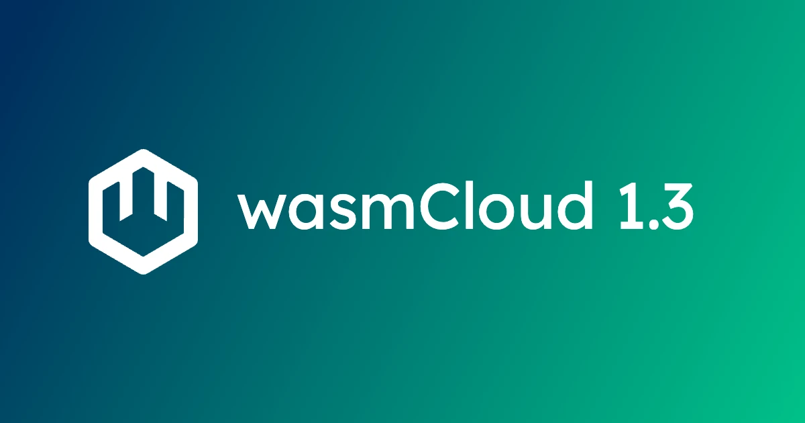
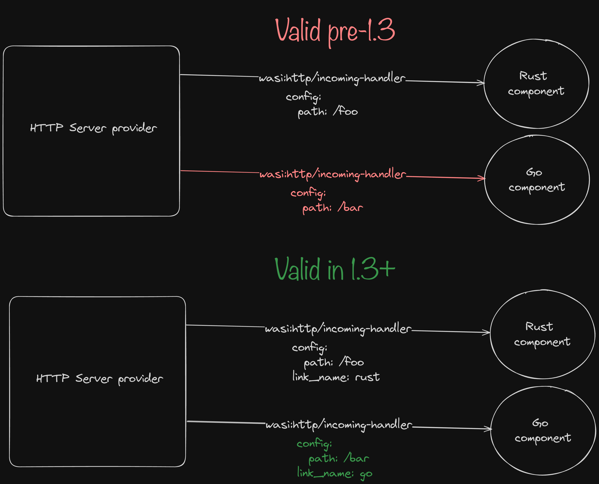

We're pleased to announce the release of wasmCloud 1.3, bringing a transformative new developer experience along with a range of fixes and enhancements.

You can check out the complete set of changes in the [release notes](https://github.com/wasmCloud/wasmCloud/releases/tag/v1.3.0). In this blog, we'll take a look at the major upgrade to the `wash dev` command and a breaking change related to link validation rules.

## A brand new developer loop

`wash` has included the `dev` subcommand as an experimental feature for some time, but we knew we wanted to level it up to a first-class, indispensable developer tool. Thanks to a lot of hard work from [Victor Adossi](https://github.com/wasmCloud/wasmCloud/pull/2946), v1.3 does just that. 

Now when you start a new project and run `wash dev`, the CLI will automatically...

* Build your component
* Read your component to learn its dependencies
* Provision suitable providers
* Launch your application in a local wasmCloud environment
* Automatically update the deployed app as you make changes

In other words, you get the automagical developer loop and experience that, until now, really hasn't been available in the world of components. No more writing application manifests in order to code and test and debug&mdash;you just `wash dev` and go. 

We think this is going to be one of the most important tools in every component developer's toolbelt, and we've already updated our [quickstart](/docs/tour/hello-world) to use the new workflow. If you'd like a primer on `wash dev`, check out the quickstart now.

## Breaking change: Link validation rules

It's important to note a breaking change in the v1.3 release. [A fix enforcing link uniqueness](https://github.com/wasmCloud/wasmCloud/pull/2963) introduces a new validation rule for links that may break existing configurations. 

As of v1.3, a link from the same source to multiple targets on the same namespace, package, and interface **must have a unique link name**. 

While this was always an invalid scenario for *components*, previously it was technically allowed for capability providers, since providers can use outside information to otherwise differentiate what target to call. 

The diagram below details this a bit:

For more on defining and using link names, [check out the documentation](/docs/concepts/linking-components/linking-at-runtime/#defining-and-using-link-names) on runtime linking in wasmCloud. 

## Get involved

Want to get involved with the wasmCloud community, chat about building components, or learn about how to contribute? Come chat with us on the [wasmCloud Slack](https://slack.wasmcloud.com/) or join us at the next [wasmCloud weekly community meeting](https://wasmcloud.com/community).