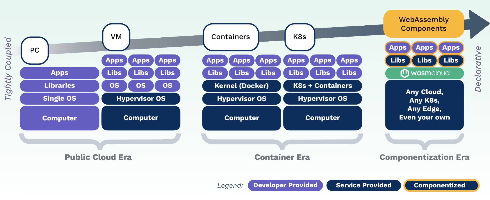
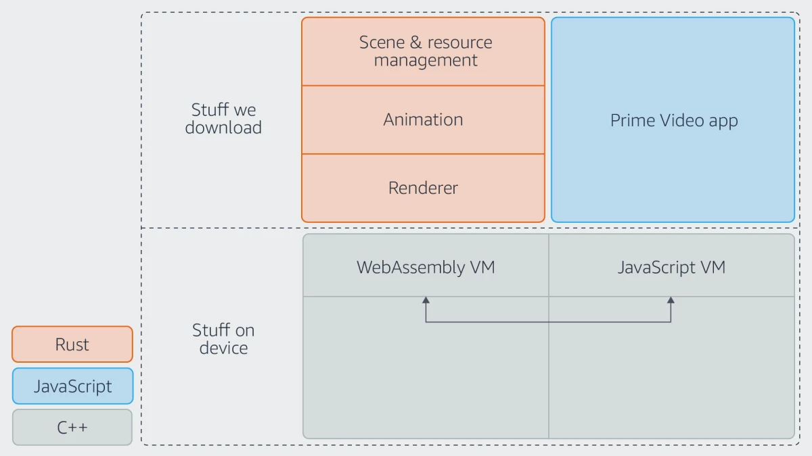
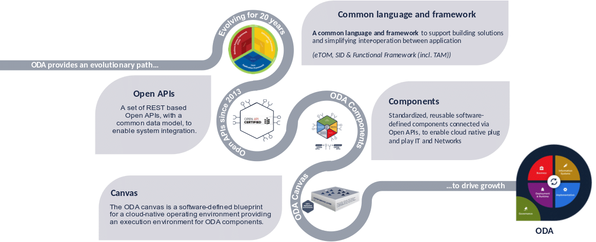
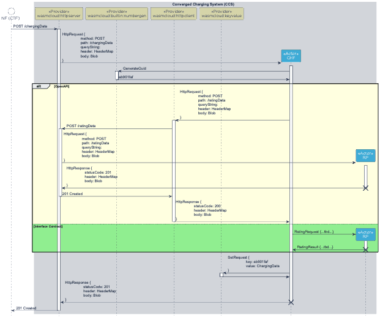
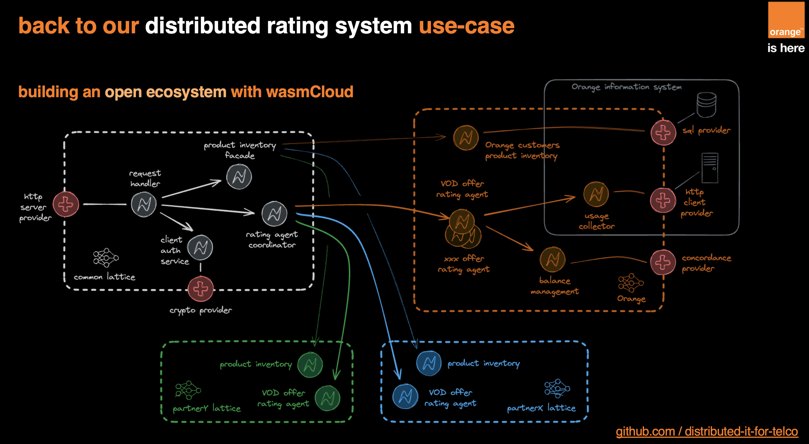
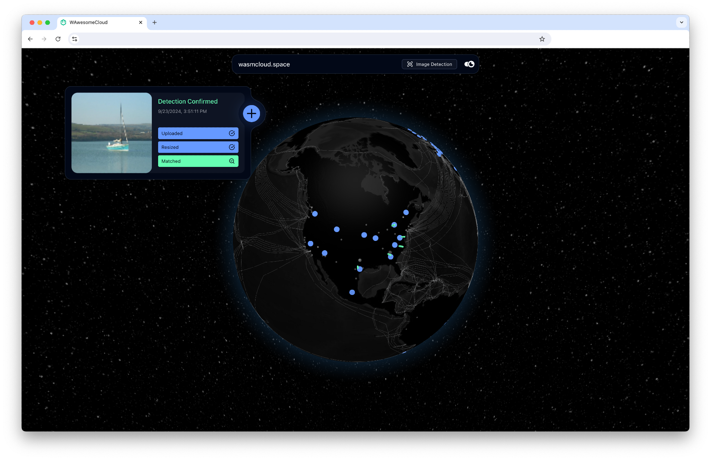

The clearest evidence that a new technology is striking a chord is the proliferation of use cases in diverse industries. WebAssembly (Wasm) has quickly transitioned from theory to practice and, over the last couple of years, more and more engineering teams have introduced it to their architectures. The use cases are varied but what interests engineers is the prospect of forever leaving behind the resource-intensive developer processes that have dogged them for decades. 

In this article we’ll take a look at a few interesting examples of how WebAssembly (and CNCF wasmCloud) is being adopted in enterprise, and the benefits teams are starting to see.

## Why the need for Wasm in the first place?

Building and maintaining distributed applications has always come with an inherent trade-off. To run them right next to users dramatically improves performance and boosts productivity. However, because the destination is always different, the way we build, the languages we use, and the way we maintain applications has to be done in isolation, **on an app-by-basis**. Fine when running 1 or 2 apps in a couple of places, but what if it’s tens of thousands running in diverse locations? 

Engineers tread a tightrope between keeping applications updated, whilst preserving performance. What has become obvious through years of trial, error and refinement, is that current development methodologies and cloud technologies are not suited to managing estates of applications at scale. 

Container orchestrators like Kubernetes are really good at making infrastructure easier to manage and move around, and at shifting agglomerations of apps from servers to the cloud. But engineers have found it fares less well in application orchestration. While it creates the portability we want, **Kubernetes is complicated and unwieldy at the edge**—even the smallest container is a few MBs, so you’re occupying limited resources just getting the container to work.

Ultimately, the dream is to write ***applications once and run them in any location**.* That’s the shift that Wasm represents, and what open source, community projects like wasmCloud (a CNCF project) are designed to deliver. Unsurprisingly, engineers in a ton of industries are really excited and, over the last 18 months or so, we’ve seen adoption of WebAssembly—and wasmCloud—growing in industry.

Before we get in to the work being done in the wasmCloud community, it’s worth reminding ourselves that pockets of early adopters have been deploying Wasm in production for a while.

*Figure 1: Epochs of compute (Source: Cosmonic)*

## One App, Thousands of Devices

A great example is [Amazon Prime](https://www.amazon.science/blog/how-prime-video-updates-its-app-for-more-than-8-000-device-types) (a [Bytecode Alliance](https://bytecodealliance.org/) member). By switching Javascript with Wasm to update the Prime app for over 8,000 devices of various types, engineers have seen significant improvements in speed and efficiency. 

This means everything from TVs and gaming consoles, to tablets and streaming sticks. Historically, because of the differences between these devices, each one would need a separate native release. As Alexandru Ene reports in his [article](https://www.amazon.science/blog/how-prime-video-updates-its-app-for-more-than-8-000-device-types) published on the Amazon Science blog, this created a “difficult trade-off between updatability and performance.”

As Ene describes, in early experiments, the team switched low-level systems from less-performant Javascript to Wasm which meant code written in high-level languages could run efficiently on any device. The experiment showed code written in Rust and compiled to Wasm was 10 to 25 times faster than JavaScript.

To quote him, “Like JavaScript code, compiled Wasm binaries run on a VM that provides a uniform interface between code and hardware, regardless of device.” The team has seen several other benefits, take a look at the [article](https://www.amazon.science/blog/how-prime-video-updates-its-app-for-more-than-8-000-device-types) for details.

*Figure 2: New architecture with WebAssembly (Source: [Amazon Science Blog](https://www.amazon.science/blog/how-prime-video-updates-its-app-for-more-than-8-000-device-types)).*

## Can wasmCloud benefit Kubernetes deployments?

### Adobe: Maximising Kubernetes investments

As Adobe’s Colin Murphy and Sean Isom* explain on the [CNCF blog](https://www.cncf.io/blog/2022/11/17/better-together-a-kubernetes-and-wasm-case-study/), having multi-tenant clusters has loads of operational benefits (flexibility, security), but efficiently managing resources for arbitrary workloads with different scaling and provisioning characteristics is challenging. A common assumption with containers is that they automatically enable efficiency in the cloud. However, containers still have to map to a fixed size virtual machine – fine if we’re dealing with small, agile distributed systems that can perfectly bin-pack. But, when mixed with larger, more monolithic systems, overall efficiency falls.

The team wondered if there was a more lightweight model that could be almost instantly scaled as traffic spikes, giving more scheduling flexibility than a coarse-grained container? In 2022, Adobe developed a couple of early projects to bring wasmCloud to its Kubernetes infrastructure.

The first took an existing function that removes the background from images, translated it to Rust, and ported it to run in wasmCloud. An immediate benefit was the ability to spin up a Wasm binary instantaneously to service the request. This binary would have an extremely low memory footprint versus running a service that required always-on, baseline resources.

The second experiment took a full microservice running in Kubernetes, and made it run in Wasm. Take a look at the process they went through in the [article.](https://www.cncf.io/blog/2022/11/17/better-together-a-kubernetes-and-wasm-case-study/) The team managed to port the entire codebase, removing final blockers once wasmCloud had full support for WASI. Now that they know it’s possible, the next phase is to replace the entire service in production to see what kind of performance and efficiency improvements might emerge (and how that could scale to more services).

These successful early projects have spawned a host of others within Adobe and beyond. Recently, Adobe’s Colin Murphy and Akamai’s Doug Rodrigues joined forces to explore the benefits of running wasmCloud at the edge. Check out their recent [appearance on Cloud Native Live](https://youtu.be/B1Q_Xx5i6Ek) for the full story. 

## How can Wasm benefit heavy industry?

### MachineMetrics: Efficient and secure processing of high velocity machine data

[**MachineMetrics LLC**](https://www.machinemetrics.com/)’s customers operate factories containing advanced manufacturing machinery, producing swathes of unutilized data. Reporting is carried out manually on thousands of machines so errors often arise which means missed anomalies and machine failure.

MachineMetrics’ edge monitoring devices accurately capture data directly from machine controls and sensors. By closely analyzing the performance of machinery, operators more accurately predict wear and tear. Data capture alone, however, consumes the majority of resources on each device. Added to this the abundance of high-frequency data and network constraints make visualizing that data difficult in tools like Grafana. 

Engineers Jochen Rau and Tyler Schoppe [suspected](https://www.cncf.io/blog/2024/08/23/wasmcloud-on-the-factory-floor-efficient-and-secure-processing-of-high-velocity-machine-data/) that the efficiency of Wasm’s bytecode format could help solve these issues and unlock greater architectural freedom. They experimented with wasmCloud to find a more efficient way to more easily transport business logic over the network. This would make better use of existing available resources at the edge, and put portable processing where needed most.

A custom algorithm was developed, allowing high-frequency data to be downsampled from any deployment target. This would allow processing power to be moved between edges and clouds, according to need and without losing data fidelity. Implemented in Rust and deployed in wasmCloud as a Wasm component, the completed downsampling algorithm reports proactive maintenance telemetry across edge and cloud platforms. 

The algorithm proves it’s possible to run high-frequency data workloads as components, on edge devices running in wasmCloud. wasmCloud is also shown to be an effective compute lattice on which to move workloads seamlessly between deployment targets. In the next development phase, Schoppe and Rau will move to deployment, and begin to reap the benefits.

*Figure 3: Architecture of the PoC showing wasmCloud host running on an edge device. NATS serves as backbone for machine, configuration, and control data (Source: MachineMetrics).*

As Jochen Rau, Data Platform Lead at MachineMetrics describes: “WebAssembly, wasmCloud, and NATS will not only reshape the MachineMetrics business but are already transforming industrial IoT. A big thanks to the WebAssembly and wasmCloud community for supporting us all the way here and providing such awesome tools.”

Read the [full story on the CNCF blog](https://www.cncf.io/blog/2024/08/23/wasmcloud-on-the-factory-floor-efficient-and-secure-processing-of-high-velocity-machine-data/) and listen to the team’s [latest talk](https://youtu.be/vEHbZCBmPok) at wasmCloud Innovation Day.

## How do more traditional sectors stand to benefit?

### **TM Forum: Bringing Wasm components to telecoms**

In early 2024 we shared how a group of international CSPs (communication service providers) and their integration partners brought Wasm to telecoms. **[WebAssembly Canvas Phase I](https://www.tmforum.org/catalysts/projects/C23.0.601/webassembly-canvas)**, a TM Forum Catalyst Project, was an early PoC that evaluated whether wasmCloud, an incubating CNCF project, could be a credible **alternative** to Kubernetes in managing TM Forum’s estate of open APIs. Referred to as Open Digital Architecture (ODA) components, these open APIs are currently managed and maintained in ODA Canvas, an ODA repository built on Kubernetes.

*Figure 4: Source: [TM Forum ODA Evolution](https://www.tmforum.org/oda/get-started/)*

The TM Forum originally assumed Kubernetes would be the default deployment platform for the ODA Canvas. Kubernetes has its limitations, though, particularly when it comes to resource efficiency and running edge workloads. It’s also not totally vendor-neutral. The host environment always requires the use of vendor-specific tooling—for instance, AKS requires us to use Azure Active Directory and Google Kubernetes Engine wants us to use gke-deploy instead of kubectl. Becoming more open to drive greater interoperability is a huge focus for CSPs.

Having seen progress in the development of the WebAssembly Component Model and WASI P2, the Project CSPs suspected Wasm could bring an accelerated, more efficient and solution-agnostic approach to hosting and managing ODA Components in Canvas.

They were right. The successful WebAssembly Canvas PoC demonstrated that wasmCloud could significantly quicken the journey towards a more interoperable, componentized architecture, and revealed its promise to create serious operational and financial efficiencies for the telecommunications industry.

In the message sequence chart comparison below, the larger yellow section denotes the profile of ODA Canvas with REST APIs, while the green section denotes the profile of the native interface in wasmCloud. Why is the yellow section so much larger than the green? Because the REST APIs require HTTP server and client capability providers and external networking, bringing with it increased carbon emissions, energy costs, latency and technical complexity whilst wasmCloud eliminates all these extra overheads. CSPs run large enough estates that they can’t afford to ignore this overhead, particularly if there’s a credible and community-based solution to fix it.

*Figure 5: The yellow section denotes the unnecessary overhead of an HTTP protocol stack in actor integration. The green section represents the optimal pattern, when a contract is created for the services an actor provides.*

In the Canvas Phase II, the team will explore the benefits of bringing Wasm *together* with Kubernetes to analyse the efficiencies of co-existence. Full details on the [blog](https://wasmcloud.com/blog/tm-forum-webassembly-canvas-project-in-phase-2).

### Orange: Scaling Applications to the Edge and Beyond

Also a member of the TM Forum project, Orange is another telco trialing Wasm in its service delivery framework. Orange faces the challenge of managing data centers and extending robust services to their 184 Points of Presence across 31 countries. It is adopting WebAssembly with CNCF wasmCloud, a path that, they believe, will significantly enhance their capability to scale applications to the edge and beyond. Take a look at Yann Cardon’s [Wasm Day talk](https://www.youtube.com/watch?v=1sWQqgK-79c) which explores the practical experiments undertaken such as how wasmCloud integrates with Orange’s distributed ratings agent. This is designed to combat latency, high costs, and reduced availability associated with traditional central data fetching methods.

*Figure 6: Orange: building an open ecosystem with wasmCloud.*

Finally, **Akamai’s** [recent presentation](https://youtu.be/vEHbZCBmPok) at wasmCloud Innovation Day gave us an insight into how platforms like wasmCloud can extend compute power to the edge in even more advanced use cases. And our **celestial-terrestrial mesh** demo shows how space agencies could put Wasm to use in super-distributed, multi-tenant use cases.

*Figure 7: A reusable environment for testing distributed use cases with wasmCloud.*

## New Emerging Adopters

What’s really exciting is that these experiences are just the start. Over the last 12 months, we’ve talked to engineers and architects in banking, gaming, automotive, professional services, and more. Above all, their ultimate goal is the same; to have a single, reusable application suite that can be put to use wherever it’s needed most.

We’ll be back soon with more on the emerging use cases coming from these sagacious sectors. In the meantime, a few of our community users and customers will be on stage at WasmCon in Salt Lake City. Check out the [schedule](https://events.linuxfoundation.org/wasmcon/program/schedule/) and see you there!

**Written during Sean Isom’s time at Adobe, he is now the founder of [Renderlet](https://www.ycombinator.com/companies/renderlet).*
