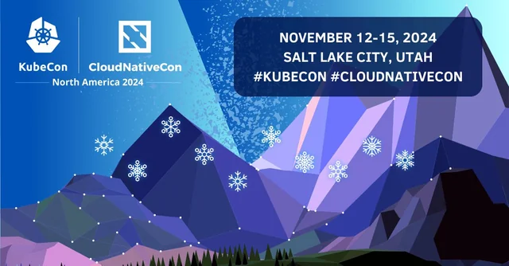
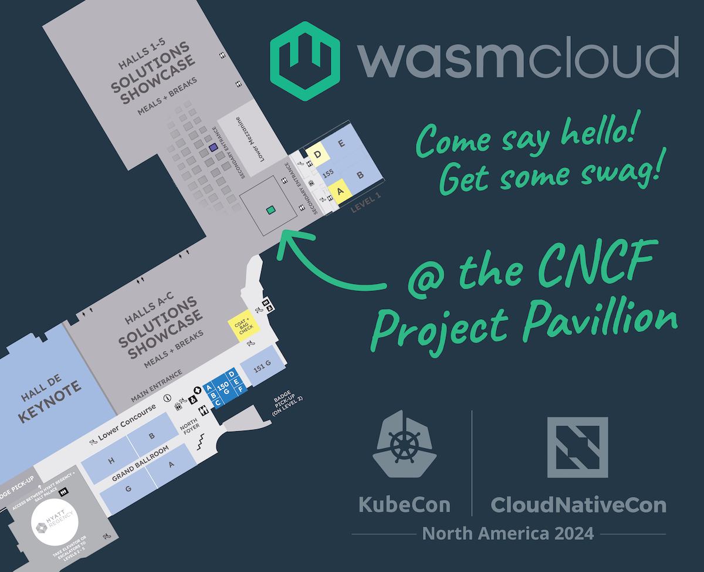

We are just days away from the start of WasmCon and KubeCon + CloudNativeCon North America (November 11-15), taking place this time in beautiful Salt Lake City, Utah. As in-person conference attendance recovers to pre-pandemic levels, this annual celebration of cloud native innovation looks set to be the biggest yet.

:::info[Visit our booth!]
The **wasmCloud project booth** will be open on **Wednesday, November 13** all afternoon and evening, during booth crawl—visit the Project Pavilion: come for the stickers, stay for the chat! 

You can also find wasmCloud maintainers at the [Cosmonic booth](https://kccncna2024.sched.com/venue/Salt+Palace+%7C+Level+3+%7C+355+D?iframe=yes&w=100%&sidebar=yes&bg=no) (T35) in the Solutions Showcase for the duration of KubeCon. Say hi and grab some swag!
:::

For wasmCloud maintainers, this will be a milestone moment as we show off a ton of new features and tools that demonstrate the maturity of the platform. It’s also the perfect time to share the growing range of use cases emerging in industry. More of our community and enterprise users than ever before will take to the stage to share why working with wasmCloud is is helping transforming architectures to improve efficiency and performance. 

Look out for talks from **American Express**, **Adobe**, and **Akamai**! The schedules for both WasmCon and KubeCon + CloudNativeCon are packed full of goodness so we’ve put together a summary of what we, and our friends, will be talking about and where to find them.

## WasmCon: November 11-12

### Day 1: Monday, November 11

**9:00am - 10:00am MST (Ballroom 1)**

**Workshop:** [Workshop: Choose Your Own Adventure: Wasm Edition - Bailey Hayes & Taylor Thomas, Cosmonic](https://wasmcon24.sched.com/?iframe=yes&w=100%&sidebar=yes&bg=no#)

Join Taylor and Bailey for a Wasm-y twist on the classic 80s and 90s ‘Choose Your Own Adventure’ genre. Attendees will get to choose how, where, and what they can deploy with Wasm using CNCF wasmCloud and other Wasm native tooling like wasi-virt, wasm-tools, and more. This workshop will cover:

- How to deploy wasmCloud in the architecture of your choice on bare metal, Kubernetes, or at the edge.
- How to write a Wasm component and application that can run anywhere, including wasmCloud.
- How to deploy an application and modify its deployment, all without changing code.

**10:30am - 11:30am MST (Ballroom 1)**

**Workshop:** [Implementing a Wasm Native Database API with Couchbase - Laurent Doguin, Couchbase & Victor Adossi, Cosmonic](https://sched.co/1iTb8)

Aimed at Wasm enthusiasts and developers, this session delves into the design, implementation, and performance considerations of adding Wasm Interface Types (WIT) to support data operations, their parameters, errors and return types. As such, attendees will gain a comprehensive understanding of how to leverage Wasm to manage databases in a serverless environment, transforming how data is managed and accessed.

Specifically, Laurent and Victor will explore the journey of integrating Wasm support for a Couchbase. They will take attendees through the process of deciding on the right interface design, implementing providers for CNCF wasmCloud, and ensuring optimal performance for data operations. 

This implementation features three key interfaces: WASI-Keyvalue, Couchbase Subdoc, and Couchbase Query. The duo will share insights on the challenges and solutions encountered during this integration, along with best practices for demonstrating and testing these capabilities.

**3:35 - 4:20pm MST (Ballroom 2)**

**User Talk**: [Unleash the Power of Open Source WASM on a Hyper-Distributed Cloud - Colin Murphy, Adobe & Douglas Rodrigues, Akamai](https://sched.co/1iTbK)

Adobe has been an early adopter of WebAssembly and an extensive user of edge computing for many years. You can read about the early PoC on the [CNCF blog](https://www.cncf.io/blog/2022/11/17/better-together-a-kubernetes-and-wasm-case-study/), where Colin Murphy and Sean Isom successfully prove the benefit of bringing WebAssembly to Adobe’s Kubernetes estate.

Adobe sees the release of WASI 0.2 as a turning point in platform engineering and, alongside Akamai and Cosmonic, they making this platform a reality. Adobe’s Colin Murphy and Akamai’s Doug Rodrigues will demonstrate how Adobe I/O Runtime will be able to serve hundreds of customers while leveraging wasmCloud and Akamai in a way that is:

- **Secure:** Untrusted code is executed with minimal overhead
- **Efficient**: WebAssembly is very fast, simple to operate and runs on demand
- **Integrated**: Applications are seamlessly distributed across Adobe’s data centers and Akamai edge locations, combining the best of both worlds while avoiding manual orchestration between cloud providers and CDNs. Hosts automatically start up and join the lattice for minimum operational overhead.
- **Polyglo**t: Multiple languages can be compiled to WebAssembly components. Furthermore, the component model allows Adobe I/O Runtime to provide access to Adobe APIs without SDKs.

**4:30 - 5:05pm MST (Ballroom 2)**

**User Talk**: [Elevating Serverless Platforms with Wasm Components - Ritesh Rai & Vamsi Sangavarapu, **American Express**](https://sched.co/1iTbR)

We could not be more excited that our friends Ritesh Rai and Vamsi Sangavarapu from **American Express** are sharing their experiences with wasmCloud on stage at WasmCon this year. 

In this talk, Ritesh and Vamsi will explore how WebAssembly (Wasm) and **wasmCloud** are revolutionizing their enterprise multi-tenant Function-as-a-Service (FaaS) platform at American Express. After a brief introduction to the platform, they will delve into the transformative impact of WebAssembly components on modularity, security, and performance. 

They will discuss the architectural benefits of WebAssembly, highlighting its ability to provide a portable, efficient, and secure runtime. Attendees will learn how wasmCloud enables the team to create modular, high-performance components that enhance our platform’s capabilities. Real-world use cases will be presented to demonstrate how these technologies are set to elevate our platform engineering practices, providing valuable insights and practical knowledge for implementing similar solutions.

### Day 2: Tuesday, November 12

**11:00am - 11:35am MST (Ballroom 1)**

**Panel Discussion**: [Playing Safely in the Sandbox ― Keeping WebAssembly Secure - Ram Iyengar, Cloud Foundry Foundation; Ralph Squillace, Microsoft Corporation; Luke Wagner, Fastly; Bailey Hayes, Cosmonic](https://sched.co/1iTbW)

Wasm (WebAssembly) is rapidly gaining traction, but a comprehensive understanding of its security landscape remains fragmented. This panel discussion brings together Wasm experts and security enthusiasts to address this gap. This discussion will provide a valuable starting point for developers building secure Wasm applications. It will also benefit Wasm users by raising their awareness of potential security concerns. The discussion will span the following major themes:

- Built-in Wasm security features and limitations
- Security tools available for the Wasm ecosystem
- Potential attack vectors and mitigation strategies
- Best practices for secure Wasm development.

**1:30pm - 2:05pm MST (Ballroom 1)**

**Maintainer Talk:** [wRPC: Distributed Components, No Assembly Required - Roman Volosatovs & Taylor Thomas, Cosmonic](https://sched.co/1iTbg)

One of the most beloved features of the component model is extensibility. As the WebAssembly ecosystem continues to grow, the WebAssembly community will need extensibility beyond component composition to build everything from plugins to fully distributed microservices and everything in between. This is where wRPC (WIT-RPC), a WebAssembly component-native, transport-agnostic RPC protocol and framework comes in. wRPC facilitates WIT (WebAssembly Interface Type) defined composition over network, IPC, or other means of communication. 

What this means is every WebAssembly component can be used with wRPC out-of-the-box using your execution model of choice. This talk will discuss why wRPC exists, the design behind it, and how you can integrate it with your WebAssembly runtimes and platforms. Through many diagrams and demos, you’ll learn why wRPC is important and how it can be used to create reusable, language-agnostic plugins and distributed component communication.

**3:30pm - 4:05pm MST (Ballroom 1)**

**Community Talk**: [Contain Yourself: Wasm and the OCI Spec - Taylor Thomas, Cosmonic & James Sturtevant, Microsoft](https://sched.co/1iTbx)

We all love Wasm, but how are we actually supposed to deploy and consume it? This is what this engaging talk is designed to explore. 

The OCI Artifact guidance provides a standardized way to build and distribute content of all shapes and sizes. In this session, Taylor and James introduce you to the Wasm OCI Artifact specification and how you can use it to distribute, discover, and consume Wasm components just like other cloud native artifacts—all while using your existing tooling and controls. They will break down how to package and use Wasm as OCI artifacts, complete with live demos. They will also show how you can use common tooling to pull the same Wasm component from a registry and run it seamlessly across runtimes such as runwasi and wasmCloud. Plus, there will be a demonstration of how these components fit neatly into dependency management. Join Taylor and James for a session packed with insights, live demos, and a dash (or two) of humor, as they explore the future of Wasm with the OCI spec.

## KubeCon + CloudNativeCon Main Event: November 12-15

**Tuesday, November 12, 11:38am - 11:43am MST (Hyatt Regency | Level 4 | Regency Ballroom B)**

**Project Lightning Talk**: [wasmCloud: Declarative WebAssembly Orchestration for Cloud Native Applications - Brooks Townsend, Cosmonic](https://sched.co/1iW95) 

wasmCloud released its 1.0 version in April of this year. Since then, the project has done everything but slow down. Maintainer Brooks Townsend demonstrates how wasmCloud enables users to build and orchestrate WebAssembly (Wasm) applications across distributed infrastructure. Learn how wasmCloud integrates the latest developments in WebAssembly standards to help users create and deploy applications “building block” style—connecting portable, interoperable Wasm components so they can focus on business logic. In this lightning project update, Brooks discusses wasmCloud’s component support, distributed networking, declarative orchestration, OpenTelemetry observability, the project roadmap, and more.

### ContribFest

**Thursday, November 14, 11:00am - 12:30pm MST (Salt Palace | Level 3 | 355 D)**

**Maintainer workshop**: 🚨 [Contribfest: Collaborative WebAssembly Creation with WasmCloud](https://sched.co/1howS): [wasmCloud maintainers Bailey Hayes, Taylor Thomas, Colin Murphy (Adobe)](https://sched.co/1howS)

We are absolutely delighted to be talking at ContribFest this year alongside fellow wasmCloud maintainer, Adobe’s Colin Murphy. 

wasmCloud aims to provide a seamless developer experience for building, testing, and deploying WebAssembly components. Join maintainers and community contributors at this year’s Contribfest to build Wasm components and enhance wasmCloud's core developer experience. The team will test wasmCloud’s newest feature, wash dev, by rapidly building applications in Wasm. With support for **Rust**, **Go**, and **JavaScript**/**TypeScript**, developers of all backgrounds can get hands-on with Wasm. Since applications built with wasmCloud use the latest Wasm standards, components created during the workshop will benefit the broader Wasm ecosystem. Contributors who find bugs, improvements, or new features can pair program with maintainers to contribute directly to wasmCloud. The perfect opportunity to become a wasmCloud contributor.

**Thursday, November 14, 5:25pm - 6:00pm MST (Salt Palace | Level 1 | 151 G)**

**Maintainer Talk**: [Multi-Tier Security in WasmCloud: From Developer Constraints to Platform Extensibility - Brooks Townsend, Cosmonic](https://sched.co/1i7pL)

In 2024, 96% of codebases contain open source, and 74% of these have high-risk vulnerabilities—a 54% increase from 2023. As open source adoption grows and the cloud native landscape evolves, robust security practices are critical. This session explores wasmCloud, a CNCF platform for distributed WebAssembly applications, focusing on achieving a secure-by-default environment. wasmCloud's multi-tier security model addresses the needs of both developers and platform engineers. 

Developers work in a deny-by-default mode, requiring explicit declaration of all application capabilities. Platform engineers grant these capabilities in a fine-grained manner and extend security through pluggable services. Grounded in real-world experience and practical demos, attendees will leave this talk with the knowledge to configure and extend security using pluggable services, enabling them to leverage WebAssembly to secure cloud native applications.

## Stop by and say hello!

We’re looking forward to connecting with everyone in Salt Lake City. You can find us on the afternoon and evening of Wednesday 13th on the wasmCloud project booth in the Project Pavilion—all through KubeCrawl. You can also catch up with wasmCloud maintainers at Cosmonic booth T35 throughout the week.

And don’t forget to connect with us on [Slack](https://wasmcloud.slack.com/) and follow us on [BlueSky](https://bsky.app/profile/wasmcloud.com), [LinkedIn](https://www.linkedin.com/company/79795654/admin/dashboard/) and [X](https://x.com/wasmcloud) for the latest news.

:::info[Local tips]
Salt Lake City native Taylor Thomas shared his top tips for visitors on the Rancher podcast. Tune into hear his recommendations, and what to expect at this year’s conference.
:::

Finally, a handy map so you can find us on the show floor! Looking forward to seeing everyone in Salt Lake City!

