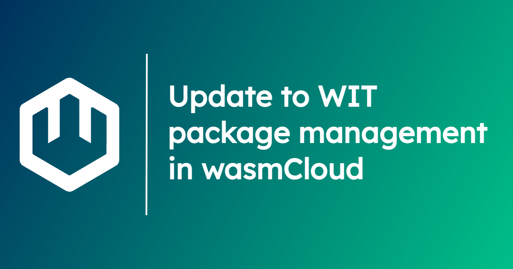

wasmCloud's language-agnostic [interfaces](https://wasmcloud.com/docs/concepts/interfaces) are defined using **WebAssembly Interface Type (WIT) packages**, which can be **stored as OCI artifacts** in your registry of choice.

As of `wash` v0.36, we're taking a big step forward in WIT package management, deprecating our usage of the `wit-deps` utility in favor of the OCI-compatible `wkg`. In this post, we'll take a look at the changes, break down exactly what's happening under the hood, and explain what it means for users.

### What is changing?

For some time now, `wash` didn’t have any knowledge of dependencies and instead expected the user to use a separate `wit-deps` utility to fetch and update WIT dependencies as raw `.wit` files in the `/wit/deps` directory of a wasmCloud project.

That was originally intended as a brief, stop-gap solution, but `wit-deps` ended up serving as the stop-gap that just kept giving. As standards and approaches across the wider Wasm ecosystem were finalized, `wit-deps` fulfilled a critical role for a good deal longer than expected, and maintainer [Roman Volosatovs](https://github.com/rvolosatovs) in particular deserves a shout-out for the utility's above-and-beyond service.

Now as of `wash` v0.36, `wit-deps` usage is being deprecated in favor of a new set of ecosystem tooling called [**Wasm Package Tools**](https://github.com/bytecodealliance/wasm-pkg-tools) and particularly the `wkg` (pronounced "wackage") command line tool.

`wash` integrates `wkg` as a library, so there's no need to download a new tool. Whether standalone or as part of `wash`, `wkg` handles the following jobs:

- Checking for WIT package dependencies
- Fetching WIT packages from known registries
- Pushing packages to your own registry

### How `wkg` works

So how does `wkg` work with `wash`?

If you set one of our well-known interfaces as an import or export in your specified world file (usually `world.wit`), `wash` will make sure you have the proper packages when you build.

The tooling simply reads the world and downloads the appropriate dependencies automatically into the `wit/deps` directory (as well as generating a `wasmcloud.lock` file that captures the dependencies that were downloaded). With no further configuration, `wash` can download dependencies from the following well-known namespaces:

- `wasi`
- `wasmcloud`
- `wrpc`
- `ba`

Easy! When it comes to interfaces outside of those well-known namespaces (such as your own custom interfaces), you can configure `wash` and its integrated `wkg` to fetch those interfaces from a given registry. See [our docs](/docs/developer/components/build) for more information.

We need to give a shout-out for `wkg`, too—it wouldn't have reached this point without a ton of amazing work from [Taylor Thomas](https://github.com/thomastaylor312), [Calvin Prewitt](https://github.com/calvinrp), [Yoshua Wuyts](https://github.com/yoshuawuyts), [Lann Martin](https://github.com/lann), and more contributors.

### What it means for you

Our templates have been updated to use `wkg` for WIT package management, so if you start building a new component, you shouldn't have to think about WIT package management too much—the process will go just as described in the section above.

In this period of transition from `wit-deps` to `wkg`, `wash` is attentive to the system you're using—if you have a `deps.toml` file used by `wit-deps` in your wasmCloud project directory, `wash` will skip using `wkg` during a build, deferring to your `wit-deps`-based approach.

At the moment, capability providers still use `deps.toml` files and `wit-deps`—this will change in the near future, and we'll keep you updated when it does.

It's also worth noting that we're still finalizing our approach to configuring `wkg` usage in a wasmCloud project directory. Right now, we have folded in the `wkg.toml` file per the [Wasm Package Tools docs](https://github.com/bytecodealliance/wasm-pkg-tools?tab=readme-ov-file#wkgtoml-and-wkglock) into our `wasmcloud.toml` file—at the moment, this is how you would go about adding a custom interface to your project, for example. We also have heard the feedback from plenty of people that the current config format in `wkg` (that maps WIT packages to registries) is overly complex. Soon we would like to consolidate this configuration into something more simple that can live in the `.wash` directory for global config and the `wasmcloud.toml` file for local config. These changes will the be propagated up to the main `wkg` toolchain!

Any of these changes should be backwards compatible, but we want people to know it will be changing for the better so you aren’t surprised!

### Get involved

wasmCloud is built on the contributions of the WebAssembly and wasmCloud communities. To chat about [Bytecode Alliance](https://bytecodealliance.org/) projects like Wasm Package Tools and learn how to pitch in, check out the [Bytecode Alliance Zulip chat](https://bytecodealliance.zulipchat.com/).

To get involved with wasmCloud, join us on the [wasmCloud Slack](https://slack.wasmcloud.com/) or at the next [wasmCloud weekly community meeting](https://wasmcloud.com/community). And stay tuned here to learn the latest developments with `wkg`!