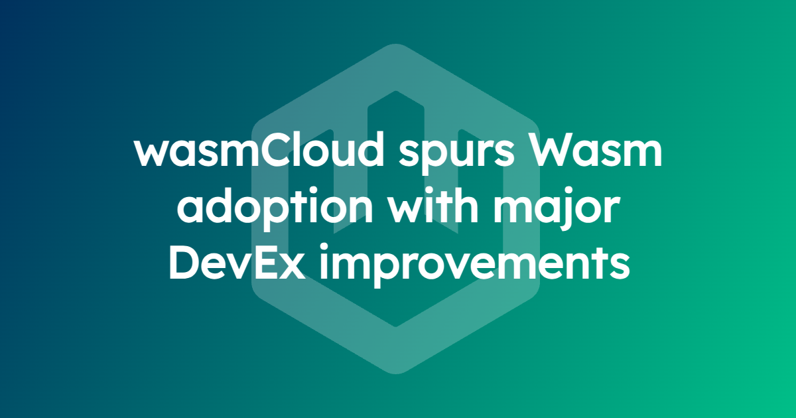
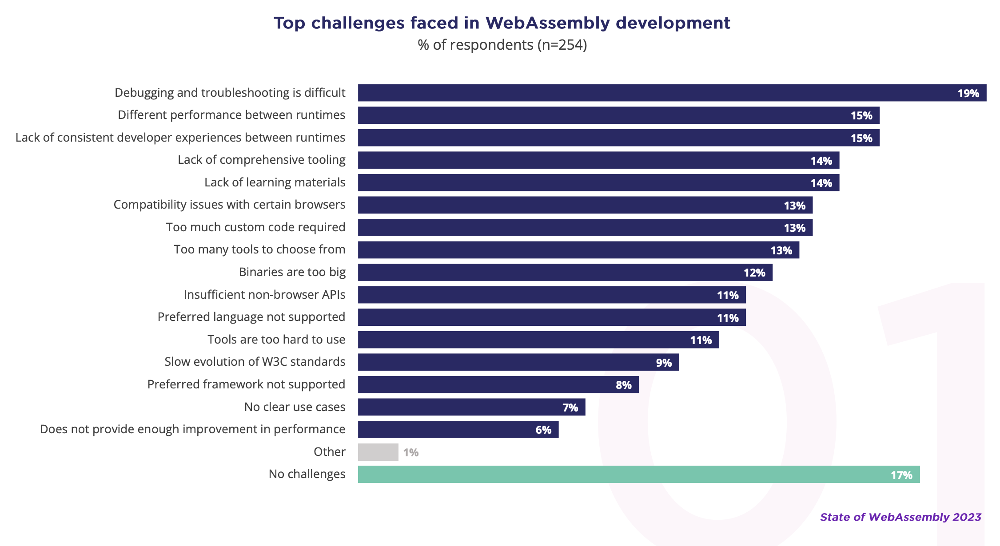

We’re constantly looking for ways to lower barriers to WebAssembly (Wasm) adoption. In Salt Lake City, we’ll show off new tooling designed to bridge common gaps in the developer experience. These inconsistencies, particularly between languages and runtimes, are amongst the biggest barriers facing Wasm developers, according to [research](https://www.cncf.io/wp-content/uploads/2023/09/The-State-of-WebAssembly-2023.pdf) from the CNCF and Slashdata, findings echoed in Scott Logic’s most recent [State of WebAssembly](https://blog.scottlogic.com/2023/10/18/the-state-of-webassembly-2023.html) report.

> *“Throughout its evolution, server-side WebAssembly had consistent gaps in developer experience. Until the standardization of the compilation target, it hasn’t been possible to advance the technology to use native tooling for writing, debugging and testing. Now, we’re seeing the impact of the component model with the advancements in developer experience and workflows compatible with native tooling.”* Brooks Townsend, wasmCloud maintainer and Cosmonic Senior Engineer
> 

## `wash dev`: Write a Componentized App with a Smooth Dev Loop

`wash dev` is a CLI tool that brings the hot reload experience developers expect to WebAssembly. Practitioners build with applications with components in exactly the same way they would usually build applications. Developers can run `wash dev` and have their dependencies resolved and components built and deployed, allowing them to just open their favorite editor and write native code.

All WebAssembly components can be inspected to discover both its dependencies and runtime behavior, just by looking at the binary. `wash dev` takes this one step further; just by inspecting the binary it can detect required runtime capabilities and deploy a local development platform. This platform contains all configuration and necessary infrastructure for the running Wasm application; all discovered from the component itself. Upon any code change the application is rebuilt, inspected again for dependencies, and any necessary infrastructure changes are reflected in the local platform.

This brings huge productivity gains for engineering teams. The streamlined workflow brings **faster development cycles**—engineers iterate and debug much more quickly, without the overhead of manual configuration and deployment. It also brings **familiarity and consistency**; `wash dev` closely matches the workflows engineers are already used to in other languages and platforms, reducing the learning curve.

`wash dev` brings:

- **Automatic provisioning of capabilities**. `wash dev` automatically provisions the appropriate capability providers based on the component's dependencies, without any manual configuration. This streamlines the setup process.
- **Seamless build and run experience**. Developers can simply run `wash dev` in their project directory, and it automatically builds the component and runs it, a similar experience to traditional app development workflows.
- **Reduced manual deployment steps.** Rather than having to create a application YAML manifest, stand up local wasmCloud infrastructure and then deploy that manifest, `wash dev` handles these steps automatically. `wash dev` can also output that YAML for a pre-configured deployment that’s ready to be promoted from dev to QA or staging.

> *“From a developer's standpoint, they just work in their project directory—never having to handle YAML to deploy applications. They don’t even need to start their local platform with `wash up`, they just type `wash dev` in the project directory and get straight to writing code in an automatically configured and deployed wasmCloud environment.”* Brooks Townsend, wasmCloud maintainer and Cosmonic Senior Engineer
> 

## Managing WIT dependencies packaged as OCI artifacts

Following the recommendations from the [CNCF Wasm working group](https://tag-runtime.cncf.io/wgs/wasm/deliverables/wasm-oci-artifact/), wasmCloud added support for the distribution of Wasm components via OCI registries. Now, with the Bytecode Alliance’s [`wasm-pkg-tools`](https://github.com/bytecodealliance/wasm-pkg-tools) (aka `wkg`) project, this evolved to enable sharing dependencies via OCI registries.

Components and providers use WIT (Wasm Interface Type) interfaces to communicate;  essential packages that bring functionality the same way a library does in Go, JavaScript or Rust. Common WASI interfaces such as `wasi-http` or `wasi-keyvalue` bring a ton of functionality and are simple to use but rely on the presence of the interfaces and the generation of bindings to make them usable within a project.`wit-deps` filled the gap for a time—a neat utility for grabbing and integrating raw .wit files into a project. However, now wasmCloud uses the underlying `wkg` (pronounced *wackage*) toolchain created as part of the [wasm-pkg-tools](https://github.com/bytecodealliance/wasm-pkg-tools) initiative from the Bytecode Alliance. It is comparable to NPM or Cargo, but for fetching dependencies for building and running applications with components. 

Using these tools, `wash` fetches and delivers WIT files from a registry, depending on the requirements of a component. When you work with `wash build`, the right interfaces are requested automatically—if you don’t have the interfaces you need, `wash` will pull the right ones from the registry.

Most importantly, these WIT dependencies are packaged as OCI (Open Container Initiative) artifacts which means any organization that already has an OCI registry can access, store and call standard WIT interfaces and. Crucially, teams can store and reuse **custom WIT interfaces** created for unique use cases.

> *“Dependency sharing with OCI is the latest innovation in WebAssembly tooling that emphasizes a broader trend; integration into existing tooling to drastically lower the adoption barrier for Wasm components.”* Brooks Townsend, wasmCloud maintainer and Cosmonic Senior Engineer
> 

## Deep Golang Support Aligns with Real-World Need

While WebAssembly is perceived to be best in Rust, Go support has matured rapidly with the Go and TinyGo communities creating new integration points to meet growing industry demand. In response wasmCloud now comes with a raft of enhanced features for Gophers.

> *“Go is the lingua franca for cloud native deployments and so, given Go’s importance, it’s important for us to build standards-based tooling that capitalizes on the extensive work done in the Go and TinyGo communities. Thanks to this, Go may be a contender for the most natively supported language in Wasm. We’re looking forward to the inspirational effect this will have on other languages considering WASIP2 integration.”* Brooks Townsend, wasmCloud maintainer and Cosmonic Senior Engineer
> 

### `wadge`: Easier Test and Debug for WebAssembly

Historically difficult, debugging and testing in WebAssembly are amongst the most requested features amongst teams. Testing WebAssembly binaries directly means running in a WebAssembly runtime, which isn’t a generally supported workflow in native testing tools. For debugging, tying back WebAssembly instructions to the original source code is a non-trivial problem, and is a big blocker for setting breakpoints and debugging code line-by-line. wasmCloud looks to bridge this WebAssembly gap with `wadge`, the WebAssembly bridge library.

`wadge` has been developed to allow the testing and debugging of Go code, written to compile to a component, by running it as native code. Instead of compiling to a component and then debugging that code, `wadge` implements the [WebAssembly component model](https://github.com/wasmCloud/cabish) ABI as Go code so component code runs like it would normally run in a Wasm runtime, but can be debugged using native tools. It doesn’t attempt to solve the aforementioned problems with running and debugging components directly, but developers can write unit tests for Go components and debug during that process; using VS code at breakpoints.  `wadge` also supports mocking custom interfaces; developers can implement custom interfaces as WebAssembly components and include them in the testing framework.

### Compile Go directly to WebAssembly components with TinyGo and WASI P2

After much work and collaboration in the TinyGo community, **wasip2** landed as an official compilation target in TinyGo. Developers can write idiomatic Go code and compile to the **wasip2** target, creating Go-based WebAssembly components straight from the TinyGo CLI. From there, components can run anywhere that supports WASI P2, with all of the portability, interoperability, and composability that WebAssembly components afford.

This is clean and idiomatic development with WASI—WASI bindings happening quietly and out of sight. Developers simply compile with `tinygo build -o app.wasm -target=wasip2`. In practical terms, developers take a Go library, clone the source from GitHub, and build it as a component, in minutes. It’s now possible to fast-track Go projects to componentized flexibility, and common libraries can be made available to the entire component ecosystem. More details in [this post](https://wasmcloud.com/blog/compile-go-directly-to-webassembly-components-with-tinygo-and-wasi-p2).

### Create custom providers in Go with the Go Provider SDK

What characterizes almost any cloud native deployment are the unique use cases they solve and the special conditions they operate in. With WASI and WIT there is a growing list of standard providers available in the ecosystem however there will always be a need for customer providers to meet specific needs.

The [Go Provider SDK](https://github.com/wasmCloud/provider-sdk-go/tree/main) was created with this in mind. Recently updated, the Go Provider SDK makes it possible for Gophers to build custom wasmCloud capability providers that communicate with components over WebAssembly Interface Type (WIT) interfaces. Like components, developers run distributed providers and update them independently of any given host. Providers use the same WIT interfaces as components and communicate via the WIT-over-RPC (wRPC) protocol.

For more information on [providers](https://wasmcloud.com/docs/concepts/providers), [WIT](https://wasmcloud.com/docs/concepts/interfaces#webassembly-interface-type-wit), [wRPC](https://wasmcloud.com/docs/concepts/lattice#runtime-composition), and how they all fit together, check out the [Platform Guide in our documentation](https://wasmcloud.com/docs/concepts/).

### Where to find us @ WasmCon and KubeCon + CloudNativeCon NA

Come and find us in Salt Lake City, catch a demo and meet the team!

- We’re delighted to see so many wasmCloud users and maintainers on stage at WasmCon and KubeCon. Check out this [handy guide](https://wasmcloud.com/blog/2024-10-30-wasmcloud-at-kubecon-na-2024) as to what’s on and where to find us!
- You can find your wasmCloud maintainers manning the wasmCloud booth (2B) in the Project Pavilion on Wednesday afternoon and evening through KubeCrawl. Come for the stickers, stay for the chat.
- The Cosmonic team can be found at booth T35 in the Solutions Showcase, for the duration of KubeCon. Come for the swag, stay for the demos!
- If you’d like to set up a meeting during KubeCon, drop us a line on [Slack](https://wasmcloud.slack.com/)!