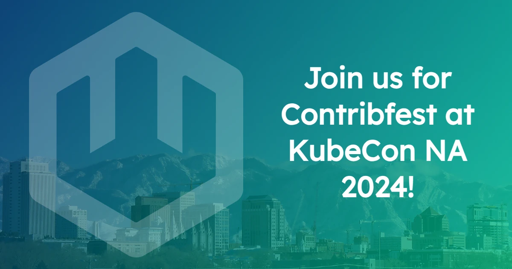

We're thrilled to be hosting a [**Contribfest**](https://sched.co/1howS) session on **Thursday, November 14**, at KubeCon North America 2024 in Salt Lake City, Utah. Check it out from **11:00am to 12:30pm MST** in the Salt Palace, Level 3, 355 D!

As a [newly Incubating CNCF project](https://www.cncf.io/blog/2024/11/12/cncf-welcomes-wasmcloud-to-the-cncf-incubator/), there's never been a better time to jump on board and become an open source contributor. In this post, we'll explain exactly what Contribfest is, highlight some good first issues for new contributors, and show you how you can get involved, whether you're in Salt Lake City or anywhere around the world.

## What is Contribfest?

Contribfest gives attendees an opportunity to join project maintainers and community contributors to explore good first issues, hunt bugs, discuss improvements, and pair program with maintainers to contribute directly to CNCF projects.

At this year's wasmCloud Contribfest, maintainers including Cosmonic's **Bailey Hayes** and **Taylor Thomas,** and Adobe's **Colin Murphy** will be on hand to show users of all experience levels how to get involved with the wasmCloud project.

Whether you're just getting started with Wasm or you're ready to dive into what makes wasmCloud tick, you'll have the opportunity to get familiar with the wasmCloud developer experience and work alongside maintainers to be a part of this exciting and evolving project.

## Good first issues

Want to find an issue to bring to Contribfest, or get started right now? Here are a handful of issues open right now:

- [[FEATURE] Check for `~/.wash/downloads/nats-server` version and update if it's old (#3572)](https://github.com/wasmCloud/wasmCloud/issues/3572)
- [[FEATURE] Always output consistent `wash dev` ending (#3460)](https://github.com/wasmCloud/wasmCloud/issues/3460)
- [[BUG] keyvalue-nats should be case insensitive (#3346)](https://github.com/wasmCloud/wasmCloud/issues/3346)
- [[FEATURE] Use `clap_autocomplete` for control interface + app commands (#3258)](https://github.com/wasmCloud/wasmCloud/issues/3258)
- [[BUG] Emojis render poorly in Windows cmd (#3184)](https://github.com/wasmCloud/wasmCloud/issues/3184)
- [[BUG] wash app deploy should fail or provide indication if component or provider is missing (#3034)](https://github.com/wasmCloud/wasmCloud/issues/3034)
- [[FEATURE] Add command to generate markdown docs for wasmcloud host (#2992)](https://github.com/wasmCloud/wasmCloud/issues/2992)
- [[FEATURE] Colorize `wash` top level help (#2873)](https://github.com/wasmCloud/wasmCloud/issues/2873)

Check out the [complete list of good first issues on GitHub](https://github.com/wasmCloud/wasmCloud/issues?q=is%3Aissue+is%3Aopen+label%3A%22good+first+issue%22).

## Join us!

If you're in Salt Lake City, you can join us for Contribfest on **Thursday, November 14**, from **11:00am to 12:30pm MST** in the Salt Palace, Level 3, 355 D.

No matter where you're located, you can join us any time on the [wasmCloud Slack](https://slack.wasmcloud.com/) and every Wednesday in the [wasmCloud community meeting](https://wasmcloud.com/community). Come hang out, talk WebAssembly, and find out how you can contribute!
