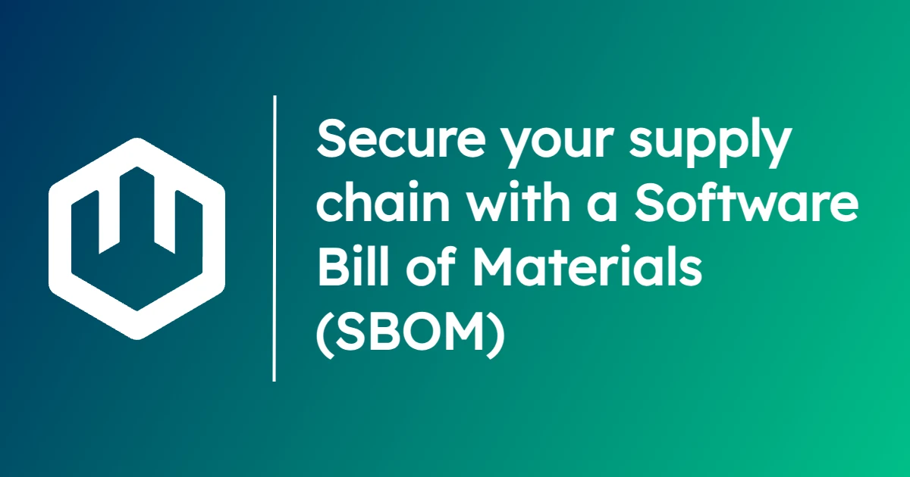

Software supply chain security is critical for enterprises, and the ability to create a **Software Bill of Materials (SBOM)** is an essential piece of every organization's security framework. 

In this blog, we'll explore how to generate SBOMs for wasmCloud projects using common open source tools [`syft`](https://github.com/anchore/syft) and [`grype`](https://github.com/anchore/grype). 

## What are SBOMs?

**Software supply chain attacks** exploit the way modern software is built by utilizing vulnerabilities in libraries and utilities that are widely depended upon by other software projects. 

The **Log4Shell** attack is one of the best-known examples of this strategy&mdash;by targeting the Log4j Java logging framework (a common dependency in one of the most common languages in the world), the attackers had a foothold in countless projects that relied on Log4j. 

One of the most challenging facets of the Log4Shell attack was that many teams didn't know whether their projects depended on Log4j or not&mdash;even if they didn't depend on it directly, sometimes their *dependencies* did. The software supply chain was opaque. 

For many, remediating the vulnerability required time-consuming research, and wasted time meant extended vulnerability. The challenge underscored the need for ubiquitous documentation of dependencies&mdash;a record of the software supply chain. 

This is the role of the SBOM: to provide an authoritative, easy-to-reference record of all the software dependencies for a given project, making it easy to assess and remediate vulnerabilities when they are discovered. Today, the U.S. National Institute of Science and Technology (NIST) [recommends that organizations adopt SBOMs](https://www.cisa.gov/sites/default/files/publications/defending_against_software_supply_chain_attacks_508.pdf) as part of their security frameworks for precisely this reason. 

## Generating SBOMs for wasmCloud projects

In order to run through this example, you'll need: 

* [wasmCloud Shell (`wash`)](/docs/tour/hello-world#install-wash)
* [The language toolchain of your choice](/docs/tour/hello-world#choose-your-language) (Go, Rust, or TypeScript)
* [`syft`](https://github.com/anchore/syft?tab=readme-ov-file#installation), an open source utility for SBOM generation
* [`grype`](https://github.com/anchore/grype?tab=readme-ov-file#installation), an open source utility for vulnerability-scanning SBOMs

Start by creating a new component: 

```shell
wash new component hello
```
`wash` will present you with a choice of templates for your project. Select the "Hello world" template in your chosen language: 

```shell
? Select a project template: ›
  hello-world-rust: a hello-world component (in Rust) that responds over an HTTP connection
  hello-world-tinygo: a hello-world component (in TinyGo) that responds over an HTTP connection
  hello-world-typescript: a hello-world component (in TypeScript) that responds over an HTTP connection
```

After`wash` generates your project files, navigate to the new `hello` project directory:

```shell
cd hello
```
We'll go ahead and run `wash build`&mdash;this will update our local dependencies and compile a component:

```shell
wash build
```

Now it's time to generate an SBOM for the project using `syft`. Run the following command: 

```shell
syft scan dir:. --output spdx-json=sbom.spdx.json
```

Using the `--output` argument means that our command will generate a file called `sbom.spdx.json` in the working directory. 

Now that we have some nice structured data enumerating our dependencies, we can scan the SBOM for vulnerabilities using `grype`:

```shell
grype sbom.spdx.json
```

Grype will compare the dependencies listed in your SBOM against the tool's vulnerability database. The output should look like this:

```text
 ✔ Vulnerability DB                [updated]  
 ✔ Scanned for vulnerabilities     [0 vulnerability matches]  
   ├── by severity: 0 critical, 0 high, 0 medium, 0 low, 0 negligible
   └── by status:   0 fixed, 0 not-fixed, 0 ignored 
No vulnerabilities found
```

## Get involved

If you'd like to learn more about security and wasmCloud, read our [security assessment from OSTIF](https://ostif.org/ostif-has-completed-a-security-audit-of-wasmcloud/) or check out the documentation on wasmCloud's [policy service](/docs/deployment/security/policy-service) and [secrets backends](/docs/deployment/security/secrets).

Want to *talk* security instead? Join us on the [wasmCloud Slack](https://slack.wasmcloud.com/) or in the weekly (virtual) [wasmCloud community meeting](/community).