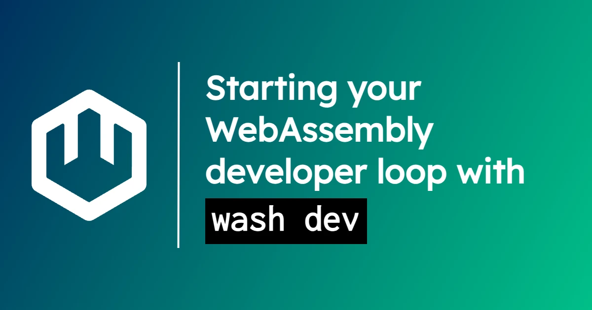

Alongside [wasmCloud 1.3](/blog/2024-10-20-wasmcloud-1.3-transforms-developer-experience-webassembly-components), we introduced a major refinement on the `wash dev` subcommand that gives WebAssembly component developers a hot-reloading developer loop across all of our supported languages&mdash;and leverages plug-and-play capabilities to make application development even smoother. 

In this blog, we'll explain how you can start using `wash dev` in minutes and dig into some of the powerful options available for customizing your dev loop. 

## How to use `wash dev`

Using `wash dev` is as simple as navigating to your project directory (or creating a new one with `wash new component`) and running:

```shell
wash dev
```

In your terminal tab, `wash` will:

* Launch a wasmCloud environment, which means starting...
    * A [wasmCloud host](/docs/concepts/hosts) 
    * The [wasmCloud Application Deployment Manager](/docs/ecosystem/wadm/)
    * [NATS](/docs/ecosystem/nats/)
* Build your project into a component
* Satisfy any well-known capability requirements (like HTTP or key-value storage) with suitable capability providers
* Generate an application manifest
* Deploy the application
* Monitor for changes to your project code

When you make a change to your code, the `wash dev` process will automatically rebuild the component and update your deployed application. 

In a lot of ways, this is the standard hot-reload experience you'd expect. But it's worth dwelling for a moment on how `wash dev` handles [**capabilities**](/docs/concepts/capabilities), because this is where some of the distinctive power of components comes into play.

## Development with capabilities

In a wasmCloud application, capabilities consist of [**interfaces**](/docs/concepts/interfaces) and [**providers**](/docs/concepts/providers). Interfaces are contracts that define the relationships between entities, and providers deliver functionality according to the contract. When working with a generic interface like `wasi:keyvalue`, a developer doesn't need to think about how key-value functionality will actually be fulfilled&mdash;a provider can be assigned (and swapped out) at runtime. 

So how can a developer tool know how to deliver that same functionality in the course of your dev loop?

Components encode their interface **imports** (requirements) and **exports** (functions they expose to other entities) in the binaries themselves. That means a tool like `wash dev` can observe the imported interfaces&mdash;if it's a well-known standard interface like `wasi:keyvalue`, `wash dev` can automatically satisfy the requirement with a known provider that exports on that same interface. 

Open standards and components with legible dependencies make it possible for tooling to reason about and fulfill those dependencies automatically. The same characteristics that make components so compelling for platform engineering are extremely powerful when building a developer tool.

## Simple but flexible

For most projects, you'll just run `wash dev` and get to work. But there's also plenty of versatility to leverage for those who need to do some more precise fine-tuning. 

You can check out [the full range of command line flags in the CLI reference](/docs/cli/wash#wash-dev), but there are a few arguments worth highlighting here:

* `--manifest-output-dir` — Write generated WADM manifest(s) to a given folder (every time they are generated)
* `--secrets-topic` — If provided, enables interfacing with a secrets backend for secret retrieval over the given topic prefix
* `--policy-topic` — If provided, enables policy checks on start actions and component invocations
* `--host-log-path` — Path to which to log information from the wasmCloud host
* `--enable-structured-logging` — Enable JSON structured logging from the wasmCloud host
* `--log-level` — Controls the verbosity of JSON structured logs from the wasmCloud host (the default value is `info`)
* `--wasmcloud-version`, `--nats-version`, and `--wadm-version` set the versions to download for each part of a wasmCloud environment

## Join the community

Ready to learn more about building and deploying WebAssembly components, or to get involved in the wasmCloud project? Join us for a [wasmCloud community meeting](/community) or come chat on the [wasmCloud Slack](https://slack.wasmcloud.com/)!