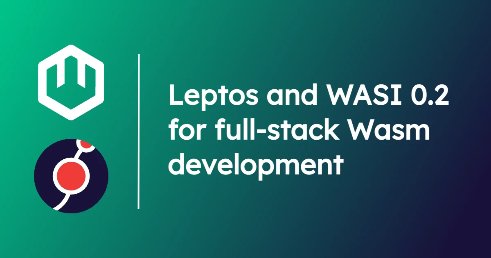
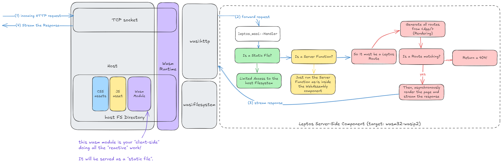

**Brooks**: Earlier this year, WebAssembly components became a reality with the launch of WASI 0.2.0. At the time, I published a blog [WASI 0.2.0 and Why It Matters](https://wasmcloud.com/blog/wasi-preview-2-officially-launches) where we discussed benefits from language support to standard interfaces. In October 30th's wasmCloud Wednesday, community member Enzo Nocera ([@raskyld](https://github.com/raskyld)) presented his contribution to Rust's [Leptos web framework](https://github.com/leptos-rs/leptos) that added WASI 0.2.0 support. 

<iframe src="https://www.youtube.com/embed/SAAyukYJGeY?si=Y6qxf51vC8P3GwKb" width="560" height="315" frameborder="0" allowfullscreen></iframe>

Since this was such an awesome demonstration of what is possible with Wasm components, we invited Enzo to discuss why he started with this project, and his goals for wasmCloud going forward!

## Leptos and WASI

**Enzo**: In reality, Leptos already leverages WebAssembly: the whole reactive system is not handled by JavaScript like you may be used to. Instead, Leptos compiles your application down into a WebAssembly module, which is loaded by a thin JavaScript shim. This is how Leptos allows you to write pure Rust code for your front-end!

But wait! Leptos is not just a reactive framework&mdash;it is also capable of producing a *server binary*! This binary does Server-Side Rendering (or SSR) and also allows you to define *Server Functions*.

When I found out about this framework, I got really excited and quickly came up with an idea: "Can we also make the server-side run on WebAssembly?".

To me, the biggest risk for WebAssembly is failing to show it can solve real-life use-cases. Building an end-to-end web application was the perfect opportunity to challenge that! This may sound tricky at first, but since WASI offers us a *POSIX-ish* API, could we create a kind of adapter that makes Leptos server-side target `wasm32-wasip2`? 

[Yes, we can!](https://github.com/leptos-rs/leptos_wasi)

### How does it work?

[](./images/leptos-server-side.png)

The above diagram should give you a good understanding of how things work!
One of my main drivers was to use purely WASI-standard interfaces so my work can be re-used with any WASI-compatible runtime.

I mentioned POSIX before, but surprisingly, we can create a minimal application with just
`wasi:http` and `wasi:filesystem`&mdash;that's a pretty small API surface!

The core of the component is the [`leptos_wasi::Handler`](https://github.com/leptos-rs/leptos_wasi/blob/84e706a440c6e30f51e3ff16e5f360e88cfd1eee/src/handler.rs#L72) abstraction which implements a short-circuiting mechanism: we delay the heavy-work (i.e., DOM Rendering) until we reach the end of the routing table. In other words, if we see the request's URI is a static file or a server function, we completely avoid any rendering.

The first challenge was how to make WASI native bindings integrate with Leptos. Luckily, Leptos maintainers made an awesome work in terms of interoperability, so I only had to [touch a few crates](https://github.com/leptos-rs/leptos/commit/2ef1723607644f2484d2c115b89df54947f8f124). Basically, I wrote a generic abstraction that used platform-agnostic crates: `http` (for `Request` and `Response`), `bytes` for the body and `futures` (for `Stream` so we can do Response streaming).

Curious readers may have realized from the commit content that I also had to introduce a "custom executor"... That gives me a perfect transition to the second challenge: writing an *async executor*, made for running inside of WebAssembly (which is single-threaded as of WASI 0.2).

That's [200 LoC](https://github.com/leptos-rs/leptos_wasi/blob/84e706a440c6e30f51e3ff16e5f360e88cfd1eee/src/executor.rs) leveraging `futures::LocalPool`. It needs to get battle-tested to ensure there are no edge-cases I overlooked, but basically there is a thread-local channel which accepts `WaitPoll`s, those are a wrapper around WASI native `pollable`s, and they implement `Future` so the first time you `.await` them, they register themselves through the said channel and give control back to the executor, which can then check which registered `pollable`s are ready.

Practically speaking, any time you obtain a `pollable` from WASI's APIs, you can `.await` them like that:

```rust
WasiPoll::new(your_pollable).await
```

For example, we provide a `sleep` function that is just:

```rust
use wasi::clocks::monotonic_clock::{subscribe_duration, Duration};

pub async fn sleep(duration: Duration) {
    WaitPoll::new(subscribe_duration(duration)).await
}
```
Pretty neat, right?

You wonder why I had to do that? Well, the whole point of doing Server-Side Rendering with response streaming is that we can await some I/O on the server, but start sending the app with placeholders. Then, as things we are awaiting become available, we can stream them back to the browser. It would have been too sad not to leverage one of Leptos' coolest feature: `<Suspense/>`. So I had to find a way to make it work with `pollable`!

I would like to end this section on an important note: I mentioned `wasi:filesystem` but you actually **don't** need it. In `leptos_wasi::Handler`, you can [Bring Your Own Handler](https://github.com/leptos-rs/leptos_wasi/blob/84e706a440c6e30f51e3ff16e5f360e88cfd1eee/src/handler.rs#L147) to decide how to serve the static assets. I mention `wasi:filesystem` because it's the easiest way to serve static files locally, but you can use any WASI interface! So you could imagine proxying the static assets from a KV store, an S3... Or simply not serving static files and using a CDN instead!

### Conclusion

I answered my own skepticism: not only can WebAssembly components and WASI serve real businesses' use-cases, but they also bring an unprecedented level of operational flexibility!

Let me explain: thanks to *composability* and the *WIT IDL*, our software have really expressive and strongly typed APIs to access their [*Backing Services*](https://12factor.net/backing-services) and they can be swapped out without any recompilation! My web app can change its storage layer in *almost* real-time: maybe I want to store my static assets in a KV store, an object store, a block store, or a distributed filesystem&mdash;it doesn't really matter, as long as they all implement `wasi:blobstore` (or even a custom interface). I don't need to decide now; I can write my web app with the interface and decide which option to use at runtime!

Okay, but we already have that in a *cloud native* world, right?

Just picture what it takes in today's cloud native world to swap dependencies at runtime:

1. If you want it to be automated and smooth, you could use a *Service Mesh* that can do traffic-management and play with load-balancing rules so your software can keep using the same URL. Otherwise you need to reconfigure your software and/or load balancer manually and somehow make it uses the new configuration (does it support hot reload or do you need to start a new container?)
2. Make sure the APIs are really compatible so the migration is smooth (maybe you use gRPC so you can guarantee that?).
3. You need to go through the OS network stack (even if it's on the same host).
4. Your deployment process is still bottlenecked by container start-up time at the end of the day.

On the other hand with WebAssembly components:

1. Linking components is done at bytecode-level, that's what we call [composition](https://component-model.bytecodealliance.org/creating-and-consuming/composing.html),
2. We have WIT IDL to describe the API and the ABI to (de)serialise data,
3. All of that happens in a single process!
4. Components start-up time is **REALLY** fast.

But with WebAssembly, can we make components and their *Backing Services* talk over the network?

Do I need to remind you you are on *wasmCloud* blog?

## Looking forward

**Brooks**: We plan to follow this up with another blog which goes deeper into the developer experience of building Leptos apps for wasmCloud. You can expect a `wash dev` integration and use of first-party capability providers like `wasi:blobstore` implementations to drive the full-stack application. 

To get involved with wasmCloud, join us on the [wasmCloud Slack](https://slack.wasmcloud.com/) or at the next [wasmCloud weekly community meeting](https://wasmcloud.com/community).  Keep an eye out for a Leptos blog part 2 in the coming weeks, once we get past our conference season!