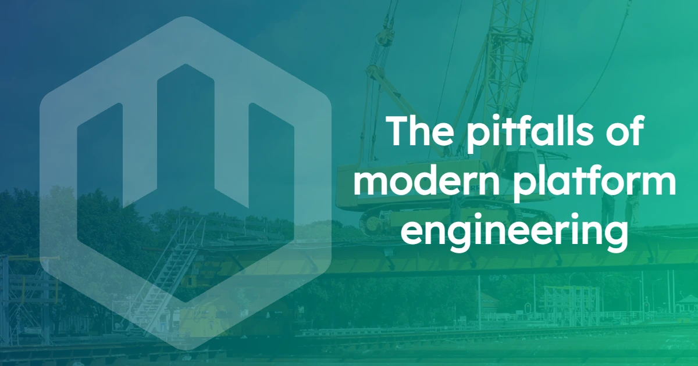
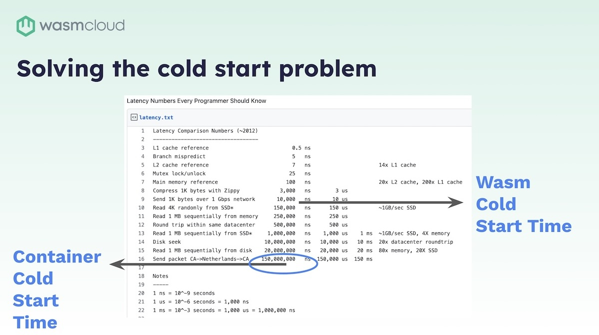
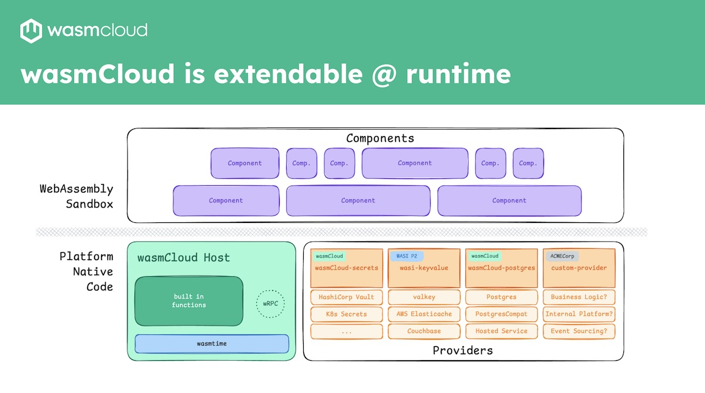

At wasmCloud Innovation Day, we had a chance to [reflect](https://wasmcloud.com/blog/2024-09-24-wasmcloud-innovation-day-2024-in-review) on the state of platform engineering within large companies—and the role WebAssembly has to play in evolving engineering methodologies. We gathered together the wasmCloud community of users, maintainers, and enterprise engineering teams to share advice and best practices when working with WebAssembly in industry.

The recordings are now being uploaded to YouTube, and we wanted to spotlight the most insightful sessions. To set the scene, Cosmonic CTO, Bytecode Alliance TSC director, and Wasm WG co-chair Bailey Hayes’s keynote is a perfect place to start. In her talk she looks at the costs and complexities faced by platform engineering teams building and running applications at scale.

<iframe width="1254" height="705" src="https://www.youtube.com/embed/PexRsU8sVIs" title="The Pitfalls of Modern Platform Engineering with Bailey Hayes" frameborder="0" allow="accelerometer; autoplay; clipboard-write; encrypted-media; gyroscope; picture-in-picture; web-share" referrerpolicy="strict-origin-when-cross-origin" allowfullscreen></iframe>

Bailey explains how using WebAssembly components as a unit of compute addresses long-standing challenges for platform engineers. Challenges such as the **complexity of maintaining application platforms**, and the **cost of maintaining application code**. One great example is the perennial **cold start problem**. She shows how a containerized application needs multiple containers on the go to address spikes in traffic while meeting standard latency expectations. Since components are able to start in milliseconds rather than the seconds required by containers, components face no such challenges. But the possibilities go further.

The beauty of components is that they can be **composed** so that communication between them happens in **nanoseconds**, rather than being constrained by network communication. Platform engineering teams can compose an application into a larger component that incorporates secrets, authentication, and other requirements that platform teams are on the hook for, giving them a transformative new paradigm.

As just one example of the sort of composable computing that can be achieved with wasmCloud, Bailey showcases a demo for a celestial and terrestrial mesh that we're building with a number of different agencies, all interested in running Wasm in space.

As an introduction to both the challenges faced by engineers in a host of sectors, and a comprehensive introduction to wasmCloud and the Wasm Component Model, this talk is unmissable.

Catch the recording above. We’ve also dropped in a handy summary of the topic areas Bailey covers, and you can find the **full transcript below**. We’d love to hear your thoughts and experiences—find us on [Slack](https://wasmcloud.slack.com/) and join the community.

## Topics covered

- [**Challenges in modern platform engineering**](/blog/2024-12-12-the-pitfalls-of-modern-platform-engineering#challenges-in-modern-platform-engineering): The complexity of maintaining application platforms; the limitations of Kubernetes, the burden of managing open-source dependencies, and the cost of maintaining application code to prevent vulnerabilities.

- [**Introduction to WebAssembly (Wasm) and wasmCloud**](/blog/2024-12-12-the-pitfalls-of-modern-platform-engineering#introduction-to-webassembly-wasm-and-wasmcloud): WebAssembly as the new unit of compute; how components compare to containers; and highlighting components' advantages, including how Wasm components are smaller, more secure by default, start in less than a millisecond, and are better suited at the edge. 

- [**Benefits of Wasm components and wasmCloud**](/blog/2024-12-12-the-pitfalls-of-modern-platform-engineering#benefits-of-wasm-components-and-wasmcloud): How communication between Wasm components can be faster than network requests, allowing for local compute on the edge. Why wasmCloud is the orchestration layer for Wasm applications, allowing the development of applications with composable building blocks, and their deployment across any device, cloud, or edge.

- [**Declarative application manifests and auto-scaling**](/blog/2024-12-12-the-pitfalls-of-modern-platform-engineering#declarative-application-manifests-and-auto-scaling): How wasmCloud uses a declarative application manifest similar to Docker Compose, allowing deployment across any device. How it is extendable at runtime and supports auto-scaling, load balancing, and failover, enhancing reliability and fault-tolerance.

- [**Polyglot development and composable computing**](/blog/2024-12-12-the-pitfalls-of-modern-platform-engineering#polyglot-development-and-composable-computing): How Wasm components support polyglot development, allowing applications written in different languages to work together. How they are isolated from each other, ensuring security and performance. WIT-defined interfaces and their importance.

- [**The platform harness pattern**](/blog/2024-12-12-the-pitfalls-of-modern-platform-engineering#the-platform-harness-pattern): How the platform harness pattern involves building a golden template for all applications. How this approach allows platform teams to manage and maintain a lifecycle separate from application developers. How composable computing enables distributed applications to run efficiently, improving performance and reducing costs.

- [**Adoption and future of Wasm**](/blog/2024-12-12-the-pitfalls-of-modern-platform-engineering#adoption-and-future-of-wasm): Where Wasm is already being used in various industries, including serverless edge computing, TVs, cameras, and video distribution. How Wasm is gaining traction in the cloud-native landscape, offering a last plugin model for distributed computing. And, how wasmCloud is the tool for enterprises to adopt Wasm, enabling them to leverage its benefits.

Video Transcript

### Transcript

**Speakers**

Bailey Hayes, Brooks Townsend

**Brooks Townsend**

Without further ado, I'd like to introduce Bailey Hayes, who is a Technical Steering Committee Director at the Bytecode Alliance, WASI sub-group chair, and Cosmonic CTO. Bailey, take it away.

**Bailey Hayes**

Thank you. Brooks, glad to be here. Really excited to see so many faces joining us for the first time with wasmCloud. I wanted to start the day off by talking about some of the problems that we're looking to solve with wasmCloud, and that begins with some of the pitfalls in modern platform engineering.

To start, we need to define platform engineering. So, platform engineering as a practice really began during the containerization era and epoch of compute, where first we started with microservices, bundled those into VMs that allowed us to build out data centers, and eventually moved to the public cloud. But really there was this major paradigm shift that happened when we were able to package our applications into a container and then orchestrate those containers with Kubernetes.

That allowed infrastructure teams to evolve to be part of the team that's providing a platform and giving common application services like capabilities from Secrets management to authentication and authorization that then application developers are able to build on top of. Really, this was a massive improvement in our productivity and the types of things that we're able to build, but it does come with some pretty big problems, namely that applications today are just too expensive to build, maintain, and run.

### Challenges in modern platform engineering

That really starts with the initial application language choice, and the template that we build for all of our different apps across enterprises. We are tied into specific clients and frameworks that are part of and built for that language, and we have to maintain these apps on an app-by-app basis. Platform engineering teams are usually on the hook for the application platform layer&mdash;that's all of the authentication, observability, maybe even artifact registry, secrets, common storage layer, messaging and more types of capabilities. For the application platform team to be able to evolve their platform&mdash;if they are trying to make a new API level change or moving to a new major version&mdash;application developers have to update their dependencies.

But they're not just revving for being able to evolve the platform. They're revving because most of our application code is not our code. It's full of open source code, which is actually a great thing. It's amazing that we're able to do this, however, that comes with a significant cost and burden on maintaining your application code to prevent vulnerabilities. And so, both by having boilerplate code for your platform and for open source dependencies, we're constantly churning on this application like a hamster wheel of building apps, and we don't really have an easy way to wrangle that problem.

Now, on the running and deployment side, platform engineering teams are stuck managing these very expensive platforms. Typically, it's built on top of Kubernetes today&mdash;the orchestration layer&mdash;and it really lacks portability, because it doesn't allow us to run in many different types of environments, like on the edge. So throughout this platform evolution that we've seen moving through the public era, including containers as part of that era, but that being the major paradigm shift. I believe that today, we are now in a new componentization era, where our next distributed unit of compute is the WebAssembly component, orchestrated by wasmCloud.

### Introduction to WebAssembly (Wasm) and wasmCloud

So, let's take a step back and just do a kind of a basic comparison between Wasm and containers. You can think of Wasm as perhaps a tiny VM. So this type of direct comparison works. Okay. Containers themselves are much larger. They're usually on the order of megabytes to gigabytes, whereas a WebAssembly component is kilobytes or megabytes. WebAssembly components themselves are secure by default. For containers, we have to add a number of processes, best practices and tools to get them to a place where they are secure and provide the right level of isolation, but they're still not generally considered the right choice when you're trying to run arbitrary user code, and certainly not on a user's device.

Now the other difference here, while containers give us much more new layers of portability, those images are still CPU architecture-bound, whereas WebAssembly components&mdash;the `.wasm` file&mdash;doesn't need to change for any different environment, so long as that environment has a WebAssembly runtime for it. But perhaps the most important difference between containers and components is that containers start in seconds, whereas WebAssembly components start in less than a millisecond. And that really enables WebAssembly components to solve this major problem that we have in the industry&mdash;and that is it solves the cold start problem.

Containers, because they take several seconds to start, they have to effectively keep a pilot light on. They have to keep many different containers running, even though they're not necessarily servicing any requests, because when you get a burst of requests, it takes seconds to scale out, and your response time that a typical user expects is less than a second. So you can't wait on a new container to spin up. Compare that with a WebAssembly component. This list of numbers here, these are numbers that every programmer should know. You've probably seen this set of numbers before, but I think it's really important to highlight where WebAssembly components fit into this latency story.

WebAssembly components, because they start in less than a millisecond, it means that it's so much faster than even making a network request. And so you're going to see new types of architectures evolve because of this new layer that WebAssembly components fit in. Why make a network request to somewhere else when you can be running that compute on the edge next to the user?

### Benefits of Wasm components and wasmCloud

Now, with every new unit of compute, every new thing that we're distributing around, you need a new orchestration layer for that, and that's what wasmCloud is. It's Wasm-native orchestration. It allows you to deploy and manage your Wasm applications across any device, cloud or edge, including your own. When we're building a WebAssembly component, you get a new way of simplifying the way that developers need to build, because you're able to reuse your logic with essentially composable building blocks, and that lets you eliminate boilerplate from your code. wasmCloud lets platform engineers build a component that slots in that the application developers themselves don't have to manage.

One thing I really want to highlight here is that Wasm-native also works with cloud native; it has all of the existing cloud native technology integrations that you would expect. A common deployment strategy for wasmCloud actually is to be able to run on Kubernetes and orchestrate your applications with wasmCloud. When we compose applications, we're doing that in wasmCloud with open standards and common interfaces for platform capabilities. These can be swapped at runtime, allowing you to do upgrades for maintenance, or even changing out the vendor entirely. Because these APIs are at a high level, they're vendor-agnostic.

We also allow you to write your own custom capabilities and interfaces, and we've had an amazing amount of success&mdash;we'll be doing later deep dives on our integrations with Postgres and Couchbase.

### Declarative application manifests and auto-scaling

One thing to understand when we're talking about building apps for wasmCloud is that we have a declarative application manifest. You might later today hear the word "wadm"&mdash;that's what we're talking about there: the WebAssembly Application Deployment Manifest. And you can just think of that as like a Docker Compose file, but for Wasm. When we run WebAssembly applications in a deployment, we allow you to run that across any device, server, or cloud.

This is something that's very, very different from other types of application architectures. It allows you to have a seamless distributed network that automatically load-balances and fails over to available compute. We support vertical and horizontal autoscaling with automatic failover, allowing you to reach this new level of reliability and fault-tolerant applications. Another added benefit here is that we do all of this routing locally first. So, if you're working in one region and there is a type of capability that's closer to you, we route to that first before reaching over across a different region.

In this scenario, we're talking about orchestrating Wasm applications. You know that Kubernetes is a container orchestrator, so you can at least think of wasmCloud as Kubernetes, but for Wasm.

Another major feature of wasmCloud is that it's extendable at runtime. This is effectively a view of our stack for wasmCloud, where we support WebAssembly components that run in a Wasm sandbox. We have our Wasm host, which embeds a WebAssembly runtime called wasmtime, and then we have many different capability providers that are extendable at runtime.

A single WebAssembly component has things that are called imports and exports. These are basically APIs for imports. These are the things that my component needs to run, and my exports are the things that my component provides. So in this case, I may be getting many different secure capabilities that are built into my host. These are often the WASI APIs that you see, and I can also import from extendable capabilities that can be swapped at runtime.

Another amazing feature is that WebAssembly components themselves can build on top of each other, just like Lego blocks. And in this case, I can have one component who imports (AKA depends on) another component that exports an interface that it needs to run. So you might be thinking, "Why components? We already have containers. We have had amazing success with containers. So why do we need to go back to the drawing board on our fundamental piece of compute?" And really, I think that part of the problem is the way that we manage.

### Polyglot development and composable computing

With containers, we're bringing in the whole world, whereas with WebAssembly components, we get down to exactly your business logic that is bundled into the app. And when we start back from first principles, we know that we need to use applications that are written in many different languages. We need to be able to support polyglot and so we're able to do that with WebAssembly components, where one component written in Rust and another component written in Go can compose together and communicate over interfaces that are designed so that we can do interface-driven development.

And they are also shared nothing leaks, so each component is actually still isolated from each other. Now you would think that, with this level of isolation, there would be this massive performance cost, but that's really not the case, going back to our latency numbers. Now imagine two components that are composed together, in that case, they're actually able to run in the same process, which means when I communicate across that boundary, it happens in nanoseconds. And that is a major difference and a game-changer.

Now the way that we define these interfaces is with an IDL called WIT (Wasm Interface Types). It gives us some new capabilities that we don't have in OpenAPI or other IDL-type technologies, and that really comes down to the interface types that we get out of the WebAssembly component model. Namely things like resources and streams that give us the ability to manage the lifetime and lifecycle of components as they're composed together, and in wasmCloud as they're distributed over the network. Later on, Brooks Townsend is going to give a deep dive on how we're able to use resources in a way that solves privacy and security concerns with our secrets.

### The platform harness pattern

More than anything, by using WebAssembly components as our primary unit of compute, we can see emerging types of patterns that are going to help platform engineering teams solve major problems that they're experiencing today. And I believe it's with the platform harness pattern. We're seeing that across many different enterprises that are adopting Wasm code, where essentially they're building a golden template that all of their applications are able to compose with so that they create a single component that isolates and I would say, wraps, effectively, all of the different logic that they need to be able to get; their authentication, their secrets. All of the basic things that platform engineering teams are on the hook to provide, but they have the benefit of managing that themselves and maintaining a lifecycle separate from the application developers component that just composes their app.

And, once this application component is composed together, you can see that it doesn't expose those imports. It can now just run with the basic standard APIs. So what that gets us to is composable computing that can be distributed across the core in the data center, across edges and clouds, and that's going to be a very powerful change in our industry. 

So to give you a taste of the art of the possible, I'm going to give you a demonstration of a celestial and terrestrial mesh.

### Example: Celestial and terrestrial mesh

This is something that we are building in partnership with a number of different agencies that are interested in running WebAssembly in space. What I'm showing here on the screen is a world map with different data centers deployed in Azure and their connectivity over the internet. The job of this application is to identify whether or not something is a boat. 

So it's doing image classification. Once I upload an image, imagine some satellite has just taken this photo, and I need to image classify whether or not this was actually a ship. In this case, it decided that it was not a ship.

So my prompt engineering here isn't amazing. It's pretty simple. Okay, this one is a ship. Let's do something else. Let's go right back up. Let me give it something that is definitely not a ship. And this is a member of our team. His name is Oscar, and he is not a boat&mdash;that is Oscar. And we'll do just one more boat before we're done, just so I can know that here's a boat that one's actually an AI generated boat, but it's real enough for an image classification system. So we'll dive a little bit more into the different pieces and parts that make this app real, from the different capability providers as part of it. But I wanted to go ahead and introduce you to the use case.

This is a different view of showing, essentially, that global view that I showed a second ago, where we have a distributed compute mesh. The use cases for this that we're seeing are actively growing, and today's methodologies just can't achieve it. Kubernetes itself and containers are not well suited for running in embedded devices on the edge, whereas WebAssembly is fantastic for that use case, and composing all of this together with the right enterprise-ready security and compliance controls, it makes wasmCloud ready for organizations to adopt.

### Adoption and future of Wasm

Now, you might be thinking this is new to you, but I just want you to let you know that this technology has actually already won. We're seeing it from Fastly and Cloudflare for serverless edge computing. It's in your TV. It's probably in my camera right now. It is definitely in Zoom that we're running. It is the way that we distribute our videos from Prime Video, Disney Plus, etc. It is taking over the cloud native landscape by storm as being the last plugin model that you'll ever need. So that means that Wasm has taken over the industry, and you're using it everywhere. The future is here. It's just not evenly distributed. So I hope today you'll learn how wasmCloud is the ‘picks and shovels’ that you need to bring Wasm into your enterprise. Thank you.

