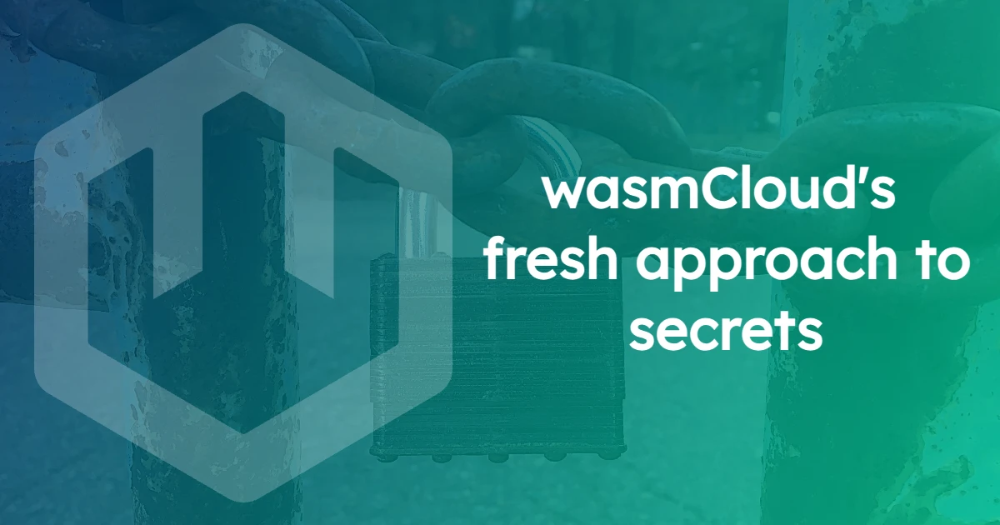
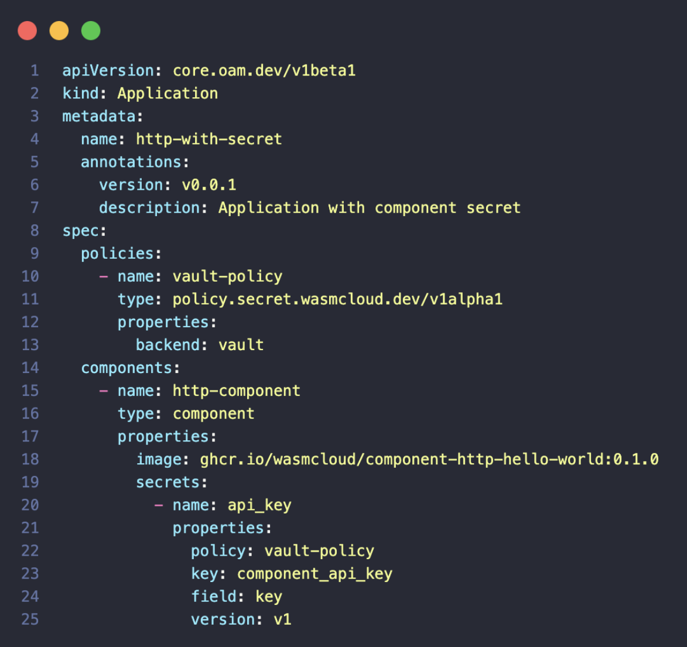
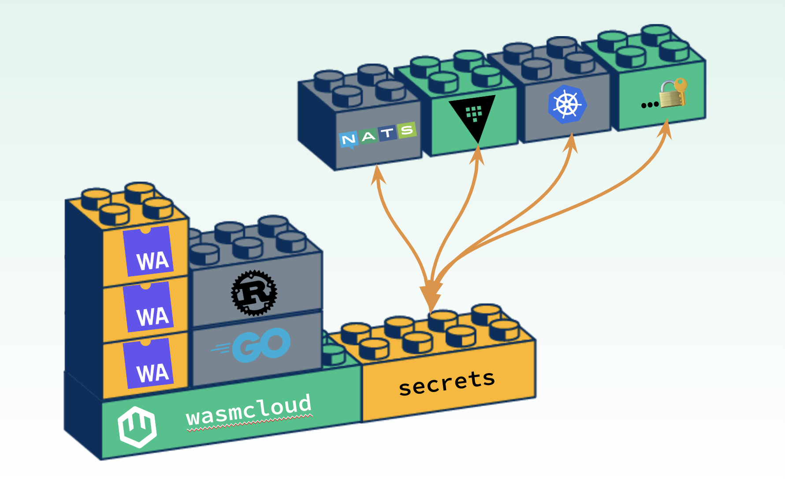
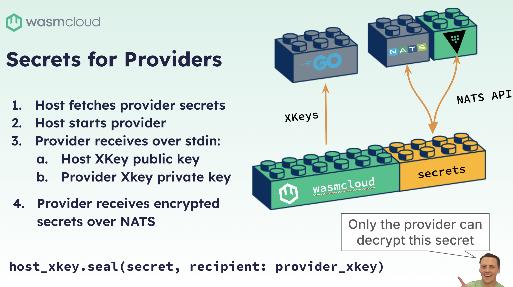
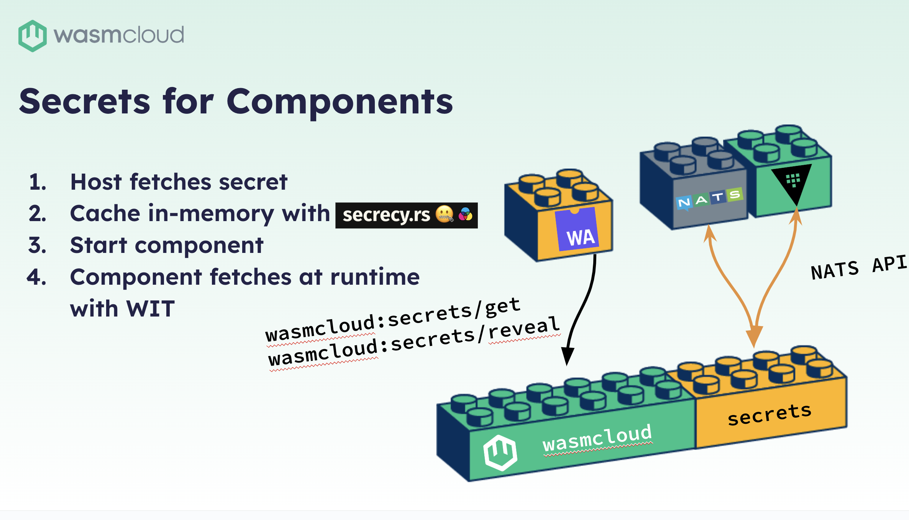

Secrets are a must-have feature for enterprise users. In his Innovation Day 2024 talk, wasmCloud maintainer Brooks Townsend takes us through the challenges that secrets pose in cloud native environments, and how wasmCloud maintainers have developed an approach to tackle these problems.

<iframe width="560" height="315" src="https://www.youtube.com/embed/vFuMf_Mn-bo?si=dKCmktev0Z3Ua0uT" title="CNCF wasmCloud Secret Provider with Brooks Townsend" frameborder="0" allow="accelerometer; autoplay; clipboard-write; encrypted-media; gyroscope; picture-in-picture; web-share" referrerpolicy="strict-origin-when-cross-origin" allowfullscreen></iframe>

Enterprise organizations rely heavily on secrets to protect sensitive data and systems against unauthorized breaches. Robust secrets management is crucial for good reason; a [2023 Sophos report](https://news.sophos.com/en-us/2023/08/23/active-adversary-for-tech-leaders/) found that compromised credentials are the root cause of 50% of malicious attacks.

Common practices see secrets handled centrally, with encryption, access controls, and audit logs tightly controlling usage. This works perfectly where compute happens in a single, simple environment. But it’s complex and difficult to do in distributed architectures, where secrets may be stored across multiple servers and locations. Also, as systems and secrets proliferate, it becomes increasingly difficult to manage secrets at scale.

In his Innovation Day talk, wasmCloud maintainer and Cosmonic Senior Engineer Brooks Townsend walks through the [secrets support in wasmCloud](https://wasmcloud.com/blog/secure-pluggable-webassembly-secrets-with-vault-k8s-secrets). He explains how wasmCloud's approach to secrets opens the door to new possibilities for developers.

wasmCloud secrets are unique in that they are [resources](https://component-model.bytecodealliance.org/design/wit.html#resources) revealed just-in-time, so sensitive data can be passed around freely between applications. Think user credentials or data covered by HIPAA. Brooks discusses how wasmCloud's flexible support for different secrets backends lets teams use (and swap out) the secret store of their choice.

## How secrets work in wasmCloud

As Brooks describes, we wanted a [better approach](https://github.com/wasmCloud/wasmCloud/blob/main/adr/0019-secrets.md) to the status quo. One that leverages the NATS-powered lattice to deliver true encryption, and avoids storing secrets on the [wasmCloud host](/docs/concepts/hosts) in any form that would be accessible to anything other than the component or provider requesting them.

We also wanted our secret system to be **pluggable**, so teams could use the secret store of their choice, whether that was HashiCorp Vault, cloud provider systems like AWS Secrets Manager, an in-house solution, or an open source store.

To achieve this, we came up with an [architecture](https://github.com/wasmCloud/wasmCloud/issues/2190) that organizes secret requests and responses into a few key steps:

- A component or capability provider **requests a secret** by reference to a secret's location in the secret store, without needing to present credential material.

- The request goes to a **secrets handler** which in turn requests the specified secret from the appropriate **secrets backend**.

- Communication with a **secrets store** is mediated by a **secrets backend**.

Check out the recording above for the deep dive. We’ve dropped in the major themes covered below with the full talk transcript.

## Topics covered

- [**Introduction to secret support in wasmCloud**](/blog/2024-12-17-wasmclouds-fresh-approach-to-secrets#introduction-to-secret-support-in-wasmcloud): The importance of fetching and using secrets at runtime, encrypted both in transit and at rest. The design of wasmCloud secrets, decoupled from any specific solution, pluggable API over NATS.

- [**The wasmCloud secrets interface**](/blog/2024-12-17-wasmclouds-fresh-approach-to-secrets#the-wasmcloud-secrets-interface): A deep dive into the design of the wasmCloud secrets interface and the pluggable secrets API over NATS. Important updates to application manifests and command-line tools, and the role of the host plugin in supporting multiple secrets backends.

- [**Encryption and key management in wasmCloud**](/blog/2024-12-17-wasmclouds-fresh-approach-to-secrets#encryption-and-key-management-in-wasmcloud): How NATS xkeys are used for encryption, providing strong cryptography that can be inexpensively generated on the fly. How the NATS API supports a request for the public key, and a GET endpoint for secret requests, ensuring encryption in transit.

- [**Capability providers and component secret fetching**](/blog/2024-12-17-wasmclouds-fresh-approach-to-secrets#capability-providers-and-component-secret-fetching): How capability providers fetch secrets via a host request to a secrets backend. How the backend analyzes the request and sends the secret encrypted over NATS, with the host and provider managing key pairs for decryption. For components, the secret is cached in memory and accessed via the wasmCloud secrets interface.

- [**Community collaboration and the secrets WIT interface**](/blog/2024-12-17-wasmclouds-fresh-approach-to-secrets#community-collaboration-and-the-secrets-wit-interface): The meticulous design of the wasmCloud secrets interface, with input from community champions within the wasmCloud ecosystem. How the interface allows secrets to be fetched as opaque pointers, preventing the secret value from being loaded into memory. Secrets are passed between components and providers without revealing their value.

- [**Further reading**](/blog/2024-12-17-wasmclouds-fresh-approach-to-secrets#further-reading): Discussion of useful resources like our [secrets documentation](https://wasmcloud.com/docs/concepts/secrets).

## Transcript

**Speaker: Brooks Townsend**

### Introduction to secret support in wasmCloud

I have the pleasure of walking through the most requested feature on our wasmCloud roadmap: wasmCloud application secret support. Specifically, wasmCloud applications needed to be able to fetch and use secrets at runtime that are encrypted in transit and at rest. And, as we proposed the design of secrets, it was critical that we approached adding secrets as an extendable layer and not tightly-coupled to wasmCloud, or to any particular solution.

It was also important to design this in a components-native way, with a standard interface so that it can be used in any language that supports WebAssembly components. We knew that we would provide an API as a collection of functions and types that developers could import into their code, and write business logic in terms of secrets. Of course, this would also need to work just as globally and distributedly as wasmCloud does. So what is our solution?

### The wasmCloud secrets interface

We designed the wasmCloud secrets WebAssembly interface&mdash;the pluggable secrets API over NATS&mdash;and we started implementing secrets back ends or reference implementations. At the same time, we pushed updates to our application specification wadm, and command-line tools, to support managing secrets in wasmCloud apps. On the right you can see an example application. This is how it actually works today in a wasmCloud app. It uses a policy to instruct wasmCloud how it can pull a secret at runtime, and then how the secret is specified in Vault down at the level of a component.

So, I want to show a couple of diagrams and talk through how this actually works in the wasmCloud ecosystem. At runtime, wasmCloud is responsible for orchestrating WebAssembly components and capability providers&mdash;also called native plugins. Secrets is actually a built-in host plugin that's configured as soon as wasmCloud starts and is immediately ready to support multiple secrets backends, based on what applications declare in their manifest. Secrets backends are responsible for encrypting and storing the secret, which we know current secret solutions (like cloud providers, specific key stores, or Hashicorp Vault) are very good at.

### Encryption and key management in wasmCloud

wasmCloud is responsible for making sure that all secrets are encrypted in transit as they're fetched from the back end. We use NATS xkeys for this which are elliptic curve key pairs that provide strong cryptography, and are actually very inexpensive to generate on-the-fly at runtime. So, supporting this NATS API&mdash;which is how this secret solution is extendable and pluggable for wasmCloud, and how we don't tightly-couple to a particular solution&mdash;is using the NATS API, and supporting this is very simple.

You supply a subject to wasmCloud when the host starts, and then your backend pluggable layer just needs to support two endpoints. The first one is just a request for the public key that the server is going to use to encrypt secrets in transit. This is just returning the actual key that the backend is going to use. The second and important one is an endpoint called GET, which is used to send the context of an entire secret request. In effect, what secret needs to be fetched? What component is fetching it? What host is fetching it? What application does the component belong to? Then the backend can make a decision based on that&mdash;or based on an external policy&mdash;to return the secret or an error response.

### Capability providers and component secret fetching

Now this is, of course, going to be encrypted in transit. And every single time that this GET function is invoked, we generate a unique request xkey which prevents replay attacks, even if the NATS network itself for wasmCloud is compromised. It’s very important to know here that all secret fetching in wasmCloud is facilitated by the host itself. No components or capability providers actually fetch secrets on their own. They are just handed secret values. This actually works a little bit differently for providers and components. Let's go through both scenarios.

**Capability Providers**

You have an application that specifies a capability provider and it requires a secret. `wadm` tells wasmCloud to start the capability provider as a part of deploying your application. So wasmCloud sees the specification that you've laid out for the secret, and it will send a request to the secrets backend that you have configured with the context of the provider. The backend will then analyze that request, and then allow the secret to be sent back, encrypted over NATS. Then the host will actually start the provider along with two opposite pieces of a key pair.

The provider receives the host public key and its own private key to use for secret decryption, and the host stores the host private key and the provider’s public key for encryption later. This ensures that this individual capability provider and only this instance of the provider can decrypt secrets sent by the host. If the provider or host is restarted, those keys are completely discarded and generated new, if it starts again.

I included a little code sample here at the bottom, and this is almost exactly the line of code that we have in our host to do this encryption. But using the private key from the host, you can then seal or encrypt a secret value and specifically target that for that recipient, which is the provider's public key. So this is a very nice asymmetric encryption algorithm.

**Components**

Now, for components this is a little bit different, but most of the entire process for fetching secrets is exactly the same. So when the component starts, if there's a dependency on a secret, or the component specifies a secret, wasmCloud will request it from the backend. Since components are running alongside the host, there is no need to transmit that secret over the wire. We actually just cache that in-memory with the secret, which ensures that it is zeroed out from memory as soon as the component stops. And then the component itself is able to access these secrets at runtime with the wasmCloud secrets interface.

### Community collaboration and the secrets WIT interface

The two functions GET and reveal are actually built into the host. This is a built-in plugin. This is a key piece of innovation in the secret solution; making sure that we have encryption and decryption handled correctly is the secrets WIT interface. This was meticulously designed. We collaborated with several folks in our community and champions within WASI land on the final design of this interface. The end result is something that's really simple to use, but it’s key WebAssembly innovation that makes it special.

The secret itself is initially fetched with the GET function as a resource, which is actually an opaque pointer to the actual secret value. So, when the component calls GET we don't actually load that secret into the component’s memory. You can pass that secret around with other WIT interfaces that are designed with this secret type. You can pass a secret from component to component, from component to provider, without ever revealing that value in memory. Finally, secrets are actually entirely encrypted the entire way in transit and at rest, all the way up until a component or a provider reveals it.

This implication here around the usability is nice, but the real huge benefit is for platform teams, especially at enterprises, where secrets need to be part of applications that aren't just like API keys or a token or a password, but they're sensitive data that should only be revealed under very strict circumstances. Customer data, PII/HIPAA data, payment information; all of that can now be sent all the way through a chain of applications without ever being revealed. You can process that without seeing the secret itself, without ever actually loading the secret into memory. It's very impressive. I'm very proud of this part. Again, we designed this with the other members of the WASI community, and the hope is to contribute this upstream as a WASI secrets interface as a Phase One proposal as soon as we can.

### Further reading

All in all, you can see my excitement boiling over. I am incredibly proud of the secrets implementation and what our maintainers and community contributors were able to put together for this implementation for wasmCloud, and I'm very excited to see all the use cases and implementations come to life. If you are interested in using secrets in a wasmCloud app, please check out our [secrets documentation](https://wasmcloud.com/docs/concepts/secrets). The link is up at the top, but if you just go to wasmcloud.com and search for secrets, there is great information about how to import the WIT, how to add secrets to your custom providers, and how to connect to your own secrets backend. 

That is all that I have for the deep dive in secrets. Anybody watching, if you're on YouTube or in the webinar itself, please feel free to put in questions in the Q&A and I can get to them as I come off here.
