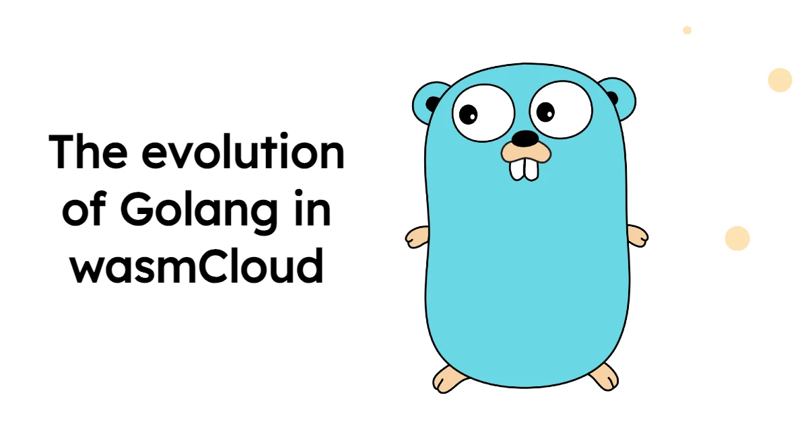
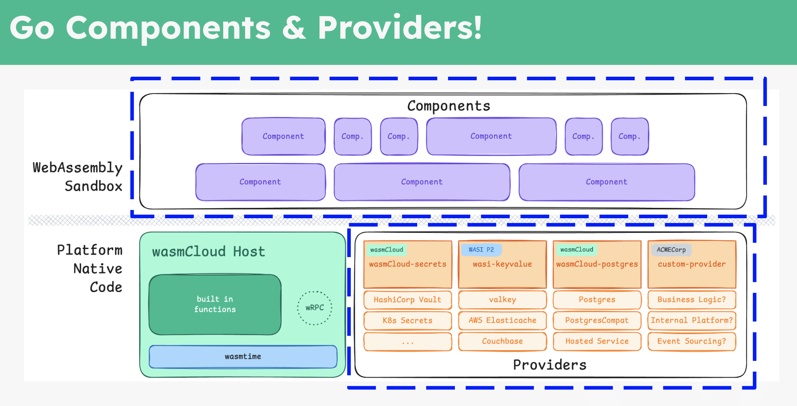
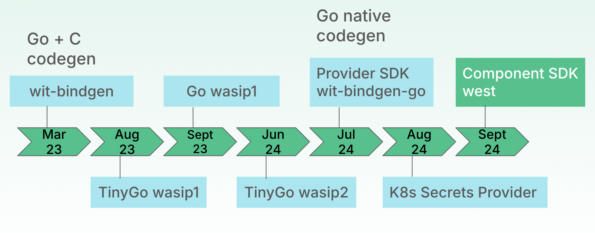
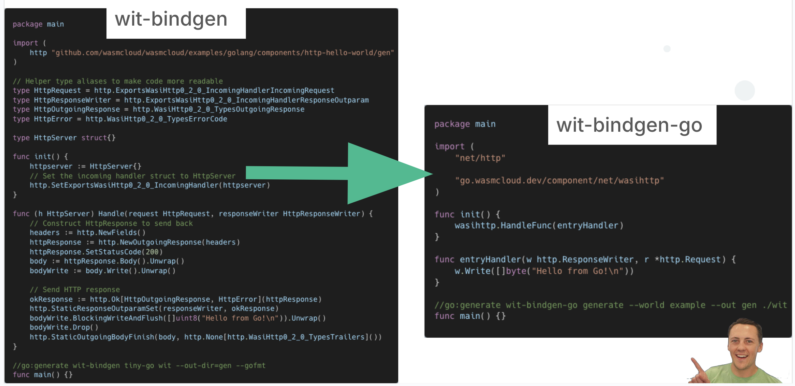
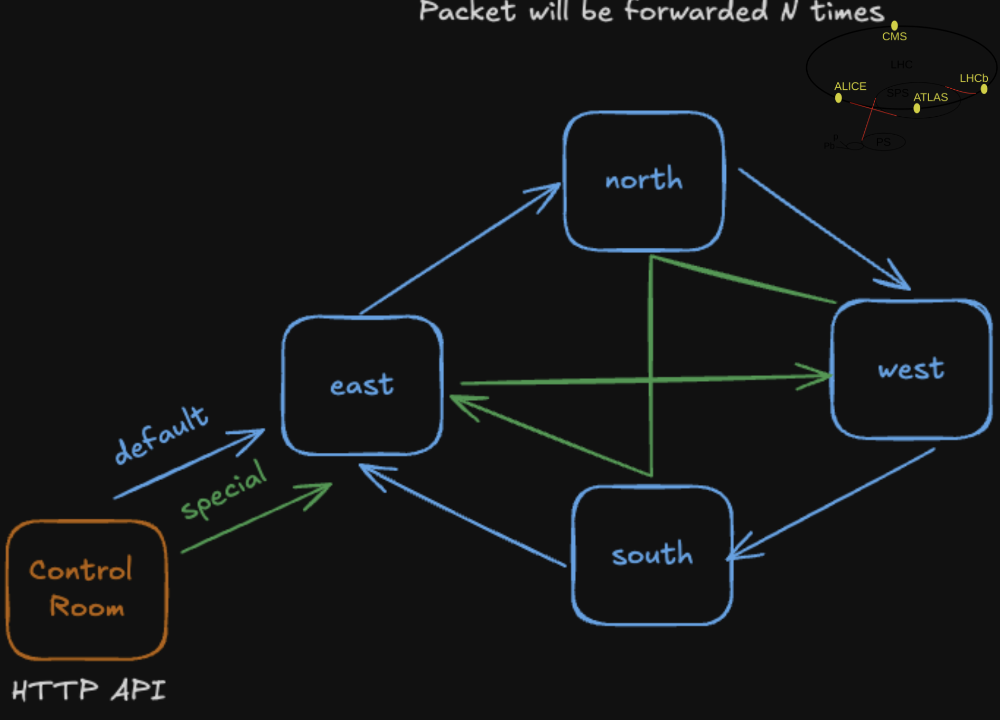
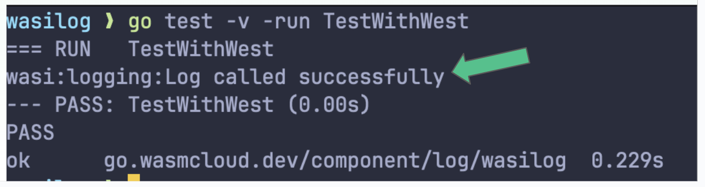

The [Go](https://go.dev/)-based WebAssembly component development experience has advanced in leaps and bounds this year, including [TinyGo's ability to compile idiomatic Go to components](https://wasmcloud.com/blog/compile-go-directly-to-webassembly-components-with-tinygo-and-wasi-p2). In his Innovation Day talk, [Lucas Fontes](https://github.com/lxfontes) walked through these developments and more, showing how wasmCloud SDKs for Go-based components and providers make it easier than ever to build wasmCloud applications with Go. The complete presentation is [available to watch on YouTube](https://www.youtube.com/watch?v=gQudwr7Pg-g), and we've provided a summary and transcript below.

<iframe width="560" height="315" src="https://www.youtube.com/embed/gQudwr7Pg-g?si=FoCXbdqz0Joua6PG" title="YouTube video player" frameborder="0" allow="accelerometer; autoplay; clipboard-write; encrypted-media; gyroscope; picture-in-picture; web-share" referrerpolicy="strict-origin-when-cross-origin" allowfullscreen></iframe>

So what are the wasmCloud Go SDKs?

* The **Go component SDK** is a brand new, optional framework that enables developers to write Go-based **components** without ever thinking about bindings to WASI interfaces&mdash;especially useful when writing HTTP-centric apps. You can check out [the Go component SDK on GitHub](https://github.com/wasmCloud/go/tree/main/component#readme).

* For developers who want to write a **custom capability provider** in Go, the **Go provider SDK** makes that easy. This enables Go developers to write an executable plugin that can communicate over WIT interfaces and handle more stateful activities for wasmCloud applications. [Check out the Go provider SDK on GitHub](https://github.com/wasmCloud/provider-sdk-go).

In addition to the SDKs, Lucas showed off a new **Go framework that supports testing WebAssembly components written in Go**. Traditionally, testing components has been a bit difficult since tools like `go test` don't account for component interfaces. With this new framework, tests interact with the Wasmtime WebAssembly runtime used by wasmCloud but allow developers to stub interfaces and ensure complete coverage. You can try an [early version on GitHub](https://github.com/wasmCloud/wadge).

:::warning[west is now wadge]
Fast-moving projects often start under working titles&mdash;since Lucas' presentation, the Go framework that he calls `west` in the original presentation has been renamed to `wadge`&mdash;both to distinguish it from existing projects and to emphasize its nature as a **bridging framework**, useful for but not limited to testing. 

For currency and clarity's sake, we've replaced "west" with "wadge" in brackets when Lucas mentions it in the transcript, but when you refer to the video or screengrabs, just know that "west" is the old name for the framework now known as "wadge". 
:::

The Go-Wasm ecosystem is moving quickly. To stay up-to-date with the latest developments, keep an eye on the [`wasmcloud/go` repository](https://github.com/wasmcloud/go) where we collect wasmCloud Go ecosystem libraries and tooling. You can read more about creating and deploying WebAssembly components with Go and wasmCloud in the [Go section of the wasmCloud documentation](/docs/developer/languages/go/components).

## Topics covered

- [**The history of Golang and WebAssembly**](/blog/2024-12-20-the-evolution-of-golang-in-wasmcloud#the-history-of-golang-and-webassembly): An initial approach using C code generation; implementation of the WASI P1 spec in TinyGo.

- [**Advancements in WebAssembly specifications and implementations**](/blog/2024-12-20-the-evolution-of-golang-in-wasmcloud#advancements-in-webassembly-specifications-and-implementations): Implementation of the WASI P2 spec in TinyGo; release of the provider SDK and Go bindgen.

- [**Implementation of Kubernetes secret provider in Go**](/blog/2024-12-20-the-evolution-of-golang-in-wasmcloud#implementation-of-kubernetes-secret-provider-in-go): How implementing the Kubernetes secret provider in Go demonstrated the flexibility of using different languages for provider creation.

- [**Introduction of component SDK**](/blog/2024-12-20-the-evolution-of-golang-in-wasmcloud#introduction-of-component-sdk): How the Go component SDK and new bridging/testing framework abstract the complexity of WASI interfaces and provide standard library constructs in Go. 

- [**Demonstration of Large Wasm Collider**](/blog/2024-12-20-the-evolution-of-golang-in-wasmcloud#demonstration-of-large-wasm-collider): Demo looping packets through a system of five wasmCloud hosts, demonstrating the seamless integration of wasmCloud components.

- [**Code walkthrough and component linking**](/blog/2024-12-20-the-evolution-of-golang-in-wasmcloud#code-walkthrough-and-component-linking): Lucas illustrates the integration of HTTP handlers and wasmCloud components, then  introduces chaos into the system to simulate failures and observe wasmCloud's reaction.

- [**Testing with &lsqb;wadge&rsqb;**](/blog/2024-12-20-the-evolution-of-golang-in-wasmcloud#testing-with-wadge): Lucas explains the challenges of testing when building components and how the wadge framework helps to overcome those challenges.

- [**Wrap-up and resources**](/blog/2024-12-20-the-evolution-of-golang-in-wasmcloud#wrap-up-and-resources): Lucas recaps the key points of the discussion, emphasizing the importance of bindgen-go and the component SDK for generating Wasm interfaces and abstracting complexities.

## Transcript

**Speaker: Lucas Fontes**

### The history of Golang and WebAssembly

Hi, everyone. My name is Lucas Fontes. I'm an engineer here with the Cosmonic team working on wasmCloud, and focused on infrastructure Golang; a bit of the framework story there. Today I want to talk a bit about the evolution of Golang and Wasm together. And what I'm going to cover here has to do with providers and also components. This is how you create your providers and components, using Go and integrating that with wasmCloud. So pretty much these two boxes here.

The story between WASI and Golang started about a year and a half ago with the first inception of wit-bindgen. And what this was, it gets your interface types and generates Go code so you can write your servers, your microservices and things like that, using just vanilla Go. But the challenge with that approach is you’re always generating C code to go together with your Go code. It was a way to get started in the ecosystem. But we knew from the beginning it was not sustainable.

### Advancements in WebAssembly specifications and implementations

Around August 23, TinyGo&mdash;another Go runtime focused on smaller environments and embedded systems&mdash;implemented what we call the Preview 1 (P1) specification. The P1 spec was first landed in TinyGo with a fast-forward landing in ‘big’ Go on September 23; this was great. This was the first time that we were able to get components in Go running inside a WebAssembly runtime. But then, come February 24 we saw this was evolving.

We saw the WASI Preview 2 (WASI 0.2) being born around that time and we had to get Go literally running with WASI 0.2 and, in order to do that, we focused on our TinyGo implementation. Getting that inside TinyGo is easier than getting that in ‘big’ Go. It moves faster, the community is responsive, the developers are awesome. And with that, we got WASI 0.2 which was a change in the underlying implementation of how those binaries are generated in TinyGo. This gave us the opportunity to implement a wit-bindgen in Go that got rid of all that C code, which was problematic at the beginning.

In July 24, we were able to release the provider SDK, which allows you to generate your capability providers in wasmCloud, and also the wit-bindgen-go, which generates interface bindings in Go, without any C code. 

### Implementation of Kubernetes secret provider in Go

In August 24, about a month later, we had the Kubernetes secret provider also being implemented in Go. This came with the realization that the Go libraries for Kubernetes are pretty much all built on top of Go. So it was a pretty good implementation story there. With this, we had the initial implementation of secrets backends using NATS with Rust and Kubernetes, in Go. This also proves that we can be using any language here to create the providers, components, and also the secrets backends. 

### Introduction of component SDK

Now, on September 24, we want to talk about a component SDK and also about &lsqb;wadge&rsqb;, which is how you test your components in Go. Why do we need an SDK here? The initial codegen that I was talking about, that generates go and C code, generates the types, the structs, the functions which are very verbose, and this calls into C APIs, and is very low level.

In reality, what we want to do is write Go code that is more idiomatic. You want to write an HTTP server or a handler, you want a round tripper; you don't want to be called inside WASI interfaces all the time. So the component SDK is abstracting this communication and giving you standard library constructs that you are familiar with. On the left here, you can see the code that will generate the initial bindgen. And, on the right, we're seeing what is possible once we have the codegen in Go and also the component SDK. It's essentially a regular web server in Go, and Brooks approves, which is a good thing.

Why an SDK? What we are doing here is providing abstractions on top of WASI and converting that to the standard library. It's completely optional, and you don't need to use it if you don't want to, but we highly recommend it so you can get started quicker and also use more of your usual tools. For example, we do have `wasi-logging`, but in Go, you're used to writing your logs using `slog`. So what we have is a `slog` adapter that, once you use it, uses `wasi-logging` underneath.

### Demonstration of Large Wasm Collider

I want to just show here what these components look like in a mini demo. And we're calling it the Large Wasm Collider. And sorry to disappoint everybody, this is not the Large Hadron Collider, but we will also make some packets bump into each other. Here on the top right, we have kind of a view of the real Large Hadron Collider. And what is going on there is you have a control room, a control center, injecting a particle into loops, and those particles will be looping inside this large ring.

What we have in here, using wasmCloud, is five wasmCloud hosts where one of them is a control room and it injects a packet (like a particle) inside the system. And this is all using components. Once we inject a particle into the system, it's going to be looping in one of those two arrows, either through a regular path or through a special path. 

The interesting thing here is there is no actual RPC code telling it go to this IP or go to this port or ENCODE. Use JSON or gRPC, you are literally programming as if you were interacting with a library, but your calls are being sent to a remote host and you don't need to do anything for that to happen. You get free instrumentation and observability of your system with that.

So gonna swap here quickly. How does this look like? Again, we're injecting packets here, and things will be looping. We have two routes, one that is the default, one that is the special. And once we inject packets, we want to know in each one of these points for how long the packet has been going around the system. And in here we see each one of those packets that are being injected with their defined ID. We can see how long they took to go through each one of those hops, how many of those calls are failing, are succeeding, latency logs, all these things are being given to you by the platform, just by writing your basic HTTP server or component. 

### Code walkthrough and component linking

And to take a look at what that actually looks like, this is the entire code for the system that simulates this Large Hadron Collider. We have a blast handler here, which is a regular HTTP handler. We receive a request in JSON, we parse the request as with any other regular HTTP requests, and we also introduce some chaos in the system. What this means is we want to make the component panic and just simulate a failure there to see how wasmCloud will react to that failure.

Once we do that, we generate a packet ID and we inject that into the system, and we tell this packet ‘just go start looping,’ and we return back a JSON response to the client. The difference you will see here is, instead of using `main` to write to our program, you will use `init` to bind your HTTP handler to the `wasi-http` interface, and this is where we are bridging those two worlds. And, likewise, the probe itself: each one of those points in here, the blue ones, what they need to do is they need to forward packets. They receive and forward packets.

What do they look like again? They are regular Go functions. We first see if we have a special route. If we do, we take the special route. We then check the delta between when the packet was created to the packet received in this probe, and then we call the logger. And you can see here that we're calling a logger here. That is `slog`, literally, but this is being fulfilled by `wasi-logging`. If this is the last time that we should see this packet, we pretty much just bail right here, otherwise we do one of my favorite features of wasmCloud, which is component linking at runtime.

Here, what we're doing is&mdash;based on the route, we might send this next call of the packet looper interface to either host A or host B, depending on the route that was picked. And this is configured using with them based on a link name. What we are saying here is, ‘Hey wasmCloud. Next time I call the LWC packet looper interface, I want you to point it to a specific location, which is going to be this target route right here’. And then we just send the packet to the next hop. Right after that. We do a bit of checking for the random and if it's kind of within the bounds of the random number, we panic right there.

Again, in the `init` function, we say, this is the function that is fulfilling the WIT interface and calling this. I have this running here in the background, but just to show you what this kind of looks like and don't spend too much time here. We pass here: how many times we want the package to loop into the system in the TTL, time to live, the percentage of chaos to introduce in the system, and which path to take. And once we do that, we we receive back a message with the packet ID, which route it's going to take, and pretty much the things that you provided in the request.

If we go back here and all the way to the bottom, we should see that 542 is this packet. And I really want to see if I can expand this so we can actually see the 542. There you go. And this is how long the packet took to kind of do the 1000 times around the system. Why is this interesting? Here we can see how much latency-wise wasmCloud is introducing within the different aspects of failure scenarios. What happens when things break? The information that you see here is coming through OpenTelemetry, and as you saw in the code, there was pretty much no mention of OpenTelemetry in the whole setup.

## Testing with &lsqb;wadge&rsqb;

The next thing that I want to talk about here quickly is about &lsqb;wadge&rsqb; and component testing. &lsqb;wadge&rsqb; is a testing framework for WebAssembly components written in Go. And the challenge with testing components is that your laptop, your Mac, your Windows laptop, it's not an actual Wasm runtime, so you're not going to have the `wasi-logging`, `wasi-http`, or other interfaces available to you there. So what you need to do is compile your code and then run that inside Wasmtime. If, in writing texts, you want to be able to stop interfaces and provide some different messages, some different errors, so you can make sure that you have proper coverage. And the trick here is, if you simply run the gold test on top of a component, it will tell you that it doesn't know anything about those interfaces, because those interfaces are not in your system.

When we run this test with &lsqb;wadge&rsqb; we can mock those calls to `wasi-logging`, and pretty much return anything that we want back from those calls. We can check the parameter that you received, we can send a different response, and we can also simply pass through the `.wasm` in real time. And what &lsqb;wadge&rsqb; is doing underneath is actually instant; instantiating a Wasm runtime, which is the one that powers of wasmCloud. When linking your Go code to the component code in each one of your tests, to write this is pretty simple. You don't need anything special other than including the &lsqb;wadge&rsqb; library in your code.

I'm not going to spend too much time on this one, because it's a pretty cool one, and there's a blog post coming up soon. So just to recap here, `wit-bindgen-go` is the way to generate WIT interfaces in Go and the component SDK, bridges the gap here between the complexity of `wasi-streams`, `wasi-http`, and brings that into Go native libraries if you’re writing components. Targeting WASI 0.2, TinyGo 0.33 and above is what you want to be using.  In terms of the larger Go community, like the ‘big Go’ as we call that, support is still coming, and you can follow up on those two PR links that I have here.

### Wrap-up and resources

This is to say that in wasmCloud you can write providers and components in Go in a very dramatic way. It's not going to look like writing C++ in Go, or anything like that. The capability provider is for when you want to run long-running processes. You want to have more state. And the component SDK is for when you're writing components, things that are punctual and supposed to be stateless and short-lived. And that's all I have here for Go. Thank you.