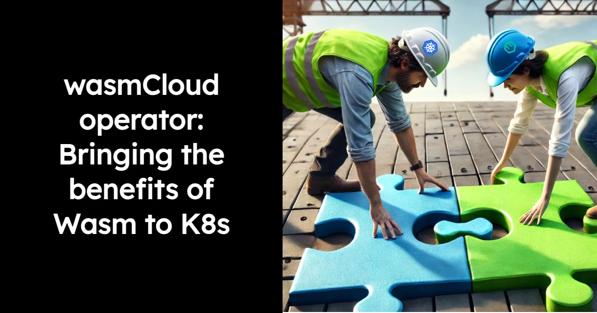
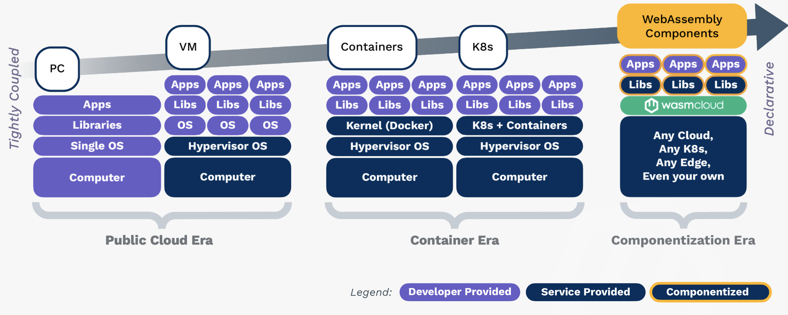
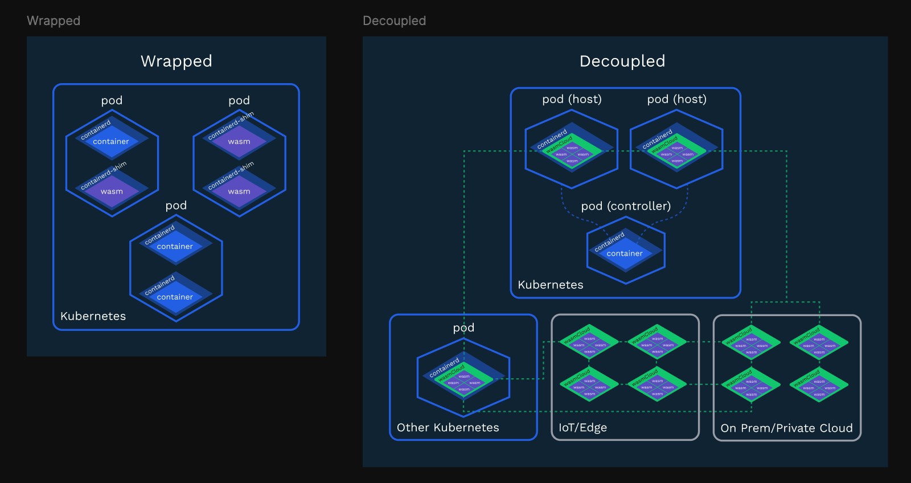
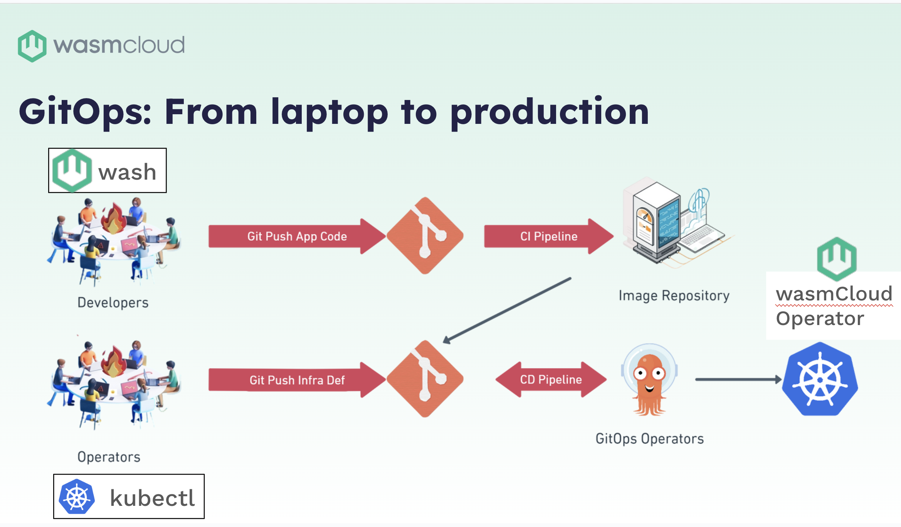
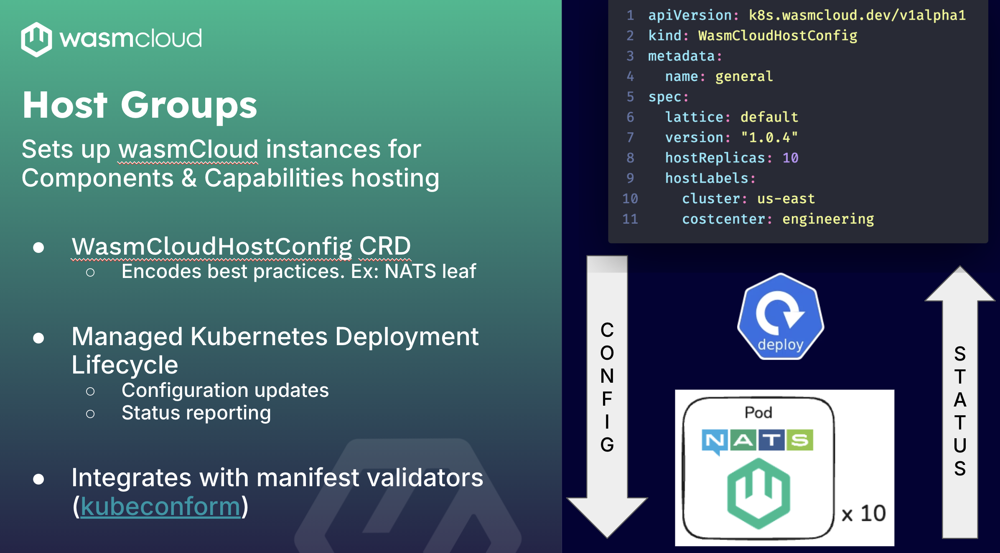
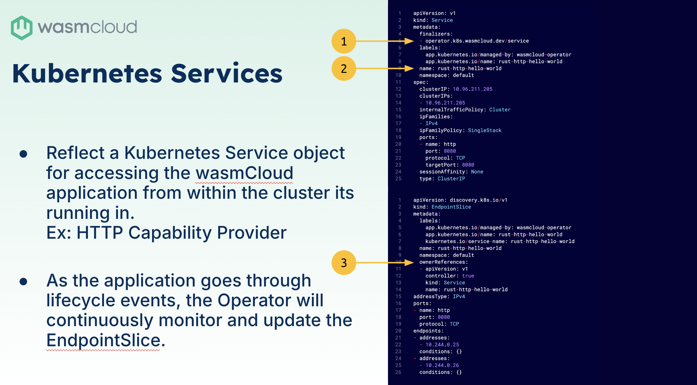
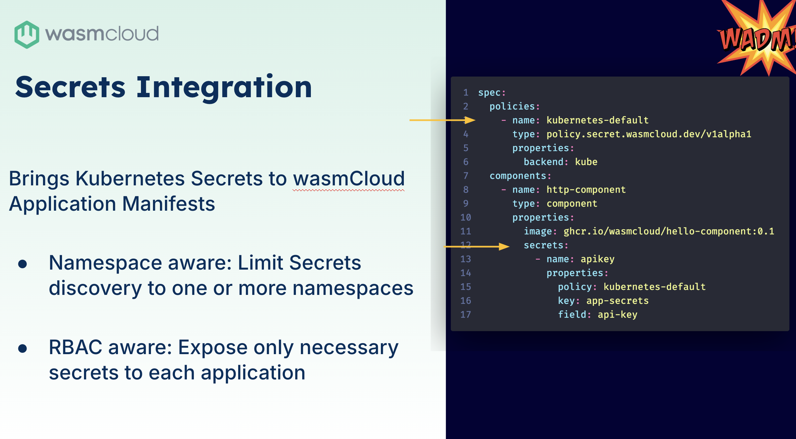

As more and more platform engineering teams begin working with WebAssembly (Wasm), they often ask: 

**“What benefits might we see from integrating Wasm with Kubernetes?”**

The question makes sense. Consider the level of investment many companies have made in containers over the last 10 years—and the cost and complexity of orchestrating containers with Kubernetes. 

This complexity is spurring engineering teams to try using WebAssembly and application orchestration platforms like wasmCloud. The goal isn’t just to simplify Kubernetes operations, but also to extend compute power to diverse edges where Kubernetes can’t operate effectively—and ultimately increase the value and efficiency of existing Kubernetes investments.

:::note[]
Take a look at this [early example](https://www.cncf.io/blog/2022/11/17/better-together-a-kubernetes-and-wasm-case-study/) of the benefits our friends at Adobe saw in bringing wasmCloud to Kubernetes.
:::

It’s worth saying, we love Kubernetes. It is *perfect* for infrastructure orchestration, but application management is not its forte. WebAssembly is specifically designed for distributed application orchestration, at-scale. Some describe it as what comes next after Kubernetes—the next level of abstraction. Wasm is where platform teams deploy to multiple orchestrators and platforms in a consistent and secure way; and developers no longer have to ship an entire operating system or CPU architecture-specific artifacts (x86/arm).

The Wasm component model enables our applications to be constructed from standard, reusable components that are compiled at runtime. Teams only need to concern themselves with essentials like business logic, configuration, and security policies—no more worrying about bug-ridden libraries or bloat. Applications are leaner and more secure because they use standard interfaces (thanks to WASI 0.2), capable of running **anywhere components are supported.**

:::note[]
We’ve talked extensively about the Wasm Component Model and how WASI 0.2 allows us to bring Wasm to our own infrastructure. Check out this [post](https://wasmcloud.com/blog/webassembly-components-the-next-wave-of-cloud-native-computing) for more.
:::

Rather than a replacement for Kubernetes, Wasm is highly complementary when **decoupled** from (rather than wrapped around) Kubernetes. Check out this [in-depth post](https://cosmonic.com/blog/engineering/do-you-need-runwasi-to-run-wasi) on why we chose a decoupled approach to running wasmCloud with Kubernetes.

We do this with the [**wasmCloud operator**](https://wasmcloud.com/docs/deployment/k8s/). In his Innovation Day talk, wasmCloud maintainer Lucas Fontes took a closer look at the wasmCloud operator: our open source project for running WebAssembly components on Kubernetes using wasmCloud, all without having to modify your cluster or use custom nodes.

<iframe width="560" height="315" src="https://www.youtube.com/embed/SH98d3I3guA?si=Bu59UUF6vopjGSGZ" title="YouTube video player" frameborder="0" allow="accelerometer; autoplay; clipboard-write; encrypted-media; gyroscope; picture-in-picture; web-share" referrerpolicy="strict-origin-when-cross-origin" allowfullscreen></iframe>

## Topics covered

* [**wasmCloud operator overview**](#wasmcloud-operator-overview): Introduction to the wasmCloud operator and its role in platform operations. Lucas covers the process of building components and providers, pushing code through a CI pipeline, and generating an OCI image, as well as platform teams' responsibilities in deploying the code to varied environments.

* [**Key functions of the wasmCloud operator**](#key-functions-of-the-wasmcloud-operator): How the operator creates groups of wasmCloud hosts and deploys application manifests. How wasmCloud capability providers work in Kubernetes using load balancers and Ingress interfaces. How integration with Kubernetes secrets allows for secure storage and retrieval of application secrets, supporting AWS Secrets Manager and Google Vault.

* [**Declarative configuration and service reflection**](#declarative-configuration-and-service-reflection): How the operator supports declarative configuration, allowing the use of existing DevOps tools like Argo, Flux, and Kubeconform for YAML validation. The Open Application Model (OAM), rooted in Kubernetes, enables seamless integration with local development environments.

* [**Demonstration and future work**](#demonstration-and-future-work): Lucas demonstrates the deployment of a wasmCloud host and application using Kubernetes, showcasing how wasmCloud operates alongside Kubernetes. He takes us through a step-by-step guide for installing the operator, setting up NATS, and deploying a wasmCloud host and application.

* **Q&A Session: Benefits of Running wasmCloud on Kubernetes**: Brooks asks about the benefits of running wasmCloud on Kubernetes and the distinction between deploying applications in wasmCloud versus Kubernetes. Lucas explains that wasmCloud provides an additional layer of control for operators, allowing fine-grained access and security for components. wasmCloud can run in isolation or on top of existing infrastructure, offering flexibility in deployment options. This provides operators with more component control and security.

## Transcript

Speaker: Lucas Fontes

### **wasmCloud operator overview**

Hi everyone, I'm Lucas Fontes, and I'm going to be talking about the wasmCloud operator. This is a story for platform teams; we’ll cover development plans and go into operations a bit. We've been talking a lot about `wash` in terms of components and capability provider development. The usual flow is: once you have your component or provider built, you're going to push that code up to a CI pipeline and generate an OCI image of your component or provider.

From this point on, another group in your organization, the platform team, will get that code and is responsible for putting it in production–in your public cloud, bare metal, anywhere. And, as this group is more familiar with a different set of tools, the wasmCloud operator is tailored to help improve the lives of those folks.

They are dealing with `kubectl`, they are dealing with Jenkins. They are dealing with a different set of systems that developers might not be exposed to all the time. What the wasmCloud operator does is facilitate the setup of a lot of infrastructure and applications, helping the lives of operators and ensuring wasmCloud is adhering to the industry standards that most companies are familiar with.

### **Key functions of the wasmCloud operator**

So what does it do? It allows us to create groups of wasmCloud hosts and also deploy application manifests. I'll show you, in a bit, what these look like. But for now, just think of these pretty much as YAML. The other thing that the operator does is, as you expose capability providers in terms of TCP ports from wasmCloud, those need to be reflected in Kubernetes so they can be exposed using load balancers, ingress interfaces and other things. The wasmCloud operator is watching your deployments, making sure that these are also being exposed on the Kubernetes side.

The third thing is integration with Kubernetes secrets. This is a good one because you’ll need secrets at some point in your application. You don't want to put your secrets in a YAML file, putting that in Git and calling it a day. The interesting thing with the secrets integration here is, because we're integrating to Kubernetes secrets, you can bring in an external operator, like the external secrets operator, and plug into many different, many different endpoints. AWS secrets manager, Google Vault, you name it.

The repository for the operator is under wasmCloud/wasmcloud-operator and host groups. Host groups are pretty much the wasmcloud runtime itself. When you run wash up on your laptop, you're bringing up a single wasmCloud host. What the CRD here is doing is you tell it which lattice and how many you want, and it will take care of creating the deployment. It will also enforce some good patterns in standing up wasmCloud hosts. So every time you bring up a wasmCloud host, we make sure there are companion NATS leaf nodes right beside it; it has faster communication with NATS.

It is also responsible for making sure that the configuration traverses from your EMLs down to Kubernetes deployments into the actual pod, as well as the communication in the other direction. We want to know: ‘Is this pod healthy?’, ‘How many applications do I have deployed in each host?’, ‘Do I need to recycle them?’, ‘How do I upgrade them?’. The status report here is an important part.

### **Declarative configuration and service reflection**

The other thing that is interesting is, because this is declarative, you can use any tools that you already have in your DevOps arsenal. If you have Argo, if you have Flux, if you have Kubeconform to check if your YAML is up-to-date; In wasmCloud these things are all possible. And as Bailey previously mentioned, with them comes our application orchestrator. And the manifest there looks suspiciously like Kubernetes: this is not by mistake.

What we're doing there is we're using a spec called the Open Application Model (OAM), which is rooted in Kubernetes, making this a very good match that you can use in your local development. Use `wash app deploy` to deploy an application to your local wasmCloud environment and operators can use `kubectl apply` on the exact same file and get this to work once the operator is in the manifest. Here  is where you're going to declare your components, your providers, your links, everything that you want on your application goes inside this file.

The other thing that the operator is doing is that service reflection that I mentioned initially, and this is done in a way that we keep the lifecycle of the service being exposed in sync with what is happening inside the wasmCloud host. What this means is we set up a finalizer on those services to make sure that they don't simply go away by themselves. If they get deleted, the wasmCloud operator gets a chance to go in there and maybe recreate it, maybe update it, you name it.

The lifecycle here is also important, because if you bring up more wasmCloud hosts to your system, and you start positioning, you start spreading providers that existed into these new hosts. The operator will also include these new hosts into your service, into your endpoint slice. And the other bit is about the secrets integration that I mentioned initially. The important thing here, when bringing wasmCloud secrets to Kubernetes, is we need to make sure that we are playing nice in the Kubernetes ecosystem. We need to respect service accounts. Need to respect our back namespaces, and this is done through the concept of policies.

Here, we want a wasmCloud secret called an API key, and we want to fetch it from the Kubernetes default policy. We want to get the secret called app secrets. And inside the secret we want to get the secret API key, so you can imagine that this might live in the same namespace or in a different one. You can configure those things here through the policy, just by adding service account or default namespace in the property section. And now I'm going to do a kind of a quick demo here, which is going to show a bit of the senior YAML engineer chops.

### **Demonstration and future work**

What you can see is a Kubernetes cluster which already has the operator installed. And I want to bring up a wasmCloud host and also deploy one application. Let's see how many pods we have going on. So we just have max with them, and an Alpine container that I was playing with initially. In terms of YAMLs, we have a wasmCloud host config YAML, and this is going to bring up one wasmCloud host in the 104 version, in the lattice default. And you notice that I didn't specify the number of hosts. If you don't specify the number of hosts, the default is one; to show that we also have some same defaults underneath the system, getting the host there.

Once we apply this, we're already creating a deployment and a pod for the wasmCloud host, and from this point on, we can describe that and see all the properties of that specific wasmCloud host. We don't have any applications deployed there. It's connected to NATS: the version and everything for my application. What I have here is a basic ‘Hello World’ application which is coming with one hello world component and one HTTP provider that's going to be binding it to port 8080.

The interesting thing here is I can take a `kubectl` approach to show that this application is deployed, or I can use `wash`, so these things are working in sync when we request information from Kubernetes. What is actually happening is Kubernetes is going over to the wasmCloud host, asking how many applications are there, and coming back. This is to say that we implemented the operator here as an API service. This means that it doesn't matter if you apply your applications using `wash` and check them via `kubectl` or vice versa, the system will be consistent.

There is no way for somebody to install an application using `wash` that the operators will not be aware of. Once we apply this application here, we also see that now we have a ‘Hello World’ service here on port 8080. Again, this is that service reflection that I was talking about a few minutes ago. This is all great. The Quickstart (literally this thing that I just went through) shows you how to install the operator, get NATS, generate a wasmCloud host, and then run a simple application right beside it.

In terms of future work, we know that the installation story right now is not the best. This is because you have to install NATS with the operator. Each one has its own installation procedures, so there is some Helm installation that requires a bit more love. We have a member of the community working on a Helm chart that will encompass this, and make things way easier to install. We also want to look into the gateway API integration so we can plug wasmCloud easily into Envoy, into NGINX and other ingress classes.

The other part coming soon is the ability to create end-to-end clusters. You might want to create multiple wasmCloud clusters inside a single Kubernetes cluster, or you might want to create one wasmCloud cluster that spans multiple Kubernetes clusters. So these things are important in the day-to-day for for any company at this point, and we want to make sure that we are supporting those use cases. And that's the end of the operator chat. Thank you.

*Watch the full recording for the short Q&A that followed this session*.