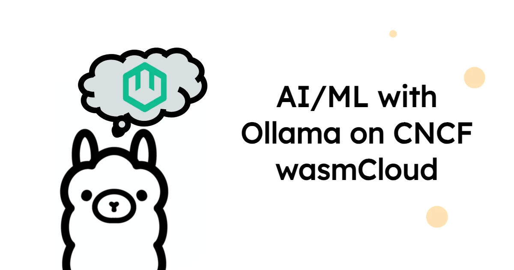
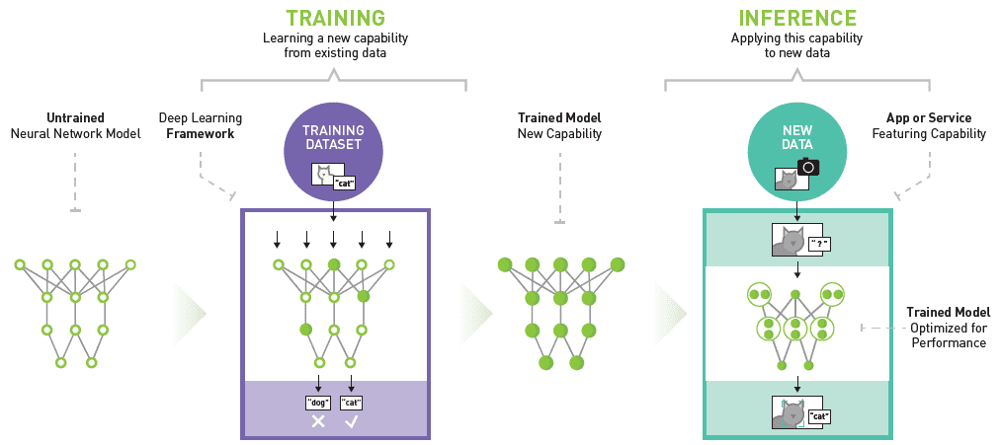
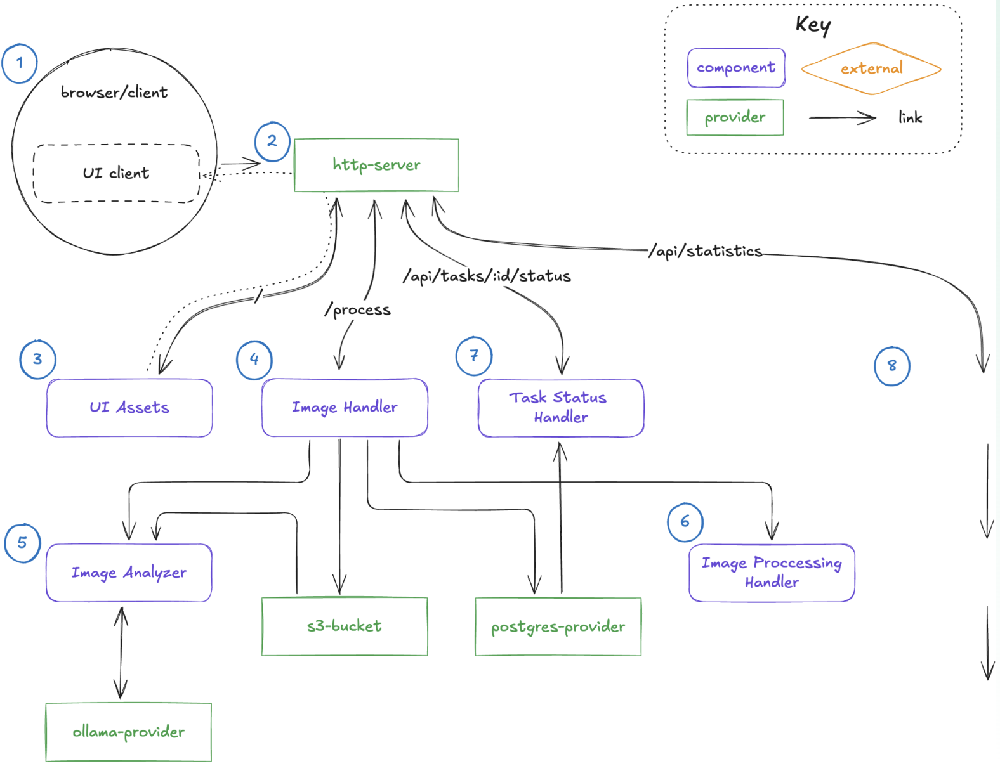

While the hype around Artificial Intelligence (AI) and Machine Learning (ML) promises limitless benefits, the discussion is shifting from theory to real-world practicalities. Focus within platform engineering teams is turning to the usability and operational efficiency of ML/AI, and the viability of running AI workloads at the edge. With this in mind, Cosmonic CTO Bailey Hayes takes a closer look at AI inference, and the ways WebAssembly (Wasm), and platforms like wasmCloud, could improve the effectiveness of distributed AI workloads.

<iframe width="560" height="315" src="https://www.youtube.com/embed/zvIXqcjMkcU?si=soEEJCRXkPn69BVk" title="YouTube video player" frameborder="0" allow="accelerometer; autoplay; clipboard-write; encrypted-media; gyroscope; picture-in-picture; web-share" referrerpolicy="strict-origin-when-cross-origin" allowfullscreen></iframe>

:::note[]
AI inference is the process of running live data through a trained AI model to predict an outcome or solve a problem. It is the acid test that reveals how well it puts learned information into practice to make a prediction. Efficient inferencing means AI systems provide fast, accurate outputs.
:::

Cloud-only ML and AI strategies have limitations. Moving large volumes of data between clouds and edges is expensive, especially between regions. Latency issues affect AI inference in the cloud, creating lag across devices and cloud environments. Additionally, running AI applications in network-constrained environments impacts application reliability and security, a major problem when delivering real-time services. 

Wasm is an excellent compilation target for inferencing-style workloads due to its portable, light weight, open architecture, and near-native speed. Its fast startup time and low resource consumption make it ideal for real-time inferencing on edge devices, while secure sandboxing ensures safe operation in diverse environments. 

Bailey takes us through the current methods for taking advantage of Wasm in AI workloads:`wasi-nn`, `wasi-webgpu`, custom interfaces, and providers. Each model is suited to specific use cases—Bailey takes us through the pros and cons. She rounds off the talk with an exciting demo of a celestial and terrestrial mesh running in wasmCloud, exploring how it uses Ollama for image recognition. Check out the recording above, and we’ve dropped the main talking points and talk transcript below.

## Topics covered

- [**AI inference and Wasm**](#ai-inference-and-wasm): Wasm is an excellent compilation target for inferencing-style workloads. There are four main approaches, all compatible with wasmCloud: [`wasi-nn`](https://github.com/WebAssembly/wasi-nn), `wasi-webgpu`, custom interfaces, and providers.

- [**Introduction to `wasi-nn`**](#introduction-to-wasi-nn): `wasi-nn` integrates with existing ecosystems, making it ideal where there’s significant investment in existing ML models. Inferencing happens through host and native code which means hardware is optimized. Bailey talks through the pros (hardware optimization) and cons (sandboxing, portability, and hardware dependencies) of this approach.

- [**Introduction to `wasi-webgpu`**](#introduction-to-wasi-nn): `wasi-webgpu` is a new WASI interface based on the WebGPU API. Targeting GPUs directly, it is portable and is a lower-level fundamental building block, making it exciting for future AI framework development. With no off-the-shelf solutions currently available for `wasi-webgpu`, this is suited to more experienced practitioners.

- [**Compiling models to Wasm and local-first workloads**](#compiling-models-to-wasm-and-local-first-workloads): Compiling models like Ollama to Wasm, and creating a quantized version for local-first workloads, allows for local inference without network requests. This is sandboxed inside the Wasm runtime but limitations in utilizing specialized hardware and increased code size are significant performance trade-offs.

- [**Custom interfaces and providers**](#custom-interfaces-and-providers): There are many ways to implement custom interfaces and providers. Some services, like Hugging Face, offer specific APIs for certain models, such as Ollama, which is suited to local and edge applications.

- [**Demonstration of image analyzer component**](#demonstration-of-image-analyzer-component): The image analyzer component triggers inferencing and runs image classification on uploaded images. It uses the Ollama API for inference, making OpenAI HTTP calls over Ollama running locally. The component is tiny (292 kilobytes) compared to traditional container sizes, making it efficient for local development and production deployment.

- [**Swapping capabilities and component analysis**](#swapping-capabilities-and-component-analysis): The image processor component can be linked to different capabilities, such as a blobstore or local file system—this maintains compatibility with various AI providers. Using the `wasmtools-component-wit` command, the component's dependencies and requirements are analysed to reveal the necessary components for the image analyzer to function.

## Transcription

**Speaker:** Bailey Hayes

### **AI inference and Wasm**

As you probably are aware, Artificial Intelligence (AI) and Machine Learning (ML) are very hot topics right now, and I wanted to be able to break them down and give a simplified overview of all the different approaches that I've been seeing. I'm going to focus here specifically on inferencing-style workloads. And one of the things that I find most interesting about this is that Wasm is an excellent compilation target for these types of workloads.

There are basically four main categories that I'm going to walk through. `wasi-nn`, `wasi-webgpu`, compiling models to Wasm, and then also writing your own custom interfaces and providers. And I want to note that all of these different approaches are also compatible with wasmCloud. But I'm actually going to give many different examples that I'm seeing around the industry today.

*Credit: Nvidia deep learning inference platform model.*

### **Introduction to `wasi-nn`**

So for `wasi-nn`, it is a WASI interface for performing ML inferencing. It's been around for a couple of years. Actually, one of the key champions, Andrew Brown from Intel, has been pushing it forward and involved in the spec for it over quite some time. We've had some very recent and very cool additions to that spec to make it a little bit better for the types of inferencing that I'm going to demo in a second.

It has many different key pros. It integrates with your existing models and ecosystems that we have today, and that space has exploded. So, trying to create something that allows you to sort of abstract all of those is really incredible. That's one of the biggest strengths of it. Of course, it's a WASI API, which means that we're seeing many different runtimes implemented, from WAMR to Wasmtime and WasmEdge. By far, the biggest strength for `wasi-nn` is that it allows for hardware optimization: essentially, you tell the API to load your model and then run inference on it.

That inferencing side actually happens with host code, with native code. That is both its greatest strength and its greatest weakness. The reason why it's a bit of a weakness is that it makes it very difficult to sandbox. Also, because it ties itself to hardware, it makes it not portable. However, if you are deploying your own inferencing models, it's your first party code, then perhaps sandboxing is not as big of a deal to you. And, if you already have an ecosystem that has this large investment in existing models and complex use cases, `wasi-nn`, is a great solution for you.

### **Introduction to `wasi-webgpu`**

The other one that's emerging (really, if we're being frank, it's very nascent, but I get asked about it a lot, so I wanted to give a bit of an overview of it). This is another new WASI interface called `wasi-webgpu`. Given the name, you can probably guess that it's based off of the WebGPU API, and obviously targets GPUs directly. Because it targets GPUs directly. That means that you're probably not going to have some type of CPU fallback or be able to take advantage of specialized hardware like TPUs that make it very efficient for running TensorFlow. However, its biggest pro is that it's extremely portable.

A lot of places have already figured out how to support a WebGPU API. It also is a lower level fundamental building block. And I find that extremely exciting, because what I expect to happen is that many different people are going to build AI frameworks on top of `wasi-webgpu`. However, that hasn't quite happened yet, so there really aren't many off-the-shelf solutions for it today. Now, if you're a pioneer or leading edge seeker. This is probably the time to jump on this bandwagon and see if you can build out your own AI framework for other people to use.

This is another case that I think is actually probably something that you've run and you just didn't realize—that's because TensorFlow JS seems to appear just about everywhere in major web applications. It's very handy for, let's say, blurring your video background.

### **Compiling models to Wasm and local-first workloads**

There's another case that I think is interesting, that I'm seeing a little bit more on the server side, which is compiling Ollama, specifically a quantized version of that model, to WebAssembly. When you compile the model and all that it contains into a single .wasm, that's really nice, because that means any WebAssembly runtime is able to run it, and that allows you to do local-first saw workloads. You don't have to make a network request to run your inference. You don't have to step out to a separate process. It is literally all local, and that means that it's all sandboxed inside the WebAssembly runtime.

There are some significant trade-offs for this. The performance is probably the biggest inside WebAssembly. We've been pushing forward SIMD 128; an expanded SIMD, so there are new performance gains, but at the end of the day, you're not able to take advantage of specialized hardware that uses the portability of WebAssembly by using this approach. It also expands the code size footprint quite a bit. So if you are interested in this type approach, which many people do because they're targeting the web or edge or local first use cases, do make sure that you use a quantized version of your model, aka something that's more compressed and smaller.

### **Custom interfaces and providers**

All right, this last bucket here, I'll admit, is very much a catch-all where we're seeing people write custom interfaces and providers, and the degrees of what this implementation looks like varies wildly, but I want to just give a shout out for a few different approaches. Wasm actually has a number of different styles of how they can support AI inferencing. One of those is with a TensorFlow interface. So in a lot of ways, that's like a lower level API that's very specific to TensorFlow, but if you are running with only TensorFlow, then maybe that's the best API for you.

There are also lots of other cases that I'm seeing where WebAssembly components surface an OpenAI HTTP interface that other people are able to call into. But what happens underneath is still a little bit of a varied story in terms of how they actually are doing. The inferencing seems to be very widely different between different providers.

This last one is one that I want to dive in a little bit deeper. Some folks are building APIs that are specific to certain providers, for example, Ollama. Earlier today, I showed the wasmCloud space demo, and that actually uses Ollama under the hood. There are some key pros for Ollama. We've got so many different models there. A lot of these are open source models that you can pull down and run on your laptop. So the demo I ran was on my laptop running Ollama with their desktop app. So it has a ton of different desktop apps for Mac, Mac, OS, Windows and Linux. So it's really great for consumer hardware, and it knows how to fall back to a CPU if it needs to. That makes it perfect for local model deployment and development, and makes it very, very easy to use.

There is a big con, although to be fair this is a problem that we're trying to solve across the industry. This is that you can only run one inferencing cycle at a time, because it's kind of hard to figure out a way to multi-tenant your GPU. So if you're using Ollama, I really recommend it for local and edge applications, but understand that you're going to have to have some type of workload lock before executing on your GPU. Make sure that you think about that and also understand that this is really a privileged capability you're giving access to running inferencing on a GPU. With wasmCloud, you're able to give that capability through a link. I'll show a little bit of what that looks like inside the demo.

### **Demonstration of image analyzer component**

We're going back to the application architecture here, and I'm going to talk through this component, specifically the image analyzer component. It's the one that triggers our inferencing on our image classification against the image that we upload. There's another piece here that also uses a blobstore bucket, but let's first run through and remind ourselves how this demo works again.

I've got a globe. I'm going to use some different images this time, and the job of this image classifier is to determine whether or not this image is a ship. So I have a Corvette running on top of water, so it's kind of confusing. Let's see what the AI does here. Okay, this Corvette is not a boat. Let me give it a real boat. So this is an image of a boat. I'll see whether or not it determines that image itself is a boat. Okay. It is a boat!

Let's look at the code on what is making all of this happen. My component here is the image analyzer `.wasm`. It is 292 kilobytes, so extremely small. Compare that to a container that's in the order of hundreds of megabytes, even gigabytes. We're going to step through the logic a little bit, since it's fairly straightforward. Essentially, we have it making an OpenAI HTTP call over to Ollama that's running locally. Ollama surfaces and supports OpenAI compatibility over HTTP.

*Ollama wasmCloud demo*

So, if I'm configured to talk to an endpoint, I'm going to call that endpoint here and then I'll also be able to pass in a prompt so that I can configure this actually at runtime. So one little piece here, this piece of code; `wasi-config-runtime`. It's my ability to change and modify the config at runtime. And how do I do that? I do it by working within our application manifest. This is my component getting pulled from OCI, and here's my runtime config. And notice that I have a very simple prompt passed in here, but I can refine it and make it better at runtime as I want. It's linked over HTTP, so that's the part that's making the request over to Ollama, and then it's also managing the tasks that I'm working with within this component.

### **Swapping capabilities and component analysis**

One other thing I want to highlight is that I did mention the image processor. Once we have processed an image and recognized it as a boat, let's save it and process it later. For more things, let's upload it to a blobstore, so I link it to a WASI blobstore. But what's really cool about this is that I can actually use and swap in a capability, in this case, a blobstore that's my local file system. That is really, really powerful because it means that I can take the exact same `.wasm` that I'm developing locally, working with Ollama deployed on my desktop. Then, when I deploy it to production, it's still making OpenAI API calls; so I could back it with OpenAI provided by Microsoft, and also a blobstore, let's say with Azure. Very, very powerful.

One last thing I want to show here is that when I look at my component to see what it has inside it, I run this command called `wasmtools-component-wit` on top of my image analyzer component, outputting it to component.wit, and you can see the things that it needs to be able to run. There's that `wasi-config-runtime` import, and then all the other different WASI pieces that I use to be able to execute this component. That is a very brief overview of how you can write your own component, using Ollama and our Ollama provider.

## Get involved

Join the discussion on [Slack](https://wasmcloud.slack.com/), and help us plot the innovation course in our [Q1 roadmap planning discussion](https://github.com/wasmCloud/wasmCloud/discussions/3813). This week's wasmCloud Weekly will be devoted to the roadmap&mdash;[join us today](https://www.youtube.com/watch?v=1jVV0kPh4wM) at 1pm Eastern.
