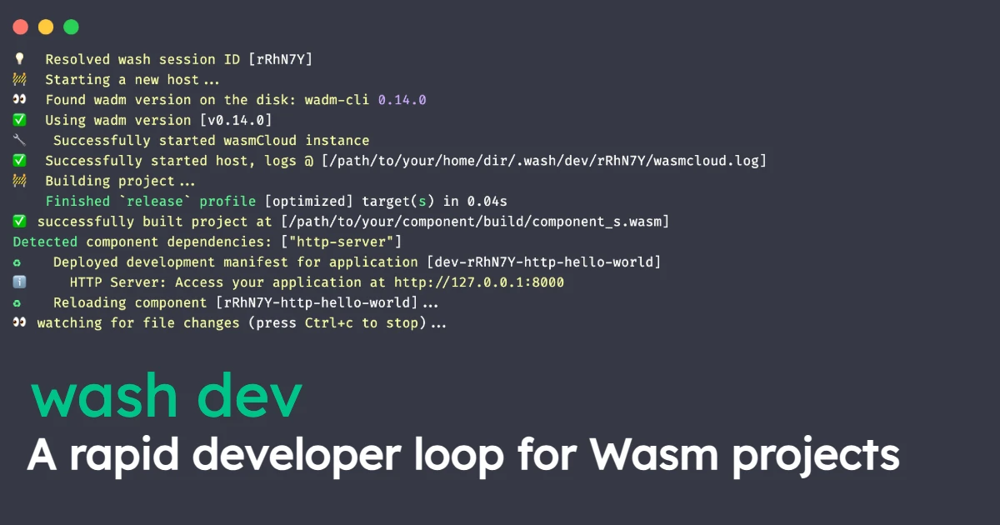
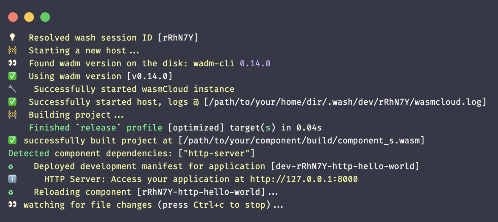

At **KubeCon + CloudNativeCon NA 2024** in Salt Lake City, we introduced a new set of tools to improve the wasmCloud developer experience. The aim was to better align the wasmCloud experience with familiar application engineering practices, and solve wider inconsistencies encountered by would-be WebAssembly (Wasm) users.

These inconsistencies in experience between languages and runtimes are among the biggest barriers facing Wasm developers, according to CNCF [research](https://www.cncf.io/wp-content/uploads/2023/09/The-State-of-WebAssembly-2023.pdf) and Scott Logic’s most recent [State of WebAssembly](https://blog.scottlogic.com/2023/10/18/the-state-of-webassembly-2023.html) report. The [evolved `wash dev` subcommand](/blog/2024-11-26-starting-your-webassembly-developer-loop-with-wash-dev) marks an important step towards breaking down these barriers. 

Starting a development loop by running `wash dev` makes it easy to write simple, componentized applications with a common, recognizable workflow. Developers can build and iterate on components in the same way they would build applications in any other scenario. They put wasmCloud to work and remain productive with minimal changes to their usual routines.

At wasmCloud Innovation Day, wasmCloud maintainer [Victor Adossi](https://github.com/vados-cosmonic) led a session on these DevEx refinements&mdash;specifically, how he went about refining the `wash dev` experience. The subcommand has been around for a while, but Victor has focused on making it the mature, robust development solution it was always intended to be: **the go-to command for anyone starting a developer loop on a component or provider**. 

TK RECORDING HERE

`wash dev` handles the following steps in a developer loop:

* Building your WebAssembly component
* Starting a local wasmCloud environment
* Automatically fulfilling a project's well-known [capability](/docs/concepts/capabilities) requirements 
* Deploying your application to the local wasmCloud environment (using an automatically generated [application manifest](/docs/ecosystem/wadm/model))
* Watching for updates to relevant files in your project 

The Wasm component model allows us to inspect any Wasm component&mdash;exposing its dependencies so we understand its behavior from the outset. `wash dev` takes this one step further. It is the first developer iteration tool that can spin up a development environment just by inspecting the application binary. 

If you're building a component that handles HTTP requests, for example, the `wash dev` process will automatically launch an HTTP server provider&mdash;no need to worry about deployment manifests. 

This streamlined workflow facilitates **faster development cycles**, allowing engineers to iterate and debug much more quickly, without the overhead of manual configuration and deployment. `wash dev` also brings **easier testing** with automated testing of Go-based WebAssembly applications&mdash;a key requirement in enterprise. Finally, it brings **familiarity and consistency**: `wash dev` closely matches the workflows engineers are already used to in other languages and platforms, reducing the learning curve.

Check out Victor’s talk in the recording above, or the summary and transcript below.

## Topics covered

- [**Introduction to `wash dev`**](#introduction-to-wash-dev): How [`wash dev`](https://wasmcloud.com/docs/developer/workflow/) automates the process of building, watching, and redeploying Wasm components and their dependencies, using WebAssembly interface types (WIT) to infer dependencies from code imports.

- [**Understanding wasmCloud projects**](#understanding-wasmcloud-projects): wasmCloud projects involve both Wasm components and infrastructure dependencies such as [capability providers](/docs/concepts/providers). Victor discusses how `wash dev` handles common infrastructure dependencies like HTTP servers and key-value stores.

- [**Demo of `wash dev`**](#demo-of-wash-dev): Victor shows how `wash dev` builds and spins up HTTP servers and other dependencies automatically, and highlights the benefit of being able to test components in a web browser to see a component's output. Victor also discusses "infrastructure nervousness" and how `wash dev` helps alleviate this by managing dependencies automatically.

- [**Q&A and further clarifications**](#qa-and-further-clarifications): Victor answers questions about the difference between the previous and current iterations of `wash dev`.

## Transcript

**Speaker:** [Victor Adossi](https://github.com/vados-cosmonic)

### Introduction to `wash dev`

We've been focusing lately on `wash dev`&mdash;trying to get it really tight, and to improve the onboarding and developer experience. In a world where people build WebAssembly (Wasm) components&mdash;where people use providers to abstract dependencies and plug-and-play&mdash;we need to make sure that interface and that developer experience is a really tight feedback loop. `wash dev` is something we've actually had out for a while. We are improving it and trying to really dial it in.

`wash dev` is for building wasmCloud projects and components. And when we say “wasmCloud projects” we mean both WebAssembly components and capability providers. We use the word “application” because an app involves more than just one component. You've got a WebAssembly component, you've got a provider&mdash;let's say, an HTTP server and a handler for that HTTP endpoint. When we talk about a project, we can talk about either Wasm components, which you might think of like an app, or an infrastructure dependency. The middle pieces, that we're helping you abstract away from, are capability providers.

`wash dev` is one of those things we thought was really important to get the developer experience right. Level zero is just building, watching your source code change, rebuilding and redeploying. But what we wanted to do was to leverage some of the WebAssembly Interface Types (WIT). We wanted to use that interface language, that IDL, to automatically pull out your dependencies based on what you're importing and what you're using.

`wash dev` watches your code for changes, and reloads:

### Understanding wasmCloud projects

Let's say you're building a component that handles an HTTP request, and you have a key-value import. We know that this component must answer an HTTP request, and it must use some sort of key-value capability provider. It doesn't matter what the key-value store is; it could be Redis, it could be Couchbase&mdash;lots of things, but we can tell those things just from the interface. We can take that interface and we can use that to automatically generate the spec as a local mock-up of the deployment environment. And we can deploy it locally, as opposed to just deploying just the one program.

We've really leaned into that and tried to focus on that for both imports and exports, and this is for capabilities that we consider really important and vital, sort of baseline capabilities. Key-value is one of them, HTTP servers, and outgoing HTTP requests are another. There are a bunch. And we're always open to expanding this in the future as we see usage go up for certain interfaces.

The core of `wash dev` now, as opposed to before, is to build your component, watch your code, deploy your component locally, and spin up its dependencies where we can. I'm going to demo it really quick here on what the output of this looks like. And it's just, it's what you'd expect.

### Demo of `wash dev`

We generate a session. Turns out you can run more than one command on a computer at the same time. You could have two `wash dev` sessions running on the same machine&mdash;we want those to not collide. And you can have the component or provider built. You can also get an HTTP server spun up.

So, we have our managed and officially supported capability providers and HTTP servers. Since we know that provider, we can spin it up, and it will automatically give you a place.

We can figure out the address that the HTTP server is running at, and while you're testing, you can just open up a web browser and take a look at what your component is outputting. I'm going to do a quick demo here with a somewhat simple component, which I think is a fun one for long-time Linux and Unix users.

For those people who are old enough or Unix-enough to remember `cowsay`, we have a regular component, and we can `wash build` it. A quick explanation. We've got the code on the left side, and we've got a terminal open to the same folder on the right. From the folder we can do a simple `wash build` and we get our component output. We've got a signed component here, and we've got an unsigned component as well. If we're running in something else, say a different runtime, we can always include it with our examples.

This is an example that's in the [wasmcloud/wasmcloud repo](https://github.com/wasmcloud/wasmcloud): you can look at it any time. What we do is we always include a `wadm` file; this one is quite simple, because it doesn't have any dependencies. It just takes in an invocation and it spits out text. This is quite a simple application, but this is basically what it looks like; very easy to grok. We could deploy this by just deploying the bottom file on the left and that's simple, mostly because we've done the work of writing the `wadm` file and making it simple to use.

What we want is to have this be a ‘no touch, no ops’ solution. So, what we've done is we've built `wash dev` to be able to read your code, watch it, change it, build the component, spin up whatever `wadm` or application manifest is necessary to run your application. Then, I'm going to call it so I'm going to say, “let's look at what's running. Let's look at my apps." What I have is a new `wash` app here&mdash;from a previous run of the regular app. We have the `dev` version of the app now. Note that all dev applications are ephemeral, so they are prefixed, just to make it easy to sort of see which is which.

We have a new app here which is `dev` prefixed, and it has a new little identifier, which you can see here, right? And we're going to get the inventory that is currently running on this host, so we're going to see all the different components that are running. And we're going to trigger it to see what the output looks like. So this is now. Let's make a change. So we were wasmCloud users at this point, but now we're innovating! That's all you need to do! You change the file: our file watcher is very active. As soon as I made a change to the file it already started building. You can just rerun whatever command you are running to actually test your application, and you'll be able to see the output and see the component and its requirements. Its dependencies change in real time.

We think this is really going to supercharge the development and tighten the feedback loop for developing applications when building with wasmCloud. We're pretty excited about what this will do. It will make developing applications for this new paradigm&mdash;and developing applications in general&mdash;much easier, much faster, and with less. What is a good term for it? I think I'd call it just uncertainty around infrastructure, or infrastructure nervousness that developers, a lot of developers, face. You won't have to worry about the infrastructure at all. If we have interfaces that we recognize, we'll spin them up for you.

### Q&A and further clarifications

**Question from Brooks:** Because I had used `wash dev` before, at the time `wash dev` was very ‘start a component and then hot reload it’ and that was great but this iteration of `wash dev` is not just that, is it also an infrastructure-as-code or infrastructure-as-component approach?

**Answer:** This example is very simple. And the thing is, there are a lot of other solutions that try and do something like this, but what it ends up forcing the developer or the average user to do, is to figure out how to deploy everything from scratch, sort of by themselves. For some apps, that's very simple, but the point of `wash dev` is to start up your dependencies as well.

This is a very simple app; it spits out some text. But what we have here for the apps that do, for example, HTTP handling, we spin up a ‘first approximation’. We spin up a HTTP server, we hook it up to your component, and it's running, ready to ping. We can't tell exactly what your application does just by knowing that it handles HTTP requests. You could do absolutely anything once that HTTP request comes in, but we can at least make sure you have an HTTP request, make sure you have a key-value server, make sure you have a blob store, things like that. As long as you write to those interfaces, which is one of the core benefits of wasmCloud, you'll be able to run and test your app without setting up additional infrastructure.

## Be a part of what comes next…

Join the discussion on [Slack](https://wasmcloud.slack.com/), and help us plot the innovation course for this quarter. Take a look at the [Q1 roadmap](https://github.com/wasmCloud/wasmCloud/discussions/3813) and add your thoughts. The [wasmCloud Weekly Community Meeting](https://wasmcloud.com/community) takes place every Wednesday at 1pm Eastern&mdash;we hope to see you there.