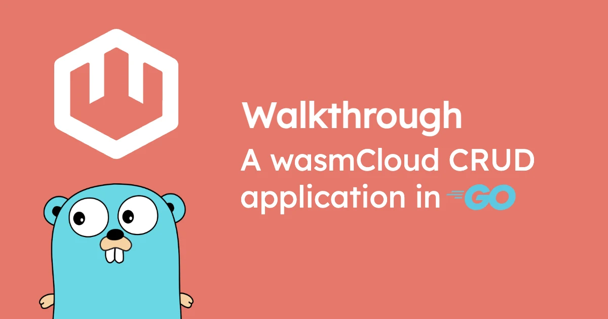

Exploring a web application that performs simple [CRUD operations](https://en.wikipedia.org/wiki/Create,_read,_update_and_delete) (Create, Read, Update, Destroy) is a great way to understand new application paradigms. 

In this walkthrough, we'll unpack a simple CRUD application in Go, compile the code to a [WebAssembly component](/docs/concepts/components/), and run it on wasmCloud using swappable, vendorless [capabilities](/docs/concepts/capabilities/) for HTTP service and key-value storage.

By the end, you'll understand how the pieces of a wasmCloud application fit together, and how to use the `wasi:http` and `wasi:keyvalue` interfaces in your Go-based wasmCloud projects.

Let's get started!

## Before we begin

We'll need a few tools for this walkthrough: 

- [**wasmCloud Shell (`wash`)**](https://wasmcloud.com/docs/installation) provides a command-line interface for wasmCloud, helping you build and deploy components and run a local wasmCloud environment.
- The [**Go (1.23+) toolchain**](https://go.dev/doc/install) and [**TinyGo**](https://tinygo.org/getting-started/install/) let us compile Go code to a WebAssembly component. The TinyGo project moves quickly, so always use the latest version.
- [**`wasm-tools`**](https://github.com/bytecodealliance/wasm-tools#installation) is a utility that helps generate bindings between language-agnostic [interfaces](/docs/concepts/interfaces/) and Go.

## Run the example

To download the example, you can clone the [wasmCloud/go repository](https://github.com/wasmcloud/go): 

```shell
git clone https://github.com/wasmCloud/go.git
```

Change directory to `examples/component/http-keyvalue-crud`:

```shell
cd examples/component/http-keyvalue-crud
```

We'll start by running the example and seeing what it does&mdash;then we'll take a look under the hood and see how it all works. 

From the project directory, run:

```shell
wash dev
```

This will start a dev loop that automatically builds and deploys your app (in a local wasmCloud environment) and continuously watches for changes.

In a new terminal tab, you can view your wasmCloud apps and check status:

```shell
wash app list
```

Once the app status for `http-keyvalue-crud` is `Deployed`, we can test a POST against our app with `curl`:

```shell
curl -X POST localhost:8000/crud/mario -d '{"itsa": "me", "woo": "hoo"}'
```

We should get the result:

```text
{"message":"Set mario", "value":"{"itsa": "me", "woo": "hoo"}"}
```

We can test a GET and DELETE as well:

```shell
curl localhost:8000/crud/mario
```
```text
{"message":"Got mario", "value":"{"itsa": "me", "woo": "hoo"}"}
```
```shell
curl -X DELETE localhost:8000/crud/mario
```
```text
{"message":"Deleted mario"}
```

You can press Ctrl+C in your first terminal tab to stop the dev loop. 

Now let's take a step back and see how the pieces of this application fit together.

## Exploring the component project

In wasmCloud, a [**component**](/docs/concepts/components) is a WebAssembly component dedicated to an application's creative logic. Typically, we will simply refer to this as a "component." The code in this directory is for a Go application that compiles to a component. 

Here we have the standard `go.mod` file for a Go project and a `.go` file for the application. We also have a few more pieces that make up a wasmCloud project:

- `/build`: Target directory for compiled `.wasm` binaries
- `/gen`: Target directory for Go bindings of [interfaces](https://wasmcloud.com/docs/concepts/interfaces)
- `/wit`: Directory for WebAssembly Interface Type (WIT) packages that define interfaces
- `bindings.wadge.go`: Automatically generated test bindings
- `wadm.yaml`: Declarative application manifest
- `wasmcloud.lock`: Automatically generated lockfile for WIT packages
- `wasmcloud.toml`: Configuration file for a wasmCloud application

Let's take a tour of the major pieces of the project.

## Understanding the interfaces

We will interact with the `httpserver` and `keyvalue` capabilities via language-agnostic interfaces defined in the **WebAssembly Interface Type (WIT)** interface description language. These are standard interfaces belonging to the [WebAssembly System Interface (WASI)](https://wasi.dev/).

Take a look at the contents of `wit/world.wit`:

```wit
package wasmcloud:http-keyvalue-crud;

world component {
  include wasmcloud:component-go/imports@0.1.0;
  import wasi:logging/logging@0.1.0-draft;
  import wasi:keyvalue/store@0.2.0-draft; 
  export wasi:http/incoming-handler@0.2.0;
}
```

This **world** file specifies the interfaces that our code will utilize. In this project, we're using:

- `wasi:http/incoming-handler@0.2.0`
- `wasi:keyvalue/store@0.2.0-draft`
- `wasi:logging/logging@0.1.0-draft`

Specifically, we're **importing** `keyvalue/store` and `logging`, while we're **exporting** `http/incoming-handler`. That means the component will rely on another entity to provide storage and logging functionality, while exposing functions that can be invoked by an HTTP server over the `http/incoming-handler` interface.

We're also including `wasmcloud:component-go/imports@0.1.0` to make use of the [Go Component SDK](https://github.com/wasmCloud/go/tree/main/component)&mdash;an optional framework that provides a more idiomatic Go development experience for WASI interfaces like the ones in this project.

## Exploring the code

Now that our dependencies are defined, let's take a look at the code in `main.go`. We'll start with the first line:

```go
//go:generate go run go.bytecodealliance.org/cmd/wit-bindgen-go generate --world component --out gen ./wit
```

This line specifies how the `wash` builder should generate Go bindings for our WIT interfaces. When we build the application with the `wash build` command, the builder will use these instructions to run the `wit-bindgen-go` tool and generate bindings between the functions defined in the WIT dependencies and Go.

Let's try it out. In the root of the project directory:

```shell
wash build
```

This will create a a compiled `.wasm` binary in the `build` directory. It will also populate the `gen` directory with bindings. You can explore those binding files to get a sense of how to use the interfaces, and IDEs with autocompletion can help you make use of them as well.

Now let's take a look at the imports.

```go
import (
	"encoding/json"
	"fmt"
	"io"
	"net/http"

	// A lightweight, high performance HTTP request router
	"github.com/julienschmidt/httprouter"

	// For the keyvalue capability, we're using bindings for the wasi:keyvalue/store interface.
	store "github.com/wasmCloud/go/examples/component/http-keyvalue-crud/gen/wasi/keyvalue/store"

	// The cm module provides types and functions for interacting with the WebAssembly Component Model.
	"go.bytecodealliance.org/cm"

	// The wasmCloud wasihttp module enables us to write more idiomatic Go when using wasi:http.
	"go.wasmcloud.dev/component/net/wasihttp"
)
```

We have several packages worth noting here:

* Core Go packages like `encoding/json`, `fmt`, and `io`. We can use these like in any other Go app and compile to a component.
* A third-party HTTP router. We can use this in our component, too.
* The Go bindings we generated for the `wasi:keyvalue/store` interface. These are referenced at `<project name>/gen/`.
* The `go.bytecodealliance.org/cm` package for building Go applications that interact with the [WebAssembly Component Model](https://wasmcloud.com/docs/concepts/components#open-standards).
* The optional wasmCloud `wasihttp` package for writing more idiomatic Go when using `wasi:http`.

Next in `main.go`, we define a couple of types that we'll use to validate JSON later on. 

```go
// Types for JSON validation.
type CheckRequest struct {
	Value string `json:"value"`
}

type CheckResponse struct {
	Valid   bool   `json:"valid"`
	Length  int    `json:"length,omitempty"`
	Message string `json:"message,omitempty"`
}
```

Then we reach the `init()` function:

```go
func init() {
	// Establishes the routes and methods for our key-value operations.
	router := httprouter.New()
	router.GET("/", indexHandler)
	router.POST("/crud/:key", postHandler)
	router.GET("/crud/:key", getHandler)
	router.DELETE("/crud/:key", deleteHandler)
	wasihttp.Handle(router)
}
```

This program doesn't run like a CLI, so the `main` function is empty (and tucked away down at the end of the file). Instead, we establish our routes and methods in the `init()` function and call the relevant function when an HTTP request is received.

The simplest handler function is `indexHandler`&mdash;it simply provides instructions (in a JSON envelope) on how to use the application. Users will make a GET, POST, or DELETE request to the `/crud/` endpoint with a key provided as a parameter and a JSON payload for POST operations. 

```go
func indexHandler(w http.ResponseWriter, r *http.Request, _ httprouter.Params) {
	fmt.Fprintln(w, `{"message":"GET, POST, or DELETE to /crud/<key> (with JSON payload for POSTs)"}`)
}
```
Note the idiomatic use of `fmt.Fprintln`, with `w` for the HTTP `ResponseWriter`. Though we're using `wasi:http` under the hood, this is a Go-standard approach to HTTP, made possible by the `go.wasmcloud.dev/component/net/wasihttp` package.

Now let's take a look at the handler for POST operations.

```go
func postHandler(w http.ResponseWriter, r *http.Request, ps httprouter.Params) {

	// Assigns the "key" paramater to the "key" variable.
	key := ps.ByName("key")

	// Checks the request for a valid JSON body and assigns it to the value variable.
	// The user will set the value via JSON payload:
	// curl -X POST 'localhost:8000/crud/key' -d '{"foo": "bar", "woo": "hoo"}'
	var req CheckRequest
	defer r.Body.Close()
	value, err := io.ReadAll(r.Body)
	if err != nil {
		errResponseJSON(w, http.StatusBadRequest, err.Error())
		return
	}
	if err := json.Unmarshal(value, &req); err != nil {
		errResponseJSON(w, http.StatusBadRequest, fmt.Sprintf("error with json input: %s", err.Error()))
		return
	}

	// Opens the keyvalue bucket.
	kvStore := store.Open("default")
	if err := kvStore.Err(); err != nil {
		errResponseJSON(w, http.StatusInternalServerError, err.String())
		return
	}

	// Converts the value to a byte array.
	valueBytes := []byte(value)

	// Converts the byte array to the Component Model's cm.List type.
	valueList := cm.ToList(valueBytes)

	// Sets the value for the key in the current bucket and handles any errors.
	kvSet := store.Bucket.Set(*kvStore.OK(), key, valueList)
	if kvSet.IsErr() {
		errResponseJSON(w, http.StatusBadRequest, kvSet.Err().String())
		return
	}

	// Confirms set, returning key and value in JSON body.
	kvSetMessage := fmt.Sprintf("Set %s", key)
	kvSetResponse := fmt.Sprintf(`{"message":"%s", "value":"%s"}`, kvSetMessage, value)
	fmt.Fprintln(w, kvSetResponse)

}
```

In this function, we...

* **Grab the key parameter** and assign it to a `key` variable.
* **Look for a JSON body** in the request and assign it to a `value` variable.
* **Open a key-value bucket**. Note that this operation is agnostic to the key-value store in question&mdash;the component simply opens an abstract bucket, and the store on the other side could be Redis, NATS, Vault, or something else entirely. The same will go for the rest of our key-value operations.
* **Convert the value to a list of bytes** so we can pass it around in the Component Model's language-agnostic, implementation-agnostic way.
* **Set the value** for the specified key with `store.Bucket.Set`.
* **Return a confirmation message** with the key and value.

The `set` operation covers the **Create** and **Update** pieces of CRUD. So now we need handlers for `get` and `delete` operations. These functions look pretty similar to the last one:


```go
func getHandler(w http.ResponseWriter, r *http.Request, ps httprouter.Params) {

	// Assigns the "key" paramater to the "key" variable.
	key := ps.ByName("key")

	// Opens the keyvalue bucket.
	kvStore := store.Open("default")
	if err := kvStore.Err(); err != nil {
		errResponseJSON(w, http.StatusInternalServerError, err.String())
		return
	}

	// Gets the value for the defined key.
	kvGet, kvGetErr, kvGetIsErr := store.Bucket.Get(*kvStore.OK(), key).Result()

	// Returns and reports that key does not exist if no value is found.
	if kvGet.Value().Len() == 0 {
		errResponseJSON(w, http.StatusBadRequest, fmt.Sprintf("%s does not exist", key))
		return
	}
	// Handles get errors other than non-existent key
	if kvGetIsErr {
		errResponseJSON(w, http.StatusBadRequest, kvGetErr.String())
		return
	}

	// Uses cm.LiftString to convert the byte value into a string, taking the data and len as arguments.
	kvGetJSON := cm.LiftString[string](kvGet.Value().Data(), kvGet.Value().Len())

	// Returns key and value in JSON body.
	kvGetMessage := fmt.Sprintf("Got %s", key)
	kvGetResponse := fmt.Sprintf(`{"message":"%s", "value":"%s"}`, kvGetMessage, kvGetJSON)
	fmt.Fprintln(w, kvGetResponse)

}
```

The `get` operation looks a lot like the `set`, except that the translation between string and list-of-bytes happens in reverse&mdash;in this case, we get a byte value from the bucket and then convert that value into a string that we can return with `fmt.Sprintf`.

Now our **Read** is handled. All that's left is to **Destroy**.

```go
func deleteHandler(w http.ResponseWriter, r *http.Request, ps httprouter.Params) {

	// Assigns the "key" paramater to the "key" variable.
	key := ps.ByName("key")

	// Opens the keyvalue bucket.
	kvStore := store.Open("default")
	if err := kvStore.Err(); err != nil {
		errResponseJSON(w, http.StatusInternalServerError, err.String())
		return
	}
	// Returns and reports that key does not exist if no value is found.
	kvGet, _, _ := store.Bucket.Get(*kvStore.OK(), key).Result()
	if kvGet.Value().Len() == 0 {
		errResponseJSON(w, http.StatusBadRequest, fmt.Sprintf("%s does not exist", key))
		return
	}
	// Deletes the entry for the provided key.
	kvDel := store.Bucket.Delete(*kvStore.OK(), key)

	if kvDel.IsErr() {
		errResponseJSON(w, http.StatusBadRequest, kvDel.Err().String())
		return
	}
	// Confirms delete in JSON body.
	kvDelMessage := fmt.Sprintf("Deleted %s", key)
	kvDelResponse := fmt.Sprintf(`{"message":"%s"}`, kvDelMessage)
	fmt.Fprintln(w, kvDelResponse)

}
```

This looks similar to the above functions, with one exception&mdash;we perform a cheeky `store.Bucket.Get` *before* the `store.Bucket.Delete` so we can handle the condition where the key doesn't exist. `wasi:keyvalue/store0.2.0-draft` doesn't treat finding a null value for a given key as an error, so instead we get the value and check to see whether its length is zero. With the check out of the way, we simply delete and return a confirmation.

The only pieces left in our component code are a brief function for JSON validation handling and our empty `main` function.

```go
// JSON validation handling.
func errResponseJSON(w http.ResponseWriter, code int, message string) {
	msg, _ := json.Marshal(CheckResponse{Valid: false, Message: message})
	http.Error(w, string(msg), code)
	w.Header().Set("Content-Type", "application/json")
}

// Since we don't run this program like a CLI, the `main` function is empty. Instead,
// we call handler functions when an HTTP request is received.
func main() {}
```

We've finished walking through the code, and we've already built the `.wasm` binary with `wash build`&mdash;now it's time to look at the application manifest.

## Prepare for deployment

The declarative application manifest in `wadm.yaml` defines the desired state for our application when it is running in a wasmCloud environment. Manifests use the Open Application Model (OAM) standard and will look familiar if you've used Kubernetes. The manifest included with the `http-keyvalue-crud` example looks like this:

```yaml
apiVersion: core.oam.dev/v1beta1
kind: Application
metadata:
  name: "http-keyvalue-crud"
  annotations:
    description: "HTTP and keyvalue CRUD example"
    wasmcloud.dev/authors: wasmCloud team
    wasmcloud.dev/source-url: https://github.com/wasmCloud/go/blob/main/examples/components/http-keyvalue-crud/wadm.yaml
    wasmcloud.dev/readme-md-url: https://github.com/wasmCloud/go/blob/main/examples/components/http-keyvalue-crud/README.md
    wasmcloud.dev/homepage: https://github.com/wasmCloud/go/blob/main/examples/components/http-keyvalue-crud
    wasmcloud.dev/categories: |
      http,outgoing-http,http-server,tinygo,golang,example
spec:
  components:
  - name: keyvalue-nats
    type: capability
    properties:
      image: ghcr.io/wasmcloud/keyvalue-nats:0.3.1
    traits: []
  - name: http-server
    type: capability
    properties:
      image: ghcr.io/wasmcloud/http-server:0.24.0
    traits:
    - type: link
      properties:
        namespace: wasi
        package: http
        interfaces:
        - incoming-handler
        source:
          config:
          - name: wasi-http-config
            properties:
              address: 127.0.0.1:8000
        target:
          name: crud
  - name: crud
    type: component
    properties:
      image: file://./build/http-keyvalue-crud_s.wasm
      id: crud
    traits:
    - type: spreadscaler
      properties:
        instances: 100
    - type: link
      properties:
        namespace: wasi
        package: keyvalue
        interfaces:
        - store
        target:
          name: keyvalue-nats
          config:
          - name: wasi-keyvalue-config
            properties:
              bucket: wasmcloud
              enable_bucket_auto_create: 'true'

```

Let's walk through the manifest.

* The `metadata` fields provide a name, description, and other optional metadata for the application.
* The `components` fields under `spec` describe the different pieces of our application&mdash;not *just* WebAssembly components, but also capability providers. This application consists of three pieces:
    - The `keyvalue-nats` capability provider, which mediates between the WebAssembly component we built from `main.go` and the actual key-value store we're using&mdash;in this case, the storage built into the [NATS connective layer](/docs/ecosystem/nats/) that is already part of your wasmCloud environment. This provider is fetched as an [OCI artifact](/docs/concepts/packaging). 
    - The `http-server` capability provider, which handles HTTP service, also as an OCI artifact.
    - The `crud` component that we just built, served up straight from the local binary.
* Under the components, we define configuration and links that connect the entities. Links are defined under the `source` (or importer) on the interface in question. (Learn more about linking on the [Linking at runtime](/docs/concepts/linking-components/linking-at-runtime/) overview.)

When we wrote the code for our WebAssembly component, we didn't worry about how key-value and HTTP services would be rendered. We treated them as abstractions, and now at deployment, we've defined the specific providers that will fulfill those abstract requirements according to the contracts defined in our interfaces. 

It's important to emphasize that different providers could just as easily do the same jobs. The same component we wrote could perform CRUD operations against *any* key-value store as long as a provider exists for it. (And if a provider doesn't exist yet, you can always [create one](/docs/developer/providers/).)

It's *also* important to note that we didn't have to think about the manifest when we used `wash dev`. Because components define their interface requirements (and the functions they expose to other entities) in the `.wasm` binaries themselves, it's possible to reason programmatically about manifests and generate them automatically, which is exactly what `wash dev` does. 

When the `wash dev` process sees a well-known interface in a binary, it fulfills the requirement with an appropriate provider, which is why we never had to think about which key-value store we were using when we first ran this application.

## Launch and run (manually)

The `wash dev` subcommand launched a local wasmCloud environment and deployed the application automatically. This time, we'll perform the same steps manually. Start a local wasmCloud environment (using the `-d`/`--detached` flag to run in the background):

```shell
wash up -d 
```

Now you can launch the application:

```shell
wash app deploy wadm.yaml
```

Once again, we can check the app's status with `wash app list`.

If we want to update our application (and we're not using the dev loop), we can `wash build` and `wash app deploy wadm.yaml` again.

Once you're finished with the example, you can delete the application from your wasmCloud environment by referring either to the application name (`http-keyvalue-crud`) or deployment manifest you used to launch it:

```shell
wash app delete wadm.yaml
```

Shut down your local wasmCloud environment:

```shell
wash down
```

## Next steps

In this walkthrough, we took a look at a simple CRUD application in Go that uses WASI interfaces including `wasi:http` and `wasi:keyvalue`.

With these fundamentals in place, good next steps might be working through the [Component Developer Guide](/docs/developer/components/) or [exploring other wasmCloud capabilities](/docs/capabilities/). 

If you have questions or feedback, join us in the [wasmCloud Slack](https://slack.wasmcloud.com/) or live at our weekly [wasmCloud Community Meeting](https://wasmcloud.com/community). We hope to see you there!
