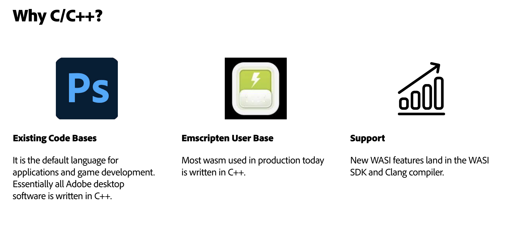
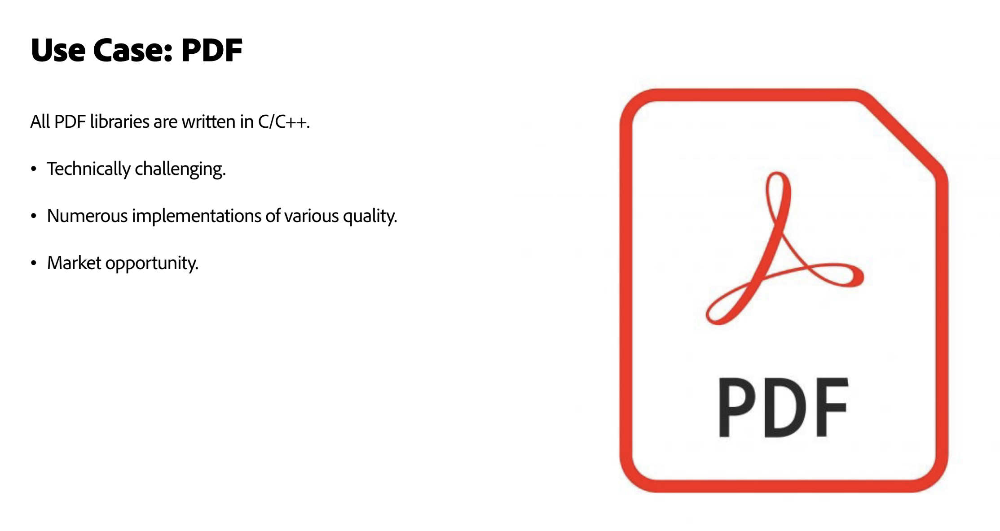
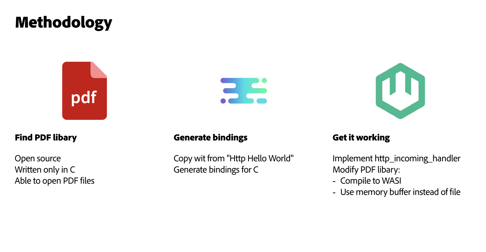
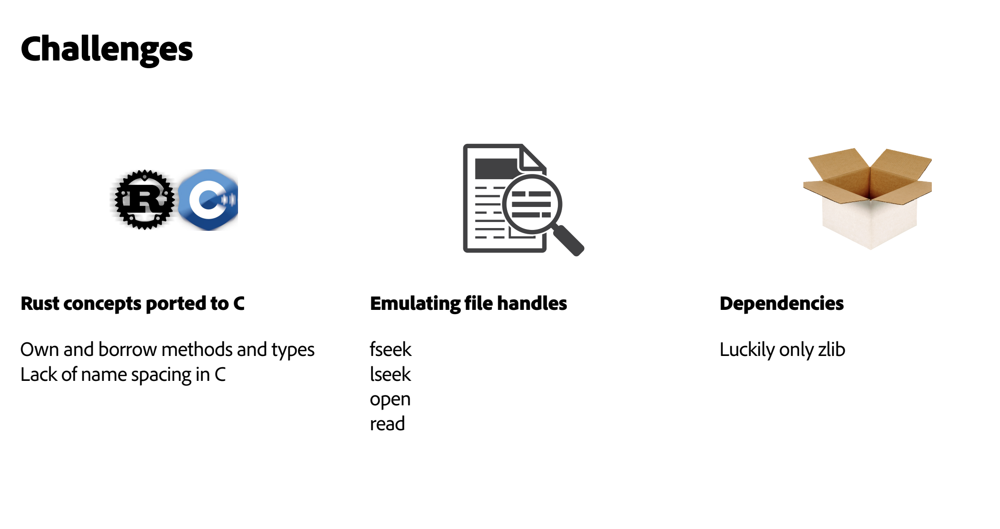

At Adobe, the use cases for WebAssembly (Wasm) continue to grow, as do the languages that can be compiled to core Wasm—Rust, Go, Python, .Net, C#, C, Javascript, and more. Adobe's engineers are long-time CNCF wasmCloud collaborators and community members. Some may already be familiar with the [successful project](https://www.cncf.io/blog/2022/11/17/better-together-a-kubernetes-and-wasm-case-study/) undertaken by Adobe's Senior Software Engineers [Colin Murphy](https://github.com/cdmurph32/) and [Sean Isom](https://github.com/seanisom) to bring wasmCloud to Adobe's Kubernetes architecture. This early project is now spurring fresh innovation across the company.

This time, at wasmCloud Innovation Day, Colin discussed the benefits and challenges of compiling C and C++ to Wasm components using wasmCloud. C is used by around 20% of developers and often found in files and operating systems. Used by nearly a quarter of developers worldwide, C++ is often used for systems and software development.

*Top 20 most used languages used by developers worldwide, 2024. Source: [Statista](https://www.statista.com/statistics/793628/worldwide-developer-survey-most-used-languages/)*

In his talk, Colin detailed the creation of a PDF text extraction component, noting the technical challenges such as emulating file handles in memory and dealing with Rust concepts in C bindings. The component, written in C, is less than 1 MB without optimization. Murphy aims to build momentum within Adobe for using these components on devices at the edge for more efficient PDF processing.

Colin discussed his experience writing the application and explored the suitability of Wasm for sharing portable, polyglot, open source PDF libraries. Watch the talk below, and we’ve dropped in a handy summary, and the full transcription below. You can also [check out the demo on GitHub](https://github.com/cdmurph32/pdf-text-example).

TK RECORDING

## Topics covered

- [**Introduction**](#introduction): Colin Murphy, Senior Engineer at Adobe, covers his work on integrating wasmCloud with Adobe's Kubernetes infrastructure. He discusses the importance of supporting C and C++ given their prevalence and introduces a novel PDF processing use-case as a technically challenging and relevant example for wasmCloud.

- [**Goals and challenges**](#goals-and-challenges): Colin discusses the goals for the PDF library and initial challenges in implementation, including work with file handles and binding generation.

- [**Overcoming technical hurdles**](#overcoming-technical-hurdles): Colin explores modifications made to the PDF library to work with memory buffers instead of file handles, including emulating standard file operations like seek and read. He discusses the challenges of dealing with Rust concepts in C bindings, such as name spacing and duplicate functions, and the need to address these issues for a usable example.

- [**Demo: PDF text extraction component**](#demo-pdf-text-extraction-component): Colin demonstrates the PDF text extraction component, showing how it operates, and explains how to overcome the limitations of the current library. He mentions the inclusion of additional files and code in the PR to help others understand request handling, and the complexities involved in reading headers and handling pointers.

- [**Q&A and future plans**](#qa-and-future-plans): Questions on LLVM stack memory and the need to set the right stack size, as well as the blocking read/write issues in current Rust examples.

## Transcript

### Introduction

My name is Colin Murphy&mdash;I work at Adobe. I'm going to talk about C and wasmCloud. We currently don't have many examples in the wasmCloud examples repo. In the course of preparing for this, I did find one example in a gist. We should have C and C++ examples because, firstly, in the embedded and desktop application space, and the gaming space, C++ is still the king.

All of the Adobe desktop software, all of our WebAssembly is written in C++ with the small exception of the content authenticity initiative, which is written in Rust. We have a lot of WebAssembly users out there for inscription, and we want them to write WASI applications as well. Another reason why C++ is a good thing to support in wasmCloud is because it's supported in WASI, although although there are not many examples. But there's the WASI SDK which has been built into the Clang compiler. It's there so we just need to expose it and create good examples for people.

### Goals and challenges

This example is PDF. I wanted something that was technically challenging; a little more than just "hello world"; something you'd send to a printer and can be rendered on a monitor. There are lots of implementations: they're all written in C or C++ and they're of varying quality. This is something that we probably want at Adobe: there are many PDFs in open source format and there are many use cases for running PDF functionality. We call them verbs on the edge and in various places.

How did we do it? Firstly I defined a PDF library. I wanted it to be open source so I could put it out there on the web. I wanted it to be somewhat functional, so that I wouldn't get in trouble by changing it too much. And it had to be written only in C, just to make it easier for `clang` and the WASI C SDK, with a lack of exception handling and various things. In WASI, it's just easier to just go straight C, although not impossible to do C++, but I only had a few days to do this, and it had to be able to open PDF files, which is actually something that not a lot of libraries out there do.

I wanted to be able to give it a PDF and have it spit out the text of the PDF. So, to generate the binding I used `wit-bindgen`, in the same way it's built into wash for the other languages, but not yet for C. So I just had to generate the bindings for C. I then had to get it working, which is always 99% of everything. There was that one gist I found for implementing an HTTP incoming handler. Initially it didn't work, but It was pretty trivial to get it working.

### Overcoming technical hurdles

The real challenge was modifying that PDF library. So all PDF libraries use file handles because they have been around for 40 years; there wasn't a lot of working memory when PDF libraries first came out. And PDFs can be very large, so we’re used to working with PDFs on disk. That doesn't really work for WASI. Firstly, it gets complicated because we don't have the full suite of file opening and writing capabilities by design, so I had to use a memory buffer.

I'm going to post a whole PDF that exists in a memory buffer. I need that PDF library to work on it in a memory buffer, and hat’s the big challenge. I am emulating what a file handle could do. So F, seek, LC, token, read, I didn't do writing, but, you know, kind of do that the standard set of things. Maybe we can build those into build some kind of functionality into the wasI, SDK or wasm cloud.

The other challenge was that, when you generate the bindings, they there are a lot of Rust concepts. There's the main Rust concept of owning and borrowing, and those create duplicate functions. And there's also a lack of name spacing, so the methods and types of the package get added at the beginning. This makes it harder to kind of make an example that everyone can use when, when the name of your package is on every single type and method.

There's a PR I've proposed for the wasmCloud example repo to add a C example, so you can all see that. Dependencies are always really hard in C and C++; anyone who's done C and C++ knows that lots of times it will be one build toolchain for one package and another for another, which can be terrible. What was nice with this library I chose to PDF to, the only dependency is wasi-lib, and you already know that works. I do want to demo then, if we have time, I'd like to go over a few more of the challenges I faced.

### Demo: PDF text extraction component

So here I have the PDF text. I made a word AMP file, and copied it from the Rust example 'hello world'. I've got a component, and I've got the server, and I have the basic PDF I'm going to give it. It was actually the limitation in the library, not that this thing can't handle pictures without crashing. So this is a very minimal example. As you can see, this is a test PDF. There is more in this example that I included. There's more in this little thing. And also I included in the example, in the PR, just to kind of work what that request comes in as, because it's, see, you're doing some it's not, it's not a, you know, nicely packaged for you, the headers and and such.

Here it is. Anyone can grab it and you'll find it's all in here. There were some changes to PDF.io, but you'll see there's a lot more stuff you have to deal with. It's not as easy to get started. The challenge I really banged my head against was LLVM shadow stack memory. I kept rolling the pointer over the stack; there was just so much depth of function calls, it got to the point where, for a 32 bit system with a one megabyte stack, it's pretty easy to roll over the stack pointer. It's a little confusing, because there's a stack pointer in LLVM and there's also a stack pointer in `clang`, and you have to make sure you set the right stack size. So thanks to Pat Hickey on that one.

The other thing Brooks helped me out with was the blocking read and write. That's in the Rust examples. You actually can only read up to four kilobytes at a time in the HTTP handler. So you have to keep looping. And then, when you write, you have to keep looping through and writing out using `wasmtime serve`. I know we're getting there with the wasmCloud host, but Wasmtime serve was a little more verbose when things went bad.

I worked on this on my Linux machine and on a Mac. That could be a challenge as well, because X code and system libraries are in different places. But I made to be all in one it's an all in one package. Here are a few things you need, but it’s just a make file and it just builds everything. So it should not be intimidating if you want to test it out. And maybe somebody can get PDF.io to be able to actually take text from complex PDFs.

### Q&A and future plans

**Brooks**: What's the plan for this component? Now that you have this component that's written in C and processing PDFs, and you can deploy it on wasmCloud, where are you going from here with this app?

**Colin**: I have some traction. But I'd like to build some momentum within Adobe for our own proprietary PDF libraries to build this out into a component. Passing an entire PDF is expensive in network costs and in user time. So if we can process that out on the edge, especially for mobile or small devices, that can be really useful. As I said before, we really think of PDFs in terms of different verbs and different actions with PDFs, and we can compile each one of those actions into a different Wasm component.

**Brooks**: How big did this component end up being?

**Colin**: I got it to 947 kilobytes. But I did not, I did not optimize and compile it. So it's less than a megabyte without anything stripped out. So hopefully it could be much smaller.

**Brooks**: That's great to hear. A Rust component, I think, usually comes in at about like two megabytes. Then, once you strip debug symbols, it comes in anywhere from like 100 to 200 kilobytes. So I bet this one was probably pretty small.