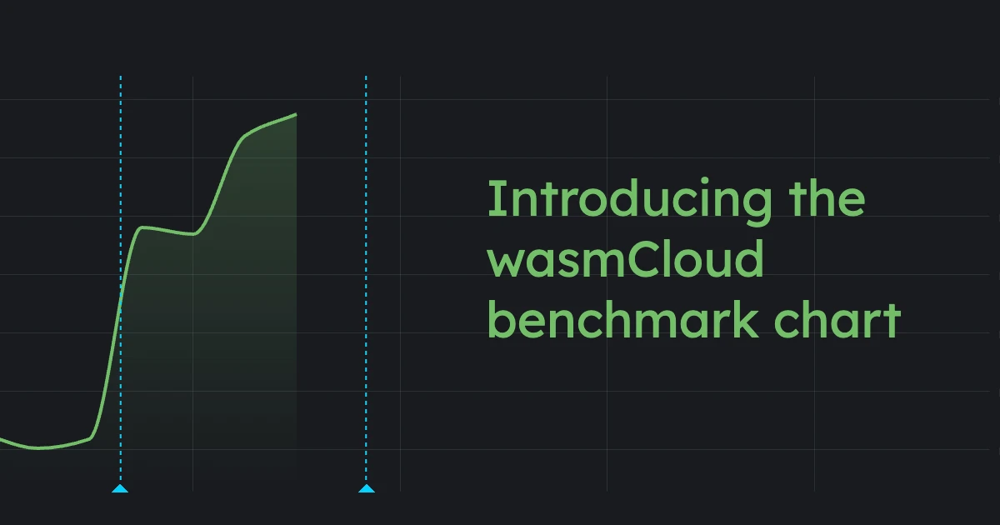
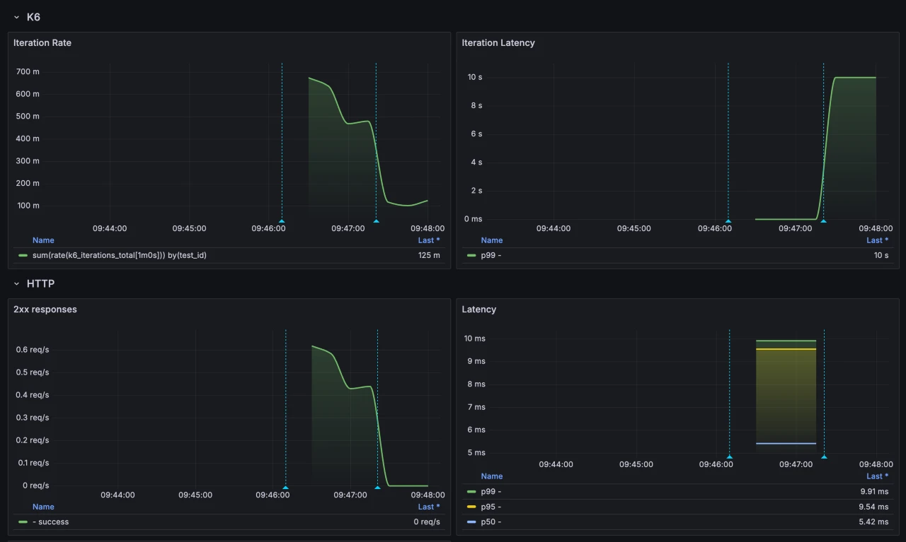

As wasmCloud adoption has accelerated, we've seen an increased demand for more sophisticated benchmarking options. To fulfill this need, wasmCloud maintainer [Taylor Thomas](https://github.com/thomastaylor312) recently introduced a new [**wasmCloud `benchmark` Helm chart**](https://github.com/wasmCloud/wasmCloud/tree/main/charts/benchmark) for users running wasmCloud on Kubernetes. 

In this post, we'll explore how the chart works and demonstrate how to use it. 

## The need for speed (tests)

Robust benchmarking is important for enterprise wasmCloud users and wasmCloud contributors alike:

* Enterprises need to be able to evaluate platform performance.
* wasmCloud contributors need to be able to assess how their changes to the codebase affect performance.

The wasmCloud project is in the process of securing infrastructure hosted by the Cloud Native Computing Foundation (CNCF) for regular benchmarking on the project, since it's important to test in a stable, isolated, production-like environment. 

In the meantime, users can try out the `benchmark` chart for themselves. The chart includes a self-contained observability and benchmarking stack that uses Grafana's open source [**k6** load-testing tool](https://k6.io/) for the actual benchmarking:

* Grafana
* Loki
* Tempo
* Prometheus
* OpenTelemetry signal collectors 
* k6 operator 

The `benchmark` Helm chart makes it easy to install (and uninstall) this stack at the push of a button.

## Deploying the benchmark chart

To test the chart, you'll first need a Kubernetes cluster with wasmCloud deployed on it. You can get wasmCloud running on a local `kind` cluster following the [Kubernetes guide in the wasmCloud documentation](https://wasmcloud.com/docs/deployment/k8s/).

Once you've got a Kubernetes cluster with wasmCloud, deploy the [`hello-world` application from the Kubernetes guide](https://github.com/wasmCloud/wasmcloud-operator/blob/main/examples/quickstart/hello-world-application.yaml):

```shell
kubectl apply -f https://raw.githubusercontent.com/wasmCloud/wasmcloud-operator/main/examples/quickstart/hello-world-application.yaml
```

To install the `benchmark` chart:

```shell
helm upgrade --install my-benchmark --version 0.2.0 oci://ghcr.io/wasmcloud/charts/benchmark --wait --set test.url=http://hello-world:8000
```

When you run this command, `test.url` is a required value that specifies a URL (accessible from within the Kubernetes cluster) that the benchmark will test against. Typically this will be a component with an HTTP service&mdash;the `hello-world` application will work just fine. 

k6 load-testing works by simulating a given number of requests from a given number of virtual users. The default configuration is suitable for a production-grade environment; if you're testing out the installation and usage on something a little humbler (like a local kind cluster), you may want to modify the test via a `values.yaml` file. You can set criteria like arrival rate, test duration, and maximum virtual users:

```yaml
test:
  scenarios:
    default:
      rate: 1000
      duration: "1m"
      preAllocatedVUs: 25
      maxVUs: 500

```

:::note[]
If you'd like to experiment with k6 on its own in a local environment, the [k6 dashboard](https://github.com/grafana/xk6-dashboard) is a fantastic tool.
:::

Once the `benchmark` chart is successfully installed, the tests will start automatically. Running this command will let you know when tests are complete:

```shell
kubectl wait -n default --timeout 90s --for=jsonpath='{.status.stage}'=finished testruns/my-benchmark-test
```

You can get the logs and output of the test by running:

```shell
kubectl logs -n default -l k6_cr=my-benchmark-test,runner=true --tail=-1
```

Each test outputs a ConfigMap (named after the test pod) with a key named `results`&mdash;this is a JSON object containing the summary results. To get a JSON array of the results:

```bash
kubectl get cm -n default -o json -l chart-revision=1,k6-result=true,k6-test-name=my-benchmark-test | jq  '[.items[].data.results | fromjson ]'
```

With results in a JSON array, users can go on to process and store the result data in whatever way makes sense for their needs.

To view dashboards during or after your tests, you can port-forward to the chart's Grafana instance:

```shell
kubectl port-forward -n default svc/my-benchmark-grafana 3000:80
```
Then open http://localhost:3000 in your browser and navigate to the "Test Environment" dashboard in the dashboards section.



When you're done, you can clear the test results by running:

```shell
kubectl delete cm -n default -l k6-result=true,k6-test-name=my-benchmark-test
```

For advanced options, see the [chart's GitHub repo](https://github.com/wasmCloud/wasmCloud/tree/main/charts/benchmark#advanced-usage). 

## Next steps

The `benchmark` chart is a rapidly developing project&mdash;watch [the GitHub repo](https://github.com/wasmCloud/wasmCloud/tree/main/charts/benchmark) for new developments in the chart&mdash;and dedicated benchmarking infra&mdash;in the near future. 

If you'd like to learn more about benchmarking with wasmCloud or get involved with the project, join us in the [wasmCloud Slack](https://slack.wasmcloud.com/) or at a [wasmCloud community meeting](https://wasmcloud.com/community/). We'd love to hear your thoughts on how we can make benchmarking even better!