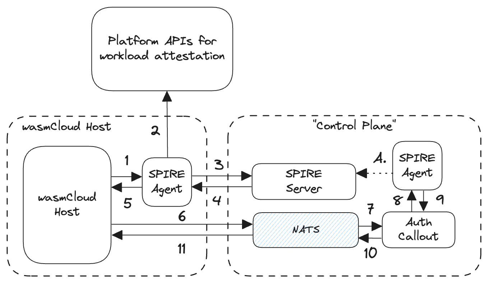

import BedaTweet from './images/spiffe-beda-twitter.png';

As both infrastructure and application patterns grow more complex, establishing identity for software workloads becomes more and more crucial. In order to interact correctly and securely, the various parts of an application should be able to verify the identities of the other parts (i.e., the other workloads).

All of the major cloud providers and many of the major orchestrators have introduced their own workload identity systems, but few have approached it from the angle of establishing **universal identity** that stretches across vendors or systems.

In the last few years, the [**Secure Production Identity Framework for Everyone (SPIFFE)**](https://spiffe.io/docs/latest/spiffe-about/overview/) has been gaining industry-wide adoption, and it is an excellent fit for our own distributed workload orchestrator. In this post, we’ll explore the specification’s background and explain why wasmCloud is adopting SPIFFE as the standard for introducing workload identity that spans on-prem, edge, and cloud estates.

## **The history of SPIFFE for workload identity**

Joe Beda popularized the concept of workload identity in the cloud native community, with Beda mentioning it on Twitter in March 2016:

A reply asks whether the acronym “LOAS” can be shared publicly, because it refers to an internal Google system to establish “[cryptographic identities for all jobs that run on [the company’s] infrastructure](https://youtu.be/K7EN-1FW8zY?t=1830).”

Much as Google’s internal Borg system served as the inspiration for Kubernetes, the open source SPIFFE and SPIRE projects (hosted by the Cloud Native Computing Foundation) were inspired by LOAS. By the end of 2017, there was a [talk introducing SPIFFE at KubeCon NA](https://www.youtube.com/watch?v=ikmxZdZRTio&t=6s).

In 2024, the Internet Engineering Task Force (IETF) established a working group dedicated to [Workload Identity in Multi System Environments (wimse)](https://datatracker.ietf.org/doc/charter-ietf-wimse/), and today, SPIFFE is really the best open source representation of what the IETF is working toward.

SPIFFE provides an open standard for establishing and asserting identity between the various parts of an application in a distributed system. Put another way, SPIFFE is a framework for asserting trust between software components in zero-trust circumstances.

Where SPIFFE provides a specification for identifying workloads in “heterogeneous environments,” [SPIRE](https://spiffe.io/docs/latest/spire-about/spire-concepts/) is a reference implementation of the SPIFFE specification, which among other things includes a definition of the APIs for attesting workload identity.

When implementing SPIFFE, Unique Resource Identifiers (URIs) called SPIFFE IDs are assigned to all workloads, and SPIFFE IDs are assigned within a given “**trust domain**.” The [SPIFFE documentation](https://spiffe.io/docs/latest/spiffe-about/spiffe-concepts/#trust-domain) explains:

> A trust domain could represent an individual, organization, environment or department running their own independent SPIFFE infrastructure. All workloads identified in the same trust domain are issued identity documents that can be verified against the root keys of the trust domain.

Workloads can then request **SPIFFE Verifiable Identity Documents (SVIDs)**, which represent a given **SPIFFE ID** in the form of a cryptographically verifiable JSON Web Token (also known as a JWT-SVID) or X.509 certificate (X509-SVID).

## **Using SPIFFE and SPIRE for WebAssembly workload identity**

The SPIFFE specification is designed for identifying workloads across heterogeneous environments: a use-case that sounds an awful lot like wasmCloud, where distributed WebAssembly workloads may span clusters, clouds, edges, and even on-prem data-centers.

Other platforms and orchestrators have their own approaches to the question of workload identity:

- Kubernetes uses ServiceAccounts to assign unique identity to entities within a cluster and enable Role-based Access Control or service authentication.
- HashiCorp’s Nomad includes a workload identity feature in which JWTs are used to verify the identities of workloads.

Each major cloud provider has their own implementation of workload identity, too. But in each of these cases, the problem is that their identity systems are primarily focused on serving the needs of their own particular contexts.

In the case of wasmCloud, you might be running on any infrastructure provider, or none of them. You might be running on Kubernetes or standalone, and your workloads might need to assert identity across a set of heterogeneous environments.

We need to establish universal identity no matter where your workloads are located. Our [workload identity RFC](https://github.com/wasmCloud/wasmCloud/issues/4111) explains the proposal for how this is to be implemented in wasmCloud, based on SPIFFE as the underlying standard and SPIRE as the deployable reference implementation, as an optional feature.

The RFC explains the flow for connecting to NATS with workload identity:

Steps in the diagram:

> 1. When the wasmCloud host starts, it requests it's identity from the local SPIRE Agent via the SPIFFE Workload Endpoint (configured via `SPIFFE_ENDPOINT_SOCKET`)
> 2. The local SPIRE Agent performs workload attestation for the host against the configured workload attestation plugin.
> 3. If the attestation is successful, the SPIRE Agent reaches out to the SPIRE Server to request the SVID for the wasmcloud host
> 4. SPIRE Server issues the SVID for the workload and responds back to the Agent
> 5. SPIRE Agent returns the issued SVID back to the requesting wasmCloud Host.
> 6. At this point, the wasmCloud host sends a CONNECT request to the configured NATS Server providing the newly issued SVID (as JWT) as NATS authentication token
> 7. NATS Server sends an authorization request to configured Auth Callout service with the connecting wasmCloud host's details.
> 8. The Auth Callout service calls the SPIFFE Workload API to validate the provided SVID (as JWT)
> 9. The SPIRE Agent validates the SVID against the configured Trust Domain and the expected Audience
> 10. If successful, the Auth Callout Service generates a set of NATS User Claims that map the Host to the appropriate NATS Account and returns a success response back to NATS Server.
> 11. NATS Server indicates back to the client that the connection was successful.

Work on an experimental implementation of this proposal is [currently underway](https://github.com/wasmCloud/wasmCloud/pull/4118).

## **Looking forward**

We’re excited to see how organizations leverage workload identity in wasmCloud once it lands. In the meantime, if you’d like to chat about the project’s use of SPIFFE and SPIRE, please join us in the [wasmCloud Slack](https://slack.wasmcloud.com/) or in a [weekly wasmCloud community meeting](https://wasmcloud.com/community/)&mdash;we’d love to hear from you!