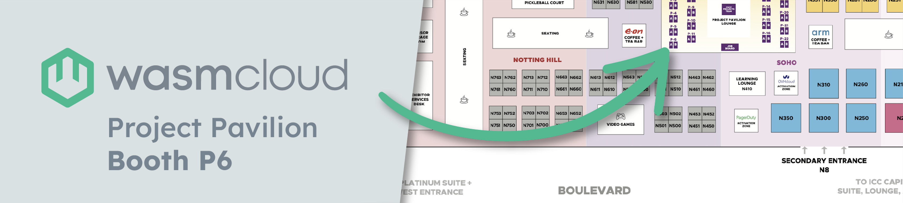

In London for KubeCon + CloudNativeCon Europe 2025? Hey, us too! Join us at the **wasmCloud project booth** on Wednesday afternoon/evening, and make sure to check out talks from wasmCloud maintainers and contributors. 

### **[KubeCon + CloudNativeCon Europe, 1-4 April, 2025: London](https://events.linuxfoundation.org/kubecon-cloudnativecon-europe/register/?utm_source=google&utm_medium=paid-search&utm_campaign=kubecon-eu-2025&utm_term=events-kubecon-europe-2025-cncf-kubeconeu&utm_content=events-kubecon-europe-2025-cncf-kubeconeu-rsa-eventregpage&gad_source=1&gclid=Cj0KCQjw-e6-BhDmARIsAOxxlxW2EUXxgTijrQvvRRwxeE2x93yBw8Ui7VYZQF5q4aVyzTWWL3Lv1IYaAivQEALw_wcB)**

#### Co-Located Events, Tuesday 1st April

#### ⚡[Project Lightning Talk: The Super Fast TAG Runtime Wasm Review](https://sched.co/1tcuY) 
**Taylor Thomas, Wasm WG Chair**  
Tuesday April 1, 2025 09:24 - 09:29 BST  
[Platinum Suite | Level 3](https://kccnceu2025.sched.com/venue/Platinum+Suite+%7C+Level+3)

Join Taylor for the fastest review of the CNCF Wasm Ecosystem you've ever seen. This talk will give you the (literal) 30 second overview of Wasm before a rapid fire review of the projects and advancements in the CNCF Wasm ecosystem. This will be a super fast, one-stop shop for all updates Wasm.

#### ⚡ [Lightning Talk: Meshin’ With WebAssembly: Taking Linkerd Beyond Containers](https://sched.co/1u5jI) 
**Joonas Bergius, Cosmonic**  
Tuesday April 1, 2025 14:50 - 15:00 BST  
[Level 3 | ICC Capital Suite 14-16](https://colocatedeventseu2025.sched.com/venue/Level+3+%7C+ICC+Capital+Suite+14-16)

Much in the same way that Service Meshes have (as originally pioneered by Linkerd) accomplished for seamlessly connecting, observing and securing service-to-service communication between applications deployed in containers, WebAssembly on the server side is looking to revolutionize the way we think about and enable application development and delivery of the future.

This session explores Cosmonic’s efforts to bring together the two cutting edge CNCF projects, Linkerd and wasmCloud, to enable end-users to expand their mesh to service an entirely new class of workload in the form of WebAssembly, without leaving behind their existing tooling.

Attendees will gain an understanding of how you can extend your Linkerd deployments to support WebAssembly workloads in order to leverage the emerging paradigm on the server-side without compromising on security or observability.

#### Main Event

#### [Wasm I Right or Wasm I Wrong? a Review of the Wasm Ecosystem](https://sched.co/1tcxS)
**Taylor Thomas, Cosmonic & David Justice, Microsoft**  
_**Maintainer track**_  
Wednesday April 2, 2025 12:00 - 12:30 BST  
[Level 3 | ICC Capital Suite 14-16](https://kccnceu2025.sched.com/venue/Level+3+%7C+ICC+Capital+Suite+14-16?iframe=yes&w=100%&sidebar=yes&bg=no)

WebAssembly (Wasm) has long been touted as the next era of compute, with its portability, security, and efficiency. But many people still question if it is ready for production usage. Once rooted in browsers, Wasm has found a home at the edge, in serverless platforms, and in many of the CNCF projects you know and love. 

Early experiments often meant fumbling with custom ABIs, but the advent of the component model makes interoperability and composability a breeze. In this talk, David and Taylor, two of the Wasm WG chairs, will cover Wasm’s journey from its browser origins to its role as a building block of cloud-native applications. 

They’ll show how CNCF projects are leveraging Wasm today, from spinning up services to extending existing stacks, all without getting bogged down in bespoke ABIs. They’ll conclude with a candid discussion about the component model, its strengths and weaknesses, and how we can all successfully use it in our projects today.

#### [Wasm Whiplash: wasmCloud's Wild Ride To Standards](https://sched.co/1tcz9)
**Brooks Townsend, Cosmonic**  
Thursday April 3, 2025 11:45 - 12:15 BST  
[Level 3 | ICC Capital Suite 7-9](https://kccnceu2025.sched.com/venue/Level+3+%7C+ICC+Capital+Suite+7-9)

Everybody loves a standard. The CNCF contains many products and projects that integrate with well-defined standards—allowing them to focus on their own goals. See OpenTelemetry (OTEL) for example, the widely used standard for traces, logs and metrics and the second-most contributed to project in the CNCF (only behind Kubernetes).

In 2019, wasmCloud started as a hand-crafted WebAssembly (Wasm) application platform. We used our own IDL, codegen, and FFI protocol. Over the last five years we’ve broken down these proprietary bits one by one, rebuilding them around WASI 0.2 to become the incubating platform we are today.

This talk will use wasmCloud as a backdrop to explore innovative new standards in the cloud and Wasm-native spaces, and why they matter. Attendees will learn why a platform built on standards leads to greater collaboration and the pitfalls of not using those standards based on what we learned from wasmCloud’s evolution towards being the best platform to run Wasm in production.

#### [SPIFFE in Practice: Universal Identity for WebAssembly Workloads](https://sched.co/1tx8U)
**Joonas Bergius, Cosmonic & Colin Murphy, Adobe**  
Thursday April 3, 2025 15:00 - 15:30 BST  
[Level 1 | Hall Entrance S10 | Room C](https://kccnceu2025.sched.com/venue/Level+1+%7C+Hall+Entrance+S10+%7C+Room+C)

Universal Identity (or Workload Identity) is a foundational concept that underpins every secure platform. When implemented well, it provides the platform and security teams the ability to reason about the entities running on their platform and the interactions between them.

SPIFFE has become the industry standard for establishing Identity that can be used to authenticate across all major cloud providers, on various workload platforms, even to an increasing number of third-party services. As SPIFFE adoption across various CNCF projects is growing, WebAssembly workloads present some unique challenges to simply lifting and shifting from what’s been done before.

This talk will cover the journey CNCF wasmCloud underwent in adopting SPIFFE as the foundation for providing Secure Production Identity for the WebAssembly Workloads running on the platform. Joonas and Colin will share the lessons we learned from our journey, starting out with a concept to then bringing it all the way to production.

#### 🤔🔧 [Can You Maintain 1000 Apps? wasmCloud & K8s: The Ultimate Golden Template](https://sched.co/1txB3)
**Liam Randall, Cosmonic**  
Thursday April 3, 2025 15:00 - 15:30 BST  
[Level 0 | ICC Capital Hall | Room I](https://kccnceu2025.sched.com/venue/Level+0+%7C+ICC+Capital+Hall+%7C+Room+I)

You can deploy 1,000 applications to Kubernetes, but can you maintain them? Kubernetes excels as an infrastructure abstraction, but today's application management demands better abstractions for applications and their capabilities. This talk introduces CNCF wasmCloud (incubating) as the ultimate golden template for platform engineering. With wasmCloud, you can manage common capabilities like blob stores, HTTP, messaging, and secrets centrally, enabling pluggable, reusable components that scale. 

wasmCloud simplifies migrations and secures operations across diverse computing environments—essential as data locality laws balkanize the world's compute. By shifting to pluggable capability abstractions, platform engineers can update thousands of apps at once while freeing development teams to focus on building their business logic. This demonstration-heavy talk is based on real world adoption and deployments across the F100 in financial services, tech, and the startup ecosystem.

#### **Come and say hello!**

Remember to check out the **wasmCloud project booth** on the afternoon of Wednesday, 2 April to catch up with wasmCloud maintainers and community members&mdash;and don’t forget join the [wasmCloud Slack](https://wasmcloud.slack.com/) to keep the conversation going!