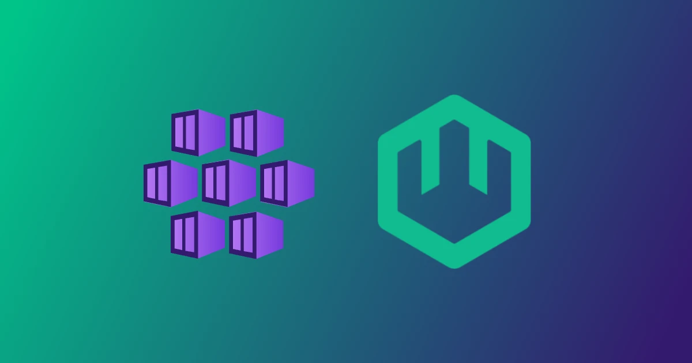

The wasmCloud docs include a growing collection of guides for deploying wasmCloud to Kubernetes clusters hosted by cloud providers, including [AWS Elastic Kubernetes Service (EKS)](https://wasmcloud.com/docs/deployment/k8s/aws-eks/), [Google Kubernetes Engine (GKE)](https://wasmcloud.com/docs/deployment/k8s/gcloud-gke/), and [Akamai Linode Kubernetes Engine (LKE)](https://wasmcloud.com/docs/deployment/k8s/akamai/).  

Now you can find guides for deploying to Microsoft's **Azure Kubernetes Service** in both the [wasmCloud](https://wasmcloud.com/docs/deployment/k8s/azure-aks/) and [Azure documentation](https://learn.microsoft.com/en-us/azure/aks/wasmcloud). 

In this blog, we'll walk through the basics of a wasmCloud deployment on AKS, including how it works, the tools you'll need to get started, and a quickstart for a simple deployment.

## wasmCloud on AKS

When you deploy to Kubernetes, wasmCloud [hosts](/docs/concepts/hosts/) run inside of Kubernetes pods, and [WebAssembly components](/docs/concepts/components/) run on those hosts. wasmCloud's unique primitives are represented as [Kubernetes custom resources](https://kubernetes.io/docs/concepts/extend-kubernetes/api-extension/custom-resources/), so you can manage them with `kubectl` (or other tooling that uses the Kubernetes API) the same way you would with any other Kubernetes resource. You can also use port-forwarding to connect to the deployed wasmCloud environment with the `wash` CLI on your local machine.  

wasmCloud is deployed to Kubernetes using a Helm chart, so to get started deploying to AKS you'll need the following:

* A free [Azure account](https://azure.microsoft.com/free/)
* [`kubectl`](https://kubernetes.io/docs/tasks/tools/#kubectl)
* [Helm](https://helm.sh/docs/intro/install/)
* An AKS cluster (you can create one with the [Azure CLI for Mac/Linux](https://learn.microsoft.com/en-us/azure/aks/learn/quick-kubernetes-deploy-cli), [PowerShell](https://learn.microsoft.com/en-us/azure/aks/learn/quick-kubernetes-deploy-powershell), or the [Azure web portal](https://learn.microsoft.com/en-us/azure/aks/learn/quick-kubernetes-deploy-portal)) 

Once you have all of your prerequisites squared away and `kubectl` is set to work with your AKS cluster, you're ready to deploy. 

For the purposes of this blog, we'll keep things simple and high-level&mdash;if you'd like a deeper dive on the patterns and elements of the deployment, including options and alternative approaches, see the [Deploying wasmCloud on Kubernetes](https://wasmcloud.com/docs/deployment/k8s/) documentation.

First we'll use Helm to install the `wasmcloud-platform` chart:

```shell
helm upgrade --install \
    wasmcloud-platform \
    --values https://raw.githubusercontent.com/wasmCloud/wasmcloud/main/charts/wasmcloud-platform/values.yaml \
    oci://ghcr.io/wasmcloud/charts/wasmcloud-platform:0.1.2 \
    --dependency-update
```

We can use `kubectl rollout` and `kubectl wait` to make sure all of the necessary pieces of the deployment are ready:

```shell
kubectl rollout status deploy,sts -l app.kubernetes.io/name=nats
```
```shell
kubectl wait --for=condition=available --timeout=600s deploy -l app.kubernetes.io/name=wadm
```
```shell
kubectl wait --for=condition=available --timeout=600s deploy -l app.kubernetes.io/name=wasmcloud-operator
```

Now we'll use Helm again to create a wasmCloud host:

```shell
helm upgrade --install wasmcloud-platform \
  --values https://raw.githubusercontent.com/wasmCloud/wasmcloud/main/charts/wasmcloud-platform/values.yaml \
  oci://ghcr.io/wasmcloud/charts/wasmcloud-platform \
  --dependency-update \
  --set "hostConfig.enabled=true"
```

When the deployment succeeds, you'll get this response:

```shell
✨ Congratulations! Your wasmCloud platform has been deployed successfully.
   - 🛀 To use the wash cli with your new wasmCloud platform, run:
    kubectl port-forward service/nats 4222:4222 4223:4223

   - 🗺️  To launch the wasmCloud dashboard on http://localhost:3030, in a different terminal window, run:
     wash ui
```

Now you're ready to run WebAssembly components on your cluster! Our Rust-based "Hello world" component makes a good test. We can deploy the [manifest](https://raw.githubusercontent.com/wasmCloud/wasmcloud-operator/main/examples/quickstart/hello-world-application.yaml) straight from GitHub using `kubectl`:

```shell
kubectl apply -f https://raw.githubusercontent.com/wasmCloud/wasmcloud-operator/main/examples/quickstart/hello-world-application.yaml
```

You can verify that the deployment succeeded with the `application` custom resource:

```shell
kubectl get application
```

```shell
APPLICATION   DEPLOYED VERSION   LATEST VERSION   STATUS
hello-world   v0.0.1             v0.0.1           Deployed
```

The component itself is running inside a host pod. Since the manifest uses a daemonscaler, your wasmCloud deployment automatically created a Kubernetes service to expose the component on the cluster. You can reach the component by port-forwarding the host pod:

```shell
WASMCLOUD_HOST_POD=$(kubectl get pods -o jsonpath="{.items[*].metadata.name}" -l app.kubernetes.io/instance=wasmcloud-host)
```
```shell
kubectl port-forward pods/$WASMCLOUD_HOST_POD 8000
```
Now we can `curl` the application from our local machine:

```shell
curl http://localhost:8000
```

You should get the response:

```plaintext
Hello from Rust!
```

If you'd like to try deploying something a little more substantial, check out our examples in [Go](/docs/examples/go/), [Rust](/docs/examples/rust/), and [TypeScript](/docs/examples/typescript/)&mdash;you could try...

* [A JSON converter in Rust](/docs/examples/rust/component/http-jsonify/)
* [A simple CRUD application in Go](/docs/examples/go/component/http-keyvalue-crud/)
* [A password checker in TypeScript](/docs/examples/typescript/component/http-password-checker/)

When you're ready to delete the cluster, see the [Clean up](/docs/deployment/k8s/azure-aks/#clean-up) section of our AKS deployment guide.

## Share your thoughts

Have questions about working with your AKS deployment? Want to see a deployment guide for another cloud? Join the [wasmCloud Slack](https://slack.wasmcloud.com/) or a [weekly community meeting](https://wasmcloud.com/community/) and let us know!