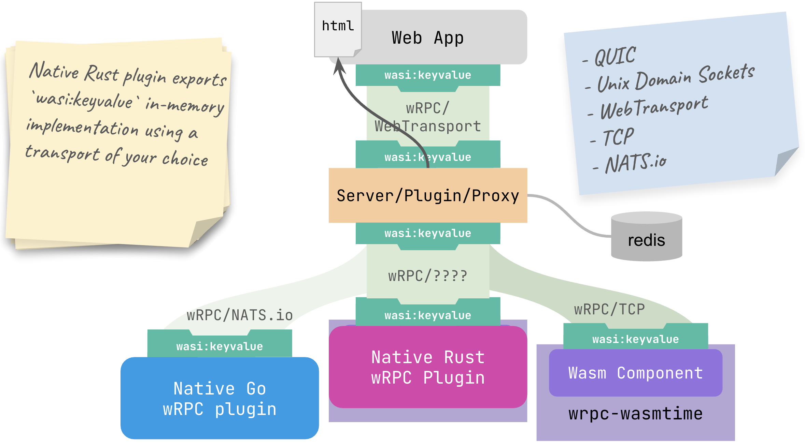

The wasmCloud core team&mdash;and our leading contributors, including Cosmonic&mdash;are steadfastly committed to open source, to the needs of our community, to the core tenants of software foundation membership, and to the Cloud Native Computing Foundation (CNCF). We are proud to license wasmCloud under Apache 2.0 and do not believe the Business Source License (BUSL) is open source in practice or philosophy. 

We’ve built wasmCloud around open standards such as the [WebAssembly System Interface (WASI)](https://github.com/WebAssembly/WASI), [WebAssembly Interface Types (WIT)](https://github.com/WebAssembly/component-model/blob/main/design/mvp/WIT.md), and [WebAssembly itself](https://www.w3.org/TR/wasm-core-2/), and our focus has always been on building, managing, and running standards-based WebAssembly components. From day one, we’ve championed pluggability, extendibility, and the philosophy that we build better together.

As longtime users of NATS.io, we were surprised to learn about the project’s proposed “exit” from CNCF and change to a BUSL license from the [CNCF's recent blog on the topic](https://www.cncf.io/blog/2025/04/24/protecting-nats-and-the-integrity-of-open-source-cncfs-commitment-to-the-community/). Like many in our community, we adopted and have actively contributed to NATS precisely because it has been a truly open source, foundation-led project. NATS has given us a lightweight, high-performance messaging backbone, and its CNCF stewardship has been a cornerstone of our confidence in its long-term stability.

Rest assured: the wasmCloud community will continue to build better together and remain unwaveringly committed to genuine open source. Across the project, we have designed our system around pluggable abstractions. Our primary communication protocol, [**wRPC**](https://github.com/bytecodealliance/wrpc), is fully compatible with&mdash;but not dependent upon&mdash;NATS. Licensed under Apache 2.0, wRPC is hosted by the Bytecode Alliance.

As we shared in our November 2024 presentation at KubeCon NA, wRPC is a transport-agnostic protocol and framework that can run over NATS, TCP, WebTransport, Unix Domain Sockets, or even QUIC. This flexibility ensures that wasmCloud hosts can choose the transport layer that best fits their security, performance, or operational requirements&mdash;without locking anyone into a single messaging system. Check out the talk here:

<iframe style={{paddingBottom: 25 + 'px'}} width="700" height="393.75" src="https://www.youtube-nocookie.com/embed/EYqZYXjCvkY?si=w_SBBINVNErB5El9" title="YouTube video player" frameborder="0" allow="accelerometer; autoplay; clipboard-write; encrypted-media; gyroscope; picture-in-picture; web-share" referrerpolicy="strict-origin-when-cross-origin" allowfullscreen></iframe>
  
Looking ahead on the wasmCloud roadmap, we’re already working on a slimmer, more pluggable host that makes it even easier to swap out transports or integrate new protocols. We believe that composability is the path to innovation: hosts should be light, components should be reusable, and ecosystems should thrive on choice.

To our community: Compatibility with event-driven architectures and message buses, including NATS&mdash;in any form or fork&mdash;will remain a goal of the project. At the same time, we will continue driving the adoption of WebAssembly components everywhere, ensuring compatibility without dependency&mdash;just as we’ve done with Kubernetes and other foundational technologies.

Thank you for your trust and collaboration. Together, we’ll keep pushing the boundaries of what WebAssembly can do in the cloud-native world.
