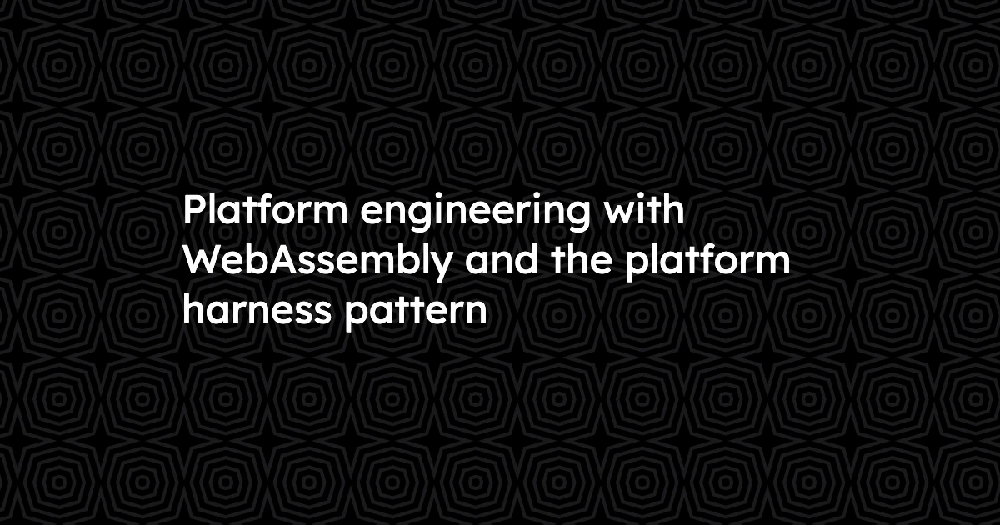
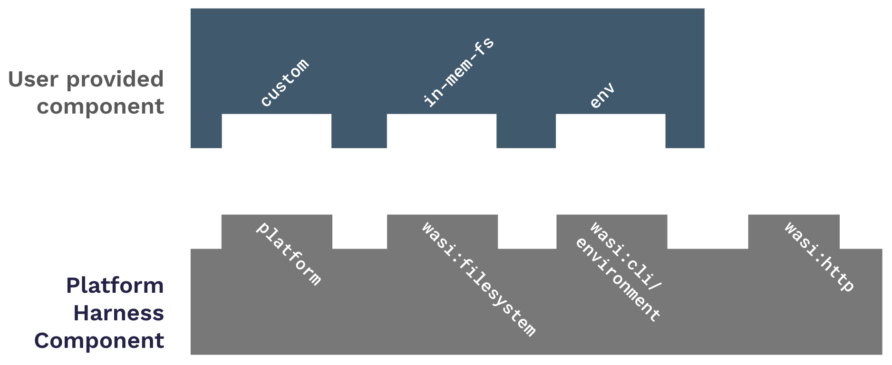
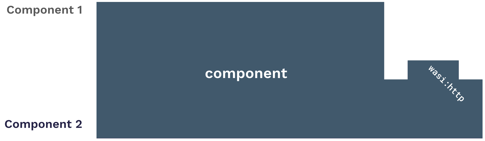

Today’s platform engineering patterns suffer from a wide chasm between principles and reality. Most platform engineers strive to cultivate systems that are efficient, flexible, and secure-by-default, but the container-powered status quo leaves much to be desired on each of those fronts. 

The unique features of [WebAssembly components](/docs/concepts/components/)&mdash;particularly the ability to combine multiple components into one&mdash;unlock new patterns that can solve persistent challenges for platform engineers. In this blog, we’ll take a look at what we call the “**platform harness**” pattern, and how it is enabling entirely new approaches to platform engineering.

## Problems with the status quo (containers)

The container-driven status quo that gave rise to platform engineering as a practice also presents significant obstacles to its success:

* **Security**: Containers are often deployed into unrestricted POSIX environments, which can enable vulnerabilities to escalate&mdash;and fixing a vulnerability often means innumerable teams have to hustle (and duplicate effort) to respond to vulnerabilities in a dependency or base image.

* **Efficiency**: Even the slimmest, most rigorously optimized containers have a cold start time greater than a network request&mdash;which means that apps have to run idle to be available with satisfactory latency. What’s more, containers are often quite large in footprint. All of this poses a challenge for density and raises costs.

* **Flexibility**: For all their relative portability, containers are still locked into specific deployment environments based on their kernel and architecture (and sometimes even their size).

Containers are well-suited to a lot of use cases, but they’re far from optimal for the cases where we use sidecars today. Here is where the new patterns facilitated by WebAssembly components present an evolutionary step forward.

## Components and the platform harness

**Components** are WebAssembly binaries that conform to an additional layer of standardized specification defined in the Component Model. That extra layer makes components…

* **Portable**: Components are simple, universal `.wasm` files that run anywhere there is a runtime supporting the component model, regardless of the OS or architecture. That means a given component can run anywhere&mdash;no need to schedule it to run only on certain hardware. 

* **Interoperable**: Regardless of the languages they’re written in, components can interact with one another over high-level APIs, meaning (for example) a Rust-based component can take advantage of a Go-based component’s Go libraries.

* **Composable**: Components written in different languages aren’t limited to interacting&mdash;multiple components can actually be combined into a single binary. Calls between composed components happen in *nanoseconds* as they run in the same process.

Taken together, these three qualities enable new patterns like the **platform harness**.

In a platform harness pattern, developer teams work on **user components** that use high-level, language-agnostic APIs for common functionality like in-memory filesystem access or environment variables, without worrying about exactly how that functionality will be fulfilled. 

When the user component is ready for deployment, a platform team can compose it with a platform component that satisfies various user component requirements. The platform component can also act as a **virtual platform layer**, providing a virtualized filesystem.

The final component is tiny, universal, and flexible. Because APIs are language-agnostic and tools exist to generate SDKs for many languages, the platform team supports multiple languages with APIs “for free.” Platform teams are empowered to shape traffic in real time, and can utilize and expand their suite of different types of invocation triggers (HTTP, messaging) for components.

Though they’re ultimately composed together, user components and platform components are decoupled&mdash;they have their own independent roadmaps, and development teams don’t have to concern themselves with changes to the platform component. 

Any vulnerabilities that arise at the platform level can be handled once, by the platform team. 

The platform harness pattern leverages the singular capabilities of WebAssembly components to take an evolutionary step forward for platform engineers, dramatically simplifying maintenance while accelerating development.

## Try it yourself

It’s easy to experiment with the platform harness pattern today. This [Wasm-powered demo of a cross-border and cross-language payment solution](https://github.com/cosmonic-labs/wasmpay/tree/main), for example, uses a [platform harness component](https://github.com/cosmonic-labs/wasmpay/tree/main/wasmpay-platform-harness) that supports both HTTP and messaging events as invocation triggers. 

The example’s readme notes:

The platform harness component wasmpay-platform-harness is the core of the wasmPay platform. It wraps every validator component before deployment via [WebAssembly Composition tooling](https://github.com/bytecodealliance/wac). This allows validators to implement a simple interface and leave the implementation of a message bus and HTTP to the platform harness. This component can be updated and upgraded without changing the validator at all.

 For the purposes of the example, updating the harness is a matter of rebuilding, but with a more sophisticated CI pipeline, all of this can easily be automatic&mdash;allowing platform engineers to grow their set of capabilities, while developers focus only on their business logic. 

You can find [instructions for running the wasmPay demo](https://github.com/cosmonic-labs/wasmpay?tab=readme-ov-file#running-wasmpay) in the GitHub repo. 

## Learn more and get involved

If you’d like to learn more about using the platform harness pattern in real-world environments, join the wasmCloud Slack and weekly community meeting to talk with contributors, maintainers, and enterprise users around the world. Hope to see you there\!
