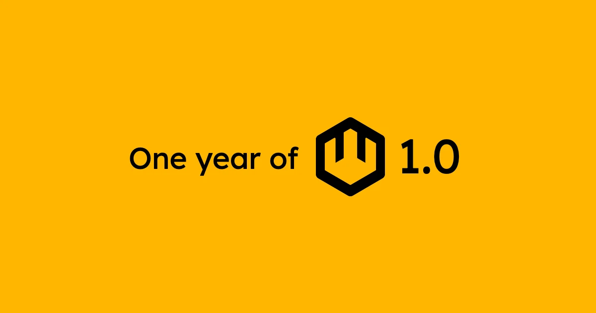
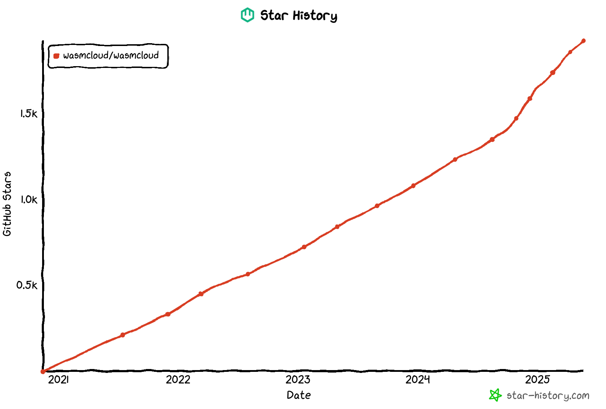
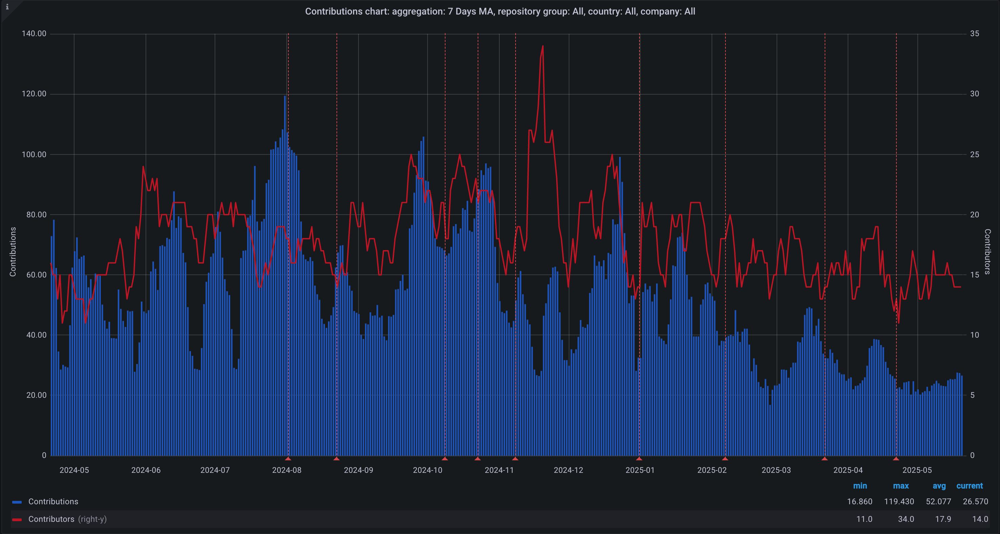

wasmCloud celebrated 1 year since its [1.0 release](https://wasmcloud.com/blog/wasmcloud-1.0-webassembly-apps-production-any-cloud-any-edge/) last month. The 1.0 release culminated years of work on bringing WebAssembly to the cloud, embracing community standards in lieu of bespoke wasmCloud FFI and RPC, codegen, and interface definition languages. 

We made a big bet on making WASI 0.2 and WIT our stable base for 1.0, and it paid off wonderfully in Wasm ecosystem support, community growth, and real-world adoption that’s helping shape the long-term direction of the project.

## WebAssembly Standards and Proposals

At the heart of wasmCloud 1.0 is [WASI 0.2](https://wasmcloud.com/blog/wasi-preview-2-officially-launches/). This includes using the WIT IDL for custom capabilities, wasi-http for the core HTTP server and client capabilities, and the Wasm component model as a binary target for applications deployed on wasmCloud. Removing our wasmCloud-specific IDL and code generation let us focus on the application primitives, rather than the table-stakes of compilable code in different languages.

Looking forward, we’re excited to adopt [WASI 0.3](https://wasi.dev/roadmap#upcoming-wasi-03-releases) for native async and simplified standard interfaces. We’ll continue to provide a backwards-compatible experience as much as possible, allowing new adopters to utilize our automatic adapter for WASI 0.1, use WASI 0.2 as they are today, and take advantage of new features in the WASI 0.3 target.

## Looking forward

A year of 1.0 means many things. It means that we’ve made no major breaking changes to the core protocols and tools, and that our fundamentals were strong last April. We’ve made choices to ensure that we remained compatible, and major breaking changes are a part of the lifecycle of any project. Looking forward, we’re excited to make breaking changes to carry the project forward with new features, deprecating and removing functionality that doesn’t contribute to the goals of the project, and refining our APIs and tools to optimize for the use cases we see most often succeeding with wasmCloud.

Even though with 1.0 we cut the scope of the project to lean on WASI, the wasmCloud host is still responsible for too much. It must manage its connection to a NATS JetStream enabled cluster, manage receiving global information in links and configuration and deliver that to the entire lattice, deliver configuration to capability providers and hope that it was valid, and it still manages JWT claims and signing information that’s essentially wasmCloud-specific. As we look forward to the wasmCloud project roadmaps for the end of the year, I’d like to focus on wasmCloud as a platform that’s pluggable and extensible at every layer.

The core of this pluggable platform is the wasmCloud host, which should only be concerned with running WebAssembly components and plugins that communicate over wRPC. On top of the wasmCloud host is where we’ll build higher level APIs: highly distributed communication with automatic failover and resiliency with CNCF NATS, optimized reporting and protocols for running in Kubernetes, or even a minimal surface for embedding in applications like `wash`.

## Community

The community continues to be the pillar of excellence for the wasmCloud project. We’ve onboarded many new maintainers (Jiaxiao Zhou (@mossaka), Mark Kovari ([@markkovari](https://github.com/markkovari)) Masoud Baharlouie ([@ossfellow](https://github.com/ossfellow)), Luke ([@luk3ark](https://github.com/Luk3Ark)), Aditya Salunkhe ([@Aditya1404Sal](https://github.com/Aditya1404Sal))) who embody the fun-loving, genuine excitement for open source. It’s thanks to this community that we see our traction steadily growing in the form of GitHub stars, and that we maintain a flurry of activities in the GitHub contributions front.

For everyone looking to be a part of wasmCloud, we have open weekly [Wednesday community meetings](https://wasmcloud.com/community/) at 1PM EST and we have a [Slack](https://slack.wasmcloud.com) for discussions, brainstorming, and general socializing. Come join!