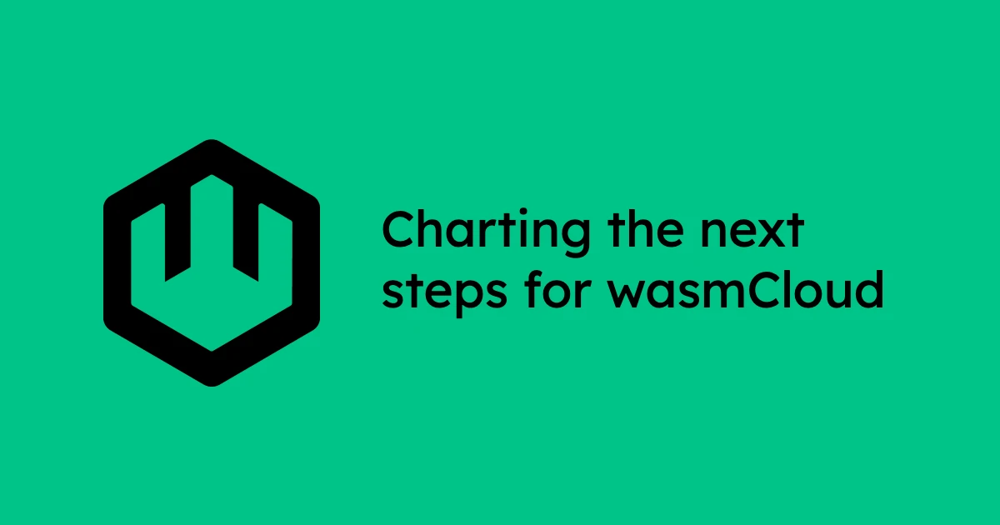
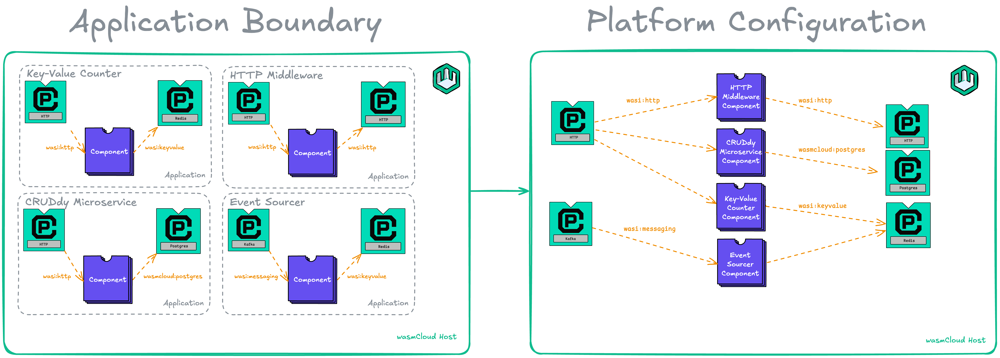

[wasmCloud released 1.0 on April 18, 2024](https://wasmcloud.com/blog/wasmcloud-1.0-webassembly-apps-production-any-cloud-any-edge/). It’s been running under 1.0 for over a year now, and we’ve learned wonderful (and not so wonderful) things about running wasmCloud in production. Our community-planned roadmaps for the past year have been in service of new features, bug fixes, and maintenance. Like any post-1.0 project, we’ve reached a point where it’s time to consider what works and what doesn’t, even if there are breaking changes involved.

After discussions with community members, maintainers, and adopters, we’ve come to some conclusions about the wasmCloud features and abstractions that should be kept and expanded on…and the ones that should go the way of the dodo (flying away peacefully, of course).

:::important[Share your thoughts]
I work at Cosmonic, a company providing enterprise-grade solutions on top of wasmCloud as well as dedicating maintainer hours to open source work. The following sections reflect not just feedback from folks at Cosmonic, but from open source adopters and maintainers across many organizations. If you don’t see your opinion reflected here, please leave your thoughts in the [Q3 2025 Roadmap discussion](https://github.com/wasmCloud/wasmCloud/discussions/4542).
:::

### What works

WebAssembly components are a fantastic choice for a unit of compute. They are lightweight in size and compute resources, polyglot, secure-by-default, and can run everywhere from browser to cloud to edge.

Extensibility at every layer of the stack, custom policy engines, secrets backends, capability providers, and interfaces all make wasmCloud powerful. Being able to run one binary but with all custom implementations makes for a truly pluggable platform.

`wash dev` as a zero-config developer loop is key to the developer experience of wasmCloud. Being able to drop into a project and immediately start writing code in your preferred language, without worrying about compilation targets or capabilities, is key to the adoption of Wasm in the cloud.

Bringing Wasm tools into `wash` helps create a unified CLI development experience. We’re wary of making a CLI that tries to do too much and combines *all* the possible tooling, so we carefully bring in utilities from other Rust libraries to provide a smooth developer experience. A great example of this is the adapt step from WASI 0.1 to 0.2, which we were able to slowly roll component builds over from modules by building towards the 0.1 target and adapting to 0.2.

Building language-specific SDKs to provide idiomatic experiences has been extremely worthwhile. For a while in wasmCloud we did not provide SDKs, and only relied on WIT bindgen to provide the language-idiomatic experience. This has pros in transparency and consistency, but cons in areas like resource management which may not come naturally to non-Rust developers. With the development of the Go and Rust component SDKs, we’ve seen a much better developer experience while still targeting the WASI standard interfaces.

### What doesn’t work

The idea of an **application**, the main unit of orchestration in our wasmCloud application deployment manager (`wadm`), is not quite right. If you’re a developer deploying one application that contains all of your components and platform capabilities, then there isn’t too much issue here, since everything is in the same deployment. However, once you get to deploying many different microservices, it becomes difficult to take advantage of the density of Wasm. If you separate your microservices into separate applications, you need to run an HTTP server per-component, which goes against the entire density model. If you run them all in the same deployment, you can’t manage and deploy your components independently. The pattern that continues to emerge is that wasmCloud should be configured as a *platform* and then the components are deployed as configured components of that *platform*.

Seamless distributed networking is a magical aspect of wasmCloud. In distributed systems, magic is a little scarier than it is desirable. If you bring a component to wasmCloud that imports `wasi:keyvalue`, your component call is *automatically* transformed into a distributed NATS request via [wRPC](https://github.com/bytecodealliance/wrpc). So, instead of a nanosecond in-process call to a host function, it’s subject to transport failure, message loss&mdash;all kinds of different issues. Introducing [`wrpc:error`](https://wasmcloud.com/docs/developer/interfaces/error-handling/) support in our interfaces is key evidence of this, as it provides runtime-level error handling of these transport errors. To be clear, component networking via wRPC is a superpower of wasmCloud’s distributed model, but it should be used intentionally rather than implicitly.

Speaking of nanosecond in-process calls, wouldn’t it be nice if two components running on the same host that are linked together could call each other's functions *directly* instead of going out to NATS? That’s something that wasmCloud doesn’t have today, but certainly could at its runtime layer.

The wasmCloud host is too complex and responsible for too many aspects beyond running Wasm components. While this may seem like an internal architectural detail, it’s an important one. wasmCloud requires a NATS JetStream connection to instantiate, is responsible for reading and writing state to socialize to other wasmCloud hosts, must request secrets on behalf of components and providers, collect a list of links into the target call graph for component invocations, fetch artifacts from OCI, so on and so on. This hinders the ability for wasmCloud to run in diverse environments such as: 

* On more embedded edge devices 
* Embedded in `wash` as a CLI development tool 
* On Kubernetes, where NATS isn’t a first-class citizen

At the same time, the complexity of the host complicates development. With recent changes to the `wasmcloud-host` library we’ve moved these concerns out of the host itself and into a `nats` module, which is a step in the right direction. There still is a split between `wadm` and `wasmcloud`, where we have a smart operator that’s responsible for scheduling that breaks instructions down into simple commands that the host needs to rebuild to run components properly. This is a huge area of opportunity for wasmCloud: reduce host responsibility and API surface while leaning into NATS’ distributed capabilities at the `wadm` layer instead.

We still use `wascap` and `nkeys`, utilities for signing and packaging wasmCloud-specific artifacts. These solved a problem at the time, but are largely unused in today's wasmCloud deployments.

Regarding Wasm interfaces, much of our maintainer budget and time has gone towards development of standard interfaces and maintaining multiple implementations for those interfaces. The main issue arises when we consider our support of standard interfaces that aren’t yet standardized, like the inclusion of `wasi:logging`, `wasi:keyvalue`, `wasi:blobstore`, and `wasi:messaging` as built-in runtime interfaces. The fault isn’t with the folks working on these standards, nor is it with the wasmCloud maintainers who wanted to give these capabilities to developers since Day 1. The lessons to be learned here are that we shouldn’t attempt to maintain many implementations for interfaces that aren’t standardized yet, nor should we build those into wasmCloud itself, as it makes compensating for breaking changes much more difficult.

## Looking ahead

Operating a project past 1.0 for more than a year is no small feat. Breaking changes are inevitable in a growing project, and that’s a good thing. Our community remains the pillar of the wasmCloud project, and the [wasmCloud weekly meeting](/community/) is the highlight of my week. As we look ahead at the next community roadmap planning, I look forward to planning how we can make wasmCloud the best project to run WebAssembly in the cloud.