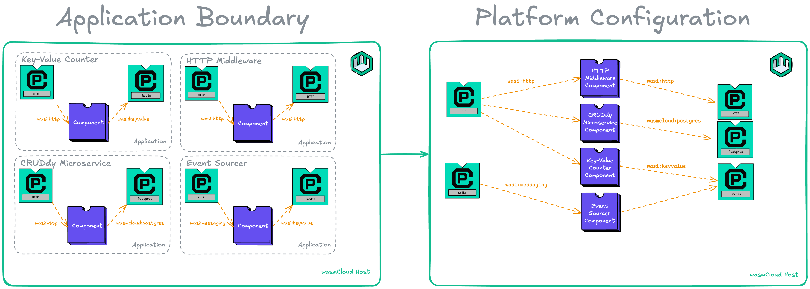

Every quarter, wasmCloud maintainers, contributors, and users gather in the [wasmCloud community meeting](/community/) to define the roadmap for the quarter ahead. [Last week](/community/2025/07/09/community-meeting/), we talked through our goals for the project in Q3&mdash;in this blog, we'll recap the major initiatives that emerged from the meeting.

## Reduce complexity in the wasmCloud host

Today, the wasmCloud host is responsible for a *lot*: not just running WebAssembly (Wasm) components, but also managing providers, reconciling state, and more. 

This complicates operation in diverse environments like Kubernetes and the edge&mdash;a key goal of the project&mdash;and we think the host architecture can be a lot simpler. We're aiming to reduce the scope of responsibilities&mdash;and the API surface&mdash;for the host. 

In the streamlined host architecture, the host will include our Wasm runtime and a wRPC API server. Once it starts and applies configuration (more on an important piece of config in a moment), the host will wait for a scheduler or orchestrator to tell it what to do via a control plane API.

## Transition capability providers to "wRPC servers"

Capability providers are a wasmCloud-specific concept and, in maintainers' experience, one of the most frictionful elements of both development and operations with wasmCloud. 

This initiative proposes that we rethink the provider concept as a **“wRPC server”**: any binary, container, component, or application that serves a WIT interface via one of the transports available with wRPC (TCP, NATS, QUIC, UDP, etc.). 

The name is open to iteration, but the distinction is critical: since these reconceived providers would communicate over wRPC, the host wouldn't run them at all (dovetailing with the effort to reduce host responsibility). 

Instead, you would configure a host with the connection information and transport necessary to communicate with a wRPC server. (This is very similar to [LUK3ARK](https://github.com/LUK3ARK)'s proposal for "virtual components," in which the host communicates with an entity over wRPC.)

In addition to removing a host responsibility, this effort would enable developers to write capability providers/wRPC servers in any language that can implement wRPC, and these providers could optionally be deployed as containers.

## Improve deployment density with shared capability providers

As Brooks discussed in [Charting the path forward for wasmCloud](/blog/charting-the-next-steps-for-wasmcloud/), the current OAM-derived wasmCloud application model isn't quite optimal for large-scale microservice deployments, since it works against the kind of high-density to which Wasm is so uniquely well-suited. If every application includes, say, a duplicate HTTP provider, that can add up to a lot of redundant providers in your environment.

It's already possible for components to "share" capability providers by adding a shared annotation, but it's an awkward fit: swimming upstream to represent a *platform* capability in an *application* model. 

This initiative aims to remove the "application" concept from the equation altogether and support configuration of **hosts** with connections to shared capability providers/wRPC servers that will provide platform-level capabilities.

## Simplify interface maintenance

Over the last year, we've spent a lot of maintainer time on development and maintenance of standard interfaces *as well as* multiple implementations of those interfaces in the wasmCloud host. That gets particularly challenging when you're talking about interfaces (such as those that [haven't reached Phase 3 of standardization in WASI](https://wasi.dev/interfaces#proposals-for-the-standard)), which are inherently subject to frequent or significant change. 

If we implement interfaces as *pluggable extensions to the host*, we would be able to more quickly implement and iterate on upstream in-progress interfaces and maintain a minimal, stable set that we support by default. At first, that set would likely include:

- `wasi:cli/imports` (io, clocks, random, filesystem, sockets)
- `wasi-http/proxy` (inbound and outbound)
- `wasmcloud:component` (wasmCloud features for guest components like links, contextual and env data)
- wRPC NATS
- Possibly `wasi-config`

Once they reach WASI Phase 3, the following interfaces would likely join the club:

- `wasi-keyvalue`
- `wasi-messaging`
- `wasi-blobstore`

In the meantime, for the sake of stability, we can create `wasmcloud`-namespaced versions of these interfaces, exactly matching the current version upstream.

## Intentional distributed networking

Distributed networking is a core wasmCloud superpower, but not every problem needs to be solved with superpowers. Specifically, not every *call* should be handled distributedly, since these are subject to transport failure and message loss (and are just inherently slower than an in-process call to a host function). 

For this reason, we want to move away from distributed-by-default to distributed-when-it-makes-sense, and distributed-when-you-explicitly-ask-for-it. This should make for more stable, predictable workloads and improved performance overall. 

## Get involved

The initiatives above aren't the only items on this quarter's agenda&mdash;see the [Roadmap project on GitHub](https://github.com/orgs/wasmCloud/projects/7) for the full list&mdash;but taken together, they form a guiding constellation for wasmCloud in Q3 2025.

Whether you're a long-time community member or brand new to wasmCloud, there are plenty of opportunities to get involved. Join the discussion on the [project board](https://github.com/orgs/wasmCloud/projects/7), find a [good first issue](https://github.com/wasmCloud/wasmCloud/issues?q=state%3Aopen%20label%3A%22good%20first%20issue%22), join the [wasmCloud Slack](https://slack.wasmcloud.com/), and make sure to join us at the next [wasmCloud community meeting](/community/)&mdash;we get together every week. Hope to see you there!