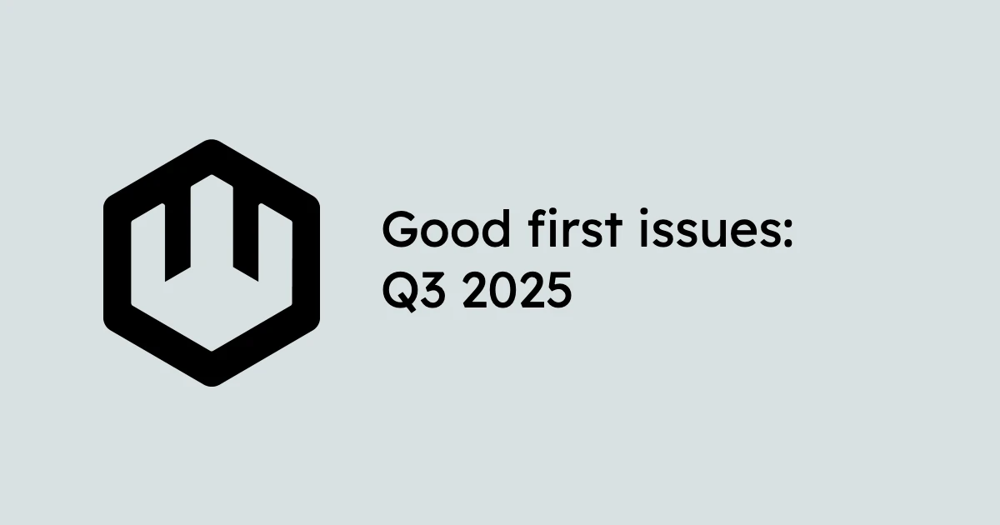

As the wasmCloud community digs into [our Q3 roadmap](/blog/2025-07-15-q3-2025-roadmap-recap/index.md), now is the perfect time to get involved with the project. Whether you're a veteran wasmCloud user or brand new to the Wasm ecosystem, there are tons of opportunities for folks of all experience levels to contribute. 

Ready to pitch in? Here are some of our current [good first issues](https://github.com/wasmCloud/wasmCloud/issues?q=state%3Aopen%20label%3A%22good%20first%20issue%22) for new contributors, drawn from across several repos:

* [`wasmCloud/wasmCloud`](https://github.com/wasmCloud/wasmCloud): The monorepo for all development on wasmCloud itself
* [`wasmCloud/wasmcloud.com`](https://github.com/wasmCloud/wasmcloud.com): The project website and documentation
* [`wasmCloud/go`](https://github.com/wasmCloud/go): wasmCloud Go ecosystem libraries and tooling

## `wasmCloud/wasmCloud`: Standardize image reference field names

Across the project, we use a variety of different names for image references, including but not limited to: 

* `provider_ref` 
* `image_ref` 
* `component_ref`

This issue proposes that we name these `image_reference` everywhere. Since we depend on the variously-named fields in other places, this effort will need to add a new field and deprecate the old ones. [See the issue for more information](https://github.com/wasmCloud/wasmCloud/issues/3909). 

## `wasmCloud/wasmcloud.com`: Implement reusable language tabs

Documentation is a great place to make a first contribution, and this is a good opportunity for someone with frontend experience.

In the wasmCloud documentation, we often need to present instructions on the same task across multiple languages, given the polyglot nature of Wasm development. We use `<Tabs>` and `<Tab>` components to organize content according to language, but this requires maintaining the same id everywhere the components are used. This could be a lot smoother if we had dedicated, reusable components for each language, for example:

```jsx
<LangTabs>
  <LangTab lang="rust">...</LangTab>
  <LangTab lang="go">...</LangTab>
  ...etc
</LangTabs>
```

Or even...

```jsx
<LangTabs>
  <RustTab>...</RustTab>
  <GoTab>...</GoTab>
  ...etc
</LangTabs>
```

[See the issue for more information](https://github.com/wasmCloud/wasmcloud.com/issues/254).

## `wasmCloud/go`: Support configuration updates on the Go Provider SDK

Go-specific tooling, libraries, and examples live in the `wasmCloud/go` repository, and this is a great place for Gophers to pitch in. 

One standing issue for the Go Provider SDK aims to make it easier for Go-based providers to update based on configuration changes. As the issue notes:

> This is a good-first-issue since there's a reference implementation in Rust, and is just additive 😄 It would be a good practice to add a piece of configuration to the example, like a prefix for the sync.Map, and then update it for testing.

If you're interested in learning more, [check out the issue](https://github.com/wasmCloud/go/issues/126).

## `wasmCloud/go`: Set up Go Provider SDK unit test for properly handling links

Another opportunity for Gophers on the Go Provider SDK!

Under some circumstances, providers can fail to handle links, so it would be useful to create a unit test validating that...

* Links are handled and stored properly as source/target links when incoming on the link put topic
* Links are handled and stored properly as source/target links when incoming on host data
* A provider always starts with valid host data

[See the issue to learn more](https://github.com/wasmCloud/go/issues/125).

## Conclusion

As Brooks said in his [look forward at the project's next steps](/blog/2025-07-01-charting-the-next-steps-for-wasmcloud/index.mdx), the community is the pillar of wasmCloud, and we're always thrilled to welcome new contributors. If you have questions or just want to chat Wasm, make sure to [join the wasmCloud Slack](https://slack.wasmcloud.com/) and tune in to the next [wasmCloud community meeting](/community/). Hope to see you there!