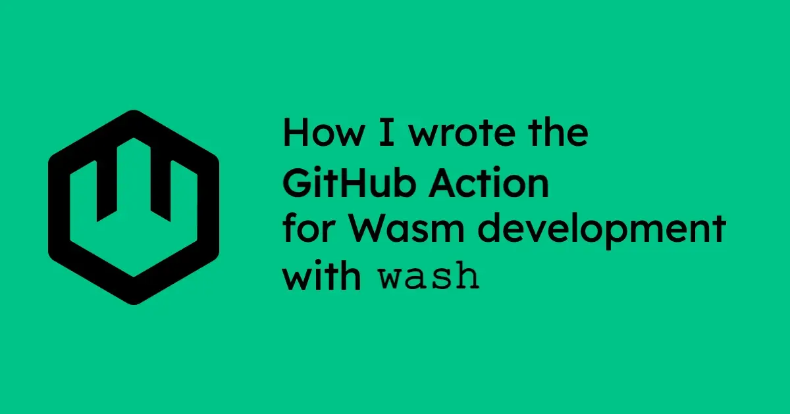
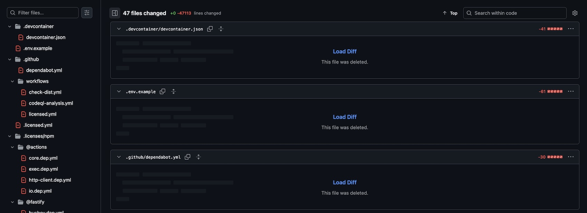
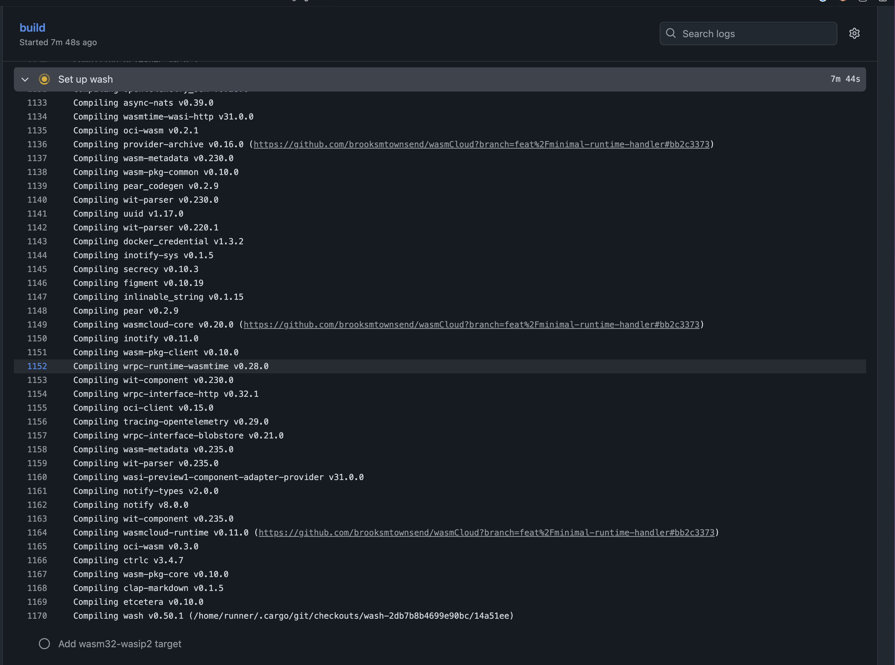
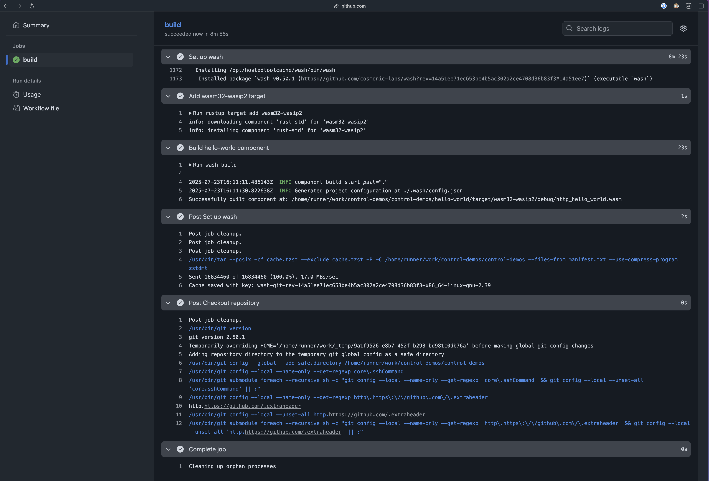
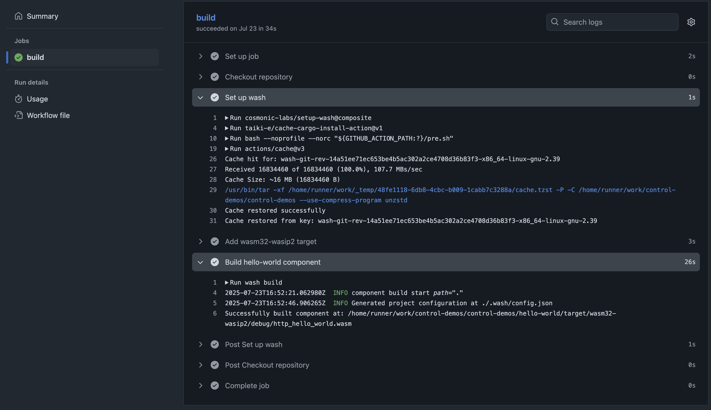
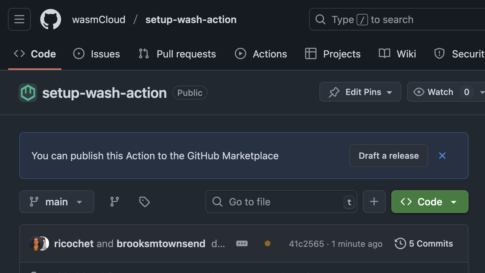
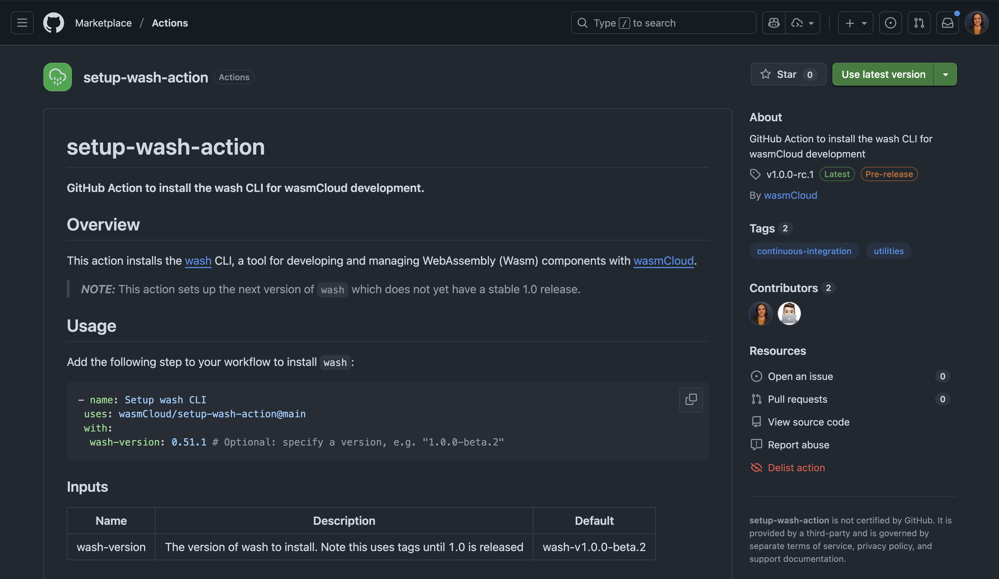

Lately I've been surveying the landscape on GitHub Actions, in an effort to help build useful CI tools both for wasmCloud and the wider Wasm ecosystem in the Bytecode Alliance. The first result of these investigations is `setup-wash`, a GitHub Action for installing the [Wasm Shell (`wash`) CLI](https://github.com/wasmcloud/wash) so you can build and publish Wasm components in your workflows. Check out the [wasmCloud/setup-wash-action](https://github.com/wasmcloud/setup-wash-action) repo or find the action [on the GitHub Marketplace](https://github.com/marketplace/actions/setup-wash-action).

My experiments started in [cosmonic-labs/setup-wash](https://github.com/cosmonic-labs/setup-wash), where Cosmonic provides an enterprise-grade platform powered by wasmCloud. After successfully integrating `setup-wash` into our own GitHub workflows and validating the approach, I presented the results in the in the [wasmCloud community call](https://www.youtube.com/watch?v=RrUzTSKzSo4). During that discussion, we agreed to upstream our GitHub Action work to the core wasmCloud project.

I learned a ton in the process of planning and writing `setup-wash`, and now that it's out, I thought I'd share the results of my explorations, including discoveries that helped shape `setup-wash`, and lessons learned that could help anyone working on a GitHub Action.

## Three approaches to custom GitHub Actions

There are [three basic approaches](https://docs.github.com/en/actions/concepts/workflows-and-actions/custom-actions#types-of-actions) we could have taken with the `setup-wash` action:

* **Docker container**: Use containers for the action
* **JavaScript**: Write a JavaScript (TypeScript) action
* **Composite Actions**: Create an action that combines several workflow steps into one action

Containers have all the usual advantages of consistency and reproducibility, but in our case, we could rule out the container approach right off the bat, for the simple reason that it's the slowest: if you run something in a container, you're going to have to spin up that container before you can do anything. You can think of this approach as the *least* native to the GitHub Actions ecosystem.

That leaves **TypeScript** and **Composite** actions. 

Composite Actions are essentially wrappers around existing actions. We'll talk about those more in a moment. Meanwhile, TypeScript is basically GitHub Actions' native language: this is the path that GitHub's docs recommend, so it was the path I tried first.

## Pros and cons to GitHub Actions in TypeScript

GitHub's documentation for Actions strongly recommends that you use a TypeScript-style Action, so that's where I started. I used their template to create a GitHub repo for my new action, and it gave me *a lot of stuff* (much of it good!): tons of different types of linting, a `build` to roll up the Action and put it in a `dist` folder, a check to make sure that the `dist` folder isn't empty, and so on. 

One of the key reasons GitHub recommends TypeScript is because it has among the fastest start-up times of the available approaches. TypeScript actions are so fast because they are on runners with Node.js already in place: the action is loaded straight from the `.js` files in your `dist` directory. The runner isn't doing any `npm` gymnastics&mdash;just running your JavaScript, which means that everything for a TypeScript Action has to be bundled, versioned, and committed to main (an interesting quirk that is worth flagging). 

The *other* key reason you might use TypeScript is to take advantage of their [`tool-cache` SDK](https://github.com/actions/toolkit/tree/main/packages/tool-cache), which enables you to save a tool (like `wash`) between runs on a given runner. Not having to reinstall a tool for every run can make an already-fast approach even faster, and can be very helpful for tooling that takes a *while* to install.

In our case, caching is pretty essential: without a cache, each `setup-wash` run could take about eight minutes. Runs that use the cache, by contrast, are generally under a minute. 

So advantages to TypeScript include:

* High speed on account of being the "GitHub Actions-native" approach
* A lot of built-in tooling out of the box, and more available as you need it...
* ...such as the `tool-cache` SDK, which deserves its own call-out here, because caching is an extremely powerful way to speed up your workflows.

These were all pretty compelling arguments. But there were also some cons to consider.

The biggest *downside* of the TypeScript approach is dependency sprawl. As you start to build out your action, you will *very* quickly accumulate a ton of pull requests for bumping dependencies. You don't just have dependencies on your TypeScript code, but also in the actions that you're depending on. 

This isn't just annoyance: You should think of your action dependencies as third-party code, and you want to be very careful about what you're putting in your CI workflows, as a recent [GitHub Actions breach at Coinbase](https://www.bleepingcomputer.com/news/security/coinbase-was-primary-target-of-recent-github-actions-breaches/) demonstrates. Breaches via GitHub Action are a serious consideration, so we want to limit how many actions we use&mdash;and when we use them, we want to make sure we're pinning those actions by SHA.

So we've ruled out containers, and TypeScript brings both some significant advantages and disadvantages to design around. How about our last option?

## Building a Composite Action in GitHub Actions

Composite actions bundle multiple workflow steps into a single action. This is beneficial because you can then run your composite action as a single step across multiple workflows. 

We've already decided that caching is mandatory. In GitHub Actions, there are actually a couple of different kinds of cache. The [**Actions Cache**](https://docs.github.com/en/actions/reference/workflows-and-actions/dependency-caching) is provided by GitHub, and your Actions can interact with it directly. It's a nice way to cache intermediate dependencies like Node modules or binaries that you've built. Where the `tool-cache` SDK we discussed for the TypeScript approach caches on a *per-runner* basis, the Actions Cache caches on a *per-workflow* basis.

In our case, the Actions Cache is interesting because we can build a Composite Action that wraps an existing action, [`cache-cargo-install`](https://github.com/taiki-e/cache-cargo-install-action), which knows how to install to a cache with `cargo install`. Since `wash` is built with Rust, we can install it to an Actions Cache and we're off to the races. Because Rust is installed on every action runner, our Composite Action can simply mount this hosted tool cache (per workflow) and go. 

It could be a little frictionful if we asked folks to use `cache-cargo-install` directly. A lot of people in our ecosystem aren't writing Rust, and asking them to interact with the Rust package manager directly could create a big barrier to entry for those folks. 

But *wrapping* this action gives us a canonical `setup-wash` action without expecting folks to learn `cargo`. And this sort of abstraction isn't the only benefit&mdash;in the case of `setup-wash`, moving to a Composite Action meant removing 40,000+ lines from the repo. Much cleaner!

There are downsides to `cache-cargo-install`. The first time the workflow with `setup-wash` action is run, it will compile `wash`. This means that the initial run may take longer as the tool is built from scratch. However, subsequent runs will benefit from the caching, significantly speeding up the workflow. Something I debated building but haven't yet is to integrate with `cargo binstall` that way we would download pre-built binaries and then cache those in the Actions Cache.

 
In order to correctly integrate something with pre-compiled binaries like with `cargo binstall`, we would need to verify cryptographic signatures (e.g. with cosign/Sigstore) to appropriately defend against supply chain attacks. Since this is a one time cost and gives a reproducible build if pinned dependencies are recorded, this approach is sufficient for now. This is very much a [two way door](https://thoughtbot.com/blog/one-way-vs-two-way-door-decisions) where we can choose to optimize further in the internals of `setup-wash` in the future and our downstream consumers would not need to change how they integrate.

A second run of `setup-wash` takes less than 1 second to run:

## Publishing to the marketplace

Whoever designed the tips in GitHub with a guide for how to publish actions to the marketplace... Kudos! I really appreciated the guided tooltip and walkthrough to publish our first release candidate to the marketplace. 

Click this button!

Note that you don't have to go straight to `v1` in order to publish to the marketplace. We install the next version of wash by default, which is reaching stability but is not yet stable. For this reason I opted to publish a release candidate of the action to signal to users that breaking changes may still occur. 

After creating a release, you can then publish it to the marketplace after agreeing to the GitHub Marketplace terms.

The hardest decision of this entire endeavour was choosing the icon to use for the action. Third-party vendors in the marketplace cannot use their own custom SVG and have to select from a set of icons per [GitHub's action branding documentation](https://docs.github.com/en/actions/reference/workflows-and-actions/metadata-syntax#branding). 

Special thanks to [Brooks](https://github.com/brooksmtownsend) for helping me pick between the `droplet`, `cloud-rain`, and `cloud-drizzle` [Feather icon](https://feathericons.com/). We didn't have an option to select our preferred emoji for wash (🚿). The [colors to select from](https://docs.github.com/en/actions/reference/workflows-and-actions/metadata-syntax#brandingcolor) are very limited, but `green` is the obvious choice for a wasmCloud project.

## Conclusion

In the process of working on `setup-wash`, I took inspiration from (and geeked out over) several examples out in the broader ecosystem. 

* [Victor](https://github.com/vados-cosmonic) (fellow wasmCloud maintainer and co-worker) has put together some wonderful end-to-end workflow examples over in the [`jco` repository](https://github.com/bytecodealliance/jco/tree/main/.github/workflows). 
* I was also inspired by how [Chainguard manages their actions](https://github.com/chainguard-dev/setup-chainctl). 

Chainguard ended up taking the Composite Action approach. In fact, they do *composites of composites*, which is a pattern that I think makes sense for our ecosystem as well. They place individual actions intended for public consumption in dedicated repos&mdash;a requirement for inclusion in GitHub Marketplace.

We borrowed some of that approach to organization. We have a [dedicated repo](https://github.com/wasmcloud/setup-wash-action) for our Composite Action, `setup-wash`, enabling it to be [part of the GitHub Marketplace](https://github.com/marketplace/actions/setup-wash-action). We *also* have a [`wasmCloud/actions` repo](https://github.com/wasmcloud/actions) that gathers our actions in one place, with the dedicated repos submoduled in for easy maintenance. 

Now that `setup-wash` is out in the wild, I'm looking forward to seeing how folks use it&mdash;and to making it better! If you have thoughts or questions, bring them to the [wasmCloud Slack](https://slack.wasmcloud.com/) or the next [wasmCloud community meeting](https://wasmcloud.com/community/). Hope to see you there!
