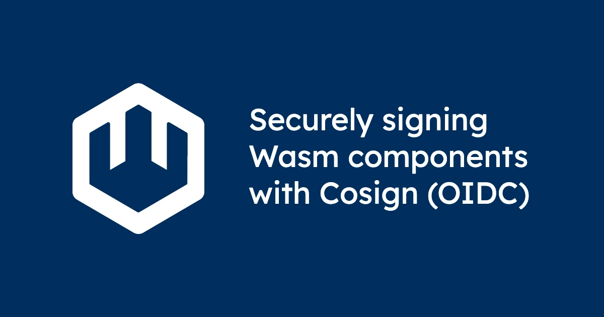

As WebAssembly (Wasm) adoption accelerates, ensuring **artifact integrity and authenticity** becomes essential. Just like traditional packages, **WebAssembly components** should be signed, stored, and verified before deploying in production.

In this blog, we'll demonstrate how to use [Cosign](https://github.com/sigstore/cosign) to **sign WebAssembly component artifacts**, push them to an **OCI-compliant registry** (GHCR), and **verify** them prior to execution. We’ll use **OIDC-based signing** (no long-lived keys) so signatures are linked to an identity and stored as **invisible infrastructure** alongside your artifact.

## Why sign WebAssembly components?

There are four key reasons to sign Wasm components:

- **Integrity**: Ensure the component wasn’t modified post-build.  
- **Authenticity**: Bind the artifact to a known publisher identity.  
- **Compliance**: Align with modern supply-chain expectations (SLSA, NIST).  
- **Trust in deployment**: Configure only verified artifacts run under wasmCloud or Kubernetes via admission controller.

Now let's see how to put these into practice by signing a component, pushing to a registry, and verifying the artifact before we run it. 

## Prerequisites

Before we get started, we'll need a handful of CLI tools:

* [Wasm Shell (`wash`)](https://github.com/wasmCloud/wash) for developing and building components
* [`cargo`](https://www.rust-lang.org/tools/install) 1.82+ for compiling Rust to a Wasm release artifact
  * The `wasm32-wasip2` target for Rust (`rustup target add wasm32-wasip2`)
* [`rekor-cli`](https://docs.sigstore.dev/logging/installation/) for signing certificate retrieval
* [`openssl`](https://docs.openssl.org/master/man1/openssl/#message-digest-commands) cryptography toolkit (likely already on your system, install with your package manager of choice if not)
* [`cosign`](https://docs.sigstore.dev/cosign/system_config/installation/) for securely signing software artifacts

## Step 1: Create a New WebAssembly Component

Generate a Rust-based WebAssembly component with `wash`:

```bash
wash new
```
```bash
✔ What programming language do you want to use? · Rust
✔ Which template would you like to use? · http-hello-world
✔ You selected the template 'http-hello-world' (https://github.com/wasmcloud/wasmcloud). Do you want to proceed? · yes
2025-09-01T15:23:20.088858Z  INFO cloning git repository template="https://github.com/wasmcloud/wasmcloud"
2025-09-01T15:23:29.742343Z  INFO Successfully cloned template output_dir=http-hello-world
2025-09-01T15:23:29.751026Z  INFO extracting subfolder subfolder=examples/rust/components/http-hello-world
2025-09-01T15:23:30.015867Z  INFO successfully extracted subfolder subfolder="examples/rust/components/http-hello-world"
Successfully created project from template http-hello-world
```

## Step 2: Build the Component

From your new project directory `http-hello-world`, use `cargo` to compile your component in release mode for WASI P2:

```bash
cargo build --release --target wasm32-wasip2
```

Confirm our WebAssembly component has been built:

```bash
ls -la target/wasm32-wasip2/release/http_hello_world.wasm
```
```text
-rw-r--r--  1 liam  staff  237872 Sep  1 11:47 target/wasm32-wasip2/release/http_hello_world.wasm
```

At only **~238 KB**, this artifact is tiny&mdash;great for **fast startup** without **cold starts**, **low bandwidth distribution**, and **lightweight deployments**. 

Combined with Wasm’s **capability-driven security model** (least-privilege capabilities explicitly granted), WebAssembly components deliver both **efficiency** and **safety** by design. CNCF wasmCloud is designed to run thousands of WebAssembly Components simultaneously.

If you want to test or iterate on this component, you can use `wash dev` and compile the component again.

## Step 3: Prepare authentication for GitHub Container Registry

Before using any `cosign` commands to upload or sign against `ghcr.io`, authenticate Docker and confirm that your Personal Access Token (PAT) used for `docker login ghcr.io` has the following permissions: 

* `read:packages` (pull)  
* `write:packages` (push)  

**Note**: When authenticating in a GitHub Action, you can use a GITHUB_TOKEN rather than a PAT&mdash;see the [GitHub Actions documentation](https://docs.github.com/en/actions/tutorials/authenticate-with-github_token) for more information.

Authenticate:

```bash
echo $GITHUB_TOKEN | docker login ghcr.io -u <your-username> --password-stdin
```

There are **multiple ways** to sign and verify artifacts with Cosign (key-pair, keyless/OIDC, hardware-backed, GitHub Actions, etc.). This tutorial demonstrates **OIDC (keyless) signing** for WebAssembly artifacts. CNCF wasmCloud is compatible with multiple strategies for artifact signing; in this blog post, we are just demonstrating on possible method. See the [Sigstore documentation](https://docs.sigstore.dev/cosign/signing/overview/) for a broader overview.  


## Step 4: Upload the WebAssembly component to GHCR

Upload the built Wasm artifact (note the path):

```bash
cosign upload wasm -f target/wasm32-wasip2/release/http_hello_world.wasm ghcr.io/<your-org>/http-hello-world
```

## Step 5: Sign the WebAssembly component with Cosign (OIDC, No Key)

The Cosign philosophy is that signatures should be **invisible infrastructure**—living beside your artifact in the registry without adding operational friction for consumers.

With **OIDC mode**, you don’t specify a key when you sign the component. Instead, when you run the `cosign sign` command, Cosign will:

1. Launch a browser flow to authenticate you with an **OIDC provider** (e.g., GitHub, Google).  
2. Generate **ephemeral keys**.  
3. Obtain a **short-lived signing certificate** binding your identity to the signature.  
4. Store the signature **with the artifact in the registry** and record it in the **transparency log** (Rekor).

We recommend that you **always sign by digest** (`@sha256:...`) rather than a tag (e.g., `:latest`). Tags move&mdash;digests uniquely identify the content you intend to sign. So copy the digest from your package's page on GHCR and then run `cosign`:

```bash
cosign sign ghcr.io/<your-org>/http-hello-world@sha256:<your-digest>
```

You should see output like the following:

```text
setting TUF refresh period to 24h0m0s
Generating ephemeral keys...
Retrieving signed certificate...

	The sigstore service, hosted by sigstore a Series of LF Projects, LLC, is provided pursuant to the Hosted Project Tools Terms of Use, available at https://lfprojects.org/policies/hosted-project-tools-terms-of-use/.
	Note that if your submission includes personal data associated with this signed artifact, it will be part of an immutable record.
	This may include the email address associated with the account with which you authenticate your contractual Agreement.
	This information will be used for signing this artifact and will be stored in public transparency logs and cannot be removed later, and is subject to the Immutable Record notice at https://lfprojects.org/policies/hosted-project-tools-immutable-records/.

By typing 'y', you attest that (1) you are not submitting the personal data of any other person; and (2) you understand and agree to the statement and the Agreement terms at the URLs listed above.
Are you sure you would like to continue? [y/N] y
Your browser will now be opened to:
https://oauth2.sigstore.dev/auth/auth?access_type=online&client_id=sigstore&code_challenge=NE7EzOgpwQLE2rvBN45okIWw9ajx8ZLivQNf-dpoo5k&code_challenge_method=S256&nonce=326kV0EDXNFRD362gXkRHYtyToE&redirect_uri=http%3A%2F%2Flocalhost%3A56069%2Fauth%2Fcallback&response_type=code&scope=openid+email&state=326kUvmKpRbDn6nuy6kpgeq1SE0
Successfully verified SCT...
WARNING: "ghcr.io/<your-org>/http-hello-world" appears to be a private repository, please confirm uploading to the transparency log at "https://rekor.sigstore.dev"
Are you sure you would like to continue? [y/N] y
tlog entry created with index: 457070846
Pushing signature to: ghcr.io/<your-org>/http-hello-world
```

### What’s happening here?  

- Cosign refreshes trusted metadata (TUF), generates a short-lived key pair, and retrieves a **signed certificate**.  
- You confirm the **immutability** and **public transparency** of the record (Rekor).  
- Browser-based OIDC auth binds your identity (e.g., `liam@cosmonic.com`) to the certificate.  
- Cosign **pushes the signature** to GHCR and **records** it in the transparency log.

## Step 6: Retrieve the signer’s public certificate from the transparency log (Rekor)

Every OIDC (keyless) signature is recorded in the **Rekor transparency log**, an append-only, publicly auditable ledger. Each entry includes the **ephemeral public key certificate** used to sign the artifact. You can retrieve it for auditing, pinning, or offline validation.

Use the **log index** from the signing output above (`tlog entry created with index: 457070846`) to fetch the entry:

```bash
rekor-cli get --log-index <your-log-index>
```

You should see output like the following:

```bash
LogID: c0d23d6ad406973f9559f3ba2d1ca01f84147d8ffc5b8445c224f98b9591801d
Index: 457070846
IntegratedTime: 2025-09-01T17:41:00Z
UUID: 108e9186e8c5677ae2e00d3b5962864ce70caf89477763e66e37b3570d54962f2ab0b136abfda517
Body: {
  "HashedRekordObj": {
    "data": {
      "hash": {
        "algorithm": "sha256",
        "value": "feb69f67b43a716974e85b983cdd642850c368e0bb1719f3396cc0d651874bd0"
      }
    },
    "signature": {
      "content": "MEUCIE10cxf4DSJ6GPUTPVu6PObhbamPhNCgCuqKkYGcRbhnAiEAqudA6Y4MYMb/jdl0ULyj2Xzd0CLyWTaAwSAzi9sVzaw=",
      "publicKey": {
        "content": "LS0tLS1CRUdJTiBDRVJUSUZJQ0FURS0tLS0tCk1JSUN5VENDQWxDZ0F3SUJBZ0lVV01xZkdlM1hnejFQYVBSSlVuRXlCM2lMV25vd0NnWUlLb1pJemowRUF3TXcKTnpFVk1CTUdBMVVFQ2hNTWMybG5jM1J2Y21VdVpHVjJNUjR3SEFZRFZRUURFeFZ6YVdkemRHOXlaUzFwYm5SbApjbTFsWkdsaGRHVXdIaGNOTWpVd09UQXhNVGMwTURNMVdoY05NalV3T1RBeE1UYzFNRE0xV2pBQU1Ga3dFd1lICktvWkl6ajBDQVFZSUtvWkl6ajBEQVFjRFFnQUU2andaTksyOW8yamVYcWZHNCtBbkU3OEc3Y1FhdHNmL1ppUEoKTHBDS1g0UjI0eVZSZk94Yzc0bUFzcGJ2bUZiU0lwUWdGZU5GdVQ4Yy9mN2VjeEU3dktPQ0FXOHdnZ0ZyTUE0RwpBMVVkRHdFQi93UUVBd0lIZ0RBVEJnTlZIU1VFRERBS0JnZ3JCZ0VGQlFjREF6QWRCZ05WSFE0RUZnUVVEWW9oClNQNlJBYlU5d1hOc1JwYTJmQ3V2ZDRFd0h3WURWUjBqQkJnd0ZvQVUzOVBwejFZa0VaYjVxTmpwS0ZXaXhpNFkKWkQ4d0h3WURWUjBSQVFIL0JCVXdFNEVSYkdsaGJVQmpiM050YjI1cFl5NWpiMjB3S1FZS0t3WUJCQUdEdnpBQgpBUVFiYUhSMGNITTZMeTloWTJOdmRXNTBjeTVuYjI5bmJHVXVZMjl0TUNzR0Npc0dBUVFCZzc4d0FRZ0VIUXdiCmFIUjBjSE02THk5aFkyTnZkVzUwY3k1bmIyOW5iR1V1WTI5dE1JR0tCZ29yQmdFRUFkWjVBZ1FDQkh3RWVnQjQKQUhZQTNUMHdhc2JIRVRKakdSNGNtV2MzQXFKS1hyamVQSzMvaDRweWdDOHA3bzRBQUFHWkJsM09YQUFBQkFNQQpSekJGQWlFQXlOUEtIRytwcEwrVU5FN25LUWptaDQzSWVxdUxVaXVJQXpNY3NhOXJybFlDSUc3OVBNNGRZMVJpCjl2MDhsczZBMk5vd1pCQWlrdytmaTJ5SGRwKy8vWkNsTUFvR0NDcUdTTTQ5QkFNREEyY0FNR1FDTUdnYjVtTWEKbDNyN3h2RjhqK2Rwa0lKOEpsaFFDT20zeGRWTXByZjl6Y0JodndibVZvTktuY3puQUF1ajQzeVZLQUl3V0hjRApRQXVjczJlLzU2ZmtjYUdycTl4a29QVEFkZWEwRm9PdnNxUW01OTZqWG1Oa0lMTGdXZWYzbGZqbGpKZHMKLS0tLS1FTkQgQ0VSVElGSUNBVEUtLS0tLQo="
      }
    }
  }
}
```

:::info[What is this?]
- **Rekor entry**: A tamper-evident record storing a hash of the content and metadata about the signature.  
- **`publicKey.content`**: A **base64-encoded PEM** of the short-lived **X.509 code-signing certificate** issued during OIDC signing. It binds your OIDC identity to the signature.  
- **Use cases**: Extract the certificate for auditing, pinning identities, or performing offline verification flows.
:::

Extract the PEM-encoded certificate to a file:

```bash
rekor-cli get --log-index <your-log-index> --format json   | jq -r '.Body.HashedRekordObj.signature.publicKey.content'   | base64 -d > signer-cert.pem
```

Inspect the certificate:

```bash
openssl x509 -in signer-cert.pem -noout -subject -issuer -dates
```

You can also retrieve by UUID instead of index:

```bash
rekor-cli get --uuid 108e9186e8c5677ae2e00d3b5962864ce70caf89477763e66e37b3570d54962f2ab0b136abfda517 --format json
```

**Note**: Manual Rekor retrieval isn’t required for `cosign verify` (the Rekor bundle is embedded), but it’s useful for **audits**, **forensics**, or **air‑gapped validations** where you want explicit control over verification inputs.

## Step 7: Verify the Signed WebAssembly Component (Identity-Scoped)

For OIDC-signed artifacts, you can verify and assert the **expected identity** and **OIDC issuer**. For example:

```bash
cosign verify ghcr.io/liamrandall/http-hello-world@sha256:9e7a511fb3130ee4641baf1adc0400bed674d4afc3f1b81bb581c3c8f613f812  --certificate-identity=liam@cosmonic.com --certificate-oidc-issuer=https://accounts.google.com
```

In my case, that looks like this:

```bash
setting TUF refresh period to 24h0m0s

Verification for ghcr.io/liamrandall/http-hello-world@sha256:9e7a511fb3130ee4641baf1adc0400bed674d4afc3f1b81bb581c3c8f613f812 --
The following checks were performed on each of these signatures:
  - The cosign claims were validated
  - Existence of the claims in the transparency log was verified offline
  - The code-signing certificate was verified using trusted certificate authority certificates

[{"critical":{"identity":{"docker-reference":"ghcr.io/liamrandall/http-hello-world"},"image":{"docker-manifest-digest":"sha256:9e7a511fb3130ee4641baf1adc0400bed674d4afc3f1b81bb581c3c8f613f812"},"type":"cosign container image signature"},"optional":{"1.3.6.1.4.1.57264.1.1":"https://accounts.google.com","Bundle":{"SignedEntryTimestamp":"MEUCIHNYPM+GmCIg15yJTSw5R5Jw6PQQATDJ5y5Us3qkPvArAiEA74QKnrIJAGJSDAdX1NhLOICs1W0WG1or8Ff4xKYGKyE=","Payload":{"body":"eyJhcGlWZXJzaW9uIjoi...
```

So what does all of this mean? 

- **Claims validated**: Cosign verified the signature payload structure and contents.  
- **Transparency log proof**: The signature exists in Rekor, and verification can occur offline using the embedded bundle.  
- **Certificate chain**: The short-lived **code-signing certificate** chains to a trusted CA, and the **Subject** (`liam@cosmonic.com`) with **Issuer** (`https://accounts.google.com`) matches your verification flags.  
- The `docker-manifest-digest` equals the digest you signed, proving the exact artifact was verified.


## Quick reference

Build a release artifact targeting WASI P2:

```bash
cargo build --release --target wasm32-wasip2
```

Upload a Wasm artifact to GHCR:

```bash
cosign upload wasm -f target/wasm32-wasip2/release/http_hello_world.wasm ghcr.io/<your-org>/http-hello-world
```

Sign by digest (OIDC, no --key):

```bash
cosign sign ghcr.io/<your-org>/http-hello-world@sha256:<digest>
```

Verify with identity constraints:

```bash
cosign verify ghcr.io/<your-org>/http-hello-world@sha256:<digest>   --certificate-identity=<your-email>   --certificate-oidc-issuer=https://accounts.google.com
```

## Conclusion

By pairing **WebAssembly’s capability-driven security** with **Cosign’s OIDC-based signing**, you get **portable, verifiable, and tamper-evident** components that slot naturally into your OCI registries. With signatures as **invisible infrastructure**, wasmCloud deployments can enforce trust without operational complexity. You can explore more signing options and workflows in the [Sigstore documentation](https://docs.sigstore.dev/cosign/signing/overview/).  

If you have thoughts or questions on component signing, Wasm and security, or wasmCloud, make sure to join us on the [wasmCloud Slack](https://slack.wasmcloud.com/) or at the next [wasmCloud community meeting](https://wasmcloud.com/community/). Hope to see you there!