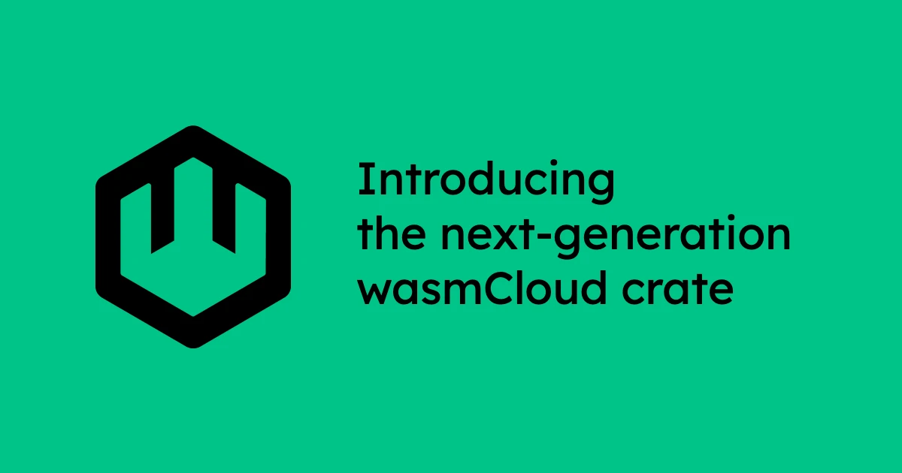

This week, we're taking a big step toward the next major version of wasmCloud with the release of [**wash-runtime**](https://github.com/wasmCloud/wash/tree/main/crates/wash-runtime), a Rust crate that wraps Wasmtime in an opinionated way to provide an easy-to-use runtime and workload API for executing WebAssembly components, with built-in support for WASI interfaces.

This release radically simplifies the wasmCloud architecture, focusing on being the most ergonomic WebAssembly host implementation&mdash;and paving the way for many of the major initiatives on the [wasmCloud roadmap](https://github.com/orgs/wasmCloud/projects/7). Simplified workload scheduling allows for embedding in many different environments, including integration with Kubernetes operators as a scheduler. 

In this post, we'll break down what exactly the crate does, why we built it, how it differs from the v1 approach, and where we're heading next.

## What is `wash-runtime`?

[Wasmtime](https://wasmtime.dev/) serves as our low-level WebAssembly runtime, just as it's always done&mdash;it handles the nitty-gritty work of compiling and executing Wasm. 

The **`wash-runtime` crate** provides easy-to-use abstractions over the low-level Wasmtime API, as well as wasmCloud-specific APIs for managing workloads, handling NATS subscriptions, managing and utilizing host plugins, and so on. 

At a high level, the `wash-runtime` crate includes:

* Wasmtime as the underlying runtime engine
* The wasmCloud host that serves as a runtime environment for components
* Two sets of built-in plugins (toggleable at runtime via feature flags), one working in-memory for development with `wash dev` and the other backed by NATS for production. Both sets contain the following interfaces:
   - wasi:http
	 - wasi:keyvalue
	 - wasi:blobstore
	 - wasi:config
	 - wasi:logging
	 - wasmcloud:messaging

The new runtime design supports several key goals on the wasmCloud roadmap:

- [Simpler API surface for deploying and managing components](https://github.com/orgs/wasmCloud/projects/7?pane=issue&itemId=119180810&issue=wasmCloud%7CwasmCloud%7C4641)
- [Host plugins enable extending wasmCloud without modifying core code](https://github.com/orgs/wasmCloud/projects/7?pane=issue&itemId=119177820&issue=wasmCloud%7CwasmCloud%7C4636)
- [Making distributed networking more intentional](https://github.com/orgs/wasmCloud/projects/7?pane=issue&itemId=119180761&issue=wasmCloud%7CwasmCloud%7C4640)

These changes have the follow-on effects of performance improvement through [in-process component-to-component calls](https://github.com/orgs/wasmCloud/projects/7?pane=issue&itemId=119177540&issue=wasmCloud%7CwasmCloud%7C4637) and increased maintainability for the project.

### What has changed?

For wasmCloud v1, we maintained the wasmCloud host, our runtime implementation, and core libaries separately, which led to both API sprawl and maintainability challenges. 

For the next generation of wasmCloud, simplification is the watchword. We've combined host, runtime, and libraries into a single crate (for contributors and integrators) and a single binary (for users). 

In a very real sense, the `wash-runtime` crate *is* wasmCloud&mdash;that is to say, it is the part of the stack that acts as a host and runs WebAssembly components wherever you want to run them.  

Meanwhile, component developers use the [Wasm Shell (`wash`) CLI](https://github.com/wasmCloud/wash/) to develop and publish components, and the [runtime-operator](https://github.com/wasmCloud/runtime-operator) integrates wasmCloud with Kubernetes. Add transport for distributed deployments and you have all the core elements of a wasmCloud ecosystem, from development to production deployment.

### Frequently asked questions

There are more changes to come as we quickly approach wasmCloud v2. As we rethink parts of the stack and proceed along the roadmap, here are a few of the most common questions we've seen:

**`wash-runtime` doesn't run wasmCloud v1 capability providers. How do I achieve similar functionality with `wash-runtime` and wasmCloud v2?**

In wasmCloud v1, capability providers were used 1) to execute code that was challenging to compile to Wasm or 2) for stateful functionality like connection pools. 

Capability providers were frictionful in both development and production deployment, so the community roadmap called for a [transition away from the provider model](https://github.com/orgs/wasmCloud/projects/7?pane=issue&itemId=119188107&issue=wasmCloud%7CwasmCloud%7C4642). In wasmCloud v2, there are a couple of different answers for the use-cases above:

* We have a concept of being able to add native extensions to the host called **plugins**. This will require building your own host&mdash;documentation for the host-building process will accompany the v2 release. 
* In the case of connection pooling, we have a concept called a **service**&mdash;essentially a trigger that the host knows will serve as a router for a component. One example of this approach in a **cron service**&mdash;you can find the code in the [`wash` repository](https://github.com/wasmCloud/wash/tree/main/examples/cron-service), and Brooks [walked through the example](https://wasmcloud.com/community/2025/10/22/community-meeting/#wasmcloud-services-and-long-running-components-demo) on the October 22 wasmCloud community call.

**Do I have to use Kubernetes to run wasmCloud v2?**

Right now maintainer time is focused on the most common deployment path, which is Kubernetes. It is possible to run wasmCloud using only a standalone Kubernetes API server (without the rest of the Kubernetes stack); we welcome new contributors and maintainers who would like to focus on this use-case. 

Notably, we now have a specification for the "Host <> Scheduler" API. You can find the [relevant messages in the runtime operator repository](https://github.com/wasmCloud/runtime-operator/tree/main/proto/wasmcloud/runtime/v2), and you can see how the runtime operator uses those messages to communicate with hosts [here](https://github.com/wasmCloud/runtime-operator/blob/main/internal/controller/runtime/utils.go#L124). 

## What's next?

A release candidate for the next generation of wasmCloud is coming very, very soon. If you want to follow along, now is a great time to join us on the wasmCloud Slack or a wasmCloud community meeting&mdash;these are the places where many exciting features and advances are first discussed and shared. Hope to see you there!