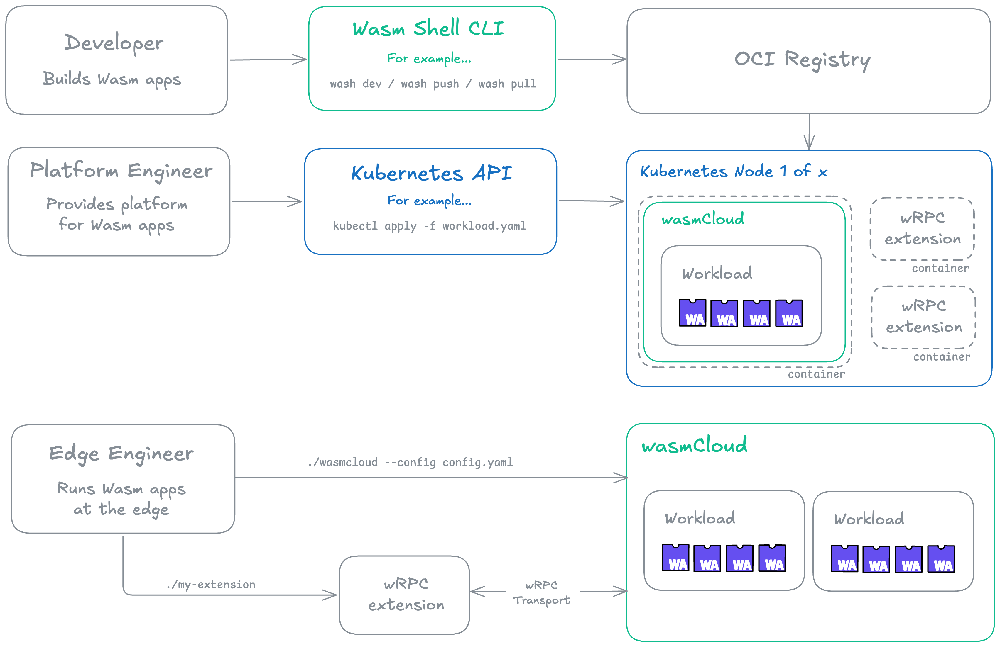

This week, we took a big step toward the next major version of wasmCloud with the release of the [**new wasmCloud crate**](https://crates.io/crates/wasmcloud). 

This release radically simplifies the wasmCloud architecture, focusing on being the best possible WebAssembly host implementation&mdash;and paving the way for many of the major initiatives on the [wasmCloud roadmap](https://github.com/orgs/wasmCloud/projects/7). Simplified workload scheduling allows for embedding in many different environments, including integration with Kubernetes operators as a scheduler.

In this post, we'll break down what exactly the crate does, why we built it, how it differs from the v1 approach, and where we're heading next.

## What is the new wasmCloud crate?

[Wasmtime](https://wasmtime.dev/) serves as our low-level WebAssembly runtime, just as it's always done&mdash;it handles the nitty-gritty work of compiling and executing Wasm. 

The **wasmCloud crate** provides easy-to-use abstractions over the low-level Wasmtime API, as well as wasmCloud-specific APIs for managing workloads, handling communication over wRPC, handling NATS subscriptions, managing and utilizing host plugins, and so on. 

At a high level, the wasmCloud crate includes:

* Wasmtime as the underlying runtime engine
* The wasmCloud host that serves as a runtime environment for components
* Built-in plugins (toggleable at runtime via feature flags) to handle...
   - Serving HTTP (WASI interface)
   - Making HTTP Requests (WASI interface)
   - Logging (WASI interface)
   - Runtime configuration (WASI interface)
   - Ephemeral Key-Value storage (WASI interface)
   - Ephemeral Blob storage (WASI interface)
   - wRPC extensions

The new design supports several key goals on the wasmCloud roadmap:

- [Simpler API surface for deploying and managing components](https://github.com/orgs/wasmCloud/projects/7?pane=issue&itemId=119180810&issue=wasmCloud%7CwasmCloud%7C4641)
- [Host plugins enable extending wasmCloud without modifying core code](https://github.com/orgs/wasmCloud/projects/7?pane=issue&itemId=119177820&issue=wasmCloud%7CwasmCloud%7C4636)
- [Making distributed networking more intentional](https://github.com/orgs/wasmCloud/projects/7?pane=issue&itemId=119180761&issue=wasmCloud%7CwasmCloud%7C4640)

These changes have the follow-on effects of performance improvement through [in-process component-to-component calls](https://github.com/orgs/wasmCloud/projects/7?pane=issue&itemId=119177540&issue=wasmCloud%7CwasmCloud%7C4637) and increased maintainability for the project.

### What has changed?

For wasmCloud v1.x, we maintained the wasmCloud host, our runtime implementation, and core libaries separately, which led to both API sprawl and maintainability challenges. 

For the next generation of wasmCloud, simplification is the watchword. We've combined host, runtime, and libraries into a single crate (for contributors and integrators) and a single binary (for users). 

In a very real sense, the new wasmCloud crate *is* wasmCloud&mdash;that is to say, it is the part of the stack that acts as a host and runs WebAssembly components wherever you want to run them. The binary is simply called `wasmcloud`, and the associated Rust library that it wraps is simply called `wasmcloud`. 

Meanwhile, component developers use the Wasm Shell (`wash`) CLI to develop and publish components. Add transport for distributed deployments and you have all the core elements of a wasmCloud ecosystem, from development to production deployment.

## What's next?

There are more changes to come as we approach the next generation of wasmCloud, including a rethinking of the "capability provider" model. If you want to follow along, now is a great time to join us on the [wasmCloud Slack](https://slack.wasmcloud.com/) or a [wasmCloud community meeting](https://wasmcloud.com/community/)&mdash;these are the places where many exciting features and advances are first discussed and shared. Hope to see you there!