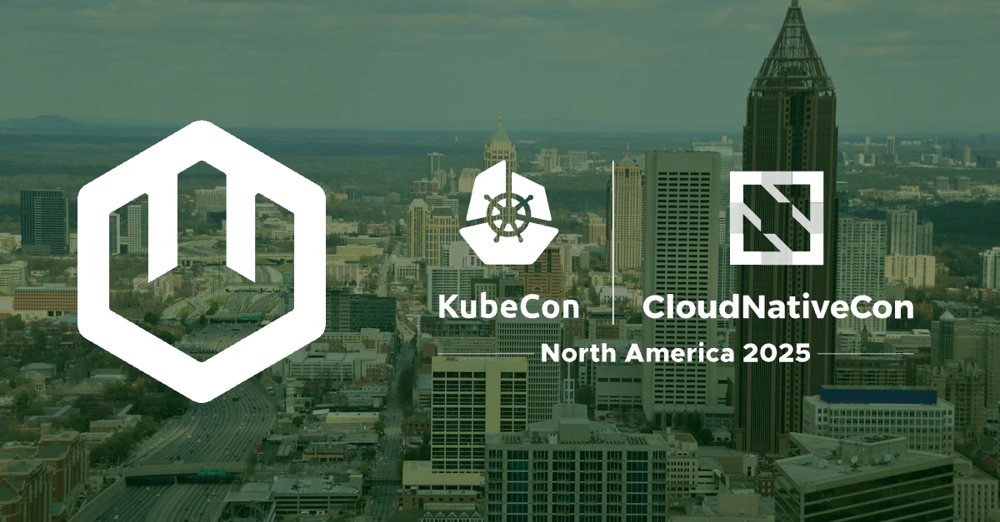
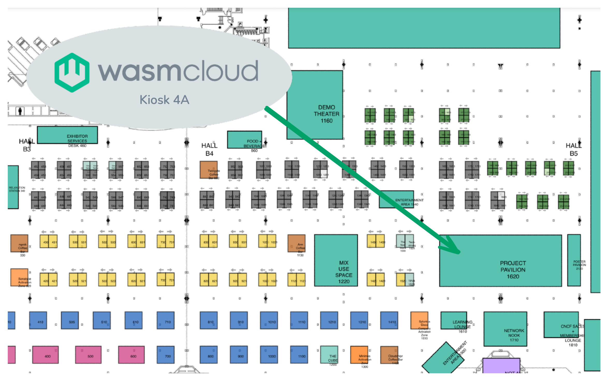
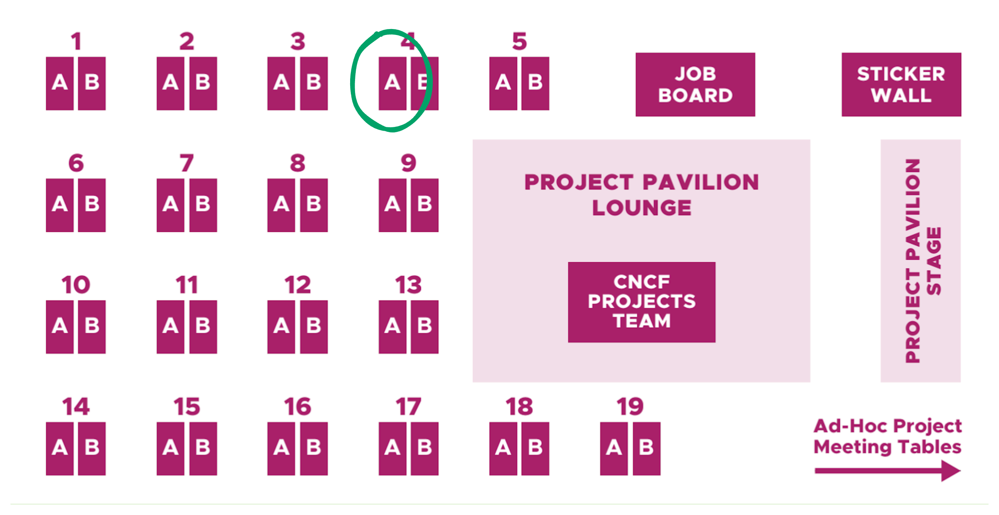

Are you attending **KubeCon + CloudNativeCon NA 2025** in Atlanta on November 10-13? Make sure to come and say hello to the wasmCloud team! You can find us in the **Project Pavilion at Kiosk 4A**, and wasmCloud maintainers and contributors are presenting on topics including service meshes, Wasm instrumentation, WASI WebGPU, GitOps with Wasm workloads, and more.

{/* truncate */}

## Where to find us 

Tuesday through Thursday, you can chat with wasmCloud maintainers at the **wasmCloud kiosk (4A) in the Project Pavilion** on the Solutions Showcase floor (Building B, Level 1, Exhibit Hall B3-B5):

### Talks and presentations

#### WasmCon on Monday, November 10

[Welcome + Opening Remarks](https://colocatedeventsna2025.sched.com/event/28FYq) - Bailey Hayes, Cosmonic  
1:25pm - 1:30pm EST, Building B | Level 5 | Thomas Murphy Ballroom 4

Cosmonic CTO, W3C WebAssembly WASI Subgroup co-chair, and Bytecode Alliance At-Large Director Bailey Hayes opens the festivities with a talk on WebAssembly's evolution from browser technology to universal runtime, including the major milestones from this year such as WebAssembly's 10th birthday and the growing ecosystem of language support.

[If You Want Peace, Add a Mesh!](https://colocatedeventsna2025.sched.com/event/28D7M) - Bailey Hayes, Cosmonic & Flynn, Buoyant  
4:00pm - 4:25pm EST, Building B | Level 5 | Thomas Murphy Ballroom 4

WebAssembly (Wasm) has been making incredible inroads in the cloud-native world, with its tiny code sizes, lightning-fast startup, and exceptional portability providing some truly amazing capabilities. Wasm doesn’t spare you from needing robust solutions for crucial operational concerns like security, reliability, and observability, though – and without them, you’re not going to find much peace in production.

In this session, we’ll demonstrate how to integrate wasmCloud with Linkerd, bringing wasmCloud’s easy-to-use, self-hostable component orchestration capabilities with Linkerd’s lightweight, flexible security, reliability, and observability features. Join us for a quick dive into the capabilities of both these systems followed by a live demo showing how you can give your Wasm applications what they need to thrive in production – and what you need for your own peace of mind.

[Whamm: A Framework for Performant, Sandboxed Instrumentation](https://colocatedeventsna2025.sched.com/event/28D4w) - Elizabeth Gilbert, Cosmonic  
2:10pm - 2:35pm EST, Building B | Level 5 | Thomas Murphy Ballroom 4

Wasm workloads are often black boxes in terms of observability, but insight into their execution is mission-critical. Where are the hot paths? How resource-heavy is the workload (e.g. usage metering)? What cache strategy is best? Does the program follow our security policies?

This talk presents Whamm, an instrumentation framework that can be used to answer questions like these. Whamm can statically rewrite bytecode ***or*** dynamically insert probes via an engine interface to invoke callbacks at runtime. Whamm’s engine interface promotes portable instrumentation with high-performance. This is achieved through leveraging engine optimizations that reduce overhead and providing logic as Wasm code, which the engine can compile and/or inline into application code. Whamm supports instrumenting Wasm modules, components…and even kernel-level events! Want to know how? This session offers an overview of the framework and a live demo of writing monitors, helping you apply Whamm in your domain.

[Content Authenticity Initiative Trustmark with WASI Web-GPU](https://colocatedeventsna2025.sched.com/event/28D6X) - Mendy Berger, Cosmonic & Colin Murphy, Adobe  
3:25 - 3:50pm EST, Building B | Level 5 | Thomas Murphy Ballroom 4

AI workloads bring unique challenges to Adobe's goal of providing high-performance experiences to our customers, regardless of the capabilities of their devices or their distance from our datacenters. CDN based edge compute has been a tantalizing solution for AI workloads, but a truly portable solution across browsers and edge compute has been elusive. In this talk, we will discuss how to create a single Wasm component that can be run in wasmCloud and transpiled for use in the browser. We will then demonstrate the encoding of images using the open-source Trustmark watermark system in both the browser and CDN edge compute. This demonstration will use the wasi:webgpu interface from the WASI-GFX proposal, which enables graphics and GPU functionality outside the browser.

#### KubeCrawl + CloudNativeFest on Tuesday, November 11

[Wasm x GitOps: WebAssembly Components with Argo and Helm](https://kccncna2025.sched.com/event/27FYb/poster-session-ps9-wasm-x-gitops-webassembly-components-with-argo-and-helm-eric-gregory-cosmonic)  
6:15 - 7:45pm EST, Building B | Level 1 | Exhibit Hall B3-B5

Running WebAssembly workloads on Kubernetes is much simpler than even a year or two ago. As the WebAssembly ecosystem standardizes and matures, integrations with the wider world of cloud native tooling make it possible to package and manage both infrastructure primitives and WebAssembly components using GitOps patterns and standard tooling like Helm and Argo.

This poster session demonstrates how wasmCloud, Argo, and Helm can work together for a smooth, GitOps approach to deployment and management for highly efficient, polyglot server-side WebAssembly applications. You’ll walk away ready to apply these techniques in your own environments.

## Watch this space

There's a lot going on in the world of wasmCloud lately, and much more to come in the next week. Don't forget to join the [wasmCloud community Slack](https://slack.wasmcloud.com/), and keep an eye on this space&mdash; we're planning to liveblog WasmCon here on the wasmCloud blog. 

Hope to see you in Atlanta!