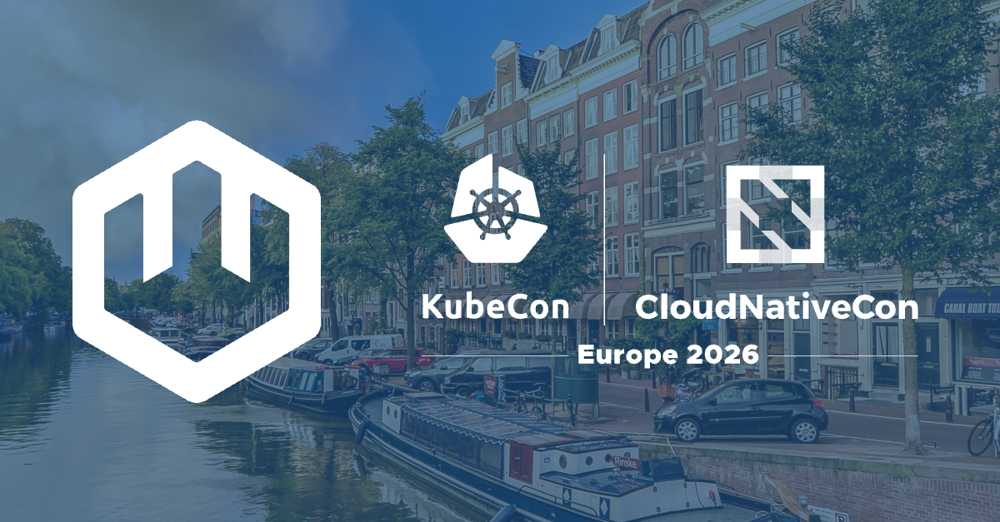
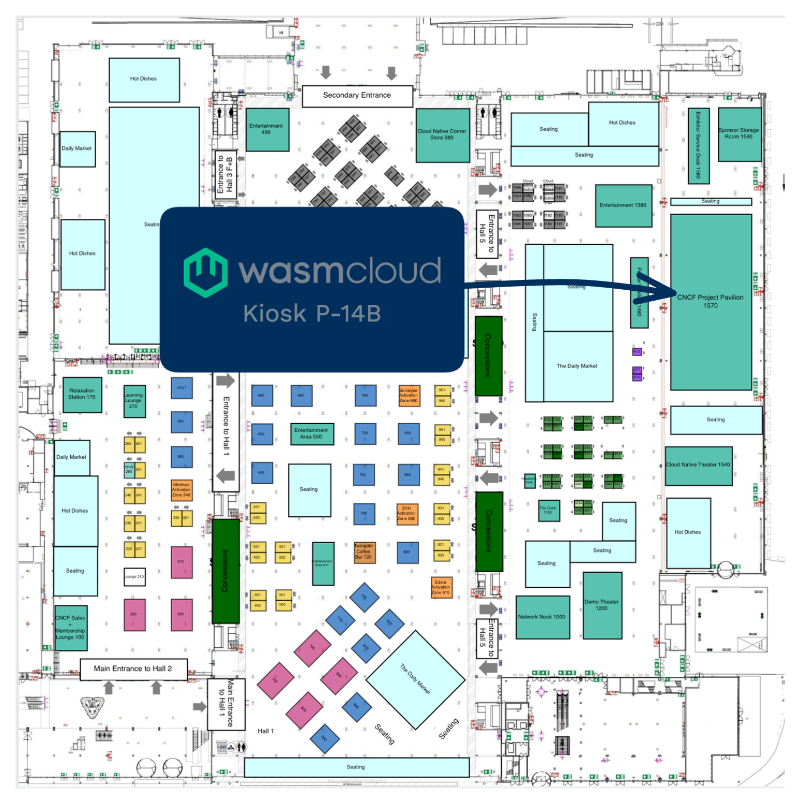

Heading to **[KubeCon + CloudNativeCon EU 2026](https://events.linuxfoundation.org/kubecon-cloudnativecon-europe/)** in Amsterdam? Come and say hello to the wasmCloud team! You can find us at **Kiosk P-14B in the Project Pavilion** (Halls 1-5), where wasmCloud maintainers will be on hand to chat about the project, answer questions, and show what's new in wasmCloud v2.

{/* truncate */}

## WasmCon

Before the main event kicks off, make sure to register for **[WasmCon](https://events.linuxfoundation.org/kubecon-cloudnativecon-europe/co-located-events/wasmcon/)**, the half-day co-located event dedicated to WebAssembly. WasmCon brings together the Wasm community for talks and discussions on the latest developments across the ecosystem, from standards and runtimes to real-world production deployments. It's the best place to go deep on all things Wasm before the broader cloud-native conversation begins.

WasmCon takes place on **Tuesday, 24 March** in **Room E106-108**.

## Where to find us

You can find wasmCloud maintainers at **Kiosk P-14B** in the **Project Pavilion, Halls 1-5** during the following hours:

| Day | Kiosk Hours |
|---|---|
| Tuesday, 24 March | 15:10 – 19:00 _(includes KubeCrawl + CloudNativeFest 17:30–19:00)_ |
| Wednesday, 25 March | 14:00 – 17:00 |
| Thursday, 26 March | 12:30 – 14:00 |

Drop by any time during those windows to meet the team, see a demo, or just pick up some stickers.

## Join the community

Whether or not you can make it to Amsterdam, the wasmCloud community is always open. Join us in the [wasmCloud Slack](https://slack.wasmcloud.com/) to stay up to date on the project, ask questions, and connect with maintainers and contributors around the world.

Hope to see you in Amsterdam!
