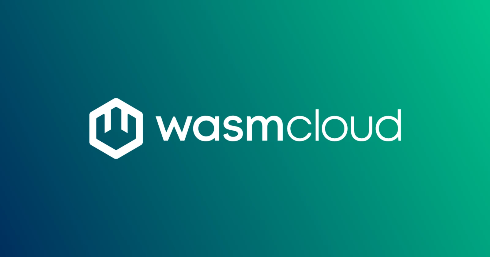

Today we're announcing **wasmCloud v2.0**, a reimagining of the wasmCloud platform that brings a radically simplified runtime architecture, Kubernetes-native scheduling, and much more. Years of production experience and community collaboration have helped make v2.0 the most powerful, flexible, and ergonomic way to deploy Wasm workloads across your environments.

If you want to jump straight in, head to the [quickstart](/docs/quickstart). Otherwise, read on for the full story.

{/* truncate */}

## What is wasmCloud?

wasmCloud is a cloud native platform designed to run WebAssembly workloads across any cloud, Kubernetes cluster, datacenter, or edge location. WebAssembly (Wasm) components are a lightweight, secure-by-default unit of compute, ideal for workloads like microservices, functions, and agents.

Where containers default to permissive POSIX environments and pare back from there, Wasm components start from **zero access**: no file I/O, no network access, and no system calls unless explicitly granted through [language-agnostic WASI interfaces](/docs/overview/interfaces). Components are compiled to the open WebAssembly System Interface (WASI) standard, making them portable across any conformant runtime without vendor lock-in. And they're small&mdash;typically kilobytes to low megabytes&mdash;with millisecond startup times.

We've always believed that WebAssembly components are the right unit of compute for a wide class of cloud-native workloads, and in the age of untrusted code and non-deterministic workloads, the Wasm sandbox is more important than ever. 

## The shape of wasmCloud v2

wasmCloud v2 consists of three core parts:

- [Wasm Shell (`wash`) CLI](/docs/wash/): A development tool for building and publishing Wasm components with languages including TypeScript, Rust, Go, and more.
  
- [Runtime (`wash-runtime`)](/docs/runtime/): An easy-to-use runtime and workload API for executing Wasm components, with built-in support for standard WebAssembly System Interface (WASI) APIs.
  
- [Kubernetes Operator (`runtime-operator`)](/docs/kubernetes-operator/): An operations tool that runs wasmCloud infrastructure and workloads on Kubernetes.

**Application teams** use Wasm Shell (`wash`) to build and publish components.

**Platform teams** can use the wasmCloud operator to run wasmCloud hosts (runtime environments) and workloads on Kubernetes.

**Anyone** can build custom wasmCloud hosts with the `wash-runtime` library.

Since the runtime is built into Wasm Shell, you can run `wash host` to start a host immediately. By default, the wasmCloud operator deploys containerized `wash` binaries as hosts, though you can substitute your own custom host builds.

## How we got here

If you've been following the wasmCloud project, you may have read last July's post on [charting the next steps for wasmCloud](/blog/charting-the-next-steps-for-wasmcloud). We took a hard look at what wasn't working in v1.x: the application abstraction was awkward for microservices deployments, the host carried too many responsibilities, distributed networking was implicit rather than intentional, and maintaining capability providers consumed too much maintainer bandwidth.

Last November we [introduced the `wash-runtime` crate](/blog/2025-11-05-introducing-the-next-generation-wasmcloud-runtime), the core architectural foundation for v2.0. We combined the wasmCloud host, runtime, and libraries into a single crate with a simple, focused API&mdash;easy to embed, easy to extend, and easy to reason about. v2.0 is the completion of that journey.

## Components 🤝 containers

wasmCloud is built to run alongside your existing container infrastructure, so you can start deploying WebAssembly components immediately. Wasm components are a natural fit for specific kinds of work:

- **Untrusted or third-party code**: the deny-by-default capability model gives you strict, auditable control over what a component can access. Running code you don't fully control is safer because the runtime requires every capability to be explicitly granted.
- **New application logic**: business logic, API handlers, data processing pipelines&mdash;anything written fresh benefits from fine-grained capability controls and a deny-by-default sandbox, without the overhead of a full container image.
- **Edge and constrained environments**: components are small enough to run on IoT gateways and resource-constrained hosts where container images aren't viable.

Because the wasmCloud operator manages component workloads as Kubernetes custom resources, your existing namespace boundaries, RBAC, and tooling carry over directly. 

Containers and components are better together: Kubernetes keeps orchestrating what it orchestrates best, while components handle workloads that benefit from lightweight, sandboxed execution and explicit capability controls.

## What's new

### Kubernetes-native orchestration

In wasmCloud v1, state was managed via NATS JetStream and application deployments were described in OAM (Open Application Model) manifests processed by a separate `wadm` process. This worked, but it meant learning a wasmCloud-specific model layered on top of Kubernetes rather than working with Kubernetes directly.

In v2.0, the Kubernetes operator takes over orchestration entirely. Workloads and infrastructure are described as **Custom Resource Definitions** (CRDs) and managed through the standard Kubernetes API. This means you can use `kubectl`, Helm, ArgoCD, and whatever else is already in your toolchain.

State lives in Kubernetes `etcd`. Backup, recovery, scaling, and observability all use existing Kubernetes tooling. Runtime configuration and secrets can be sourced from Kubernetes ConfigMaps and Secrets and surfaced to components as environment variables.

### Host plugins and services replace capability providers

One of the most significant changes in v2.0 is the removal of capability providers. In v1, providers were out-of-process plugins running alongside the host and communicating over NATS to handle capabilities like keyvalue, blobstore, and messaging. This worked, but it introduced network overhead, created separate deployment concerns, and was a consistent source of operational friction.

In v2.0, there are two purpose-built replacements:

- **[Host plugins](/docs/overview/hosts/plugins)** are native extensions to the `wash-runtime` host. They run in-process, communicate with components at near-native speed, and can implement any WASI interface. Plugins for `wasi:keyvalue`, `wasi:blobstore`, `wasi:config`, `wasi:logging`, and `wasmcloud:messaging` ship with `wash-runtime` out of the box.
  
- **[Services](/docs/overview/workloads/services)** are persistent, stateful companions to stateless components. A service acts as the `localhost` for its workload&mdash;it can open TCP sockets, call component interfaces (for example, firing a component on a cron schedule), and maintain state like connection pools across invocations.

Both patterns are more explicit than v1 capability providers, and they eliminate the network overhead that came with wRPC calls in distributed deployments.

### Intentional, explicit networking

In v1, a component that imported `wasi:keyvalue` would have its call automatically routed over NATS via [wRPC](https://github.com/bytecodealliance/wrpc). This was convenient, but implicit, and often surprising. A call that felt like nanoseconds in your mental model was actually subject to transport failure, message loss, and network latency.

In v2.0, distributed networking is **explicit**. In-process calls happen in nanoseconds by default. If you want to route component calls over NATS, you wire that up deliberately. The performance difference is significant, and the clarity of the model makes reasoning about distributed behavior much easier.

### WASI P2 natively supported&mdash;with P3 on the way

All WASI P2 interfaces are supported natively in `wash-runtime`, including `wasi:io`, `wasi:clocks`, `wasi:filesystem`, `wasi:random`, `wasi:http`, `wasi:cli`, and more. 

Any standards-compliant WASI P2 component works with wasmCloud&mdash;no special configuration required, and no lock-in. Components running on wasmCloud v2.0 can run on any other conformant WASI P2 runtime.

For those looking ahead to the impending release of WASI P3, you can expect support in wasmCloud very swiftly upon P3's release.

## Getting started

The fastest way to get started is the [quickstart](/docs/quickstart), which takes you from installation to a running component deployment on Kubernetes in minutes.

If you're coming from wasmCloud v1, the [migration guide](/docs/migration/) covers the major changes and how to adapt your workloads.

## Join the community

wasmCloud has an amazing community of contributors, maintainers, and adopters who meet weekly and help shape the project's direction.

- Join the [wasmCloud Slack](https://slack.wasmcloud.com/) for discussion, questions, and announcements
- Attend the [weekly Wednesday community meeting](/community/) at 1PM ET
- Follow the [GitHub repository](https://github.com/wasmCloud/wasmCloud) for releases and issues
- Find us at [KubeCon + CloudNativeCon Europe 2026](/blog/wasmcloud-at-kubecon-cloudnativecon-eu-2026/) this week

We're grateful to everyone who contributed to this release&mdash;through code, feedback, docs, and community participation. We're looking forward to building the future of cloud computing together.
