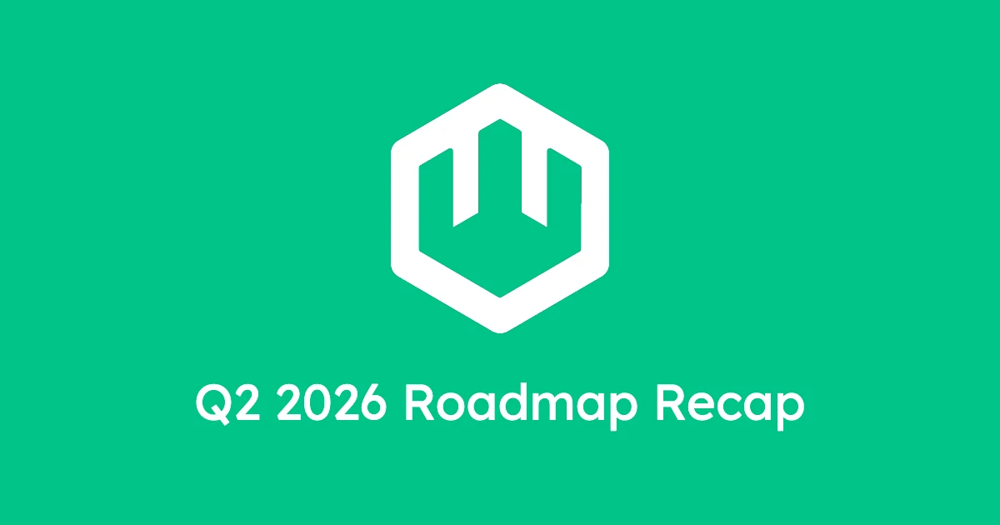

[wasmCloud v2](https://wasmcloud.com/blog/wasmcloud-v2-is-here/) ships a fundamentally different runtime, Kubernetes-native orchestration, in-process host plugins, and an explicit networking model. It's the result of sustained work to translate production experience and community feedback into a reimagining of wasmCloud that's both simpler to operate and more powerful to build on. But shipping v2 was just the starting line.

Last Wednesday, we ran our Q2 roadmap planning session as part of the regular wasmCloud Wednesday community call. We walked through candidate priorities, the community weighed in on what matters most, and the results are now live as tracking issues in the [Q2 2026 project board](https://github.com/orgs/wasmCloud/projects/7/views/19). This post walks through the work currently underway, the issues queued up for pickup, and how to get involved.

## The Q2 priorities

### WASI P3 and async components

WASI P3 is the biggest technical milestone on the horizon for wasmCloud, and for the WebAssembly ecosystem more broadly. P3 rebases WASI onto the Component Model's native async primitives: first-class `stream<T>` and `future<T>` types that propagate correctly across component boundaries, and an async handler model that lets developers write components in their language's native async style without any WASI-specific plumbing.

The practical impact is significant. HTTP handlers become `async fn`; bodies become `stream<u8>`; what were eight resource types in `wasi:http` collapse to two. The `v0.3.0-rc-2026-03-15` release candidate is available now with support in Wasmtime 43 and experimental support in wasmCloud&mdash;see our [blog on wasmCloud's WASI P3 support](/blog/wasi-p3-on-wasmcloud/) for the full walkthrough.

For Q2, the focus is on bringing WASI P3 support to production-readiness. The tracking issues are:

- **[#5015 — Support WASIP3 rc behind a flag](https://github.com/wasmCloud/wasmCloud/issues/5015)** (in progress): Landed the initial experimental P3 support behind the `wasip3` Cargo feature; ongoing work keeps the implementation in step with the evolving RC.
- **[#5028 — Harden sockets and http impls for p3](https://github.com/wasmCloud/wasmCloud/issues/5028)** (ready for work): The dispatch path works for the straightforward case; this issue tracks the edges — streaming bodies under load, backpressure, and long-lived connections — that separate a preview from a production-ready feature.
- **[#4951 — Support separate WasiCtx for different components in same store](https://github.com/wasmCloud/wasmCloud/issues/4951)** (triage): A prerequisite for correct per-component isolation as we scale up concurrent P3 workloads.

Language coverage is expanding in parallel: Rust is the happy path today, with TypeScript support via `componentize-js` in process. If you're building P3 components in any language, please file minimal reproductions for anything that surprises you.

### Kubernetes integrations

With v2, wasmCloud is Kubernetes-native. Several Q2 priorities focus on closing remaining gaps for operators coming from existing cluster topologies. One significant piece is already done:

- **[#5025 — Replace runtime-gateway with Kubernetes-native Service routing](https://github.com/wasmCloud/wasmCloud/issues/5025)** (completed): Shipped earlier this month, simplifying how wasmCloud integrates into cluster networking.

The remaining tracked work:

- **[#4939 — Autoscaling WorkloadDeployments](https://github.com/wasmCloud/wasmCloud/issues/4939)** (ready for work): Native autoscaling semantics for wasmCloud workloads, bringing scale-to-zero and load-driven scaling into the same reconciliation loop that already manages placement.
- **[#5016 — Implement wasmcloud:secrets plugin backed by Kubernetes Secrets](https://github.com/wasmCloud/wasmCloud/issues/5016)** (triage): A first-party secrets plugin that sources values from Kubernetes Secrets, closing the loop on secure credential delivery to components.
- **[#5049 — Scheduled vulnerability scans for published container images](https://github.com/wasmCloud/wasmCloud/issues/5049)** (ready for work): Ongoing CVE scanning for wasmCloud's published images, making them fit naturally into compliant container pipelines.

Beyond the tracked issues, the community also flagged a need for better ingress-controller documentation (Envoy, Traefik, Istio) and more complete Helm chart references. Expect those to land as doc PRs over the quarter.

### Host plugins, interfaces, and routing

One of the most substantial pieces of the Q2 roadmap is the maturation of wasmCloud's host plugin model. Host plugins let you extend what a wasmCloud host can offer to components as in-process capabilities with well-defined WIT interfaces.

**Core plugin work:**

- **[#5018 — [FEATURE] Host Component Plugins](https://github.com/wasmCloud/wasmCloud/issues/5018)** (triage): Lets a host plugin itself be backed by a Wasm component, rather than native Rust code. This is a significant expressiveness win: plugin authors can target a stable WIT contract and ship their plugin as a component.
- **[#4949 — [FEAT] HTTP Client Plugin](https://github.com/wasmCloud/wasmCloud/issues/4949)** (in progress): A first-party plugin that implements `wasi:http/outgoing-handler`, so components can make outbound HTTP calls without each deployment rolling its own.
- **[#5053 — [Example] Connection Pool Example for wasi:sockets Host Plugin](https://github.com/wasmCloud/wasmCloud/issues/5053)** (ready for work): A worked example of a stateful plugin, showing how host plugins can hold onto expensive resources (connections, sessions) across invocations.
- **[#4954 — [FEAT] Represent plugin+host WitWorld with VersionReq](https://github.com/wasmCloud/wasmCloud/issues/4954)** (ready for work): Lets plugins express version compatibility ranges rather than exact pins, so the host can resolve compatible plugins at load time.
- **[#5055 — [DOC] Host Plugin vs wasmCloud Service](https://github.com/wasmCloud/wasmCloud/issues/5055)** (ready for work): v2 introduced both in-process host plugins and persistent service companions. This tracks the documentation work to give operators and developers clear guidance on when to use each.

**Multi-backend routing:**

- **[#5051 — Implement Multiple Backend instances for hostInterfaces](https://github.com/wasmCloud/wasmCloud/issues/5051)** (triage): A recurring theme in the community discussion — the ability for a single wasmCloud host to support multiple backends for a given API, and to route across multiple components exporting handlers for the same interface. The Q2 scope is design: defining the semantics (A/B deployments, fallback chains, per-tenant backend selection) before committing to an implementation.

### Performance and observability

With v2's architectural simplifications, there's now a clean baseline to measure against, and the Q2 roadmap invests heavily in making that measurement public and repeatable.

- **[#5052 — [Performance] Benchmarking Suite for wasmCloud v2](https://github.com/wasmCloud/wasmCloud/issues/5052)** (ready for work): A reproducible benchmark harness covering cold start, steady-state throughput, and tail latency: something evaluators and operators can run themselves.
- **[#5054 — Add HTTP invocation microbenchmarks for wash-runtime](https://github.com/wasmCloud/wasmCloud/issues/5054)** (in progress): Tight, per-path benchmarks for the HTTP dispatch hot path in `wash-runtime`, to catch regressions as the runtime evolves.
- **[#5056 — Instance pooling / reuse for HTTP invocations](https://github.com/wasmCloud/wasmCloud/issues/5056)** (blocked): A significant latency win once prerequisite work lands: reusing component instances across invocations instead of constructing them fresh each time.
- **[#5050 — [OTEL] OTEL Example with Context Roll-Up for v2 Wasm Workloads](https://github.com/wasmCloud/wasmCloud/issues/5050)** (ready for work): A worked OpenTelemetry example showing trace context propagating from an ingress request down through component invocations and plugin calls.
- **[#5023 — [FEATURE] Configurable engine flags and builder](https://github.com/wasmCloud/wasmCloud/issues/5023)** (ready for work): Exposes Wasmtime's engine configuration surface through `wash-runtime`, so operators can tune pooling, fuel, and memory limits per workload.

Adjacent to the perf work, **[arewefastyet.com](https://arewefastyet.com/)**-style public performance dashboards came up repeatedly in community discussion. Once the benchmarking suite in #5052 exists, a public dashboard built on top of it is the natural next step.

### Platform tooling and developer experience

A set of targeted DX improvements round out the roadmap:

- **[#5047 — Unify TLS support for wash dev and wash host](https://github.com/wasmCloud/wasmCloud/issues/5047)** (in progress): One TLS configuration path that works consistently between local development and production host deployments.
- **[#5030 — CI: Add publishing for wash-runtime crate](https://github.com/wasmCloud/wasmCloud/issues/5030)** (in progress): Publishes `wash-runtime` to crates.io on each release, making it a first-class dependency for embedders.
- **[#5017 — [FEATURE] Add wash winget package for windows](https://github.com/wasmCloud/wasmCloud/issues/5017)** (ready for work): Closes the last major install-experience gap on Windows.
- **[#4937 — [CI] publish OCI artifacts of examples](https://github.com/wasmCloud/wasmCloud/issues/4937)** (ready for work): Publishes the example components as OCI artifacts so users can `wash` and run them without a local build.
- **[#4953 — [BUG] wasmtime host resource types are string comparisons](https://github.com/wasmCloud/wasmCloud/issues/4953)** (ready for work): A correctness fix in the resource-type dispatch path.
- **[#5034 — [Tests] Add wash-runtime integration test for host aliases in DynamicRouter](https://github.com/wasmCloud/wasmCloud/issues/5034): Test coverage for host-alias routing, guarding a subtle piece of the request-dispatch logic.

Composition tooling also came up strongly in community discussion. A `wash compose` subcommand, bringing component composition into the standard `wash` workflow rather than requiring `wasm-tools` directly, is a clear next step; expect a tracking issue to follow.

## Security: proactive, not reactive

If you've been following the wider WebAssembly ecosystem, you may have seen the Bytecode Alliance publish [the largest set of security advisories in Wasmtime's history](https://bytecodealliance.org/articles/wasmtime-security-advisories): 12 vulnerabilities uncovered with the help of a frontier LLM model.

wasmCloud is a natural target for this class of analysis. We inherit Wasmtime's security posture, and that's a strong foundation, but wasmCloud's own host implementation is independently in scope.

As part of the Q2 roadmap, we're committing to a proactive LLM-assisted fuzzing effort against wasmCloud's codebase, complementing the scheduled image scans tracked in [#5049](https://github.com/wasmCloud/wasmCloud/issues/5049). The intent is to get ahead of external researchers rather than behind them. Findings will be filed and tracked publicly wherever responsible disclosure permits.

## How to get involved

The Q2 roadmap is live in [GitHub Projects](https://github.com/orgs/wasmCloud/projects/7/views/19), broken out by status: **In Progress** issues are actively being worked, **Ready for Work** issues are unblocked and looking for owners, and **Triage** issues are under active design discussion.

A few ways to jump in:

- **Pick up a "Ready for Work" issue**: If any of the issues in that column sound interesting&mdash;especially the examples ([#5053](https://github.com/wasmCloud/wasmCloud/issues/5053), [#5050](https://github.com/wasmCloud/wasmCloud/issues/5050)), the benchmarking suite ([#5052](https://github.com/wasmCloud/wasmCloud/issues/5052)), or the Windows package ([#5017](https://github.com/wasmCloud/wasmCloud/issues/5017))&mdash;comment on the issue to coordinate.
- **Weigh in on "Triage" issues**: The [Host Component Plugins](https://github.com/wasmCloud/wasmCloud/issues/5018), [Multiple Backend instances](https://github.com/wasmCloud/wasmCloud/issues/5051), and [Kubernetes Secrets plugin](https://github.com/wasmCloud/wasmCloud/issues/5016) issues are all in the design phase. If you have production experience with any of these patterns, your input matters now.
- **Join wasmCloud Wednesday**: The community call runs every Wednesday; bring your questions, ideas, and PRs. [Add to your calendar](https://calendar.google.com/calendar/u/0/embed?src=c_6cm5hud8evuns4pe5ggu3h9qrs@group.calendar.google.com) or [join via Zoom](https://zoom.us/j/98144613430?pwd=VjBObmZIaUppUXVWRkxSZ3crZzhkZz09).
- **Good first issues**: We maintain a curated list for new contributors: [github.com/wasmCloud/wasmCloud/issues](https://github.com/wasmCloud/wasmCloud/issues?q=label%3A%22good+first+issue%22+is%3Aopen).
- **Slack**: The fastest path to maintainers and other contributors is the [wasmCloud Slack](https://slack.wasmcloud.com).
- **P3 bug reports**: If you're testing WASI P3 components and running into issues, please file them. Minimal reproductions are especially valuable right now.

**Related reading:**

- [wasmCloud v2.0 is here](https://wasmcloud.com/blog/wasmcloud-v2-is-here/)
- [Writing and running async components on wasmCloud with WASI P3](/blog/wasi-p3-on-wasmcloud/)
- [Wasmtime Security Advisories, April 2026](https://bytecodealliance.org/articles/wasmtime-security-advisories)
- [wasmCloud Q2 2026 Roadmap](https://github.com/orgs/wasmCloud/projects/7/views/19)
