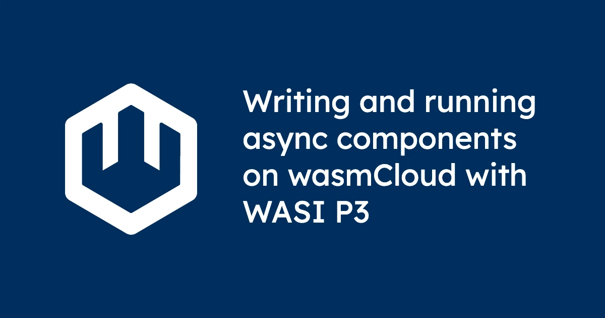

With a WASI P3 release just around the corner, now is a good time to start thinking about what it looks like to build and run P3 components on wasmCloud. And good news: you don't have to speculate. Experimental P3 is available in wasmCloud today. So what does it actually look like to write and run a WASI P3 component on wasmCloud? In this post, we'll break down the status of the preview, and how you can help get that support to production-readiness. 

## Experimental P3 support status: what works, and what doesn't

P3 support in wasmCloud landed in [PR #5022](https://github.com/wasmCloud/wasmCloud/pull/5022), behind a `wasip3` Cargo feature flag. It's preview-quality, working end-to-end for Rust HTTP components, with some gaps elsewhere:

- **Rust HTTP components**: Working. The example below runs on wash built with `--features wasip3`.
- **TypeScript (via `componentize-js`)**: Components build and load, but there are still a few wrinkles to iron out.
- **Streaming response bodies**: Works for the straightforward case. Harder edge cases (long-lived streams under load, backpressure) are what [issue #5028 — *Harden sockets and http impls for p3*](https://github.com/wasmCloud/wasmCloud/issues/5028) is about, and it's a Q2 priority.
- **Other WASI P3 interfaces** (blobstore, sockets): Exercised in wasmCloud's internal test fixtures but not yet documented end-to-end for external users.

If you want to start building on P3 today, we'd recommend Rust as the happy path, and we expect TypeScript to be close behind.

## What changes for component authors

In WASI P2, an HTTP handler in Rust looked something like this:

```rust
fn handle(request: IncomingRequest, response_out: ResponseOutparam) {
    let response = OutgoingResponse::new(Fields::new());
    let body = response.body().unwrap();
    ResponseOutparam::set(response_out, Ok(response));
    let body_stream = body.write().unwrap();
    body_stream.blocking_write_and_flush(b"hello").unwrap();
    drop(body_stream);
    OutgoingBody::finish(body, None).unwrap();
}
```

That's a lot of imperative plumbing to say "respond with `hello`." The `ResponseOutparam` pattern exists because WASI P2 doesn't have a way to *return* a response asynchronously: you have to hand the outparam back through the host, then set up a separate stream for the body, then clean up resources in a specific order.

In WASI P3, the same handler becomes this:

```rust
async fn handle(request: Request) -> Result<Response, ErrorCode> {
    // ...
}
```

That's it. It's an `async fn`. It returns a `Response`. The body is a `stream<u8>`. There are no outparams, no separate initialization/finish calls, and no runtime-specific scheduling primitives.

## A minimal P3 HTTP component

Everything below is adapted from the [`http-handler-p3` fixture](https://github.com/wasmCloud/wasmCloud/tree/main/crates/wash-runtime/tests/fixtures/http-handler-p3) in the wasmCloud repo.

### The WIT world

```wit
package wasmcloud:example-p3@0.1.0;

world http-handler {
    import wasi:http/types@0.3.0-rc-2026-03-15;
    import wasi:clocks/types@0.3.0-rc-2026-03-15;
    import wasi:random/random@0.3.0-rc-2026-03-15;

    export wasi:http/handler@0.3.0-rc-2026-03-15;
}
```

A few notes on the WIT:

- The version suffix `0.3.0-rc-2026-03-15` is the current release candidate. It matches what Wasmtime 43 ships and what wasmCloud's `wasip3` feature expects.
- wasmCloud maintains a canonical [set of P3 WIT deps](https://github.com/wasmCloud/wasmCloud/tree/main/crates/wash-runtime/tests/fixtures/p3-wit-deps) you can copy directly into `wit/deps/`.

### Cargo.toml

```toml
[package]
name = "http-hello-p3"
edition = "2021"
version = "0.1.0"

[lib]
crate-type = ["cdylib"]

[dependencies]
wit-bindgen = { version = "*", features = ["async-spawn", "inter-task-wakeup"] }
```

There are two features to focus on here: 

* `async-spawn` gives us `wit_bindgen::spawn()` for launching subtasks in the component-model-async world. 
* `inter-task-wakeup` ensures wakeups propagate correctly between those subtasks and the host.

### src/lib.rs

```rust
mod bindings {
    wit_bindgen::generate!({
        generate_all,
    });
}

use bindings::exports::wasi::http::handler::Guest as Handler;
use bindings::wasi::http::types::{ErrorCode, Fields, Request, Response};

struct Component;

impl Handler for Component {
    async fn handle(_request: Request) -> Result<Response, ErrorCode> {
        let headers = Fields::new();
        let body_bytes = b"hello from p3".to_vec();

        let (mut tx, rx) = bindings::wit_stream::new();
        let (trailers_tx, trailers_rx) = bindings::wit_future::new(|| todo!());

        wit_bindgen::spawn(async move {
            tx.write_all(body_bytes).await;
            drop(tx);
            let _ = trailers_tx.write(Ok(None)).await;
        });

        let (response, _result) = Response::new(headers, Some(rx), trailers_rx);
        Ok(response)
    }
}

bindings::export!(Component with_types_in bindings);
```

This is the whole component. A few things worth highlighting:

* **The handler is `async fn`.** The `Guest` trait generated by `wit-bindgen` from the P3 HTTP handler interface gives you back a normal async method, with no callbacks, outparams, or manual polling.

* **The body is a `stream<u8>`.** We construct a `(tx, rx)` pair with `wit_stream::new()`, hand `rx` into the `Response`, and keep `tx` for the writer task. Bodies are first-class streams; the component model's canonical ABI moves the bytes for us.

* **Trailers are a `future<result<option<trailers>>>`.** Same pattern as the body: a `(tx, rx)` pair, where the response takes the receive end and the writer task fulfills the future with `Ok(None)` when it's done.

* **The writer is a spawned subtask.** `wit_bindgen::spawn()` is the crucial piece: it hands the async block to the component-model-async runtime as a proper subtask, so the host can poll it concurrently with the response being returned to the caller. If you tried to do this with an ordinary future (or a native JavaScript promise, which is the issue we hit on the TypeScript side), the work wouldn't get driven, and the response would hang with an empty body.

This is the core P3 idiom: **return the response structure immediately, fulfill the streams and futures from a subtask.** The caller gets a `Response` back right away; the bytes flow through as the subtask produces them.

## Building and running

### Build `wash` with P3 support

```sh
git clone --depth=1 https://github.com/wasmCloud/wasmCloud.git
cd wasmCloud
cargo build -p wash --features wasip3
# Binary at: ./target/debug/wash
```

The `wasip3` feature gates the P3 runtime code paths in `wash-runtime`. Without it, `wash` will refuse to dispatch P3 components.

### Build the component

```sh
cargo build --target wasm32-wasip2 --release
# Output: target/wasm32-wasip2/release/http_hello_p3.wasm
```

(We're building for `wasm32-wasip2` because [`wasm32-wasip3`](https://doc.rust-lang.org/rustc/platform-support/wasm32-wasip3.html) is not yet a supported rustc target. The component itself targets the P3 WIT interfaces via the imports in `wit/world.wit`; `wit-bindgen` emits a component binary directly from the `cdylib`.)

### Run it on wasmCloud

Create a `.wash/config.yaml`:

```yaml
version: 2.0.2
build:
  command: "cargo build --target wasm32-wasip2 --release"
  component_path: "target/wasm32-wasip2/release/http_hello_p3.wasm"
dev:
  wasip3: true
  address: "0.0.0.0:8000"
```

Then:

```sh
wash dev
```

And in another terminal:

```sh
$ curl http://localhost:8000/
hello from p3
```

The component is running on wasmCloud, handling an HTTP request through the P3 dispatch path, and streaming the response body through a canonical-ABI stream.

## What's next

This is the first working slice of a much larger story. On the wasmCloud side, Q2 is about taking P3 support to production-readiness. Priorities include:

- **[#5028 — Harden sockets and http impls for p3](https://github.com/wasmCloud/wasmCloud/issues/5028)**: Streaming bodies under load, backpressure, connection lifecycle — the edges that separate a preview from a production-ready feature.
- **TypeScript support**: Finalizing work on the Wasm + JavaScript toolchain to bring TypeScript P3 support up to parity with Rust.
- **Beyond HTTP**: blobstore and sockets interfaces already have P3 fixtures in the wasmCloud repo; documentation and user-facing examples come next.

You can track all of it on the [wasmCloud Q2 roadmap](https://github.com/orgs/wasmCloud/projects/7/views/19).

### Try it, and tell us what breaks

With P3 release candidates available, the spec is close to frozen, tooling is catching up, and the people shipping it want feedback. If you build a component and hit rough edges, especially around streaming and concurrency, please file an issue. We're in a great position to surface bugs before they become problems for the wider ecosystem, but we can only do that with the community's help.

Come find us in [wasmCloud Slack](https://slack.wasmcloud.com) or join the weekly [wasmCloud Wednesday community call](https://calendar.google.com/calendar/u/0/embed?src=c_6cm5hud8evuns4pe5ggu3h9qrs@group.calendar.google.com).

**Related reading:**

- [`http-handler-p3` fixture in wasmCloud/wasmCloud](https://github.com/wasmCloud/wasmCloud/tree/main/crates/wash-runtime/tests/fixtures/http-handler-p3) — the canonical Rust reference
- [P3 WIT deps (flat package set)](https://github.com/wasmCloud/wasmCloud/tree/main/crates/wash-runtime/tests/fixtures/p3-wit-deps)
- [wasmCloud Q2 2026 Roadmap](https://github.com/orgs/wasmCloud/projects/7/views/19)
- [Component Model documentation](https://component-model.bytecodealliance.org/)
